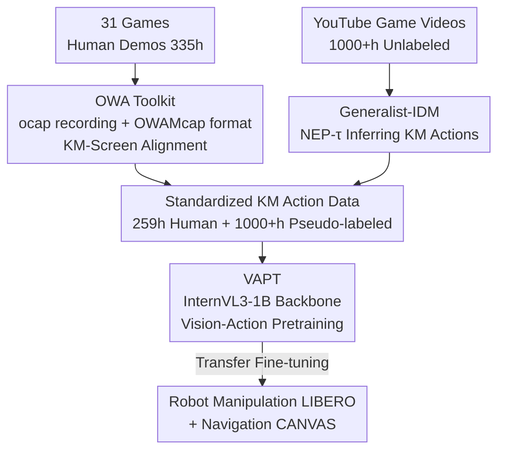

# D2E: Scaling Vision-Action Pretraining on Desktop Data for Transfer to Embodied AI

**Conference**: ICLR 2026  
**arXiv**: [2510.05684](https://arxiv.org/abs/2510.05684)  
**Code**: [Project Page](https://worv-ai.github.io/d2e/)  
**Area**: Robotics  
**Keywords**: embodied AI, desktop pretraining, inverse dynamics model, vision-action pretraining, robotics transfer

## TL;DR
The D2E framework is proposed, demonstrating that desktop gaming interaction data can serve as an effective pretraining base for embodied AI. By collecting 335h of human demonstrations via the OWA toolkit, pseudo-labeling 1000+h of YouTube gaming videos with Generalist-IDM, and performing VAPT transfer training, a 1B parameter model achieves 96.6% success rate on LIBERO manipulation and 83.3% on CANVAS navigation, matching or exceeding models 7x its size.

## Background & Motivation
**Background**: Large Language Models (LLMs) have achieved cross-task generalization due to internet-scale text data. However, collecting physical trajectory data for embodied AI is extremely costly (dedicated hardware, manual operation, complex labeling), resulting in data scales insufficient to drive similar scaling effects.

**Limitations of Prior Work**: Existing robotics datasets (e.g., DROID) are small, domain-specific, and have incompatible formats. Previous works like VPT are limited to the single domain of Minecraft, while SIMA covers multiple games but utilizes private data.

**Key Challenge**: Embodied AI requires large-scale action-labeled data, yet physical data collection is not scalable. Desktop interactions (keyboard and mouse) are rich and standardized, but can they be transferred to physical robots?

**Goal**: Establish a complete pipeline from desktop data collection to embodied task transfer verification.

**Key Insight**: Gaming interactions involve complex sensorimotor patterns (navigation, manipulation, planning) that are highly analogous to embodied AI challenges and are accessible at scale through platforms like YouTube.

**Core Idea**: Desktop environments = a cheap source of pretraining data for embodied AI. The combination of OWA collection + Generalist-IDM pseudo-labeling + VAPT transfer = a complete pipeline.

## Method

### Overall Architecture
D2E decomposes the problem of "whether desktop interactions can transfer to embodied robots" into a three-stage pipeline: first, using the OWA Toolkit to collect and standardize keyboard-and-mouse (KM) level desktop demonstration data; second, using Generalist-IDM to pseudo-label actions for massive unlabeled YouTube gaming videos; and finally, using VAPT to pretrain a unified backbone on this desktop data for transfer to robot manipulation and navigation tasks. These three components are interlinked—the toolkit addresses "collectability and readability," the IDM addresses "labeling cost and accuracy," and VAPT addresses "transferability."

### Key Designs

**1. OWA Toolkit: Removing Bottlenecks in Desktop Demo Data Collection and Reading**

While desktop data appears inexpensive, scaling it involves hidden costs in multi-source synchronization during collection and I/O throughput during training. The OWA recorder, `ocap`, is based on the Windows API and GStreamer, precisely aligning 60Hz screen frames with keyboard and mouse events to ensure strict pairings of action labels and image frames. For storage, it extends the MCAP standard into the OWAMcap format, using H.265 encoding to achieve 217× compression compared to raw frames and utilizing `MediaRef` external references instead of inlining video to support efficient random access without full-segment decoding. The training side adds `FSLDataset` (fixed sequence length packing) and adaptive batch decoding, pushing throughput to 119 img/s (a 10.2× improvement over the baseline), with an average disk read of only 18.73 KB per image (41× lower than TorchCodec). This engineering suite allowed 14 annotators to collect 335h of data across 31 games in one month, whereas DROID required 50 collectors from 13 institutions over 12 months, highlighting the cost advantage of the desktop route.

**2. Generalist-IDM: Converting Unlabeled Videos into Labeled Data via a Universal Inverse Dynamics Model**

To leverage 1000+h of YouTube gaming videos, the key is to infer the player's KM actions from pure visual frames. This is handled by the Inverse Dynamics Model (IDM). Unlike traditional IDMs that are specialized for single games, D2E models actions as a timestamped event stream. Each event is serialized as `<EVENT_START>{TYPE}{TIMESTAMP}{DETAIL}<EVENT_END>`, independent of fixed tick intervals, allowing the model to naturally skip idle periods and only output when actions occur. The training objective is Next Event Prediction with time offset (NEP-$\tau$), which looks forward $\tau$ steps into the observation window to provide future context. The loss is defined as $\mathcal{L}_{\text{NEP-}\tau} = -\mathbb{E}\left[\sum_t \log P_\theta(a_t \mid o_{1:\min(t+\tau,T)}, a_{1:t-1})\right]$. This $\tau$ is critical: experiments show $\tau=100$ms is optimal, whereas for $\tau=0$ (current frame only), the Pearson correlation between predicted and ground-truth actions drops nearly to zero, indicating that a small amount of future context is essential to resolve action-visual causal delays. Based on the InternVL3-1B architecture, it requires only ~192 H100 hours (~\$800) to train yet generalizes zero-shot to unseen games—achieving 63% keyboard accuracy on *Battlefield 6*, matching specialized IDMs.

**3. VAPT: Transferring Sensorimotor Priors from Desktop Pretraining to Robots**

With standardized human and pseudo-labeled data, VAPT pretrains a unified InternVL3-1B backbone on a total of 1.3K+ hours of desktop data (259h human + 1000+h pseudo-labeled) before fine-tuning on downstream robot tasks. The authors attribute its transferability to three commonalities: action modalities (desktop KM can be aligned with robot action spaces), task structure (both are goal-oriented sequential decision-making), and data distribution (high diversity across 20+ games provides broad sensorimotor coverage). The value of this prior is evident in the training dynamics: VAPT-initialized models converge rapidly from the start, while randomly initialized baselines experience a significant plateau before descending, effectively converting desktop-learned control capabilities into downstream sample efficiency.

### Loss & Training
Generalist-IDM utilizes the NEP-$\tau$ objective for autoregressive next-event prediction, transforming action pseudo-labeling into a sequence modeling problem. VAPT performs standard vision-action pretraining on desktop data, followed by fine-tuning on downstream tasks like LIBERO and CANVAS.

## Key Experimental Results

### Main Results
LIBERO Manipulation Benchmark (Success Rate %):

| Method | Parameters | Spatial | Object | Goal | 10 (long) | Total |
|--------|------------|---------|--------|------|-----------|-------|
| OpenVLA | 7B | 84.7 | 88.4 | 79.2 | 53.7 | 76.5 |
| π₀ | 3.3B | 90.0 | 86.0 | 95.0 | 73.0 | 86.0 |
| SmolVLA | 2.25B | 93.0 | 94.0 | 91.0 | 77.0 | 88.7 |
| **VAPT w/o pseudo** | **1B** | 95.8 | 98.4 | **98.6** | **93.6** | **96.6** |

CANVAS Navigation Benchmark (Baseline 75.3% → VAPT w/ pseudo **83.3%**).

### Ablation Study
Generalist-IDM vs. Specialist-IDM (In-domain, 6 games):

| Game | Model | Pearson-X | Keyboard Acc. |
|------|------|-----------|----------|
| Brotato | Specialist | 65.92 | 28.80 |
| Brotato | **Generalist** | **73.65** | **86.36** |
| Apex Legends | Specialist | 65.16 | 67.47 |
| Apex Legends | **Generalist** | **83.90** | **76.55** |

Generalist-IDM outperforms Specialist-IDM across all games (up to 57.6% improvement in keyboard accuracy).

### Key Findings
- 1B parameter VAPT outperforms 3.3B π₀ and 7B OpenVLA on LIBERO, with a significant advantage in long-horizon tasks (93.6% vs 73.0%).
- Pseudo-labeled data aids **navigation** (+8%) but is less effective for **manipulation**, which requires precise human supervision.
- Real robot experiments (SO101 pick-and-place) showed improvement from 70% to 80%, verifying physical transfer.
- OWA data collection efficiency far exceeds robot data: 14 people × 1 month vs. DROID's 50 people × 13 institutions × 12 months.

## Highlights & Insights
- **Novelty**: First systematic demonstration that desktop gaming → physical robot transfer is feasible.
- **Goal**: Full end-to-end contribution from tools → data → models → transfer → verification.
- **Value**: OWA Toolkit provides 152x compression and 41x I/O optimization with standardized formats for the community.
- **Mechanism**: NEP-$\tau$ design using timestamp-driven event prediction is more efficient than tick-based methods, skipping idle periods.
- **Novelty**: Generalist-IDM's zero-shot generalization makes internet-scale pseudo-labeling possible.

## Limitations & Future Work
- The transfer mechanism from desktop to robot remains a hypothesis lacking rigorous theoretical analysis.
- Only one backbone (InternVL3-1B) was validated.
- Real robot experiments were limited to a single pick-and-place task.
- OWA Toolkit currently supports Windows only.
- Gaming data may introduce visual biases inconsistent with the real world.
- Absolute success rates on Meta-World remain low (20-24% on Very Hard).

## Related Work & Insights
- VPT was a pioneer but limited to Minecraft; SIMA is cross-game but private; D2E is the first open-source, multi-game framework to verify transfer.
- Complementary to RT-X/Open X-Embodiment: D2E provides a low-cost pretraining source.
- Similar in spirit to LAPA's latent action pretraining, but D2E operates directly on explicit KM actions.
- Insight: Internet video + Generalist-IDM pseudo-labeling is a viable path for scaling embodied AI data.

## Rating
- Novelty: ⭐⭐⭐⭐⭐ The desktop-to-embodied transfer paradigm is path-breaking.
- Experimental Thoroughness: ⭐⭐⭐⭐ Extensive benchmarks (LIBERO/Meta-World/CANVAS) + real robot, though the latter is simple.
- Writing Quality: ⭐⭐⭐⭐ Highly systematic, though the breadth of content requires checking appendices for some details.
- Value: ⭐⭐⭐⭐⭐ Open-source tools, data, and models open new directions for embodied AI scaling.

<!-- RELATED:START -->

## Related Papers

- [\[ICLR 2026\] Image Quality Assessment for Embodied AI](image_quality_assessment_for_embodied_ai.md)
- [\[ICLR 2026\] Grounding Generative Planners in Verifiable Logic: A Hybrid Architecture for Trustworthy Embodied AI](grounding_generative_planners_in_verifiable_logic_a_hybrid_architecture_for_trus.md)
- [\[ICML 2026\] Seeing Realism from Simulation: Efficient Video Transfer for Vision-Language-Action Data Augmentation](../../ICML2026/robotics/seeing_realism_from_simulation_efficient_video_transfer_for_vision-language-acti.md)
- [\[ICLR 2026\] Self-Improving Vision-Language-Action Models with Data Generation via Residual RL](self-improving_vision-language-action_models_with_data_generation_via_residual_r.md)
- [\[ICLR 2026\] Vlaser: Vision-Language-Action Model with Synergistic Embodied Reasoning](vlaser_vision-language-action_model_with_synergistic_embodied_reasoning.md)

<!-- RELATED:END -->
