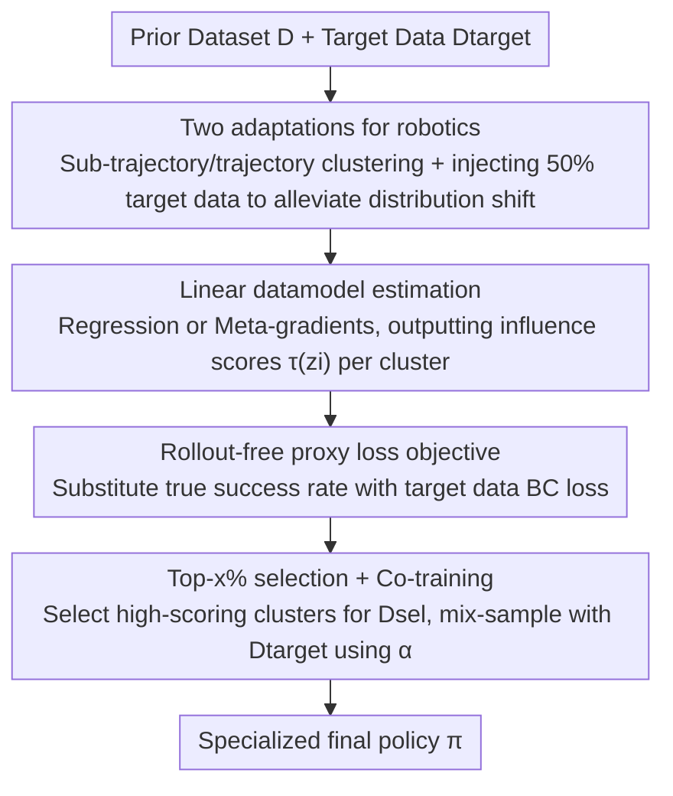

# DataMIL: Selecting Data for Robot Imitation Learning with Datamodels

**Conference**: ICLR2026  
**OpenReview**: [https://openreview.net/forum?id=AcTsKglDdh](https://openreview.net/forum?id=AcTsKglDdh)  
**Code**: To be confirmed  
**Area**: Robotics / Embodied AI  
**Keywords**: Imitation Learning, Data Selection, Datamodels, Data Attribution, Co-training

## TL;DR
DataMIL transfers the datamodels (data attribution) framework from NLP/CV to robot imitation learning. It uses the policy itself to end-to-end assign an "influence score for task success" to each piece of prior data, then selects high-scoring data for co-training with target data. By replacing expensive real-robot evaluations with a rollout-free proxy loss, it outperforms similarity-retrieval baselines by approximately 10% across 60+ simulated and real manipulation tasks. It successfully selects useful cross-embodiment data from large-scale heterogeneous datasets like OXE.

## Background & Motivation
**Background**: The robotics community is replicating the trajectory of Large Language/Vision Models by training "Generalist Policies" (e.g., RT-1/RT-2, $\pi_0$, GR00T) using massive, diverse demonstration datasets (multi-task, multi-scene, multi-embodiment such as OXE). While these generalist policies perform well on average, they often lack sufficient strength for specific individual tasks, requiring post-training fine-tuning with new task-specific data.

**Limitations of Prior Work**: A natural idea is to avoid using only a small amount of task data and instead select a useful subset from existing large datasets for co-training. However, "data selection" is particularly difficult in robotics: theoretically, verifying a subset requires retraining a policy on it followed by real-robot rollout evaluation, which is slow, dangerous, and infeasible for large-scale datasets. Existing robotic data selection methods bypass rollouts by degrading into **heuristic similarity**: assuming "data most similar to the target demonstration is most useful," based on language descriptions (Zha et al.), visual similarity (STRAP), motion optical flow (FlowRetrieval), or state-action pair similarity (BehaviorRetrieval).

**Key Challenge**: These similarity heuristics implicitly assume "similarity = utility" but completely **ignore the actual impact of a data point on final policy performance**. The paper highlights counterexamples: two states that appear nearly identical may have vastly different action distributions—one reducing target task loss (beneficial) and another leading the policy astray (harmful). Similarity alone cannot distinguish between the two, meaning naive "full usage" or "similarity-based selection" can degrade performance.

**Goal**: Without performing real-robot rollouts, find a subset $D' \subset D$ that maximizes $M(A(D'))$ (the true success rate of the policy trained on that subset), formalized as $\arg\max_{D' \subset D} M(A(D'))$.

**Key Insight**: NLP/CV fields already possess tools more "aligned with the real goal" than similarity—**datamodels** (Ilyas et al., 2022). This approach treats the "learning algorithm + model" as a black box that consumes data and outputs performance, fitting an estimator $\hat f(D') \approx M(A(D'))$ to predict policy quality without actual training. The bottleneck for datamodels in robotics is also the rollout—estimating $M$ still requires real-robot evaluation.

**Core Idea**: Replace the true success rate $M$ with a **differentiable, rollout-free proxy loss** $\hat M$ (the behavior cloning loss on target data). This allows datamodels to be efficiently estimated in robotics, enabling an "end-to-end, performance-aware" method to score and select data instead of relying on human-defined similarity.

## Method

### Overall Architecture
DataMIL (Datamodels for Imitation Learning) addresses the following: given a large prior dataset $D$, a fixed imitation learning algorithm $A$, and a small set of target task demonstrations $D_{\text{target}}$, select a subset $D_{\text{sel}}$ from $D$ that effectively improves target task success. The pipeline consists of four steps: ① **Clustering** prior data based on temporal structure into trajectories or sub-trajectories (to reduce variance in influence estimation); ② Estimating a linear influence score $\tau(z_i)$ for each cluster using either **regression** or **meta-gradient** estimators combined with a **rollout-free proxy loss**; ③ Selecting the top $x\%$ highest-scoring data to form $D_{\text{sel}}$; ④ **Co-training** $D_{\text{sel}}$ with $D_{\text{target}}$ to produce the final policy. All scoring is completed offline without real-robot interaction.

The core of the datamodel is a linear approximation: for any subset $D' \subset D$, the predicted value is written as $\hat f(D') = \sum_{z_i \in D'} \tau(z_i)$, where $\tau(z_i)$ is the **additive contribution** of sample $z_i$ to the target metric. This linear form simplifies data selection to picking samples with the highest $\tau$.

### Key Designs

**1. Linear datamodel estimation: Scoring data via Regression vs. Meta-gradients**

This is the core of DataMIL, addressing how to estimate the influence score of each data point without exhausting all subsets. Both estimators assume training results are linearly decomposable: $\hat f(D') = \sum_{z_i \in D'} \tau(z_i)$. The difference lies in the calculation of $\tau(z_i)$. The **regression estimator** is direct but expensive: it randomly samples $m$ subsets $D_j \subset D$, trains a policy $A(D_j)$ for each, and evaluates performance $M_j = M(A(D_j))$. After collecting $m$ pairs of (subset, performance), it performs least-squares regression:

$$\{\tau(z_1), \dots, \tau(z_n)\} := \arg\min_{\tau \in \mathbb{R}^n} \sum_{j=1}^{m} \left( \sum_{i: z_i \in D_j} \tau_i - M(A(D_j)) \right)^2,$$

Essentially regressing the target metric onto the presence of each sample in the subset. However, training hundreds or thousands of models for modern visuo-motor policies like Octo is infeasible. Thus, the **meta-gradient estimator** is introduced: the dataset is parameterized by a weight vector $w \in [0,1]^n$ ($w_i=1$ indicates inclusion of the $i$-th sample). A first-order Taylor expansion of $M(A(w))$ at the all-ones vector $w_0$ is performed: $M(A(w)) \approx M(A(w_0)) + \nabla_w M(A(w_0))^\top (w - w_0)$. Here, the gradient $I = \nabla_w M(A(w_0))$ represents the classic **influence function**, characterizing how changes in data weights affect performance. While calculating $I$ requires differentiating through the entire training process ("meta-gradients"), recent work (Engstrom et al., 2025) demonstrates it can be calculated **precisely and efficiently** using step-wise automatic differentiation and efficient data structures within the SGD iterative structure. These influence scores $I_i$ are then used as datamodel coefficients—requiring only a single training run.

**2. Rollout-free proxy loss objective: Replacing true success rate with BC loss**

This eliminates the biggest obstacle to applying datamodels in robotics: the true success rate $M$ requires real-robot rollouts, which are expensive and **non-differentiable**, rendering the meta-gradient estimator unusable. DataMIL introduces a proxy metric $\hat M$: using a small held-out set of target demonstrations $D_{\text{target}}$, it is defined as:

$$\hat M(\pi, D_{\text{target}}) = \frac{1}{|D_{\text{target}}|} \sum_{(s,a) \in D_{\text{target}}} -L_{\text{BC}}(\pi(s), a),$$

which is the negative of the behavior cloning loss on target data. It has two key properties: (1) it requires no additional rollouts; (2) it is fully differentiable with respect to policy parameters, allowing it to be fed into the meta-gradient estimator. The original $M$ in the optimization objective is replaced by $\hat M$, making the data selection process end-to-end differentiable. The paper validates this proxy in the MetaWorld pick-place-wall task, comparing datamodels estimated for true success rates (DM-rollouts) vs. proxy loss (DataMIL-rg regression / DataMIL-meta meta-gradients). Conclusion: using the proxy metric results in only a marginal success rate drop, and meta-gradients are slightly lower but significantly faster. Most importantly, the selected data produced policies far exceeding "All-Data" and "Target-Only" baselines (~7× higher than the All-Data policy; Target-Only mostly failed). This indicates that while validation loss is a noisy performance predictor in robotics, it is sufficient as a **data selection signal**.

**3. Robotics-specific adaptations: Temporal clustering + target data injection**

Directly applying datamodels to robotics faces two hurdles. First, **clustering for noise reduction**: influence scores estimated at the individual state-action pair level are extremely noisy (each sample is seen only a few times during training). Since robot data is naturally sequential, DataMIL clusters data at different temporal scales—sub-trajectories, tasks, or entire domains—and estimates "cluster-level" influence. There is a trade-off: fine-grained selection is precise but noisy; coarse-grained estimation is stable but loses detail. The paper finds that the optimal clustering scale is a function of dataset size: medium-scale (LIBERO) works best with sub-trajectory clustering, while large-scale (OXE) requires trajectory-level clustering for stability. Second, **alleviating distribution shift**: minor changes in lighting, camera pose, or dynamics significantly change distribution, especially across heterogeneous datasets. Since datamodels rely on training policies on prior data to estimate influence, large shifts between training and target distributions degrade estimation. The countermeasure is to split $D_{\text{target}}$ in half; one half is mixed into the prior data for datamodel estimation (helping the policy align with the target domain), and the other half is used purely for calculating the proxy objective. This technique is used for the real world (OXE), whereas in simulation (MetaWorld/LIBERO), target and prior distributions are already close.

**4. Top-x% selection + Co-training: Turning influence scores into final policies**

After obtaining influence scores for each cluster, DataMIL selects the top $x\%$ clusters with the highest positive influence to form $D_{\text{sel}}$. Downstream policies are then trained using a co-training recipe: in each training step, samples are drawn from $D_{\text{target}}$ with probability $\alpha$ and from $D_{\text{sel}}$ with probability $1-\alpha$ for behavior cloning. This step ensures that the task-specific target data retains sufficient weight, preventing it from being overwhelmed by large volumes of prior data. The process is summarized as: cluster prior data → estimate influence using proxy metric + meta-gradients → pick top clusters for $D_{\text{sel}}$ → co-train with target data.

## Key Experimental Results

### Main Results
Evaluated on 60+ simulation and real manipulation tasks across MetaWorld (50 tasks), LIBERO (100 tasks, using LIBERO-10 for evaluation), and Open-X Embodiment (4 real-world tasks, 2 embodiments).

| Setup | Policy / Estimator | Key Comparison | Results |
|------|--------------|---------|------|
| MetaWorld (50 tasks) | MLP Gaussian / Regression, Top 10% | vs. SR/AR/BR/STRAP/Flow SOTA baselines | DataMIL avg. success rate ~**10%** higher |
| MetaWorld pick-place-wall | Proxy Validation | vs. Target-Only / All-Data | Selection policy ≈ **7×** All-Data success rate; Target-only mostly failed |
| LIBERO-10 (10 long-horizon) | Octo (Transformer Diffusion) / Meta-gradient, prior LIBERO-90 (4500 demos), Top 10% | vs. STRAP/BR/Flow | Baselines fluctuate across tasks; DataMIL **consistently highest across all tasks** |
| OXE Real-world (Franka-Ball / Franka-Pouch / Tiago-Sink / Droid-Multitask) | Octo / Meta-gradient | vs. Random / BR / Flow / AR | DataMIL **consistently highest**, including unseen Tiago embodiment |

### Ablation Study

| Configuration / Analysis | Observation | Conclusion |
|------------|------|------|
| Proxy metric $\hat M$ vs. true $M$ | Marginal performance drop | Validation loss is a sufficient selection signal despite noise |
| Meta-gradient vs. Regression | Slight drop, but significantly faster | Meta-gradients are the only feasible path for large models (Octo) |
| Clustering granularity vs. Data scale | Sub-trajectory for LIBERO, Trajectory-level for OXE | Optimal granularity varies with dataset size |
| Origin of selected data | DataMIL selects balanced data across datasets; baselines concentrate on single sources (AR→RT-1, Flow→BC-Z, BR→Bridge) | Without exact matches, "related and general" data promotes positive transfer |

### Key Findings
- **Systemic flaws in similarity baselines**: State similarity (SR) fails to reject poor actions; Action similarity (AR) selects task-irrelevant data with similar action distributions; State-Action similarity (BR) may incorrectly weight modalities—all are defeated by the "similarity $\neq$ utility" counterexample.
- **Cross-embodiment transfer**: In Tiago-Sink (where the Tiago embodiment is absent from prior data), DataMIL still selects data from RT-1/BC-Z/Bridge that are "visually different but share desktop ego-perspective manipulation" characteristics, improving success rates.
- **Harmful data resembles useful data**: Samples ranked highest and lowest by DataMIL are often visually similar (same embodiment/dataset), echoing CV findings where harmful and beneficial data look similar but have different labels—a distinction similarity methods cannot make but performance-aware methods can.

## Highlights & Insights
- **Re-anchoring "Data Selection" to real optimization goals**: Instead of asking "which data looks like the target," it asks "which data actually makes the policy stronger." This perspective shift is the soul of the paper and the reason it can distinguish "similar but harmful" data.
- **The surgical use of proxy loss**: Using target BC loss instead of real success rate solves both the cost and differentiability problems, enabling meta-gradient estimators to work in robotics—this is the engineering "key" to making robotic datamodels viable.
- **Adaptive clustering granularity** is a transferable practical insight: any scenario involving sample-level influence attribution faces weak individual signals; clustering by natural data structure to estimate cluster-level influence is a general solution.
- **"Related and General > Exact Match" for transfer**: When no exact match for the target task exists, selecting multi-source, general data can facilitate positive transfer and prevent over-fitting to a single domain—a valuable insight for cross-embodiment data reuse in the real world.

## Limitations & Future Work
- **High computational cost**: Even with efficient meta-gradient estimators, the cost of estimating datamodels is multiple times that of "training one policy on all data." Scalability remains a bottleneck; the authors suggest using smaller proxy models for acceleration.
- **Hyperparameter dependence**: Parameters like target dataset size and clustering scale lack strong theoretical guidance and currently rely on empirical tuning.
- **Single-task target focus**: While partially addressed in Droid-Multitask, truly large-scale multi-task robotics settings have not been fully validated.
- **Proxy loss noise**: The paper acknowledges that validation loss is a noisy predictor of success rate. Switching to proxy and meta-gradient methods involves a trade-off between precision and efficiency.

## Related Work & Insights
- **vs. BehaviorRetrieval (BR)**: BR trains a VAE on state-action pairs and retrieves based on latent similarity. DataMIL estimates performance impact directly, distinguishing "similar but harmful" data.
- **vs. FlowRetrieval (Flow)**: Flow uses GMFlow features for retrieval. As a similarity heuristic, it wrongly selects irrelevant domains (e.g., BC-Z) for tasks like Franka-Pouch, while DataMIL correctly identifies relevant Franka data.
- **vs. STRAP**: STRAP uses DinoV2 features + Dynamic Time Warping for similarity. It works well on clean, single-view setups (LIBERO) but fluctuates across tasks. DataMIL is consistently stronger.
- **vs. CUPID (Parallel Work)**: CUPID focuses on single tasks using online rollouts to estimate policy gradient influence. DataMIL is fully offline and selects from large heterogeneous datasets.
- **vs. Generalist Policy Data Mixing (Re-Mix, etc.)**: Re-Mix optimizes domain-level mixing ratios for general training. DataMIL focuses on sample/cluster-level selection for task specialization.

## Rating
- Novelty: ⭐⭐⭐⭐⭐ First to fully implement the datamodels framework for robot imitation learning and bypass rollouts with proxy losses—innovative in both perspective and engineering.
- Experimental Thoroughness: ⭐⭐⭐⭐⭐ 60+ tasks, sim + real-world, dual estimators, unseen embodiments, and multi-tasking provide extensive coverage.
- Writing Quality: ⭐⭐⭐⭐ Clear motivation and intuitive counterexamples; some formula details are scattered in the appendix.
- Value: ⭐⭐⭐⭐⭐ Provides a practical, performance-aware route for reusing large-scale heterogeneous robotic data, with significant impact.

<!-- RELATED:START -->

## Related Papers

- [\[CVPR 2026\] NIL: No-data Imitation Learning](../../CVPR2026/robotics/nil_no-data_imitation_learning.md)
- [\[ICLR 2026\] Difference-Aware Retrieval Policies for Imitation Learning](difference-aware_retrieval_policies_for_imitation_learning.md)
- [\[CVPR 2026\] Video2Robo: 3DGS-based Synthetic Data from One Video Enables Scalable Robot Learning](../../CVPR2026/robotics/video2robo_3dgs-based_synthetic_data_from_one_video_enables_scalable_robot_learn.md)
- [\[ICLR 2026\] Rodrigues Network for Learning Robot Actions](rodrigues_network_for_learning_robot_actions.md)
- [\[ICLR 2026\] Geometry-Aware Policy Imitation](geometry-aware_policy_imitation.md)

<!-- RELATED:END -->
