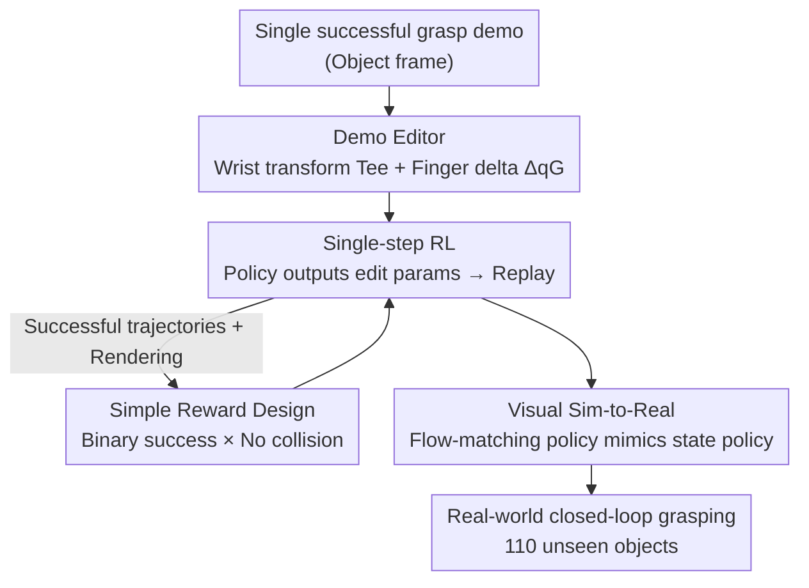

# DemoGrasp: Universal Dexterous Grasping from a Single Demonstration

**Conference**: ICLR2026  
**OpenReview**: [https://openreview.net/forum?id=Bf4FeuW0Mr](https://openreview.net/forum?id=Bf4FeuW0Mr)  
**Code**: Project Page https://research.beingbeyond.com/demograsp  
**Area**: Robotics / Embodied AI / Dexterous Grasping  
**Keywords**: Dexterous Grasping, Demonstration Editing, Single-step Reinforcement Learning, Sim-to-Real, Flow Matching Policy

## TL;DR
DemoGrasp starts from **a single** successful grasp demonstration. The RL policy learns only "how to edit this demonstration" (modifying wrist pose to decide where to grasp and finger joints to decide how to grasp), compressing high-dimensional long-horizon dexterous grasping into a single-step decision problem. Using a minimalist reward of binary success and collision penalty, a universal policy is trained on thousands of objects, achieving 95% success in simulation and 86.5% on 110 unseen objects in the real world, with cross-robot transfer across seven embodiments.

## Background & Motivation

**Background**: Multi-fingered dexterous hands are considered the most suitable end-effectors for tool use, in-hand manipulation, and bimanual collaboration due to their human-like anthropomorphism and high degrees of freedom (DoF). "Universal grasping" (lifting any object) is a prerequisite for these tasks. Recent mainstream approaches use Reinforcement Learning (RL) to train closed-loop grasping policies, incorporating techniques in observation feature design, dense reward shaping, and curriculum learning (e.g., UniDexGrasp / UniDexGrasp++ / ResDex / UniGraspTransformer).

**Limitations of Prior Work**: Dexterous hands often have dozens of DoF, creating a high-dimensional action space. Closed-loop grasping is a long-horizon task, making RL exploration extremely difficult. To achieve convergence, previous works relied on complex reward terms (hand-object distance, lift height, hand elevation, etc.) and multi-stage curricula. Many works were trained on "floating hands" without arms, utilized privileged contact information unavailable in the real world, and struggled to balance collision penalties with other reward terms. These factors make methods difficult to transfer to new embodiments or deploy on real hardware—especially when grasping thin or small objects on a table, which often leads to frequent collisions or failures.

**Key Challenge**: Universal dexterous grasping is essentially a **multi-task optimization** problem (vastly different object geometries) superimposed on a high-dimensional action space and a long-horizon. Exploring directly in the low-level robot action space is inefficient, prone to local optima, and suffers from catastrophic forgetting or gradient interference. The difficulty lies not in the inability to grasp, but in the "excessive exploration space and hard-to-tune rewards."

**Goal**: To eliminate complex reward shaping and multi-stage pipelines, using a simple framework to learn a universal dexterous grasping policy that is robust, transferable, and directly deployable on real hardware.

**Key Insight**: The authors' key observation is that **a single** successful grasp demonstration for a specific object encodes a wealth of transferable grasping patterns: approaching the grasp center, closing the fingers, and lifting the wrist. Grasping new objects of different sizes or positions often only requires **small-scale editing and replaying** of the actions in this demonstration: transforming the wrist pose changes "where to grasp," and adjusting the finger configuration changes "how to grasp."

**Core Idea**: Instead of exploring in the low-level action space, the RL policy explores only "how to edit the demonstration" along two axes (wrist $SE(3)$ transform + incremental finger joint angles). By formulating the entire grasping trial as a **single-step MDP**, the exploration burden and reward complexity are minimized.

## Method

### Overall Architecture

The input to DemoGrasp consists of an object in an arbitrary pose (initial end-effector pose, object pose, and full point cloud), and the output is a smooth sequence of actions to lift it. The training objective is a state-based policy universal across thousands of objects, which is then distilled into an image-based visual policy for real-world deployment. The pipeline consists of four steps: first, prepare **one** successful grasp demonstration expressed in the initial object coordinate system (origin at the object's geometric center); for a new object, the **Demo Editor** policy takes a single observation of the first frame and outputs an end-effector $SE(3)$ transform $T^{ee}$ and a set of incremental finger joint angles $\Delta q_G$. These parameters edit the actions in the demo for replay in simulation. Each episode returns only one reward—**rewriting multi-step grasping as a single-step MDP**. The reward is a minimalist combination of "binary success + collision penalty." Finally, a **Flow-Matching visual policy** is trained on successful trajectories of the RL policy (with rendered images) for Sim-to-Real transfer.

### Key Designs

**1. Demo Editing: Reformulating "Universal Grasping" as "Parameterized Modification of a Single Demo"**

This step addresses the "high-dimensional action + long-horizon exploration" bottleneck. The authors define a demonstration as a successful trajectory $D = \{(q^{*hand}_t, p^{*ee\text{-}obj}_t)\}_{t=0}^{T_D}$, where the finger sequence $\{q^{*hand}_t\}$ follows an open-to-close pattern and the end-effector trajectory $\{p^{*ee\text{-}obj}_t\}$ approaches the object center before lifting. All coordinates are expressed in the **initial object coordinate system** (world frame translated to the object's center). For the same object at a new position, replaying this demo already yields a decent success rate (a 75% starting point in ablations) due to inherent translation invariance. To achieve universality, two types of editing parameters are introduced: a wrist transform matrix $T^{ee}\in SE(3)$ to modify "where to grasp," and incremental finger angles $\Delta q_G$ to modify "how to grasp." The actions are rewritten: the end-effector pose before lifting is multiplied by $T^{ee}$, and then lifted vertically by a constant $\Delta z$. The finger pose is element-wise interpolated between the initial open pose $q^{*hand}_0$ and the edited grasp pose $q^{*hand}_{T_{lift}}+\Delta q_G$. By replaying the edited demo $D' = \mathrm{Edit}(D, T^{ee}, \Delta q_G)$, the robot can grasp objects under different positions, orientations, and configurations.

**2. Single-step MDP Reconstruction: Compressing Long-horizon Grasping into "Look Once, Output Params, Replay to End"**

With the editing scheme, the task is rewritten as a **single-step MDP**. The policy observes only the first frame (initial end-effector pose $p^{ee}_0$, initial object pose $p^{obj}_0$, and point cloud $c^{obj}_0$) and outputs an action—the editing parameters $(T^{ee}, \Delta q_G)$. The environment then replays the edited demo for up to $T$ steps, terminates, and returns the cumulative reward. The policy $\pi(T^{ee}, \Delta q_G \mid p^{ee}_0, p^{obj}_0, c^{obj}_0)$ only needs to maximize the single-step expected reward $\mathbb{E}[r]$. For implementation, wrist rotation is represented by quaternions in observations and Euler angles in actions. This efficiency is the core of the method: with a low-dimensional action space and a horizon of 1, the multi-task exploration burden is drastically reduced, making complex reward shaping unnecessary.

**3. Simple Reward Design: Binary Success × No Collision, with "Half-Environment Table Collision Relaxing"**

Due to the compact action space, the authors use an extremely simple reward: $r = \mathbb{1}[\text{success}] \cdot \mathbb{1}[\text{no collision during execution}]$, focusing the policy on "grasping without collisions." However, thin objects on a table often **require** fingers to lightly touch the table to reach underneath. Strict collision-free constraints prevent successful grasps. Using IsaacGym's massive parallelism, the authors **randomly disable robot-table collision detection in half of the environments**, allowing penetration. Collisions are determined by whether hand keypoints penetrate the table. The resulting effect is hierarchical: collision-free success yields $\mathbb{E}[r]=1$, success with table contact yields $\mathbb{E}[r]=0.5$, and failure yields $0$. This encourages avoiding unnecessary collisions while allowing "beneficial light touches" for difficult objects.

**4. Visual Sim-to-Real: Distilling State Policy with Flow-Matching**

The state policy relies on object poses and full point clouds, which are unavailable in the real world. The authors record proprioception (finger angles + end-effector pose), actions, and rendered RGB/depth images from successful state policy rollouts, creating a dataset of ~35,000 trajectories. They then train a **Flow-Matching policy with action chunking** for imitation learning. Flow-matching effectively models multi-modal action distributions. To bridge the visual gap, domain randomization (color, texture, lighting, camera extrinsics, table position) is applied during data collection, and a pre-trained ViT is fine-tuned as a visual encoder. This results in an image-based closed-loop policy deployable zero-shot to the real world.

### Loss & Training

During the RL phase, the single-step expected reward $\mathbb{E}[r]$ (Equation 3: binary success × no collision) is optimized. Training is conducted in parallel on hundreds to thousands of objects in IsaacGym, with half the environments relaxing table collisions. In the vision phase, imitation learning is performed using Flow-Matching and action chunking to distill successful trajectories from the state policy, utilizing domain randomization and ViT fine-tuning.

## Key Experimental Results

### Main Results

Using DexGraspNet + Shadow Hand (3,200 training objects), DemoGrasp significantly outperforms previous SOTAs in both state and vision settings, with a generalization gap between training and unseen objects of only ~1%:

| Setting | Metric (Subset) | DemoGrasp | Prev. SOTA (UniGraspTransformer) | Gain |
|------|-----------|-----------|------|------|
| State | Train. | 95.2 | 91.2 | +4.0 |
| State | Test (Unseen) | 94.4 | 88.3 | +6.1 |
| Vision | Train. | 92.2 | 88.9 | +3.3 |
| Vision | Test (Unseen) | 90.1 | 86.8 | +3.3 |

Across embodiments: Using only 175 training objects, Allegro+UR5 outperformed RobustDexGrasp on five OOD datasets (e.g., DGA 74.4 vs 64.4, Omni6DPose 82.24 vs 73.00). Seven robotic hands achieved an average 84.6% success rate on unseen datasets. Real-world 110 unseen objects averaged 86.5% (95.3% for regular size, 68.3% for thin, 76.7% for small, and >80% for cluttered scenes).

### Ablation Study

| Configuration | Success Rate (%) | Explanation |
|------|------|------|
| Sampling + BC | 77.56 | Sampling yields multi-modal inconsistent data; hard to converge. |
| RL (Full) | 96.24 | Single-step RL optimizes expected return; unimodal consistency. |
| Replay Only (No RL) | 75.29 / 73.43 (train/test) | Translation-invariant replay provides a non-trivial baseline. |
| +$\Delta xyz$ | 81.35 / 76.04 | Adding wrist translation (+6%). |
| +$\Delta xyz$+$\Delta rpy$ | 94.22 / 81.39 | Adding wrist rotation (+13%); most critical. |
| +$\Delta xyz$+$\Delta rpy$+$\Delta q$ | 96.24 / 82.74| Adding finger DoF (+2%); improves stability. |

### Key Findings
- **RL is Indispensable**: Under the same editing scheme, sampling + BC achieved only 77.56%, while RL reached 96.24%. Sampling produces multi-modal conflicting trajectories for the same object; RL directly optimizes expected returns for a unimodal consistent policy.
- **Wrist rotation contributes the most** (+13%), followed by wrist translation (+6%). Finger DoF adds the least (+2%), indicating that treating the dexterous hand as a "single-DoF gripper" performs well, but finger DoF provides robust force closure for specific geometries.
- **Translation Invariance** enables strong spatial generalization. Unlike baselines, DemoGrasp remains effective under 50cm × 50cm random object placements because the replay mechanism is inherently translation-invariant.
- Adding a robotic arm has minimal impact (FR3+Shadow is only 1.4% lower than floating Shadow), and collision-free training makes the arm-hand policy deployable.

## Highlights & Insights
- **"Reducing Dimensionality" instead of "Adding Tricks"**: While others stack reward terms and curricula to tackle high-dimensional exploration, DemoGrasp reformulates the task into low-dimensional single-step editing. By shrinking the solution space, complex reward shaping becomes unnecessary.
- **Single Demo as a "Prior Skeleton"**: The demo encodes transferable approach-close-lift patterns. The policy only learns "how to fine-tune." This is analogous to providing a good initial guess in trajectory optimization and can migrate to other long-horizon tasks (e.g., insertion, pouring).
- **Collision trick for thin objects**: Using parallel simulation to turn the "to touch or not to touch" dilemma into a soft constraint at the data level preserves collision-free preferences while unlocking thin object grasping at zero reward-design cost.
- Flow-matching combined with action chunking and domain randomization is the key to successful zero-shot sim-to-real transfer.

## Limitations & Future Work
- Real-world success for thin/small objects (68.3% / 76.7%) is still lower than regular objects (95.3%); fine-grained contact control requires further work.
- The method depends on "one good demo" as a starting point. The impact of demo quality and whether different object families need different demos remains to be explored.
- The single-step MDP assumes that "one edit + replay" is sufficient. For strong closed-loop interactions requiring mid-trajectory re-planning (e.g., sliding), this might be insufficient.
- Evaluation focused on grasp-and-lift; extending to in-hand manipulation or tool use is a future vision.

## Related Work & Insights
- **vs UniDexGrasp / UniDexGrasp++**: They train multi-step policies in the low-level action space with dense rewards and curricula, often using floating hands and privileged info. DemoGrasp uses single-step RL in the edit space with binary rewards and arm-hand integration.
- **vs UniGraspTransformer**: It relies on per-object exhaustive RL and Transformer distillation. DemoGrasp compresses multi-task exploration into a single step via demo editing, outperforming it in simulation.
- **vs RobustDexGrasp**: Also oriented towards real-world universal grasping, DemoGrasp performs better on OOD datasets and is the first to grasp thin/small objects without severe table collisions.

## Rating
- Novelty: ⭐⭐⭐⭐⭐ Fundamental simplification of the universal dexterous grasping problem.
- Experimental Thoroughness: ⭐⭐⭐⭐⭐ Sim+Real, seven embodiments, multiple OOD datasets, detailed ablations.
- Writing Quality: ⭐⭐⭐⭐ Clear logic and effective diagrams.
- Value: ⭐⭐⭐⭐⭐ Minimalist reward + strong sim-to-real transfer; high practical value for dexterous grasping.

<!-- RELATED:START -->

<!-- RELATED:END -->

## Related Papers

- [\[CVPR 2026\] DemoFunGrasp: Universal Dexterous Functional Grasping via Demonstration-Editing Reinforcement Learning](../../CVPR2026/robotics/demofungrasp_universal_dexterous_functional_grasping_via_demonstration-editing_r.md)
- [\[ICLR 2026\] RFS: Reinforcement Learning with Residual Flow Steering for Dexterous Manipulation](rfs_reinforcement_learning_with_residual_flow_steering_for_dexterous_manipulatio.md)
- [\[ICLR 2026\] D-REX: Differentiable Real-to-Sim-to-Real Engine for Learning Dexterous Grasping](d-rex_differentiable_real-to-sim-to-real_engine_for_learning_dexterous_grasping.md)
- [\[ICLR 2026\] One Demo Is All It Takes: Planning Domain Derivation with LLMs from A Single Demonstration](one_demo_is_all_it_takes_planning_domain_derivation_with_llms_from_a_single_demo.md)
- [\[CVPR 2025\] DexGrasp Anything: Towards Universal Robotic Dexterous Grasping with Physics Awareness](../../CVPR2025/robotics/dexgrasp_anything_towards_universal_robotic_dexterous_grasping_with_physics_awar.md)

<!-- RELATED:END -->
