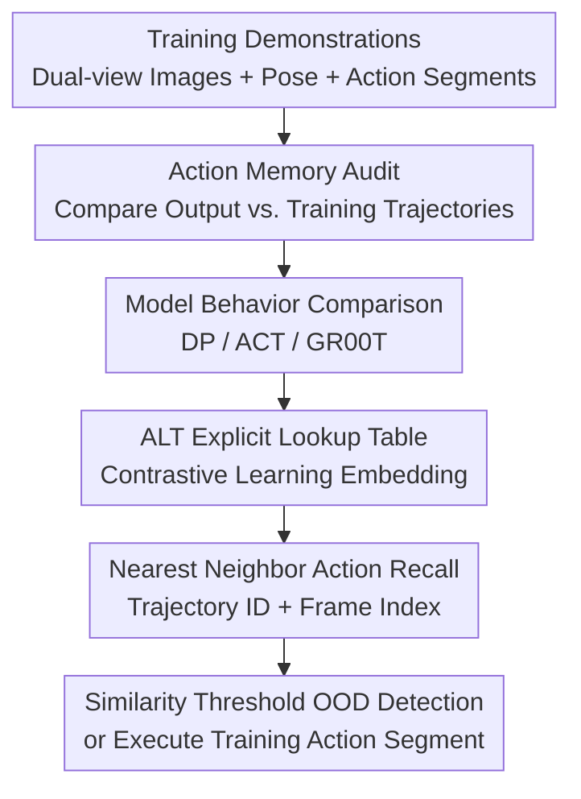

# Demystifying Robot Diffusion Policies: Action Memorization and a Simple Lookup Table Alternative

**Conference**: ICLR2026  
**OpenReview**: [https://openreview.net/forum?id=PL0tJOfm7I](https://openreview.net/forum?id=PL0tJOfm7I)  
**Code**: https://stanfordmsl.github.io/alt/  
**Area**: Robotics / Embodied AI  
**Keywords**: Robot Imitation Learning, Diffusion Policy, Action Memorization, Lookup Table Policy, OOD Detection

## TL;DR

This paper systematically demonstrates that Diffusion Policy in small-data robot imitation learning behaves more like retrieving action segments from the training set based on current images rather than learning a generalizable action generator. It proposes an explicit Action Lookup Table (ALT) using contrastive learning embeddings and nearest neighbor retrieval to achieve performance close to Diffusion Policy while providing significantly faster inference and direct OOD detection.

## Background & Motivation

**Background**: In robot visuo-motor imitation learning, Diffusion Policy has emerged as a powerful strategy for single-skill manipulation. It models the policy as a conditional diffusion model: taking camera images and robot states as input to output a short action segment, which is then re-executed in a closed loop. This paradigm often proves more stable than traditional behavior cloning or transformer action chunking on small-scale demonstration data, particularly in tasks such as grasping, placing, and long-horizon manipulation.

**Limitations of Prior Work**: Paradoxically, Diffusion Policy is typically trained on only dozens to hundreds of demonstrations while maintaining a generative model capacity at the scale of hundreds of millions of parameters. Classical machine learning intuition suggests such a setup should be prone to severe overfitting, a phenomenon supported by the observation of low training loss and high test loss during training; however, in practice, overfitting appears to be a necessary condition for obtaining high-performance robot policies. Consequently, there is a significant conflict between the generalization explanation and the actual performance of the model.

**Key Challenge**: If Diffusion Policy were indeed learning a continuous generalization of the action space, it should generate interpolated, extrapolated, or gradually degrading action segments when faced with images between training points, object positions outside the training range, or visual distractors. However, the authors observe the opposite behavior: even when presented with completely OOD images such as cats or dogs, the model tends to output an approximate copy of a specific training action segment. This suggests that its robustness may not stem from task understanding but rather from a conservative retrieval behavior of "selecting an action from the familiar set."

**Goal**: The paper addresses three questions. First, does Diffusion Policy primarily rely on action memorization in small-data robot manipulation? Second, do ACT and GR00T-N1.5 models trained on the same data exhibit similar behavior? Third, if memory retrieval is indeed the key mechanism, can a simpler, faster, and more interpretable lookup table policy replicate similar effects?

**Key Insight**: Instead of interpreting diffusion policies directly through internal weights, the authors design "action memory audit" experiments. By inputting observations from different distributions and comparing the output action trajectories with training trajectories, they hypothesize that if the output remains close to a training trajectory across various OOD scenarios, it supports the "memory retrieval" hypothesis.

**Core Idea**: The success of Diffusion Policy under sparse demonstration data is reinterpreted as "closed-loop observation-driven action segment lookup." The authors demonstrate that an explicit Action Lookup Table (ALT) can explain a significant portion of the performance.

## Method

### Overall Architecture

The paper consists of two closely linked components: first, an action similarity audit to reveal behavioral differences between Diffusion Policy, ACT, and GR00T-N1.5 on the same robot task; and second, the construction of ALT, which transforms the implicit memory mechanism of "embedding observations into action segments" into an explicit queryable database. ALT takes wrist camera images, third-person images, and end-effector poses as input, and outputs either an action segment from a specific demonstration trajectory or an OOD label, rather than a newly generated action from a neural network.

The first half of the diagram represents the explanatory experiments, while the second half describes the ALT policy. The authors first prove that Diffusion Policy outputs are highly aligned with training actions, then investigate if explicit lookup tables can replicate this. The key is not simply using raw states for nearest neighbors but training a task-aligned low-dimensional representation space.

### Key Designs

**1. Action Memory Audit: Distinguishing "Generative Generalization" from "Training Action Recall"**

The authors define a memory-audit similarity metric $S$ to measure whether the current inference trajectory $\tau^{(r)}$ is close to a training trajectory. Let the nearest training trajectory be $\tau^{(1)}$ and the second nearest be $\tau^{(2)}$. With a trajectory distance function $s(\cdot, \cdot)$, the similarity is defined as $S = 1 - \frac{s(\tau^{(r)}, \tau^{(1)})}{s(\tau^{(1)}, \tau^{(2)})}$. If the output trajectory almost overlaps with a training trajectory while maintaining a significant gap from the second-nearest one, $S$ approaches 1, indicating the model is replaying training actions rather than smoothly interpolating.

**2. Comparative Policy Analysis: Diffusion Policy as the Strongest Memorizer**

Comparing Diffusion Policy, ACT, and GR00T-N1.5 on the same data, Diffusion Policy maintains high maximum similarity across InD, OOD-Distractors, OOD-Interpolate, and OOD-Extrapolate cases. This indicates a strong tendency to select local training action segments. Even with irrelevant images (e.g., cats, dogs), it reverts to a few familiar training action sequences—a "conservative action memory" behavior. In contrast, ACT behaves as a traditional interpolator, while GR00T-N1.5 sits in between, benefiting from large-scale VLA pre-training for visual invariance.

**3. ALT Explicit Lookup Table: Transforming Implicit Memory into Interpretable Retrieval**

ALT maps wrist-view images $I_i^h$, third-person images $I_i^t$, and end-effector poses $p_i$ at each timestep to a low-dimensional representation using a fusion encoder. In production, representations, trajectory IDs, frame indices, and corresponding action segments are stored. For deployment, new observations are encoded and the closest training representation is found via cosine similarity to retrieve and execute the corresponding action segment.

**4. Similarity Threshold OOD Detection: Explicit Refusal over Forced Generation**

Diffusion Policy still outputs a training action when facing OOD inputs, which provides superficial robustness but lacks safety transparency. Since ALT is based on explicit nearest neighbor retrieval, it can compare the maximum similarity with a threshold $\gamma$. If it falls below the threshold, it is explicitly marked as OOD to trigger a safety fallback, rather than continuing with potentially erroneous actions.

### Loss & Training

The ALT encoder uses ResNet-18 as the image backbone, fusing dual-view images and end-effector poses. A fusion encoder is trained using contrastive learning: each observation $d_i=(I_i^h, I_i^t, p_i)$ undergoes two augmentations $A_1$ and $A_2$ to generate views $v_i^{(1)}$ and $v_i^{(2)}$, resulting in embeddings $z_i^{(1)}$ and $z_i^{(2)}$. The objective is a normalized temperature-scaled cross-entropy loss:

$$
L_c = -\frac{1}{2B}\sum_{i=1}^{B}\left[\log\frac{\exp(\operatorname{sim}(z_i^{(1)}, z_i^{(2)})/\tau)}{\sum_{k\ne i}^{2B}\exp(\operatorname{sim}(z_i^{(1)}, z_k)/\tau)} + (1 \leftrightarrow 2)\right]
$$

where $\operatorname{sim}(\cdot,\cdot)$ is cosine similarity and embeddings are L2-normalized.

## Key Experimental Results

### Main Results

| Scenario | ALT Max Similarity | Diffusion Policy Max Similarity | ACT Max Similarity | GR00T-N1.5 Max Similarity |
|------|----------------|------------------------------|----------------|------------------------|
| InD | 1.000 | 0.935 | 0.465 | 0.783 |
| OOD-Distractors | 1.000 | 0.837 | 0.278 | 0.798 |
| OOD-Interpolate | 1.000 | 0.690 | 0.406 | 0.725 |
| OOD-Extrapolate (side) | 1.000 | 0.838 | 0.428 | 0.463 |
| OOD-Extrapolate (back) | 1.000 | 0.875 | 0.355 | 0.745 |

| Method | Trajectory Recall Rate | InD Real Task Success Rate | MIT Inference Time | Key Phenomenon |
|------|------------|-------------------|-------------|----------|
| KD-Tree | 100% | 63.3% | approx. 0.09s | Recall possible but success rate insufficient |
| Diffusion Policy | 100% | 100% | approx. 2.65s | Strong performance but slow and lacks OOD signal |
| ALT w/o pose, $\gamma=0.75$ | 100% | 100% | approx. 0.009s | Matches InD success rate, 294x speedup |

### Ablation Study

| Configuration | Key Metric | Description |
|------|----------|------|
| ResNet-64 | InD 100%, OOD1/2/3/4/7/8 Success | Convolutional backbones are stable for small-data manipulation |
| ViT-64/128/256 | InD approx. 12.9%-16.13% | Unstable on small data without appropriate pre-training |
| CLIP-128 | InD 100% | Semantic features are useful but sensitive to output dimensions |

### Key Findings

- Diffusion Policy exhibits the strongest action memorization in real-world cup-grasping tasks, with high training trajectory similarity even under OOD distractors.
- ACT acts as an action interpolator, providing reasonable mixtures between training points but drifting under strong OOD interference.
- ALT demonstrates that a minimal lookup table can match Diffusion Policy's InD performance with 300x faster inference and less than 1/100 of the memory footprint.
- Robomimic simulations support these findings, where Diffusion Policy rollouts for tasks like Tool Hang and Transport show image-observation similarities exceeding 0.96.

## Highlights & Insights

- The paper provides a counter-intuitive but compelling explanation for why "overfitting" is beneficial in Diffusion Policy: in single-skill, small-data, closed-loop settings, action memorization serves as a conservative and reliable strategy.
- The "action memory audit" transforms the qualitative question of "is the model memorizing" into a quantitative metric, which can be applied to other robot policies.
- ALT serves as a crucial sanity check, suggesting that much of the performance in current benchmarks may stem from data coverage and representation retrieval rather than complex generative modeling.
- The similarity threshold in ALT provides a tangible parameter for engineering safety, exposing confidence levels that are usually hidden in diffusion sampling processes.

## Limitations & Future Work

- Experiments are primarily focused on single-skill, low-data, short-horizon manipulation tasks. Whether "action lookup" explains performance in multi-skill or long-horizon tasks requires further evidence.
- ALT currently relies on storing all frame embeddings; expansion to large-scale data may require approximate nearest neighbor search or clustering.
- The audit identifies similarity but does not fully explain *why* the model selects a specific trajectory or differentiate between beneficial and accidental memorization.
- Future work could combine training library retrieval with generative policies: using lookup when covered by data and falling back to generative planning for truly novel states.

## Related Work & Insights

- **vs. Diffusion Policy**: Diffusion Policy is a conditional generative model; this work suggests it often falls back into training patterns. ALT replaces the iterative denoising with explicit retrieval.
- **vs. ACT**: ACT's transformer decoder more easily interpolates action fragments, making it appear more "generalizable" between training points but less robust than the conservative fallback of DP/ALT.
- **vs. GR00T-N1.5**: GR00T's robustness comes from large-scale pre-training. This paper suggests that robot policy generalization may stem more from pre-trained representations than the action head itself.
- **vs. Traditional Nearest Neighbor**: ALT improves upon simple retrieval by using contrastive learning to construct a task-aligned representation space specifically optimized for action recall.

## Rating

- Novelty: ⭐⭐⭐⭐☆
- Experimental Thoroughness: ⭐⭐⭐⭐☆
- Writing Quality: ⭐⭐⭐⭐☆
- Value: ⭐⭐⭐⭐⭐

<!-- RELATED:START -->

## Related Papers

- [\[ICLR 2026\] Contractive Diffusion Policies](contractive_diffusion_policies.md)
- [\[ICLR 2026\] Abstracting Robot Manipulation Skills via Mixture-of-Experts Diffusion Policies](abstracting_robot_manipulation_skills_via_mixture-of-experts_diffusion_policies.md)
- [\[ICML 2026\] Discrete Diffusion VLA: Bringing Discrete Diffusion to Action Decoding in Vision-Language-Action Policies](../../ICML2026/robotics/discrete_diffusion_vla_bringing_discrete_diffusion_to_action_decoding_in_vision-.md)
- [\[CVPR 2026\] REACH: Explicit Recovery Behavior for Diffusion Policies](../../CVPR2026/robotics/reach_explicit_recovery_behavior_for_diffusion_policies.md)
- [\[ICLR 2026\] Robust Finetuning of Vision-Language-Action Robot Policies via Parameter Merging](robust_fine-tuning_of_vision-language-action_robot_policies_via_parameter_mergin.md)

<!-- RELATED:END -->
