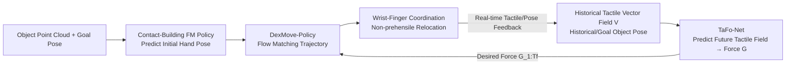

# DexMove: Learning Tactile-Guided Non-Prehensile Manipulation with Dexterous Hands

**Conference**: ICLR 2026  
**OpenReview**: [https://openreview.net/forum?id=dT3ZciXvNX](https://openreview.net/forum?id=dT3ZciXvNX)  
**Code**: Project Page [https://peilin-666.github.io/projects/DexMove/](https://peilin-666.github.io/projects/DexMove/)  
**Area**: Robotics / Dexterous Hands / Non-prehensile Manipulation / Tactile Sensing  
**Keywords**: Non-prehensile manipulation, dexterous hands, visuo-tactile sensors, flow matching policy, wrist-finger coordination, hybrid sim+human data  

## TL;DR
DexMove adopts a hybrid data paradigm combining "large-scale simulation trajectories + a small amount of human tactile demonstrations" to train a flow matching policy. This allows a multi-fingered dexterous hand to push and rotate tabletop objects through wrist-finger coordination and tactile closed-loop control (non-prehensile relocation). On a real robot, it achieves an average success rate of 77.8% across 6 object categories, surpassing ablation baselines by 36.6% and improving efficiency by nearly 300%.

## Background & Motivation
- **Background**: Non-prehensile manipulation (moving objects by pushing/pressing without lifting them) is a more robust alternative to pick-and-place for relocating large, heavy, fragile, or irregular objects. However, most existing works utilize **two-fingered grippers or pushers** for single-point contact, leaving dexterous multi-fingered hands under-explored in this scenario.
- **Limitations of Prior Work**: ① **Data Scarcity**—training a generalizable policy requires large-scale, physically plausible contact datasets covering variations in geometry, mass distribution, and surface friction. Teleoperation is inefficient and lacks high-fidelity force feedback, while pure simulation suffers from significant sim-to-real gaps (especially in tactility). ② **Controller Deficiencies**—multi-contact interactions couple the forces and motions of multiple fingers through hand-object dynamics; currently, there is a lack of whole-hand motion planners that coordinate such interactions.
- **Key Challenge**: While dexterous hands are inherently suited for non-prehensile manipulation (distributed multi-point contact is more stable than single-point and manages objects with difficult dynamics like thin plates or cylinders), the **"scarcity of scalable high-fidelity data"** and the **"absence of force-aware multi-contact coordination strategies"** hinder progress.
- **Goal**: Develop a non-prehensile manipulation framework for tactile-enabled dexterous hands that can scale force-conditioned wrist-finger trajectories and utilize real tactile feedback for closed-loop control, generalizing to unseen objects, frictions, and language-conditioned long-horizon tasks.
- **Core Idea**: **Hybrid Data Synthesis + Decoupled Tactile Force Planning**—generate mass-scale "force-conditioned wrist-finger trajectories" in simulation (addressing scale) and collect "fingertip force distributions" from human demonstrations using wearable visuo-tactile devices (addressing tactile fidelity). These are fused via a flow matching policy, with a standalone TaFo-Net predicting "desired future finger forces" to drive the trajectory policy.

## Method

### Overall Architecture
DexMove is divided into "Data Acquisition" and "Policy Learning." On the data side: 2M force-conditioned wrist-finger trajectories are synthesized in simulation via optimization + rejection sampling; then, approximately 300k frames of real tactile vector fields are collected from human demonstrations using wearable exoskeletons + R-Tac visuo-tactile sensors. The policy side consists of a pipeline of three Flow Matching (FM)/Transformer components: ① A contact-building FM policy provides the initial grasp pose → ② TaFo-Net predicts future desired finger forces based on historical tactile fields → ③ DexMove-Policy rollouts future wrist-finger trajectories conditioned on historical states, target poses, and desired forces.

### Key Designs

**1. Force-conditioned Trajectory Synthesis: Using "Penetration Depth" as a Force Proxy.** To enable large-scale trajectory generation in rigid-body simulations, wrist poses $(R^{wrist}_0, T^{wrist}_0)$ are uniformly sampled. Each fingertip is pushed toward the nearest surface along displacement vector $d$ (augmented by Gaussian noise $\hat{d}=d+\varepsilon$ for diversity). An optimization (Eq. 1-2) solves for joint/wrist configurations that satisfy fingertip target positions and constrain contact within the sensor area $L_{region}$. Post-contact, the hand is translated incrementally in random directions via MuJoCo. Directions are accepted via **rejection sampling** if stable contact holds over 50cm. Under the non-slip assumption, fingertip trajectories are derived from initial offsets and object transformations: $P^{tip}_t = P^{obj}_t + R_z(\omega^{obj}_t)(P^{TIP}_0 - P^{obj}_0)$. Crucially, **normal force is approximated by penetration depth** $G \approx D_{sensor} = r - \text{distance}(P^{TIP}_t, \text{surface})$. Finger positions are perturbed along the normal $\vec{n}$ as $\hat{P}^{TIP}_t = P^{TIP}_t + \vec{n}\cdot N(0,\sigma)$ to augment trajectories with **varying force magnitudes**. Inverse kinematics with wrist regularization $L_{wrist}$ (prioritizing finger movement over arm movement) are used for final configurations. The dataset expands 88 YCB objects into 2M sequences across 412k grasp configurations.

**2. Human Demonstrations for Real Tactility: Isomorphic Visuo-tactile Sensors.** Since rigid-body simulations fail to model high-fidelity dynamics or real tactile output, force data is supplemented by human demonstrations. A wearable exoskeleton equipped with R-Tac visuo-tactile sensors on human fingertips allows for data collection that can be directly transferred to robotic hands—this **isomorphic design** minimizes the domain gap. Each trial records goal poses, real-time poses, and tactile data: normal force $G$ derived from penetration and shear forces from 2D marker displacements, forming a tactile vector field $V \in \mathbb{R}^{v\times 4}$ ($v=33$ markers) collected at 30FPS across 20 objects.

**3. TaFo-Net Force Planning: Implicit Environment Encoding via Historical Tactile Fields.** The trajectory policy requires "desired finger forces" $G_{1:T_f}$ as a condition, which TaFo-Net predicts. The core insight is that **historical tactile vector fields implicitly encode environment properties** (e.g., friction, contact state), while poses provide error signals. The network has three stages: (i) **Per-finger spatial encoding**—tactile fields are encoded into tokens via a light Transformer + geometric position embeddings; (ii) **Cross-finger attention**—tokens from all fingers in a frame are processed via multi-head self-attention $\tilde{U}_{i,1:F}=CF(U_{i,1:F}+g_{1:F})$ to model coordination constraints; (iii) **Per-finger causal temporal attention**—a causal mask ensures query at time $i$ only attends to tokens at $\leq i$, enabling goal-conditioned, temporally and cross-fingerly consistent inference. Training minimizes reconstruction loss $L_{rec}=\sum_t\sum_f \|\hat{V}_{t,f}-V_{t,f}\|^2$.

**4. DexMove-Policy: Goal-Conditioned Trajectory Rollout.** Both contact building and trajectory generation use Flow Matching (FM), which is faster than diffusion policies. FM learns a time-dependent velocity field $u(\cdot)$ from interpolated samples $X_t=(1-t)X_0+tX_1$, with objective $L=\mathbb{E}\|(X_1-X_0)-u(X_t,t,\text{cond})\|^2$. DexMove-Policy is conditioned on system history $T_p$ (joints, wrist, object pose, contact $C$, forces $G$), target pose, and TaFo-Net's $G_{1:T_f}$. These are fused via cross-attention and fed into a Transformer decoder to predict the velocity field, outputting future $T_f$ frames of hand states $X_1=(P^{hand},A^{hand},R^{wrist},T^{wrist})_{1:T_f}$.

## Key Experimental Results

### Main Results: Success Rate (Initial Yaw Error × Friction Surfaces)

| Method | 0–30° Fric.A | 0–30° Fric.B | 30–60° Fric.A | 30–60° Fric.B | 60–90° Fric.A | 60–90° Fric.B |
|---|---|---|---|---|---|---|
| Open-loop | 36.7 | 10.0 | 23.3 | 0.0 | 3.3 | 0.0 |
| DyWA (Gripper) | 50.0 | 36.7 | 46.7 | 30.0 | 50.0 | 33.3 |
| CORN (Gripper) | 43.3 | 36.7 | 46.7 | 40.0 | 43.3 | 43.3 |
| **DexMove** | **86.7** | **86.7** | **80.0** | **83.3** | **70.0** | **60.0** |

Fric.B is a friction surface unseen during training. DexMove shows minimal degradation (robustness), whereas gripper baselines degrade significantly on Surface B.

### Efficiency: Average Completion Time (s, lower is better)

| Method | 0–15 cm | 15–30 cm | 30–45 cm |
|---|---|---|---|
| DyWA | 36.1 | 52.2 | 60.6 |
| CORN | 41.4 | 54.5 | 62.1 |
| **DexMove** | **8.3** | **10.9** | **12.4** |

DexMove completes tasks in less than half the time of gripper baselines (nearly 300% efficiency gain) due to multi-finger contact and fewer motion primitives.

### Ablation Study: Success Rate per Object (%)

| Method | Lego | Mouse | Book | Keyboard | Large Can | Small Can |
|---|---|---|---|---|---|---|
| Wrist-Only (Locked Fingers) | 13.3 | 0.0 | 33.3 | 20.0 | 0.0 | 0.0 |
| w/o Cross-Finger | 13.3 | 3.3 | 63.3 | 50.0 | 0.0 | 3.3 |
| w/o Shear-Force | 70.0 | 66.7 | 33.3 | 13.3 | 0.0 | 0.0 |
| w Heuristic Force | 36.7 | 43.3 | 66.7 | 0.0 | 0.0 | 0.0 |
| **DexMove** | **66.7** | **86.7** | **90.0** | **90.0** | **63.3** | **70.0** |

### Key Findings
- **Multi-finger > Single-point**: Gripper baselines fail primarily during rotation (especially cylinders) because they rely on single contact points. Continuous multi-surface contact by dexterous hands enables precise rotation.
- **Removing Cross-finger Attention → Plane-only limits**: The model can only handle flat objects (book/keyboard) and fails to capture inter-finger coordination.
- **Removing Shear Force → Heavy object failure**: The model degrades to predicting smooth means, failing on heavy objects where shear feedback is vital for slip detection.
- **Heuristic Force < Learned Force**: Hand-crafted "add force upon slip" strategies perform poorly across most tasks.
- **Strong Generalization**: Success on deformable objects (Plushie 96.7%, Tissue 100%) is high; TaFo-Net can recover performance on uneven surfaces with 15 minutes of fine-tuning.

## Highlights & Insights
- **"Penetration depth as force proxy"** is a key trick bridging rigid-body simulation and tactility: it allows inexpensive simulations to produce "forced" trajectories and enables force augmentation via normal-direction perturbations.
- **Isomorphic wearable tactile exoskeleton**: Using sensors for both humans and robots is an engineering masterstroke to inject "zero-domain-gap real tactility" into a policy at low cost.
- **Decoupled Force Planning and Trajectory Generation**: TaFo-Net handles "how much force" while DexMove-Policy handles "how to move," with desired force as the bridge—this makes tactile closed-loop learning interpretable.
- **Implicit Environment Encoding**: Not explicitly estimating friction but letting the network infer it from tactile history naturally supports generalization to unseen surfaces.

## Limitations & Future Work
- Accuracy is still sensitive to tactile quality; success rates for large objects drop significantly when tactile noise $\sigma$ reaches 0.2.
- Object motion is modeled as 3 DoF (x/y translation + yaw); more complex reorientations like flipping or uprighting are not addressed.
- Simulation trajectories rely on non-slip assumptions and penetration-based force approximations, leaving the fidelity of highly dynamic or high-slip contacts unknown.
- Evaluation is limited to a small set of objects; further validation on larger scale, open-world scenarios is needed.

## Related Work & Insights
- **Non-prehensile Manipulation**: Evolves from planar pushing (Mason 1986) to controlled contact breaking/rebuilding (Chi 2024). This work extends it to dexterous hands + tactile closed-loop, demonstrating that multi-point contact is significantly more stable.
- **Tactile Data Collection**: Teleoperation often lacks feedback for dexterous hands; tactile gloves have marker-mismatch domain gaps. Isomorphic sensors (Zhu 2025) represent the current frontier for low-domain-gap data collection.
- **Insight**: For "contact-rich yet hard-to-simulate" tasks, the paradigm of "using cheap simulation for motion scale + small amounts of real data for physical fidelity (tactile/force)" is a highly reusable data strategy.

## Rating
- **Novelty**: ⭐⭐⭐⭐⭐ First non-prehensile policy for tactile dexterous hands; hybrid paradigm and isomorphic exoskeleton are highly original.
- **Experimental Thoroughness**: ⭐⭐⭐⭐ Solid real-robot benchmarks + detailed ablations + robustness tests; however, lacks more diverse public baselines.
- **Writing Quality**: ⭐⭐⭐⭐ Clear correspondence between motivation, challenges, and methods.
- **Value**: ⭐⭐⭐⭐⭐ Provides a comprehensive hardware/software/data suite with real-world verification, offering significant utility for the dexterous manipulation community.

<!-- RELATED:START -->

## Related Papers

- [\[ICLR 2026\] RFS: Reinforcement Learning with Residual Flow Steering for Dexterous Manipulation](rfs_reinforcement_learning_with_residual_flow_steering_for_dexterous_manipulatio.md)
- [\[ICLR 2026\] AnyTouch 2: General Optical Tactile Representation Learning For Dynamic Tactile Perception](anytouch_2_general_optical_tactile_representation_learning_for_dynamic_tactile_p.md)
- [\[ICLR 2026\] House Of Dextra : Cross-Embodied Co-Design for Dexterous Hands](house_of_dextra_cross-embodied_co-design_for_dexterous_hands.md)
- [\[ICLR 2026\] TaCo: A Benchmark for Lossless and Lossy Codecs of Heterogeneous Tactile Data](taco_a_benchmark_for_lossless_and_lossy_codecs_of_heterogeneous_tactile_data.md)
- [\[ICLR 2026\] D-REX: Differentiable Real-to-Sim-to-Real Engine for Learning Dexterous Grasping](d-rex_differentiable_real-to-sim-to-real_engine_for_learning_dexterous_grasping.md)

<!-- RELATED:END -->
