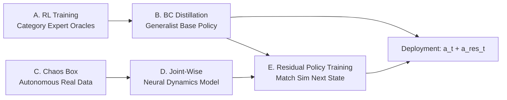

# DexNDM: Closing the Reality Gap for Dexterous In-Hand Rotation via Joint-Wise Neural Dynamics Model

**Conference**: ICLR 2026  
**OpenReview**: [https://openreview.net/forum?id=80vjyj5o7l](https://openreview.net/forum?id=80vjyj5o7l)  
**Code**: [meowuu7.github.io/DexNDM](https://meowuu7.github.io/DexNDM)  
**Area**: Robotics / Dexterous Manipulation / Sim-to-Real  
**Keywords**: In-hand rotation, Neural Dynamics Model, Residual Policy, Autonomous Data Collection, Information Bottleneck  

## TL;DR
DexNDM decomposes the high-dimensional hand-object system into low-dimensional effective dynamics for individual joints using a **Joint-Wise Neural Dynamics Model**. Combined with an autonomous "Chaos Box" for data collection, it trains a residual policy to correct the simulation-based base policy. This approach achieves the first robust real-world in-hand rotation for complex, high-aspect-ratio, and small objects across multiple wrist orientations using a single policy.

## Background & Motivation
**Background**: In-hand object rotation is a core skill in dexterous manipulation. However, the contact-rich, rapidly changing, and load-dependent dynamics create a significant "sim-to-real gap."

**Limitations of Prior Work**: Existing methods are heavily constrained—they either assume the palm always faces upward (Qi 2022, AnyRotate), handle only regularly sized/shaped objects, or rely on expensive custom hardware and tactile sensing. No prior work has achieved aerial rotation of long, small, and complex-shaped objects (e.g., animal models) across diverse wrist orientations and rotation axes.

**Key Challenge**: Learning neural dynamics models from real data is a promising way to raise the sim-to-real ceiling. However, dexterous manipulation suffers from an irreconcilable conflict between "data volume" and "distribution relevance." Generalization requires massive data covering diverse objects, but maintaining distribution relevance is nearly impossible: sub-optimal policies fail to manipulate difficult objects, frequent drops require manual resets, and hand occlusions make object states hard to track.

**Goal**: Enable a single simulation-trained policy to generalize to a wide variety of objects and conditions in the real world.

**Core Idea**: **[Factorized Dynamics]** Instead of modeling the entire high-dimensional hand-object system, dynamics are factorized by joint. Global system effects (self-actuation, inter-joint coupling, object load) are compressed into low-dimensional effective terms for each joint. Each joint predicts its evolution using only its own proprioceptive history. This information bottleneck provides high sample efficiency and strong generalization, unlocking the "Chaos Box" strategy for **[Autonomous Data Collection]**.

## Method

### Overall Architecture
DexNDM follows a specialist-to-generalist pipeline for base policy training combined with neural sim-to-real correction. First, RL is used to train expert oracles for specific object categories, which are then distilled into a unified proprioceptive generalist via Behavior Cloning. Subsequently, real interaction data is autonomously collected to learn the joint-wise neural dynamics model. Finally, a residual policy is trained to compensate for the base policy's actions to close the reality gap. Deployment executes "Base Action + Residual."

### Key Designs

**1. Joint-Wise Neural Dynamics: Trading Information Bottleneck for Generalization.** A whole-hand model $q_{t+1}=f_\theta(H_t)$ uses the state-action history of the entire hand over $W$ steps $H_t=\{q_j,a_j\}$ to implicitly capture system-wide dynamics including external object forces, but it remains data-hungry. DexNDM reformulates the dynamics of each joint $i$ as $H^{\text{eff}}_t\ddot q^i_t + G^{\text{eff}}_t = \tau^i_t$, where $H^{\text{eff}}_t,G^{\text{eff}}_t\in\mathbb{R}$ are low-dimensional effective terms distilling joint coupling, actuation, and object effects. The neural model predicts $q^i_{t+1}=f_{\psi_i}(h^i_t)$ using only the joint's own history $h^i_t=\{q^i_j,a^i_j\}$. This projection is "informationally sufficient" for predicting the next state yet "robustly simple" so it cannot reconstruct the original high-dimensional system effects, forcing the model to discard spurious correlations and learn essential joint dynamics.

**2. Generalization Theory via Information Contraction.** The authors formalize why simplification improves generalization using the Data Processing Inequality (DPI). Let the projection be $g:(H_t,q^i_{t+1})\mapsto(h^i_t,q^i_{t+1})$. Then $\mathrm{KL}(g(P)\|g(Q))<\mathrm{KL}(P\|Q)$ (Theorem 3.1). Based on generalization gap contraction (Theorem 3.2), under covariate shift: $\sup|R_P(f_2\circ g_X)-R_Q(f_2\circ g_X)|<\sup|R_P(f_1)-R_Q(f_1)|$. Conclusion (Claim 3.1): When distribution shift is large, the joint-wise model has lower prediction error on the target distribution than the whole-hand model—this is why it generalizes to rotation tasks even when trained on inconsistent distributions.

**3. Chaos Box Autonomous Data Collection.** Since the model generalizes from out-of-distribution data, data collection does not require successful task rollouts. The "Chaos Box" follows four principles: policy-aware (rough distribution alignment), interaction with load, wide coverage, and scalability. The implementation is simple: the robotic hand is placed in a container filled with soft balls. It replays simulation base policy actions to provide a distribution prior, and interaction with soft balls provides rich random contacts. Gaussian noise ($\sigma=0.01$) is added to actions with a 0.5 probability to expand coverage. The process is fully autonomous, hardware-safe, and requires no manual resets.

**4. Residual Policy for Gap Closing.** Instead of directly using $f_\psi$ to train or fine-tune the policy (which would require globally precise contact dynamics), a residual policy $\pi^{\text{res}}$ is trained. Given base observations and actions, it outputs a correction $a^{\text{res}}_t$ with the goal of making real-world state transitions approximate simulation. The optimization $\arg\min_{\pi^{\text{res}}}\mathbb{E}\sum\|q_{t+1}-f_\psi(\{q_j,a_j+\pi^{\text{res}}\})\|$ is solved supervisely on the base policy's trajectory dataset. At deployment, $a_t+a^{\text{res}}_t$ is executed.

## Key Experimental Results

### Main Results (Simulation Generalization to Unseen Objects)

| Method | ±x RotR↑ | ±y RotR↑ | ±z RotR↑ | General RotR↑ | GO Succ.↑ |
|------|----------|----------|----------|---------------|-----------|
| AnyRotate* (Re-impl) | 91.9 | 163.8 | 173.9 | 162.6 | 64.3 |
| Ours (Generalist) | **144.2** | **224.3** | **314.3** | **242.3** | **88.3** |

The base policy shows a **37%–81%** improvement over strong baselines.

### Real-World Comparison with AnyRotate (Selective Objects, Rot in rad / TTF in sec)

| Method | Cube Rot | Cube TTF | Tin Cyl. Rot | Gum Box Rot |
|------|----------|----------|--------------|-------------|
| AnyRotate | 6.53 | 24.0 | 5.09 | 4.08 |
| Ours (Direct Transfer) | 14.92 | 38.67 | 9.16 | 10.65 |
| Ours (DexNDM) | **39.10** | **198.39** | **15.68** | **13.96** |

Comparison in terms of survival angle (Visual Dexterity metric, ⌊rad/0.5π⌋): Teapot increased from 8 to **48**, Bunny from 2 to **5**, Elephant from 3 (required table support) to **7** (aerial).

### Ablation Study (Real-World Multi-axis Rotation, Rot in rad)

| Object Set | Method | ±x | ±y | ±z | Cubic Diag |
|--------|------|----|----|----|------------|
| Regular | Direct Transfer | 9.84 | 10.37 | 11.69 | 9.03 |
| Regular | Whole-Hand NDM | 5.92 | 2.41 | 7.38 | 3.30 |
| Regular | **DexNDM** | **11.36** | **14.24** | **23.82** | **16.93** |
| Small | Whole-Hand NDM | 0.35 | 0.87 | 0.00 | 0.26 |
| Small | **DexNDM** | **5.24** | **6.81** | **9.29** | **6.03** |

### Key Findings
- **Whole-hand NDM is worse than direct transfer**: Whole-hand modeling is data-hungry and almost completely fails on small objects (multiple Rot≈0), while joint-wise DexNDM excels, validating the necessity of factorization.
- **Sample Efficiency and Transferability**: In both low-data (7.5k) and high-data (3.1M) regimes, and across different training distribution shifts, the joint-wise model outperforms the whole-hand model in expressivity, efficiency, and transferability.
- First to achieve aerial rotation of long objects (10–16cm) around their long axis for nearly a full circle in a **palm-down** configuration. Authors found "Base Up/Down" harder than "Thumb Up/Down" due to LEAP vs. Allegro actuator performance differences.

## Highlights & Insights
- **Transforming "Modeling Difficulty" into "Information Bottleneck Design"**: Joint-wise factorization is both an engineering simplification and a theoretically supported choice (DPI + Generalization gap contraction).
- **Model Generalization Unlocks Data Strategy**: Because the model generalizes from inconsistent distributions, the "Chaos Box"—a task-agnostic, zero-manual-reset method—can be used for cheap data collection.
- **Residual over Fine-Tuning**: Avoids the "requirement for globally precise contact dynamics" by using supervised residuals on existing trajectories, making it practically reliable.
- Unprecedented generalization: Aspect ratios up to 5.33, object-to-hand ratios of 0.31–1.68, complex animal shapes, and multiple wrist orientations.

## Limitations & Future Work
- Joint-wise factorization might lose essential system information for tasks with **strong inter-joint coupling** or where object dynamics dominate.
- The Chaos Box provides a **coarse distribution prior**; for objects with contact patterns vastly different from the target task, the residual correction might be limited.
- Residual policies depend on the quality of the learned dynamics; if the model is inaccurate in OOD regions, corrections will deviate.

## Related Work & Insights
- **In-hand Rotation**: AnyRotate (axis/wrist generalization but only regular objects), Visual Dexterity (complex shapes but small/high-aspect-ratio objects not verified). DexNDM breaks through in object complexity, size, ratio, and wrist pose simultaneously.
- **Sim-to-Real**: Domain randomization (limited by heuristic ranges), system identification (limited by parameterization), online adaptation e.g., RMA (relies on training coverage). DexNDM uses joint-wise models to relax data distribution requirements.
- **Insight**: When "precise system modeling + distribution-relevant data" are unavailable, designing a low-dimensional information bottleneck representation with theoretical guarantees often generalizes better than forcing a high-dimensional model.

## Rating
- **Novelty**: ⭐⭐⭐⭐⭐ Joint-wise neural dynamics + DPI-based generalization theory + Chaos Box autonomous collection form a self-consistent and original framework.
- **Experimental Thoroughness**: ⭐⭐⭐⭐⭐ Simulation + real-world, multi-axis/multi-wrist, comparison with multiple SOTAs, systematic ablation, and teleoperation deployment.
- **Writing Quality**: ⭐⭐⭐⭐ Motivations and contradictions are clearly depicted; the theoretical section is dense but provides intuitive explanations.
- **Value**: ⭐⭐⭐⭐⭐ Achieves unprecedented generalization in real-world in-hand rotation and introduces a reusable "Factorized Dynamics + Autonomous Collection" paradigm.

<!-- RELATED:START -->

## Related Papers

- [\[CVPR 2026\] Contact-Aware Neural Dynamics](../../CVPR2026/robotics/contact-aware_neural_dynamics.md)
- [\[ICLR 2026\] Unified Diffusion VLA: Vision-Language-Action Model via Joint Discrete Denoising Diffusion Process](unified_diffusion_vla_vision-language-action_model_via_joint_discrete_denosing_d.md)
- [\[ICLR 2026\] Block-wise Adaptive Caching for Accelerating Diffusion Policy](block-wise_adaptive_caching_for_accelerating_diffusion_policy.md)
- [\[ICLR 2026\] Towards Bridging the Gap between Large-Scale Pretraining and Efficient Finetuning for Humanoid Control](towards_bridging_the_gap_between_large-scale_pretraining_and_efficient_finetunin.md)
- [\[ICLR 2026\] RRNCO: Towards Real-World Routing with Neural Combinatorial Optimization](rrnco_towards_real-world_routing_with_neural_combinatorial_optimization.md)

<!-- RELATED:END -->
