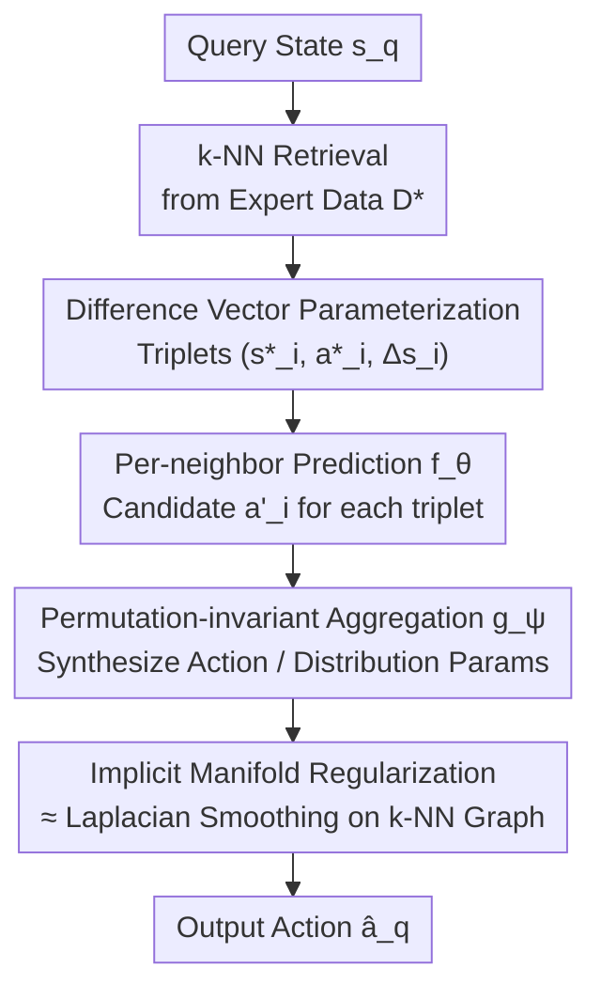

# Difference-Aware Retrieval Policies for Imitation Learning

**Conference**: ICLR2026  
**OpenReview**: [https://openreview.net/forum?id=9AA27en4go](https://openreview.net/forum?id=9AA27en4go)  
**Code**: TBD  
**Area**: Robotics / Imitation Learning  
**Keywords**: Imitation Learning, Behavior Cloning, Retrieval-Augmented, Manifold Regularization, Laplacian Smoothing

## TL;DR
DARP reparameterizes imitation learning from a global "state → action" mapping into a semi-parametric retrieval strategy: it retrieves $k$ nearest neighbors from expert data, predicts actions based on the difference vectors between each neighbor and the query state, and performs permutation-invariant aggregation. Theoretically equivalent to a parameter-free Laplacian smoothing, DARP consistently improves performance over standard Behavior Cloning by 15–46% across MuJoCo, Robosuite, and RoboCasa.

## Background & Motivation
**Background**: The most basic and commonly used method in imitation learning is Behavior Cloning (BC), which treats expert demonstrations $D^*=\{(s^*_j,a^*_j)\}$ as supervised learning samples and trains a global parametric policy $\pi_\theta(a\mid s)$ to fit the mapping from states to actions. It is simple, effective, and capable of learning complex manipulation behaviors.

**Limitations of Prior Work**: BC is fragile during closed-loop deployment, especially in long-horizon tasks. The root cause is **covariate shift**: small errors at each step of the policy accumulate, gradually pushing the agent into states not covered by the demonstration data. In these low-density or out-of-distribution (OOD) regions, over-parameterized neural network policies can oscillate arbitrarily, outputting high-variance and unreliable actions, ultimately leading to task failure.

**Key Challenge**: The objective function of BC only minimizes supervised risk on expert states; it **controls bias but fails to constrain variance**. It only requires "correct predictions on training states" without requiring "consistent predictions across neighboring states," allowing the interpolation between training points to have arbitrarily large local Lipschitz constants. Existing mitigation methods (DAgger, Lipschitz constraints, data augmentation, explicit graph regularization) mostly require moving beyond the pure BC assumption: they require simulators, online expert feedback, large amounts of suboptimal data or task priors, or the introduction of additional smoothing hyperparameters $\lambda$ for tuning.

**Goal**: Can policy variance be suppressed using only the original demonstrations, staying within the pure BC setting—using only expert state-action pairs without extra data, online supervision, or task priors?

**Key Insight**: The authors compare "global parameterization" and "local non-parameterization." Global models compress the entire dataset into one function but are fragile under distribution shift; local methods (nearest neighbor retrieval / local weighted regression) follow the data structure and are more robust, but their performance depends heavily on the distance metric, and simple averaging can blur different actions and lose multimodality. The authors aim to combine the best of both: using retrieval for the robustness of a local neighborhood and parametric networks for accuracy and expressivity.

**Core Idea**: Instead of feed-forwarding an action directly from the current query state, the policy first retrieves $k$ neighbors. Each neighbor is represented as a triplet $(s^*_i,a^*_i,\Delta s_i=s^*_i-s_q)$ and fed into a network to obtain $k$ candidate actions, which are then combined using a permutation-invariant aggregation function. The authors prove that this "architectural neighborhood aggregation" is **implicitly equivalent to performing Laplacian smoothing on a k-NN graph**, without requiring any additional hyperparameters.

## Method

### Overall Architecture
DARP (Difference-Aware Retrieval Policies) is a **semi-parametric retrieval policy**. The training side still uses standard BC regression or maximum likelihood objectives, but "neighborhood aggregation" is moved from the loss function into the network architecture itself. Given a query state $s_q$, the process is: ① Retrieve $k$ neighbors from the expert dataset $D^*$ according to a distance $d(s_q,s^*_i)$, obtaining the index set $N_k(s_q)$; ② Construct triplets $(s^*_i,a^*_i,\Delta s_i=s^*_i-s_q)$ for each neighbor, where $\Delta s_i$ is the difference vector of the neighbor relative to the query state; ③ Use a network $f_\theta$ to independently predict a candidate action $a'_i=f_\theta(s^*_i,a^*_i,\Delta s_i)$ for each triplet; ④ Use a permutation-invariant aggregation function $g_\psi$ to synthesize these $k$ candidates into a final action (or distribution parameters). Training directly minimizes the discrepancy between the aggregated action and the expert action, **requiring no $\lambda$ and no change to the objective function**.

Understanding this design requires looking at its theoretical derivation (conducted in three steps): first defining an **explicit** neighborhood regularization objective MRIL (BC loss + smoothing penalty); then showing that the same smoothing can be achieved **implicitly** via architecture (iMRIL, moving aggregation into parameterization); and finally implementing iMRIL as the practical DARP algorithm.

### Key Designs

**1. Implicit Manifold Regularization: Replacing Regularization with Architecture to Avoid Tuning $\lambda$**

This is the theoretical anchor of the paper, addressing the issue that "BC does not control variance and explicit regularization requires tuning $\lambda$." The authors first define the explicit neighborhood regularization objective MRIL:

$$L_{\text{MRIL}}(f)=\mathbb{E}_{(s,a)\sim D^*}\big[\ell(f(s),a)\big]+\lambda\,\mathbb{E}_{s\sim D^*}\Big[\sum_{i\in N_k(s)} w_i(s)\,\|f(s)-f(s^*_i)\|_2^2\Big]$$

The first term is the standard BC supervised risk, and the second is a smoothing penalty—requiring neighboring states to map to similar actions, where $w_i(s)\propto K_\Delta(\|s^*_i-s\|/h)$ are kernel-normalized weights. The authors prove (Theorem 1) that this penalty is essentially a graph Laplacian penalty on the k-NN graph, which converges to weighted Dirichlet energy as samples approach infinity, thus: (i) reducing variance like data-dependent Tikhonov regularization, (ii) providing a local Lipschitz upper bound, and (iii) making the closed-loop error recurrence $\Delta_{t+1}\le L_s\Delta_t+L_a\|\pi(s_t)-f(s^*_t)\|_2$ sub-linear rather than the linear accumulation in BC.

The key leap is Theorem 2: after moving aggregation into the architecture, the solution minimizing the standard BC objective $\arg\min_\theta \mathbb{E}\big[\|\tfrac{1}{k}\sum_{i\in N_k}f_\theta(s^*_i)-a^*\|^2\big]$ is equivalent to applying a **fixed low-pass filter** $\varphi(\mu)=1-\mu$ on the spectrum of the k-NN graph Laplacian $L$: it preserves low frequencies (smooth variations along the data manifold) and suppresses high frequencies (sharp jitters between neighbors), with an effective regularization strength $\lambda\approx 1$. Thus, neighborhood aggregation is naturally Laplacian smoothing, **eliminating the need to tune smoothing hyperparameters**.

**2. Difference-Aware Vectorization: Learning "How Actions Change with Local Perturbations"**

If only the neighbor state $s^*_i$ is fed to the network for averaging, it remains a standard local regression limited by "absolute state." The authors observe that neighborhood aggregation should learn **how expert actions vary under local perturbations**. Therefore, DARP does not use $f_\theta(s^*_i)$, but instead feeds the network the neighbor action $a^*_i$ and the difference vector $\Delta s_i=s^*_i-s_q$ to predict a candidate adjusted for the query state:

$$a'_i=f_\theta(s^*_i,a^*_i,\Delta s_i=s^*_i-s_q),\qquad \hat a_q=\frac{1}{k}\sum_{i\in N_k(s_q)} a'_i$$

The difference vector is crucial: it performs local corrections on "neighbor actions" based on "how far and in what direction the neighbor is," rather than memorizing absolute states. Ablation studies show this component contributes the most—success rates drop significantly when the input is degraded from $(s^*_i,a^*_i, \Delta s_i)$ to just the query state $(s^*_i,a^*_i,s_q)$ or just the magnitude $\|\Delta s_i\|_2$. Divergence analysis provides mechanistic evidence: at points where BC fails but DARP succeeds (Selection of Divergence, SoD), the state likelihood of the query is already below the 1st percentile threshold $\tau_s$ (OOD state), but its difference likelihood to neighbors remains above $\tau_\Delta$ (ID difference vector). This "OOD state, ID difference" reparameterization allows DARP to remain accurate in mild out-of-distribution regions.

**3. Permutation-Invariant Neighborhood Aggregation**

Neighbors constitute an unordered set; the aggregation function must be insensitive to neighbor permutation to avoid introducing spurious dependencies. The simplest $g$ is averaging $k$ candidates (corresponding to Laplacian smoothing in theory). However, as averaging is a special case of the implicit Gaussian assumption for $\ell_2$ regression, the authors generalize it to a class of permutation-invariant aggregators $g_\psi$ using Set Transformer or DeepSets: $\hat a_q=g_\psi(\{f_\theta(s^*_i,a^*_i,\Delta s_i)\}_{i\in N_k(s_q)})$. Ablations confirm permutation invariance is necessary—replacing it with a permutation-dependent aggregator drops success rates from 0.72 to 0.19.

**4. Beyond Linear Aggregation: Using $g_\psi$ to Predict Distribution Parameters for Multi-modality**

Simple averaging only represents unimodal Gaussians and "blurs" different modes in tasks with multi-modal expert behaviors (e.g., Push-T). DARP allows the aggregator $g_\psi$ to output parameters $\alpha$ of an action distribution $p(a_q;\alpha)$—such as the mean/covariance/weights of a Gaussian Mixture Model or the score function of a Diffusion Model—switching the training objective to maximum likelihood:

$$\arg\max_\theta\ \mathbb{E}_{(s_q,a_q)\sim D^*}\big[\log p(a_q;\alpha_\theta(s_q))\big],\quad \alpha_\theta(s_q)=g_\psi\big(\{f_\theta(s^*_i,a^*_i,\Delta s_i)\}_{i\in N_k(s_q)}\big)$$

This allows DARP to maintain the advantages of a semi-parametric retrieval strategy while possessing the multi-modal expressivity of GMM or Diffusion Policies.

### Loss & Training
Training uses only **standard imitation learning objectives**: the unimodal version uses $\ell_2$ regression of aggregated actions against expert actions, while the multi-modal version uses maximum likelihood of the action distribution. No extra smoothing hyperparameter $\lambda$ is involved. $f_\theta$ can be a standard feed-forward or convolutional network, and distance $d$ defaults to Euclidean distance in a pre-trained embedding space. Neighbors are retrieved from the same expert data $D^*$ during both training and inference.

## Key Experimental Results

### Main Results
Evaluation driven by three questions: Q1 Can it consistently outperform BC; Q2 Can it handle high-dimensional representations and complex distributions; Q3 Contribution of architectural components.

MuJoCo Low-dimensional State Locomotion (higher is better, 95% CI over 100 trials):

| Method | Hopper | Ant | Walker | HalfCheetah |
|------|--------|-----|--------|-------------|
| R&P (Retrieve & Play) | 711.8 | -306.0 | 419.2 | -178.6 |
| LWR (Local Weighted Regression) | 1703.8 | 846.6 | 1484.9 | 1945.8 |
| BC | 2313.7 | 2376.2 | 2658.4 | 1063.2 |
| REGENT (Retrieval Transformer) | 1819.4 | -302.1 | 507.0 | 169.9 |
| MRIL (Explicit Smoothing) | 2793.6 | 3869.1 | 4371.0 | 701.6 |
| **DARP** | **3545.6** | **4383.3** | **4894.0** | **5515.4** |
| DARP Set Transformer | 2965.9 | 4063.8 | 4752.4 | 3417.9 |

Robot Manipulation Low-dimensional State Success Rate (%):

| Method | Robosuite Stack | Threading | Square Peg | RoboCasa Drawer | Door | Stove |
|------|-----------------|-----------|------------|-----------------|------|-------|
| BC | 47 | 37 | 46 | 54 | 29 | 28 |
| **DARP** | **72** | **63** | **62** | **85** | **45** | **43** |

High-dimensional Visual (R3M embeddings) Robosuite Success Rate (%):

| Method | Stack | Threading | Peg |
|------|-------|-----------|-----|
| BC | 44 | 38 | 17 |
| **DARP** | **75** | **76** | **52** |

DARP's average improvement over BC in visual tasks is ~35%, **higher than the ~22% in low-dimensional states**—indicating DARP adapts better to complex high-dimensional representations. On the multi-modal Push-T task, DARP outperforms BC by over 20%.

### Ablation Study
Robosuite Stack, Success Rate over 100 trials:

| Configuration | Success Rate | Description |
|------|--------|------|
| DARP Full $(s^*_i,a^*_i,\Delta s_i)$ | 0.85 | Full Model |
| No neighbor action $(s^*_i,\Delta s_i)$ | 0.72 | Moderate impact |
| Ensemble of 10 BCs | 0.67 | Pure ensemble is inferior to DARP |
| Random neighbors | 0.59 | Significant drop when distance metric is broken |
| Using diff magnitude $(s^*_i,a^*_i,\|\Delta s_i\|_2)$ | 0.58 | Worse when losing directional info |
| Pure BC (Query $s_q$ only) | 0.53 | Baseline |
| Using query instead of diff $(s^*_i,a^*_i,s_q)$ | 0.47 | Large drop without difference vector |
| Permutation-dependent aggregator | 0.19 | Near collapse without permutation invariance |

### Key Findings
- **Difference vector is the primary contributor**: Success rate drops from 0.85 to 0.47 without the difference vector (using query state instead), and to 0.58 when only magnitude is kept. This confirms "difference vector reparameterization" as the performance driver.
- **Permutation invariance is non-negotiable**: Replacing it with a permutation-dependent aggregator collapses performance to 0.19.
- **Neighbor selection requires a meaningful distance metric**: Random neighbors drop success to 0.59; the distance metric is critical for retrieval quality.
- **Mechanism Evidence**: At divergence points, the state is OOD (state likelihood < $\tau_s$) but the difference is still ID (difference likelihood > $\tau_\Delta$), explaining DARP's stability in mild OOD regions.

## Highlights & Insights
- **"Moving regularization into architecture" is an elegant transformation**: Instead of adding a penalty term and tuning $\lambda$, DARP builds neighborhood aggregation into the network structure and proves its equivalence to a fixed low-pass filter $1-\mu$. This eliminates the headache of hyperparameter tuning, offering a generalizable approach for other sequential decision-making problems.
- **Difference vector reparameterization identifies true degrees of freedom for generalization**: Rather than remembering "what to do at an absolute state," it learns "how to correct based on the deviation from a neighbor." This reparameterization maintains predictions in regions that are OOD for states but ID for differences, providing a pragmatic response to covariate shift.
- **Semi-parametric approach captures dual benefits**: Non-parametric retrieval anchors predictions to real data (robustness), while parametric per-neighbor prediction and aggregation provide accuracy and multi-modal expressivity, all without additional assumptions beyond BC.

## Limitations & Future Work
- **Heavy reliance on distance metrics**: The performance drop with random neighbors suggests DARP's advantage may diminish in domains without good embeddings or distance metrics (e.g., raw high-dimensional pixels without pre-trained encoders). The paper uses Euclidean distance in pre-trained embedding spaces.
- **Inference requires the full expert dataset for k-NN**: Being semi-parametric means the dataset cannot be discarded at deployment. Retrieval overhead and storage scale with demonstration size.
- **Strong theoretical assumptions**: Variance and stability guarantees rely on $C^2$ smoothness of expert policies and infinite sample convergence to Dirichlet energy.
- **Primarily simulation-based evaluation**: While MuJoCo and Robosuite are used, real-world robotic validation regarding retrieval robustness and latency is needed.

## Related Work & Insights
- **vs LWR / VINN**: These perform (weighted) averaging on retrieved neighbors (pure non-parametric), limited by absolute states and blurring multi-modality. DARP uses triplets $(s^*_i,a^*_i,\Delta s_i)$ for a semi-parametric policy, regaining parametric generalization.
- **vs REGENT / DPT**: These use retrieval as in-context input for Transformers, aiming for fast task adaptation. DARP focuses on performance and stability within standard imitation learning with a theoretical link to Laplacian smoothing.
- **vs L2C2 / CCIL**: These use explicit Lipschitz constraints or synthetic labels for smoothing; DARP achieves this implicitly through architecture while keeping the standard BC objective and avoiding $\lambda$ tuning.

## Rating
- Novelty: ⭐⭐⭐⭐⭐ "Aggregation in architecture ≈ parameter-free Laplacian smoothing" + difference vector reparameterization is solid.
- Experimental Thoroughness: ⭐⭐⭐⭐ Broad coverage across locomotion, manipulation, and multimodality, though lacks real-world robot validation.
- Writing Quality: ⭐⭐⭐⭐⭐ Clear three-step derivation from MRIL to DARP; excellent balance of theory and intuition.
- Value: ⭐⭐⭐⭐ Significant 15–46% stability gain under pure BC assumptions, highly relevant for data-scarce real-world imitation learning.

<!-- RELATED:START -->

## Related Papers

- [\[ICLR 2026\] Geometry-Aware Policy Imitation](geometry-aware_policy_imitation.md)
- [\[ICLR 2026\] DataMIL: Selecting Data for Robot Imitation Learning with Datamodels](datamil_selecting_data_for_robot_imitation_learning_with_datamodels.md)
- [\[ICML 2026\] Fourier Features Let Agents Learn High Precision Policies with Imitation Learning](../../ICML2026/robotics/fourier_features_let_agents_learn_high_precision_policies_with_imitation_learnin.md)
- [\[ICLR 2026\] Contractive Diffusion Policies](contractive_diffusion_policies.md)
- [\[CVPR 2026\] NIL: No-data Imitation Learning](../../CVPR2026/robotics/nil_no-data_imitation_learning.md)

<!-- RELATED:END -->
