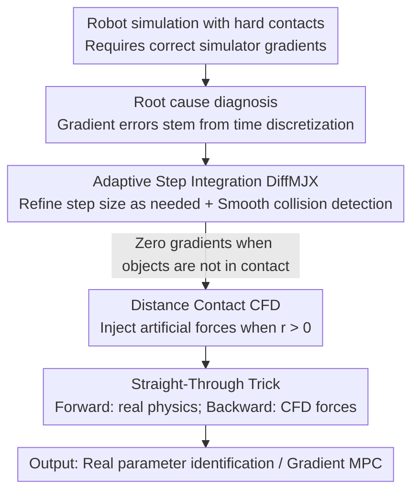

# Differentiable Simulation of Hard Contacts with Soft Gradients for Learning and Control

**Conference**: ICLR2026  
**OpenReview**: [https://openreview.net/forum?id=2EGtfFwxx8](https://openreview.net/forum?id=2EGtfFwxx8)  
**Code**: https://github.com/martius-lab/diffmjx  
**Area**: Robotics / Differentiable Simulation / Gradient Optimization  
**Keywords**: Differentiable simulation, hard contacts, adaptive integration, straight-through estimation, MuJoCo  

## TL;DR
Addressing the long-standing issues in penalty-based simulators (MuJoCo) where automatic differentiation gradients distort under hard contact and gradients vanish when objects are not in contact, this paper introduces "Adaptive Step Integration (DiffMJX)" to correct discretization-induced gradient errors. It then uses "Distance Contact (CFD) + Straight-Through Trick" to inject informative gradients for non-contacting objects without compromising forward physical realism. This enables real-world cube parameter identification and control of high-dimensional musculoskeletal systems using first-order gradients directly.

## Background & Motivation
**Background**: Imitation learning, reinforcement learning, and system identification in robotics highly depend on gradient optimization. If simulators provide accurate gradients, they can be directly used to fit real-world data, narrow the sim-to-real gap, and even compress training time from hours to seconds. Penalty-based simulators like MuJoCo model contact as soft constraints in convex optimization, which are theoretically differentiable everywhere and serve as the de facto standard for robotics simulation.

**Limitations of Prior Work**: Despite simulators being capable of calculating gradients, most methods "deliberately avoid" using them. There are two primary reasons: first, to realistically simulate hard contacts, solvers must be tuned to very stiff settings, where gradients obtained via automatic differentiation (AD) become severely distorted; if contacts are softened to preserve gradients, the sim-to-real gap widens. Second, when two objects are not in contact (e.g., a robotic hand has not yet touched a ball), the contact force is zero, resulting in zero gradients—leaving the optimizer with no signal on "which direction to move to make contact."

**Key Challenge**: The authors identify the root cause of the first problem: gradient errors in penalty-based simulators are not inherent to the simulator itself but stem from **errors generated during time discretization (numerical integration) of stiff differential equations**. In other words, AD-calculated gradients are "wrong" because they correspond to the discrete approximation system rather than the true gradients of the underlying continuous system. Common advice suggests "reducing the step size," but achieving correct gradients this way makes simulation unacceptably slow.

**Goal**: (1) Obtain correct contact gradients while maintaining hard contact realism and simulation speed; (2) Enable informative gradients between non-contacting objects.

**Key Insight**: Since the error arises from fixed-step integration of stiff ODEs, the authors introduce **adaptive step integration**—a mature numerical analysis technique—to automatically refine the step size during stiff moments like collisions while maintaining large steps otherwise. Simultaneously, inspired by contact-invariant optimization, they use **artificial contact forces** to generate gradients for non-contacting objects, applied only during backpropagation via a straight-through trick to avoid contaminating the forward trajectory.

**Core Idea**: Use "Adaptive integration to fix discretization errors + Distance contact with straight-through tricks to generate gradients" as two keys to unlock the potential of penalty-based differentiable simulation.

## Method

### Overall Architecture
The paper revolves around a standard robotic control computation graph: the state $x_k=[q_k,v_k]$ evolves under discrete dynamics $x_{k+1}=\text{step}(x_k,a_k,p)$, and the gradient of the loss $L(\tilde x_{k+1},x_k,a_k,p)$ with respect to actions $a_k$ or model parameters $p$ is used for optimization. The bottleneck lies in the numerical integration of stiff ODEs with hard contacts inside the `step` function.

The overall workflow starts by **diagnosing** that the root of gradient error is time discretization. Subsequently, **DiffMJX** (integrating the adaptive integration library Diffrax into MuJoCo XLA and smoothing non-differentiable branches in collision detection) is used to obtain correct gradients under hard contact. Then, **CFD** (allowing the solver to exert artificial contact forces in the non-contact zone where $r>0$) is overlaid. Finally, the **Straight-Through gradient trick** ensures the forward pass follows real physics while the backward pass utilizes CFD, providing effective gradients between non-contacting objects without destroying simulation realism. The resulting gradients are applied to two downstream tasks: parameter identification of real cubes and gradient-based Model Predictive Control (MPC).

### Key Designs

**1. Root Cause Diagnosis: Hard contact gradient distortion stems from time discretization of stiff ODEs, not the contact model itself**

The authors use a 1D toy example to clarify the issue: a point mass strikes a plane with velocity $v_0=-1$ and bounces back, with loss $L=|q_N-q_T|$ being the distance between final height and the target. They compare two contact models—ideal elastic collision (like DiffTaichi) and penalty-based collision (like MuJoCo). The key conclusion: the ODE of ideal elastic collision is piecewise linear before and after collision with a velocity jump at the moment of impact. The "time-of-impact (TOI)" correction used by Hu et al. (2020) solves this by splitting the ODE into two linear segments for integration, eliminating discretization error. However, penalty-based simulation involves a **nonlinear segment with varying stiffness** during collision, which cannot be simply split into large linear segments; thus, TOI correction fails for penalty-based simulation.

Conversely, penalty-based ODEs are smooth, meaning **reducing the step size can continuously suppress integration errors** (whereas in ideal elastic cases, the gradient sign remains wrong even as the step size decreases). This diagnosis is the logical starting point: since the error is a discretization error and the system is smooth, one should use "refining the step size as needed" rather than "global small steps" to address the root cause.

**2. DiffMJX: Integrating adaptive step integration into MuJoCo XLA**

The idea of adaptive integration is elegant: use two integrators of different orders to calculate the next state simultaneously; the difference between them is the error estimate. If the error is below a threshold, the step is accepted; otherwise, it is rejected, and a feedback controller selects a new step size for a retry. This paper uses Diffrax for efficient numerical integration in JAX and puts significant effort into seamlessly integrating quaternions and stateful actuators, ensuring compatibility with MJX and other MuJoCo libraries. The result: within the same computational budget, adaptive integration reduces loss and gradient errors by **several orders of magnitude** (the Pareto frontier in Fig. 5), and Diffrax’s step size selection is independent across parallel environments—a collision in one simulation does not slow down others during `vmap`.

Adaptive integration alone is insufficient: collision detection for geometries like capsules, cylinders, and boxes contains discrete `case` branches (non-differentiable), which introduce gradient artifacts. The authors smooth these branches using standard smooth proxies. The combination of **MJX + Diffrax adaptive integration + Smooth collision detection** is termed DiffMJX, where analytical gradients almost perfectly match central differences.

**3. CFD (Contacts From Distance): Enabling contact forces between "not-yet-touching" objects**

The second issue is zero gradients between non-contacting objects. For example, in a billiards scenario, applying a force $F$ to the cue ball to hit a target ball with a loss based on the target ball's distance to a goal; if $F$ is insufficient to cause collision, $\nabla_F L=0$, leaving the optimizer directionless. CFD allows the solver to exert a small artificial contact force even at positive signed distances $r>0$ (i.e., not yet touching). Specifically in MuJoCo: contact force magnitude is determined by impedance $d(r)$ and position-level reference acceleration $h(r)$. CFD keeps $d(r)$ unchanged for $r<0$ and adds a spline segment for $r>0$ (controlled by solimp-CFD parameters $(d_c,d_0,w_c,m_c,p_c)$), which smoothly continues from $d_0$ and decays to $d_c=0$ to ensure differentiability; the CFD-width $w_c$ determines the distance over which the artificial force is active. Simultaneously, the ReLU acting on signed distance in $h(r)$ is replaced with a softplus to soften it, resulting in the modified contact force $f_{\text{CFD}}$.

**4. Straight-Through Gradient Trick: Forward: real physics; Backward: CFD forces**

Directly adding CFD to the simulation causes non-physical behavior—artificial forces would make a quadruped robot hover as if standing on a sponge of thickness $w_c$ (Fig. 7, top). To gain CFD gradients without destroying forward realism, the authors apply the straight-through trick at the ODE level:

$$\dot x(t) = \operatorname{sg}\!\big(F_\theta(t,x(t))\big) + \tilde F_\theta(t,x(t)) - \operatorname{sg}\!\big(\tilde F_\theta(t,x(t))\big)$$

where $\operatorname{sg}$ is the stop-gradient operator, $F$ is the original MJX/DiffMJX ODE, and $\tilde F$ is the ODE using CFD ($\dot v_{\text{CFD}}=M^{-1}(\tau-c+J^\top f_{\text{CFD}})$). During the forward pass, the second and third terms $\tilde F$ cancel out, leaving the real $F_\theta$. During the backward pass, the derivatives of the terms wrapped in $\operatorname{sg}$ are zero, leaving only the derivative $\partial\tilde F_\theta/\partial(x,\theta)$. Crucially, **these derivatives are evaluated on the original, unmodified forward trajectory $x(t)$**—thus the loss curve remains unchanged, but gradients become informative. The cost is calculating the forward pass twice (with/without CFD), but the gradient is calculated only once. Since gradient computation is the primary overhead, this remains efficient. In the billiards example, with CFD + Straight-Through, even if the balls do not touch, a non-zero gradient is obtained pointing toward "how to make them collide."

### Loss & Training
The optimization objectives for the two downstream tasks are straightforward, placing the burden on gradient quality: parameter identification uses an L2 loss for multi-step prediction (splitting trajectories into segments of length 5 and unrolling 4 steps), optimized with Adam. Gradient MPC uses an Adam optimizer with a learning rate of 0.01 on a 256-step prediction window, iterating 32 times, and re-planning after 16 steps using the previous plan as a warm start. Two engineering details critical for Gradient MPC: (1) **Gradient Clipping**—gradients change scales drastically when contacts occur; (2) Tracking the rollout cost across all gradient iterations and selecting the one with the minimum cost, as the cost landscape is highly non-convex and non-monotonic.

## Key Experimental Results

### Main Results: Real Cube Parameter Identification
Using 550 real trajectories from the Contactnets dataset (Pfrommer et al. 2021)—a 10cm acrylic cube repeatedly thrown onto a wooden table—the authors estimate the cube's side length via gradient descent.

| Method | Side Length Estimation Error | Robustness Performance |
|------|------|----------|
| Vanilla MJX | Convergence limited | Training stalls or converges poorly when initialized at 60mm or 140mm |
| MJX + CFD | ~5% relative to ground truth | CFD resolves convergence issues caused by poor initialization |
| DiffMJX + CFD | ~5%, higher precision | Adaptive integration significantly reduces discretization error via dynamic step adjustment |

The authors claim this is the **first time a fully automated differentiable penalty-based simulator has completed parameter identification of real cube dynamics via standard gradient optimization**.

### Ablation Study (Gradient MPC vs. Sampling MPC)
The baseline is the predictive sampling of MuJoCo MPC ($k=\{64, 256, 1024\}$ trajectories per step, using brown noise sampling for fair comparison). Physical systems utilize the MyoSuite muscle-tendon models.

| Task | Sampling MPC | Gradient MPC (No CFD) | Gradient MPC (CFD) | Description |
|------|---------|------|------|------|
| Dexterous In-Hand (Two balls, MyoHand 39 tendons) | Difficult to solve | Reliably solved | Reliably solved | Contacts occur frequently due to gravity; CFD unnecessary |
| Bionic Tennis (MyoArm 63 tendons + prosthesis) | Strong baseline, near solution | **Failed to solve** (Initial miss) | Solved | Only ball-to-target distance as supervision; needs CFD |
| Tabletop Cube Reorientation | Only slight reorientation, fails position | Same as left | **Solved perfectly** | Gravity insufficient for all finger contacts; needs CFD |
| In-Hand Cube Reorientation | Failed | Solved | Solved | Contact discovered automatically by gravity; CFD has little impact |

### Key Findings
- **The value of CFD is highly dependent on whether the task "automatically initiates contact"**: For in-hand manipulation/reorientation where gravity ensures frequent contact, CFD makes little difference. For tasks like bionic tennis or tabletop reorientation that "require proactive contact," success is impossible without CFD.
- **Over-parameterization aids gradient methods**: The over-parameterization of musculoskeletal models (at least two muscles per joint) helps the gradient planner escape local minima, similar to over-parameterized neural networks, whereas RL and sampling planners struggle in such high-dimensional spaces.
- **Gradient clipping + selecting the best iteration** are indispensable engineering details for stable Gradient MPC.

## Highlights & Insights
- **Attributing "wrong gradients" to time discretization rather than the contact model is the conceptual pivot**: This diagnosis leads directly to using adaptive integration as a fundamental solution, rather than attempting to segment trajectories like TOI—the latter being impractical for penalty-based, varying-stiffness ODEs. This "diagnose the root cause before prescribing the cure" approach is highly persuasive.
- **The straight-through trick at the ODE/physics level is very clever**: It adapts a trick originally for discrete neurons to continuous dynamics, using $\operatorname{sg}(F)+\tilde F-\operatorname{sg}(\tilde F)$ to decouple "authentic forward, fictional backward" physics in a single line. This can be directly reused in any scenario where one wants to generate gradients for variables invisible in the forward pass.
- **Reusing existing infrastructure (MuJoCo XLA + Diffrax) rather than building from scratch** ensures a low barrier to entry for practitioners. DiffMJX and CFD essentially add a few adjustable knobs (integration error threshold, solimp-CFD parameters) to MJX while maintaining compatibility.

## Limitations & Future Work
- **CFD introduces extra hyperparameters** ($(d_c,d_0,w_c,m_c,p_c)$ and $w_c$), which must be tuned per task; while the authors provide a tuning guide in Appendix B, it remains a practical burden.
- **Two forward passes**: CFD requires separate forward passes with and without artificial forces. Although gradients are only computed once and the overhead is generally acceptable, doubling the forward cost remains non-negligible for ultra-long rollouts.
- **Parameter identification only validated on rigid cube geometry**; the authors admit "more experiments are needed to characterize the scope and limitations," and scalability to soft bodies, complex geometries, or dense multi-body contact is unknown.
- **Gradient MPC's reliance on engineering tricks** like clipping suggests the cost landscape remains highly non-convex, and the robustness boundaries of the method are not yet fully clear.

## Related Work & Insights
- **vs. Complementary-based differentiable solvers** (Werling 2021; Taylor 2022): These precisely calculate contact forces with discontinuities and rely on the implicit function theorem for analytical reconstruction or stochastic smoothing; this paper follows the penalty-based route, addressing the issue via integration errors and avoiding analytical reconstruction.
- **vs. TOI (Time-of-Impact) correction** (Hu et al. 2020, DiffTaichi; Schwarke et al. 2024): TOI targets ideal elastic/impulsive simulations by splitting segments at contact. This paper explicitly states TOI is unsuitable for penalty-based varying stiffness and opts for adaptive step sizes, which is the correct route for smooth ODEs.
- **vs. Contact-invariant optimization** (Mordatch et al. 2012): They also aim to make optimization aware of unreached contacts; CFD implements this in a penalty-based simulator and uses the straight-through trick to restrict artificial forces to the backward pass, preserving forward realism.
- **vs. Sampling-based planning / Graph networks for contact dynamics** (MuJoCo MPC; Allen et al. 2023): This paper demonstrates that first-order differentiable simulation gradients can outperform sampling-based predictive planning in high-dimensional musculoskeletal manipulation, providing evidence for the utility of simulator gradients.

## Rating
- Novelty: ⭐⭐⭐⭐⭐ Precisely attributes gradient distortion to time discretization and solves it systematically with two complementary routes: adaptive integration and straight-through distance contacts.
- Experimental Thoroughness: ⭐⭐⭐⭐ Includes both real-world parameter ID and high-dimensional MPC, though parameter ID is limited to simple rigid geometry.
- Writing Quality: ⭐⭐⭐⭐⭐ Uses a 1D toy example to dissect the root cause; clear figures and a complete logical chain.
- Value: ⭐⭐⭐⭐⭐ Directly implemented as usable knobs for MJX, compatible with existing libraries; high practical value for the differentiable simulation community.

<!-- RELATED:START -->

## Related Papers

- [\[ICLR 2026\] MoMaGen: Generating Demonstrations under Soft and Hard Constraints for Multi-Step Bimanual Mobile Manipulation](momagen_generating_demonstrations_under_soft_and_hard_constraints_for_multi-step.md)
- [\[ICLR 2026\] Efficient Differentiable Contact Model with Long-range Influence](efficient_differentiable_contact_model_with_long-range_influence.md)
- [\[ICLR 2026\] D-REX: Differentiable Real-to-Sim-to-Real Engine for Learning Dexterous Grasping](d-rex_differentiable_real-to-sim-to-real_engine_for_learning_dexterous_grasping.md)
- [\[ICLR 2026\] AutoBio: A Simulation and Benchmark for Robotic Automation in Digital Biology Laboratory](autobio_a_simulation_and_benchmark_for_robotic_automation_in_digital_biology_lab.md)
- [\[ICLR 2026\] BFM-Zero: A Promptable Behavioral Foundation Model for Humanoid Control Using Unsupervised Reinforcement Learning](bfm-zero_a_promptable_behavioral_foundation_model_for_humanoid_control_using_uns.md)

<!-- RELATED:END -->
