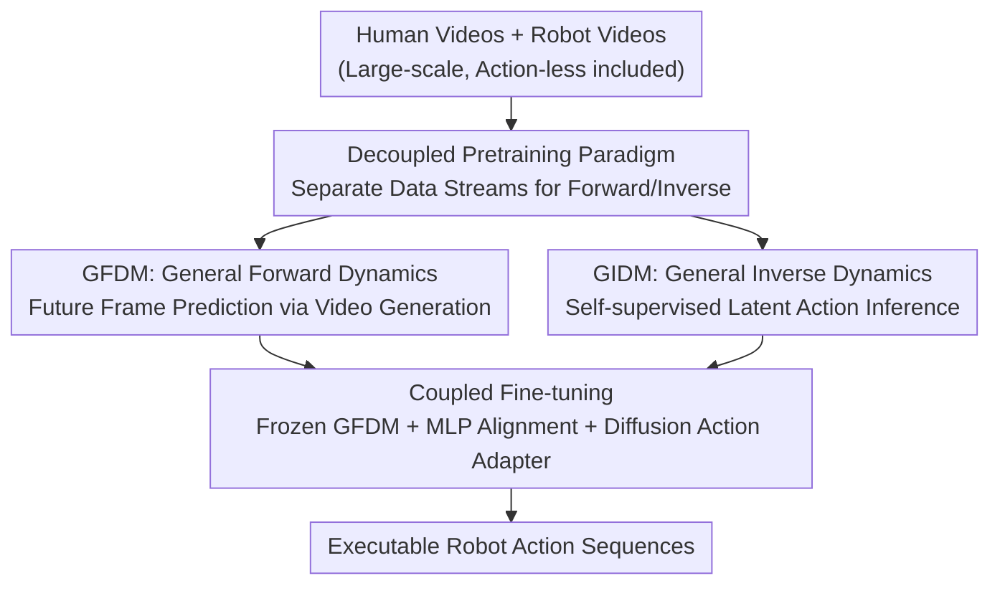

# Disentangled Robot Learning via Separate Forward and Inverse Dynamics Pretraining

**Conference**: ICLR2026  
**OpenReview**: [https://openreview.net/forum?id=DdrsHWobR1](https://openreview.net/forum?id=DdrsHWobR1)  
**Code**: Available (GitHub link provided in paper, repository to be confirmed)  
**Area**: Robotics / Embodied AI / VLA  
**Keywords**: VLA, Forward Dynamics, Inverse Dynamics, Action-less Video, Disentangled Pretraining

## TL;DR
DeFI decomposes robot policy learning into two independent modules—"predicting future frames" and "inferring latent actions." These are pretrained separately on large-scale human and robot videos and then coupled for end-to-end fine-tuning. This allows massive action-less videos to be utilized for VLA, achieving SOTA results on CALVIN ABC-D (Avg. length 4.51), SimplerEnv-Fractal (51.2%), and real-world robots (81.3%).

## Background & Motivation
**Background**: Vision-Language-Action (VLA) models serve as the mainstream framework for general-purpose robots. By leveraging the vision-language understanding of VLMs, these models learn "image + instruction → action" from large-scale action-labeled data. A promising recent trend involves implicitly learning "forward dynamics" (future frame prediction) and "inverse dynamics" (action reasoning) within a single end-to-end architecture, which outperforms traditional VLA.

**Limitations of Prior Work**: This coupled paradigm suffers from two major flaws. First, the objectives of 2D video prediction and 3D action prediction often conflict, leading to training instability. Second (and more critically), the entanglement of vision and action prevents the model from utilizing massive action-less human/web videos, which inherently contain cross-embodiment motion priors. Other approaches attempt to bypass this by pretraining a video prediction model for forward dynamics and adding a simple inverse dynamics module, but they often treat the latter as a secondary component (e.g., VPP omits it, Vidar lacks a scalable pretraining recipe), making the inverse module a bottleneck that fails to exploit the forward model's capabilities.

**Key Challenge**: The fundamental issue is that the importance of "accurate action inference" is often underestimated relative to "accurate future prediction." Inverse dynamics also requires scalable pretraining on large-scale action-less videos to reach its full potential.

**Goal**: To design a "win-win" paradigm for both 2D video prediction and 3D action inference, allowing action-less videos to benefit both forward and inverse dynamics.

**Key Insight**: Rather than coupled training that causes interference and restricts data usage, the **pretraining of forward and inverse dynamics should be completely decoupled**. Each should specialize using its optimal data sources before being coupled into a unified architecture for end-to-end fine-tuning.

**Core Idea**: Replace "entangled end-to-end VLA" with a "Decoupled Pretraining of Forward (GFDM) + Inverse (GIDM) Dynamics followed by end-to-end Coupled Fine-tuning" to unlock the potential of massive action-less videos.

## Method

### Overall Architecture
DeFI addresses how to leverage action-less videos for both forward prediction and inverse action reasoning. It splits policy learning into two independent knowledge modules across two stages: **Stage 1: Decoupled Pretraining**—the General Forward Dynamics Model (GFDM) is pretrained on mixed human+robot videos using a video generation objective (learning to predict future frames from current observations and instructions). Simultaneously, the General Inverse Dynamics Model (GIDM) is pretrained in a self-supervised manner on unlabeled video transitions (learning to infer latent actions from visual changes). Both modules specialize independently. **Stage 2: Coupled Fine-tuning**—GFDM is frozen as a stable backbone providing future video representations, which are projected via MLP into the GIDM input manifold. GIDM infers latent actions, and a diffusion-based Action Adapter translates these into executable robot commands. All three modules are jointly optimized end-to-end. This aligns forward prediction, action inversion, and low-level control, allowing efficient generalization from minimal robot data.

### Key Designs

**1. Decoupled Pretraining Paradigm: Synergizing Specialized Forward and Inverse Dynamics**

Addressing the pain point where vision-action entanglement causes interference and blocks action-less data, DeFI treats forward prediction and inverse reasoning as **complementary knowledge bases** to be pretrained separately. The forward model captures motion-level regularities from 2D videos, while the inverse model focuses on 3D action inference based on state transitions. Both are pretrained on mixed human+robot data, but they extract orthogonal knowledge: the former handles "how the scene changes," while the latter handles "what action corresponds to that change." This "specialize then integrate" structure allows each module to benefit from heterogeneous data without gradient competition in the same parameter space, fully unlocking the potential of action-less human videos.

**2. GFDM: Implicit Forward Dynamics via Video Generation and Single-Step Denoising**

Given observation $o_t$ and instruction $l$, the forward dynamics model $F_\theta$ synthesizes a short-term future video $\hat{o}_{t:t+H}$ of length $H+1$. The authors employ Stable Video Diffusion (SVD) with a CLIP text encoder, pretrained on mixed data. The video VAE $(\mathcal{E},\mathcal{D})$ defines the latent space, and the denoiser $\epsilon_\theta$ is trained under the latent diffusion objective. The noising process is $q(z^{(s)}_{t:t+H}\mid z^{(0)}_{t:t+H}) = \mathcal{N}(\sqrt{\bar\alpha_s}\, z^{(0)}_{t:t+H}, (1-\bar\alpha_s)I)$, with context $c_t = (z_t, f_{\text{text}}(l))$, where $z_t=\mathcal{E}(o_t)$. The loss is the noise prediction $L_{\text{diff}}(\theta)=\mathbb{E}\,\lVert \epsilon - \epsilon_\theta(z^{(s)}_{t:t+H}, s, c_t)\rVert_2^2$.

To avoid the computational cost of full video reconstruction and focus on motion rather than appearance, the authors **freeze the pretrained GFDM and restrict denoising to a single step**. This produces efficient future latent embeddings. For multi-camera setups, future videos are predicted independently for each view. This step converts the "prediction" capability into an actionable motion context at minimal cost.

**3. GIDM: Reframing Action Inference as Self-supervised Representation Learning**

This is the critical "bottleneck-solving" design: inverse dynamics is elevated to the same level of importance as forward dynamics and pretrained on action-less videos. The authors construct a proxy task: taking a pair of frames $o_t, o_{t+n}$ (roughly 1s apart), they encode latent states $e_t, e_{t+n}$ using DINOv2. GIDM $I_\theta$ consists of a spatio-temporal Transformer encoder with causal masking and a VQ-VAE codebook. Learnable action queries $q_a\in\mathbb{R}^{N\times d}$ are concatenated with DINO embeddings and T5-extracted instruction embeddings. The output $\tilde a^L_{t\to t+n}=I_\theta(e_t,e_{t+n},l,q_a)$ is quantized via $\hat a^L_{t\to t+n}=\mathrm{VQ}_\theta(\tilde a^L_{t\to t+n})$ to obtain discrete action tokens. The model is trained to minimize the MSE between predicted future DINO features $\hat e_{t+n}$ (reconstructed from latent action codes) and the ground truth $e_{t+n}$.

**Mechanism**: By disguising "action inference" as "reconstructing future visual features from latent action codes," the model is forced to distill meaningful latent actions from pure visual transitions. This enables the use of heterogeneous action-less data for inverse dynamics, providing discrete tokens that are naturally compatible with control adapters.

**4. Coupled Fine-tuning: Joint Optimization with Frozen Forward Backbone and Diffusion Adapter**

During fine-tuning, the modules are coupled into an end-to-end optimizable system. **GFDM $F_\theta$ remains frozen** to preserve the large-scale dynamics priors and prevent erosion from smaller downstream datasets. It acts as a stable backbone providing temporally consistent future representations. A lightweight MLP projects these embeddings into the GIDM input manifold. GIDM $I_\phi$ is optimized to interpret these aligned latents and infer underlying motion. To extract richer spatio-temporal features, a video-former fuses intermediate GFDM features with MLP projections, which are then fed into a diffusion-based action adapter (initialized from a 30M DiT-B). This translates latent actions into executable robot commands, aligning prediction, inversion, and control.

### Example Walkthrough
During inference: Current observation $o_t$ + instruction "cutting the bread" → GFDM performs single-step denoising to generate future video features $\hat z_{t:t+H}$ (visualizing the knife moving toward the bread) → MLP projects these into GIDM, which combines them with current latents to infer latent action sequences → Diffusion Action Adapter generates the final executable control commands conditioned on these latent actions.

## Key Experimental Results

### Main Results

| Dataset | Setting | Metric | DeFI | Prev. SOTA | Gain |
|--------|------|------|------|----------|------|
| CALVIN ABC-D | View: Static | Avg. Len. ↑ | 4.05 | 3.80 (UniVLA) | +0.25 |
| CALVIN ABC-D | View: Multi | Avg. Len. ↑ | 4.51 | 4.33 (VPP) | +0.18 |
| SimplerEnv-Fractal | Visual Matching | Avg. Success | 51.2% | 42.0% (TraceVLA) | +9.2pt |
| SimplerEnv-Fractal | Variant Aggregation | Avg. Success | 45.4% | 45.0% (TraceVLA) | +0.4pt |
| Real Franka (8 tasks) | — | Avg. Success | 81.3% | 48.2% (Diffusion Policy) | +33.1pt |

In the CALVIN multi-view setting, DeFI achieves success rates of 97.9/94.2/90.7/87.0/81.2 for five consecutive tasks, outperforming models like Seer, VPP, and UP-VLA that entangle prediction and inference. It also surpasses UniVLA, proving that decoupled pretraining is more effective at extracting value from action-less videos, especially for long-horizon tasks.

### Ablation Study

| Configuration | Avg. Len. | Description |
|------|-----------|------|
| All w/ pretrain (Full) | 4.51 | Both forward and inverse pretrained |
| GIDM w/o pretrain | 4.16 | No pretraining for inverse module (-0.35) |
| GFDM w/o pretrain | 3.28 | No pretraining for forward module (-1.23) |

### Key Findings
- **Forward pretraining is the primary contributor**: Without GFDM pretraining, Avg. Len. drops from 4.51 to 3.28, showing that a strong forward dynamics backbone is the foundation.
- **Inverse pretraining is essential**: Removing GIDM pretraining also causes a significant drop (0.35), confirming that accurate action inference is as vital as future prediction.
- **Superior data efficiency**: Using only 10% of downstream data, DeFI achieves an 18% higher task length than VPP on CALVIN ABC-D. It matches previous SOTA with only 60% of the data.
- **Honest failure analysis**: Performance on certain SimplerEnv tasks (e.g., Open/Close Drawer at 38.6%) is limited by domain shifts in the frozen GFDM, which propagate errors to the inverse module.

## Highlights & Insights
- **Elevating Inverse Dynamics**: While previous "video-as-policy" routes assumed "better prediction leads to better control," this paper argues that "accurate action inference is as important as accurate future prediction" and provides a scalable self-supervised recipe.
- **Clver Proxy Task**: Using "latent action codes to reconstruct future DINO features" allows the model to learn inverse dynamics from pure vision, unlocking massive action-less datasets—a trick applicable to many embodiment learning scenarios.
- **Single-Step Denoising as Feature Extractor**: Freezing the video diffusion model and running only one denoising step captures motion priors efficiently without the overhead of full generation.

## Limitations & Future Work
- **Domain Shift from Frozen GFDM**: Freezing the forward model preserves generalization but may lead to distortion when downstream domains differ significantly from pretraining data. Lightweight domain adaptation could be explored.
- **Dependency on Video Generators**: The method relies on large-scale video diffusion models, which are computationally expensive to pretrain.
- **Interpretability of Latent Action Codes**: More research is needed to determine if VQ latent codes truly align with the action manifold across different robot embodiments.

## Related Work & Insights
- **vs. VPP / Vidar (Video-as-policy)**: These treat inverse dynamics as a secondary component. DeFI achieves better results (Avg. Len. 4.51 vs. VPP 4.33) by giving inverse dynamics equal status and large-scale pretraining.
- **vs. UP-VLA / Seer (Coupled End-to-End VLA)**: These models face objective interference and cannot utilize action-less videos effectively. DeFI's "decouple then couple" strategy outperforms them (4.51 vs. Seer 4.28 / UP-VLA 4.08).
- **vs. UniVLA (Latent Action Pseudo-labeling)**: UniVLA uses latent actions as pseudo-labels for VLA pretraining. DeFI proves that direct decoupled pretraining of the dynamics modules is more effective (4.05 vs. 3.80 in static view).

## Rating
- Novelty: ⭐⭐⭐⭐⭐ Decoupling forward/inverse pretraining and reframing inverse inference as self-supervised representation learning is a significant paradigm innovation.
- Experimental Thoroughness: ⭐⭐⭐⭐⭐ Comprehensive testing across CALVIN, SimplerEnv, and real-world robots, including data efficiency and pretraining ablations.
- Writing Quality: ⭐⭐⭐⭐ Clear motivation and comprehensive diagrams; mathematical notations are mostly consistent.
- Value: ⭐⭐⭐⭐⭐ Significantly unlocks the potential of action-less videos for VLA, with high practical value for real-world robotics.

<!-- RELATED:START -->

## Related Papers

- [\[CVPR 2026\] DynBridge: Bridging Imagination and Control through Interaction Dynamics for Robot Manipulation](../../CVPR2026/robotics/dynbridge_bridging_imagination_and_control_through_interaction_dynamics_for_robo.md)
- [\[ICLR 2026\] Accelerated co-design of robots through morphological pretraining](accelerated_co-design_of_robots_through_morphological_pretraining.md)
- [\[ICLR 2026\] DataMIL: Selecting Data for Robot Imitation Learning with Datamodels](datamil_selecting_data_for_robot_imitation_learning_with_datamodels.md)
- [\[ICLR 2026\] Rodrigues Network for Learning Robot Actions](rodrigues_network_for_learning_robot_actions.md)
- [\[ICLR 2026\] LeRobot: An Open-Source Library for End-to-End Robot Learning](lerobot_an_open-source_library_for_end-to-end_robot_learning.md)

<!-- RELATED:END -->
