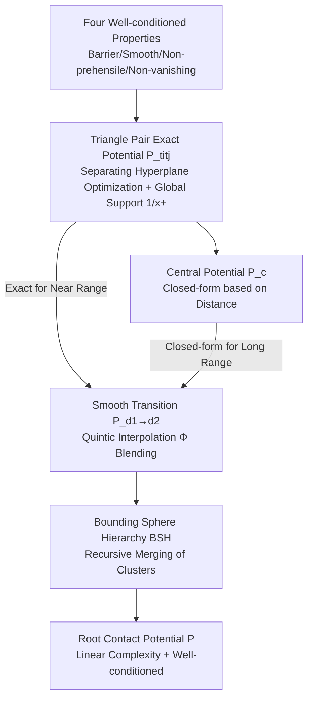

# Efficient Differentiable Contact Model with Long-range Influence

**Conference**: ICLR 2026  
**OpenReview**: [https://openreview.net/forum?id=YSIHQy80Cr](https://openreview.net/forum?id=YSIHQy80Cr)  
**Code**: To be confirmed  
**Area**: Differentiable Physical Simulation / Robot Control  
**Keywords**: Differentiable Simulation, Contact Model, Long-range Gradient, Barrier Potential, Bounding Sphere Hierarchy (BSH), Contact-rich Manipulation  

## TL;DR
This paper systematically characterizes four properties that a "well-conditioned contact model" must satisfy (barrier-form, second-order smoothness, non-prehensile, and non-vanishing). It designs a differentiable contact potential function that is efficiently evaluated using a Bounding Sphere Hierarchy (BSH) and provides non-zero gradients even when objects are far apart, enabling gradient-based optimizers to discover complex contact-rich motions from trivial initializations.

## Background & Motivation
**Background**: Differentiable physical simulation transforms simulators into functions that can propagate gradients, widely used in tasks such as model predictive control, robot co-design, and neural PDE solving. A core selling point is the ability to automatically "discover" contact-rich motions from trivial initializations.

**Limitations of Prior Work**: Several systematic analyses (Suh et al. 2022, Antonova et al. 2023) point out that analytical gradients from differentiable simulations are unreliable—they become **rugged** at non-smooth contact points and **vanishing** in non-contact regions where objects are far apart. Most existing remedies follow "global optimization" routes (Bayesian optimization, optimal transport) to escape local optima.

**Key Challenge**: The authors argue that the root cause of these pathological gradients lies in the **contact model itself**: the sudden introduction of contact forces causes ruggedness, while the absence of interaction terms when not in contact leads to vanishing gradients. Rather than wrapping global search externally, it is better to directly repair the gradient landscape within the contact model.

**Goal**: To provide a legalized set of formal properties that a contact potential should satisfy and construct a practical contact model that is **computationally feasible while satisfying all properties**, enabling first-order gradient optimizers to handle contact-rich tasks.

**Core Idea**: (1) **Theoretical Level** — Propose four well-conditioned properties: barrier-form, smoothness, non-prehensile, and non-vanishing. The "non-vanishing" property introduces **long-range influence**, providing gradients even between arbitrarily distant objects. (2) **Practical Level** — Satisfy these properties using a global support potential based on separating hyperplanes, then leverage Barnes-Hut / Fast Multipole ideas from N-body simulation to reduce contact evaluation from $O(T^2)$ to linear using a Bounding Sphere Hierarchy (BSH).

## Method

### Overall Architecture
The approach consists of two steps: first, **theoretically** defining the four properties a well-conditioned contact potential must satisfy and showing that existing models lack at least one; second, **constructively** providing a potential function that satisfies all properties. This involves an "exact potential" defined by a separating hyperplane optimization between a pair of triangles, using a globally supported $1/(\cdot)_+$ instead of a locally supported log-barrier to avoid vanishing gradients. Finally, BSH is used to **smoothly transition** the exact potential of distant triangle clusters to a closed-form "central potential" depending only on the distance between sphere centers, allowing for hierarchical, near-linear evaluation of the entire contact potential.

### Key Designs

**1. Four Well-conditioned Properties: Translating "good gradients" into verifiable mathematical conditions.** This is the theoretical backbone. **Barrier-Form** requires $P(x)\ge 0$ to be continuous and $P(x)=\infty \iff x\in C_{obs}$, which, combined with line search/trust regions, strictly guarantees non-penetration. **Smoothness** requires $P$ to be **second-order** differentiable on $C_{free}$—this is crucial because, per the implicit function theorem, simulation gradients $\partial x^{t+1}/\partial(x^t,x^{t-1}) = -[\partial^2 L/\partial x^{t+1,2}]^{-1}\,\partial^2 L/\partial x^{t+1}\partial(\cdot)$ require $P$ to be $C^2$ for correct evaluation, whereas classic IPC (Li et al. 2020) is only $C^1$. **Non-prehensile** requires contact forces to only "push" and not "pull," formalized as the force $f_i$ falling within the direction cone $\mathcal{F}_{J\to I}$ pointing from one convex hull to another. **Non-vanishing** is automatically ensured by non-zero vectors in $\mathcal{F}_{J\to I}$, realized by writing $P$ as a sum of pairwise potentials $P=\sum_{\langle I,J\rangle} P_{I\cup J}$, ensuring non-zero forces even between distant triangle pairs. Table 1 proves that prior models (complementarity, soft penalty, log-barrier, SDRS) violate at least one, while Ours satisfies all four.

**2. Pairwise Potential with Global Support via Separating Hyperplanes: Extending gradient reach without breaking barrier/smoothness.** For a pair of triangles $t_i, t_j$, as both are convex, a separating plane $p_{ij}=(n_{ij}^T,d_{ij})^T$ can be inserted. This plane is modeled as a zero-mass auxiliary object, defining a nested optimization for the pairwise potential:

$$P_{t_i\cup t_j}=\min_{p_{ij}}\Big[\tfrac{12}{(1-\|n_{ij}\|)_+}+\sum_{k}\tfrac{1}{(\langle x_{i(k)},n_{ij}\rangle+d_{ij})_+}+\sum_{k}\tfrac{1}{(\langle x_{j(k)},-n_{ij}\rangle-d_{ij})_+}\Big].$$

The key difference is that instead of using **locally supported** log-barriers as in original formulations (Liang et al. 2024, Ye et al. 2025), this work uses $1/(\cdot)_+=1/\max(\cdot,0)$, which has **global support** on $\mathbb{R}_+$. This modification prevents the potential from decaying to zero at large distances, satisfying the non-vanishing property. The objective is strictly convex with a unique minimum, making $P_{t_i\cup t_j}$ well-defined and globally $C^2$ differentiable. $p_{ij}$ is solved via Newton’s method, and the derivatives are calculated using the inverse function theorem.

**3. Smooth Transition between Potentials: Seamlessly swapping exact potentials for closed-form approximations using quintic interpolation.** Evaluating exact potentials for all triangle pairs is $O(T^2)$, which is too slow. The authors introduce a blended potential:

$$P^{I\cup J}_{d_1\to d_2}=(1-\phi_{d_1\to d_2}(x))\,P^{I\cup J}_{d_1}+\phi_{d_1\to d_2}(x)\,P^{I\cup J}_{d_2},$$

using the classic quintic smoothing kernel $\Phi(d)=\mathrm{clip}(6d^5-15d^4+10d^3,0,1)$ (which ensures continuous second derivatives). Lemma 5.1 proves that as long as $R_I+R_J\le d_1<d_2$ and $P_{d_2}$ is also smooth and non-prehensile, the blended potential **inherits** all well-conditioned properties of $P_{d_1}$. This allows for a smooth fusion of "exact for near, approximate for far" without destroying theoretical properties, providing a license for hierarchy.

**4. Recursive Evaluation via Bounding Sphere Hierarchy (BSH): Turning pairwise contact into a near-linear N-body problem.** This is the core of efficiency. By contracting triangle vertices to centers, the exact potential degenerates into a **closed-form central potential** depending only on center distance:

$$P^{t_i\cup t_j}_c=12\Big[1+\tfrac{1}{\|x_{t_i}-x_{t_j}\|^{1/2}}\Big]^2,\qquad P^{I\cup J}_c=12\Big[1+1/\sqrt{\|x_I-x_J\|}\Big]^2.$$

A **hierarchical** bounding sphere binary tree is built for each rigid body. Leaf nodes store single triangles. Recursively: if two nodes are well-separated ($\text{distance} \ge R_I+R_J$), the closed-form $P_c$ is used; otherwise, the algorithm descends to child node pairs. Transition zones ($d_1=R_I+R_J, d_2=(1+\epsilon)d_1$) use the aforementioned quintic blending. Theorem 5.4 guarantees that the final $P=\sum_{I\ne J}P^{I\cup J}_{BSH}$ satisfies all four properties. For uniform meshes, the evaluation cost is $O(T)$, analogous to Fast Multipole Methods.

## Key Experimental Results

### Physical Accuracy Validation (Stacked Books)
20 boards are extended block-by-block to the theoretical limit and retracted by 0.1%. Stability and force errors are measured under various contact coefficients $\mu$:

| Contact Coefficient $\mu$ | 1e−5 | 1e−6 | 1e−7 | 1e−8 | 1e−10 |
|---|---|---|---|---|---|
| Margin (m) | 1.82e−2 | 5.67e−3 | 1.47e−3 | 4.12e−4 | 3.13e−5 |
| Contact Force (N) | 6.38e−3 | 6.40e−4 | 6.42e−5 | 6.42e−6 | 6.42e−8 |
| Stable | ✗ | ✓ | ✓ | ✓ | ✓ |

When $\mu < 10^{-6}$, the system is stable with millimeter-level margin errors and negligible force errors, showing that "non-contact force" does not compromise physical realism.

### Comparison of Property Completeness (Table 1)

| Method | Barrier | Smooth | Non-prehensile | Non-vanishing |
|---|---|---|---|---|
| Werling 2021 / Xu 2022 (Compl.) | ✗ | ✗ | ✓ | ✗ |
| Fisher 2001 (Penalty) | ✗ | ✗ | ✓ | ✗ |
| Harmon 2009 / Li 2020 (IPC Log) | ✓ | ✗ | ✓ | ✗ |
| Ye 2025 (SDRS) | ✓ | ✓ | ✓ | ✗ |
| **Ours** | ✓ | ✓ | ✓ | ✓ |

### Control Task Convergence
On tasks like Billiards, Push, Sort, Gather, and Ant-Push, Ours is compared with IPC, SDRS, MuJoCo (finite diff), and GB (bundled gradients):

- **Billiards**: From trivial initialization (distant objects), all methods except Ours **make zero progress** due to vanishing gradients. With random sampling, they start but remain slow; Ours converges faster with or without sampling.
- **Push**: Using MPC with a 48-frame horizon, Ours directs the pole to maneuver behind the box and perform multiple pushes. Other methods fail even with sampling.
- **Gather / Sort / Ant-Push**: Ours completes 10-cube gathering/sorting and 16-DOF Ant-Push solely via gradient information, where other methods show little effect.

### Key Findings
1. **Long-range gradients are the deciding factor** for "discovering motion from trivial initializations." Baseline failures are mostly due to vanishing gradients rather than local ruggedness.
2. **Efficiency cost exists but is mitigated by BSH**: While slower per frame than IPC due to nested optimization, the BSH version is much faster than brute-force $O(T^2)$ and scales better with mesh resolution.

## Highlights & Insights
- **Elevating "good gradients" to provable mathematical properties**: The four properties + Table 1 provide a clear "scorecard" for the differentiable contact field.
- **A small substitution (local to global support $1/(\cdot)_+$) leverages long-range influence**, deriving the non-vanishing property from a clean physical source.
- **Clever cross-domain transfer**: Porting Barnes-Hut and Fast Multipole Methods to contact potential evaluation, while using smooth transitions to preserve differentiability, balances rigor and feasibility.
- **The Invariance Lemma (Lemma 5.1)**: Blending "approximation without losing properties" into a recursive guarantee is the theoretical license for hierarchical scaling.

## Limitations & Future Work
- **Limited to rigid bodies**: Bounding spheres only strictly contain geometry in rigid contexts; deformation would break properties.
- **Computational overhead**: Recursive definitions and nested optimizations introduce significant costs compared to standard simulators.
- **Complexity analysis**: $O(T)$ is only proven for special cases; general scene costs are harder to bound.
- **Outlook**: Extending well-conditioned properties to deformable contact and finding lighter-weight pairwise solvers are natural next steps.

## Related Work & Insights
- **Differentiable Simulation Spectrum**: From MuJoCo finite differences to analytic rigid/deformable simulators to Position-Based Dynamics (Huang et al. 2024); this work targets the hardest sub-step: contact handling.
- **Contact Model Spectrum**: Complementarity (Werling 2021), soft penalty (Fisher 2001), log-barrier IPC (Li 2020), and SDRS (Ye 2025). This paper identifies gaps in all and uses SDRS as a refined starting point.
- **Pathological Gradient Analysis**: Suh et al. 2022 and Antonova et al. 2023 revealed rugged/vanishing gradients; this work provides a path to fix the underlying model rather than wrapping it in global search.

## Rating
- Novelty: ⭐⭐⭐⭐⭐ — The first to characterize well-conditioned contact via four provable properties and provide a construction satisfying all; the "Global Support + BSH" combination is truly novel.
- Experimental Thoroughness: ⭐⭐⭐⭐ — Covers five tasks, physical validation, and four baseline categories; however, most results are qualitative convergence curves with fewer large-scale/real-robot validations.
- Writing Quality: ⭐⭐⭐⭐ — Rigorous derivations, clear transition from properties to construction to efficiency. High density of formulas may be a barrier for non-experts.
- Value: ⭐⭐⭐⭐⭐ — Directly addresses the core pain point of differentiable physics (vanishing gradients), providing a reusable contact model foundation for control and co-design.

<!-- RELATED:START -->

## Related Papers

- [\[ICLR 2026\] Sparse Imagination for Efficient Visual World Model Planning](sparse_imagination_for_efficient_visual_world_model_planning.md)
- [\[CVPR 2026\] Contact-Aware Neural Dynamics](../../CVPR2026/robotics/contact-aware_neural_dynamics.md)
- [\[ICLR 2026\] Differentiable Simulation of Hard Contacts with Soft Gradients for Learning and Control](differentiable_simulation_of_hard_contacts_with_soft_gradients_for_learning_and_.md)
- [\[ICLR 2026\] D-REX: Differentiable Real-to-Sim-to-Real Engine for Learning Dexterous Grasping](d-rex_differentiable_real-to-sim-to-real_engine_for_learning_dexterous_grasping.md)
- [\[ICLR 2026\] Compositional Diffusion with Guided Search for Long-Horizon Planning](compositional_diffusion_with_guided_search_for_long-horizon_planning.md)

<!-- RELATED:END -->
