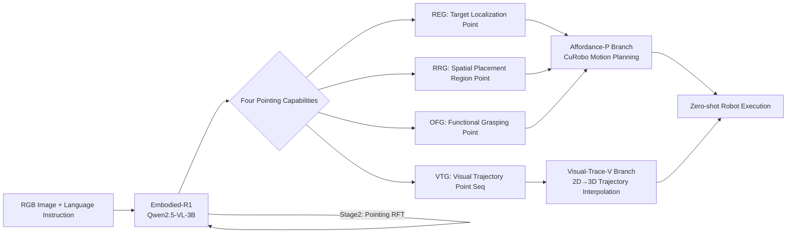

# Embodied-R1: Reinforced Embodied Reasoning for General Robotic Manipulation

**Conference**: ICLR 2026  
**Code**: https://github.com/pickxiguapi/Embodied-R1  
**Area**: Robotic Manipulation / Embodied AI  
**Keywords**: Embodied Reasoning, pointing representation, reinforced fine-tuning, Vision-Language Models, zero-shot generalization

## TL;DR
Using "pointing" (2D coordinate points/trajectory sequences) as a unified embodiment-agnostic intermediate representation, a 3B parameter VLM is trained via two-stage reinforced fine-tuning (RFT). It achieves SOTA performance on 11 spatial reasoning benchmarks and 8 real-robot tasks, with a zero-shot success rate of 87.5%.

## Background & Motivation

**Background**: Vision-Language-Action (VLA) models have demonstrated powerful visual perception capabilities in robotic manipulation. However, manipulation performance degrades significantly in novel scenarios, and both end-to-end and modular methods have their limitations.

**Limitations of Prior Work**: Current methods face two core challenges: (a) **Data Scarcity**: Limited embodied data makes it difficult to fully ground language and vision to physical actions; (b) **Robot Heterogeneity**: Differences across robot embodiments hinder knowledge transfer across platforms. Even advanced methods like FSD, which anchor reasoning via CoT, are limited by rigid templates learned through SFT, restricting generalization to new tasks.

**Key Challenge**: There is a strong understanding at the perception end (VLM), but execution at the action end is unreliable, creating a "seeing-to-doing gap"—visual understanding cannot be stably translated into effective robotic actions.

**Goal**: To design a lightweight (3B), embodied-perceptive VLM with a high zero-shot manipulation success rate that generalizes to real robot tasks without task-specific fine-tuning.

**Key Insight**: Using "pointing" (image coordinate points or point sequences) as a unified intermediate representation that is both semantic and independent of specific robot embodiments. This addresses both data scarcity (by leveraging massive internet visual data) and heterogeneity (cross-robot universality).

**Core Idea**: Replace SFT with reinforced fine-tuning to allow the model to learn free reasoning for generating pointing outputs via reward signals, bypassing the flaws of end-to-end action learning and multi-model cascading to achieve strong generalization in novel scenarios.

## Method

### Overall Architecture

Based on Qwen2.5-VL-3B, Embodied-R1 defines four embodied pointing capabilities and constructs the Embodied-Points-200K dataset. After two-stage RFT training, it outputs structured reasoning results in the format `<think>...</think><answer><point>[[...]]</point></answer>`, which are then executed by a downstream Action Executor.

### Key Designs

**1. Four Embodied Pointing Capabilities: A Unified Representation from Points to Trajectories**

Traditional VLAs directly predict low-level joint angles, leading to strong embodiment dependency. Existing pointing methods (affordance points, bounding boxes, etc.) are fragmented and have limited expressive power. Embodied-R1 systematizes pointing into four capabilities sharing the same coordinate space $p = (p, q) \in [0, w] \times [0, h]$:
- **REG** (Referring Expression Grounding): Localizes the target object based on language description, outputting a point (must fall within the segmentation mask $M_{gt}$);
- **RRG** (Region Referring Grounding): Understands spatial relationship language (e.g., "empty area between the yellow cup and the cardboard box") and outputs a placement target point;
- **OFG** (Object Functional Grounding): Localizes functional parts of objects (e.g., the handle of a knife or a pot) and outputs functional grasping points;
- **VTG** (Visual Trace Generation): Outputs an ordered sequence of trajectory points $\tau = \{p_t \mid t=1,...,T\}$ describing the complete manipulation path.

This unified format allows the model to learn a single output language while covering the entire manipulation chain from "where to grasp" to "how to move," remaining completely agnostic to robot degrees of freedom and hardware parameters.

**2. Two-stage RFT Curriculum: From Spatial Perception to Refined Pointing**

SFT faces a fundamental "multi-solution dilemma" in pointing tasks: for example, the instruction "place the object in the empty area" has infinite equivalent valid answers. SFT tends to overfit to single data points, whereas RFT can provide positive reinforcement for any correct answer, truly learning the spatial constraints. Accordingly, Embodied-R1 adopts two-stage training:

- **Stage 1 - Spatial Reasoning** (Embodied-Spatial-84K + ViRL-18K): Training with GRPO on spatial understanding data in multiple-choice format to establish a solid spatial perception foundation, mixed with general reasoning data to prevent catastrophic forgetting.
- **Stage 2 - Embodied Pointing** (Embodied-Points-200K): Continuing RFT from the first stage. Data is organized as "Question-Verification Criteria" pairs rather than "Question-Answer" pairs, allowing GRPO to determine correctness based on reward functions, achieving free reasoning rather than template memorization.

**3. Modular Multi-task Reward Library: Fine-grained Multi-task Balancing**

In multi-task training, simple tasks can dominate gradients. A composable reward library $\mathcal{F} = \{r_{format}, r_{acc}, r_{mask}, r_{dis}, r_{trace}\}$ is designed:

- $r_{format}$: Binary reward checking if the `<think>` and `<point>[[...]]</point>` tags are compliant;
- $r_{acc}$: General QA accuracy (for multiple-choice questions);
- $r_{mask}$: Checks if the predicted point falls within the segmentation mask, $r_{mask}(p, M_{gt}) = \mathbb{I}(p \in M_{gt})$;
- $r_{dis}$: Dense auxiliary distance reward, $r_{dis} = \min(1.0, \max(0.0, 1.0 - \frac{d - D_{min}}{D_{max} - D_{min}}))$, guiding the predicted point toward the target area;
- $r_{trace}$: Trajectory quality reward, normalized after evaluating the RMSE between the generated trajectory and the GT.

The total reward for each task is $R = \sum_{r \in \mathcal{F}} w_r \cdot r$, with weights normalized to $[0,1]$ to ensure consistent gradient scales across tasks. For example, the reward for RRG is $R_{RRG} = 0.1 r_{format} + 0.2 r_{dis} + 0.7 r_{mask}$, emphasizing spatial placement precision.

**4. Dual-branch Action Executor: Decoupled Architecture from Pointing to Execution**

The pointing signals produced by Embodied-R1 are transformed into robot actions via two independent branches:
- **Affordance-P Branch**: Uses RRG + OFG to predict grasp and place points, handed to the CuRobo motion planner for generating collision-free end-effector trajectories;
- **Visual-Trace-V Branch**: Uses 2D trajectory points from VTG, mapped to 3D Cartesian coordinates via a pinhole camera model + initial depth information, and interpolated into continuous SE(3) motion trajectories for the robot to follow.

This decoupled design allows Embodied-R1 to switch control strategies as needed or integrate with learned low-level controllers like diffusion policies, maintaining high-level reasoning universality.

### Training Strategy

All RFT stages utilize the **GRPO** algorithm: the behavior policy samples multiple candidate responses for each input, calculates relative advantage through normalized rewards within the group, and maximizes expected return using a clipped surrogate loss while maintaining training stability. The base model is Qwen2.5-VL-3B-Instruct.

## Key Experimental Results

### Main Results

**SIMPLEREnv (WidowX) Zero-shot Manipulation**:

| Method | Type | Success Rate (Avg) |
|------|------|------------|
| OpenVLA | End-to-end VLA | 5.2% |
| π0 | End-to-end VLA | 27.1% |
| π0-fast | End-to-end VLA | 48.3% |
| OpenVLA-OFT | End-to-end VLA | 41.8% |
| ThinkAct | End-to-end VLA | 43.8% |
| Sofar | Modular | 53.8% |
| FSD-13B | Affordance | 40.6% |
| **Ours (Embodied-R1)** | **Pointing+RFT** | **56.2%** |

**Zero-shot Success Rate on 8 Real-Robot xArm Tasks**:

| Method | Average Success Rate |
|------|-----------|
| MOKA | 9.2% |
| RoboPoint | 12.5% |
| FSD | 25.0% |
| Embodied-R1-P (Affordance Branch) | 83.3% |
| **Embodied-R1-V (Visual Trace Branch)** | **87.5%** |

### Ablation Study

**SFT vs RL (RRG Benchmark)**:

| Configuration | Where2Place | VABench-P |
|------|------------|-----------|
| RL + Think (Full Model) | **65.50** | **65.39** |
| RL - Think | 63.00 | 60.50 |
| SFT + Think | 41.25 | 47.67 |
| SFT - Think | 36.85 | 50.46 |

**Robustness to Visual Interference** (Real-robot tasks):

| Interference Condition | Grasp Rate | Success Rate |
|---------|-------|-------|
| None | 100% | 100% |
| Background Change (BC) | 100% | 100% |
| BC + Lighting Change | 83% | 83% |
| BC + Lighting + Height Change | 83% | 83% |

### Key Findings

- RL training shows a decisive advantage over SFT in OOD generalization (Where2Place: 65.5 vs 41.3), with explicit reasoning further improving performance by ~4-5 points.
- Mixing general knowledge data (ViRL-18K) significantly contributes to final ranking (Ours: 2.1 vs w/o CS: 3.4).
- Despite being trained only on real data, VTG capabilities generalize zero-shot to simulation, novel robots, and hand-drawn sketch scenarios.

## Highlights & Insights

- **Elegant Design of Pointing as Universal Representation**: Abstracting robot manipulation as "pointing on an image" overcomes data scarcity by leveraging massive internet visual data and is naturally independent of robot hardware. This addresses two core pain points simultaneously and yields interpretable reasoning results.

- **Natural Suitability of RFT for Multi-solution Problems**: In embodied pointing, valid answers are not unique (there are infinite valid placement positions). SFT overfits to single answers, while RFT provides positive reinforcement for any correct answer. This insight is the key theoretical basis for the method's effectiveness.

- **3B Small Model Surpassing 13B Large Models**: Embodied-R1 (3B) outperforms FSD-13B, RoboBrain-7B, and others on multiple benchmarks, proving that a correct training paradigm is more important than model scale.

## Limitations & Future Work

- The current pointing $\rightarrow$ execution pipeline is limited for non-pick-and-place tasks (e.g., fine assembly, cloth manipulation). VTG only tracks the motion of the target object; complex contact force control requires integration with low-level learning strategies.
- Real-robot experiments only covered the xArm platform; cross-robot transfer has not been systematically verified.
- Long-horizon tasks currently require external high-level planners (e.g., Gemini-1.5-Pro) for task decomposition; end-to-end long-chain reasoning capability needs improvement.

## Related Work & Insights

- **vs FSD (Yuan 2025)**: FSD also uses pointing + CoT but relies on SFT's rigid templates. Ours adopts RFT for freer reasoning, increasing zero-shot generalization from 40.6% to 56.2%.
- **vs RoboPoint**: RoboPoint only performs single-point prediction; this work extends this to four capabilities, covering the complete manipulation intent from localization to trajectory.
- **vs π0/OpenVLA**: End-to-end methods learn low-level actions directly, facing action-domain mismatch with pre-training data; the pointing intermediate representation completely avoids this issue.
- **vs R1 Reasoning Models (DeepSeek-R1, etc.)**: Transfers the R1 paradigm from math/code domains to embodied manipulation, verifying that RFT is equally effective in physical world tasks.

## Rating

- Novelty: ⭐⭐⭐⭐ Systematizing four pointing capabilities + the first successful application of RFT in the manipulation domain; the idea is clear and powerful.
- Experimental Thoroughness: ⭐⭐⭐⭐ Comprehensive coverage across 11 benchmarks + simulation + real robots + ablations + robustness tests; the 87.5% real-robot success is convincing.
- Writing Quality: ⭐⭐⭐⭐ Clear framework, effective problem decomposition, and high information density in charts.
- Value: ⭐⭐⭐⭐ A 3B model achieving 62% zero-shot performance and surpassing strong baselines; the pointing paradigm has the potential to become a standard abstraction for the Embodied AI utility layer.

<!-- RELATED:START -->

## Related Papers

- [\[ICLR 2026\] Vlaser: Vision-Language-Action Model with Synergistic Embodied Reasoning](vlaser_vision-language-action_model_with_synergistic_embodied_reasoning.md)
- [\[NeurIPS 2025\] Robot-R1: Reinforcement Learning for Enhanced Embodied Reasoning in Robotics](../../NeurIPS2025/robotics/robot-r1_reinforcement_learning_for_enhanced_embodied_reasoning_in_robotics.md)
- [\[ICLR 2026\] EVLP: Learning Unified Embodied Vision-Language Planner with Reinforced Supervised Fine-Tuning](evlp_learning_unified_embodied_vision-language_planner_with_reinforced_supervise.md)
- [\[ICLR 2026\] From Seeing to Doing: Bridging Reasoning and Decision for Robotic Manipulation](from_seeing_to_doing_bridging_reasoning_and_decision_for_robotic_manipulation.md)
- [\[ICLR 2026\] OmniEVA: Embodied Versatile Planner via Task-Adaptive 3D-Grounded and Embodiment-aware Reasoning](omnieva_embodied_versatile_planner_via_task-adaptive_3d-grounded_and_embodiment-.md)

<!-- RELATED:END -->
