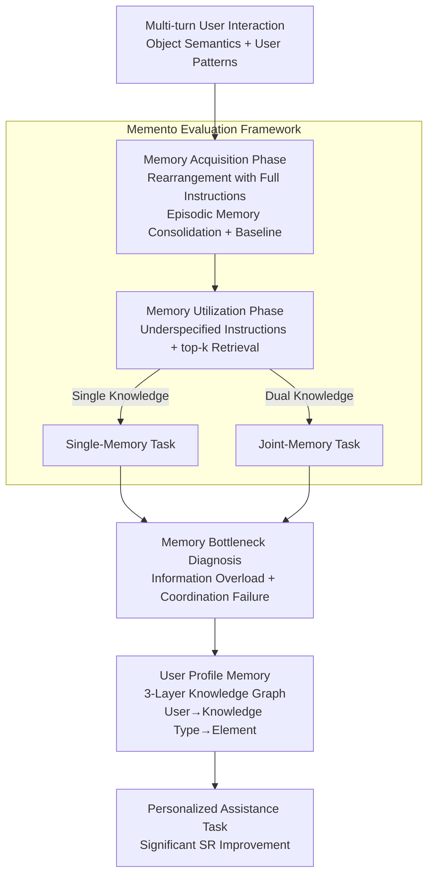

# Embodied Agents Meet Personalization: Investigating Challenges and Solutions Through the Lens of Memory Utilization

**Conference**: ICLR 2026  
**arXiv**: [2505.16348](https://arxiv.org/abs/2505.16348)  
**Code**: [https://github.com/Connoriginal/MEMENTO](https://github.com/Connoriginal/MEMENTO)  
**Area**: Graph Learning  
**Keywords**: Personalized Embodied Intelligence, Memory Utilization, Episodic Memory, Knowledge Graph, LLM Agent

## TL;DR
This paper systematically evaluates the memory utilization capabilities of LLM-driven embodied agents through the Memento framework. The study reveals that existing agents can recall simple object semantics but fail to process sequential information regarding user behavior patterns. To address this, a user profile memory module based on a hierarchical knowledge graph is proposed to effectively enhance performance in personalized assistance tasks.

## Background & Motivation

**Background**: Current LLM-driven embodied agents have achieved significant progress in traditional object rearrangement tasks. However, these tasks typically involve single-turn interactions and static instructions, requiring no understanding of personalized user preferences or historical behaviors.

**Limitations of Prior Work**: Existing memory systems for embodied agents primarily focus on semantic memory (scene graphs, semantic maps) and procedural memory (skill libraries). Episodic memory is merely used as a passive task buffer or context history, lacking a systematic evaluation of personalized knowledge extraction and utilization.

**Key Challenge**: Personalized knowledge (e.g., "favorite mug," "morning routine") requires agents to extract information from past interactions and apply it flexibly to new tasks. However, agents face two critical bottlenecks: information overload (performance degradation as retrieved memory increases) and coordination failure (inability to utilize multiple memories simultaneously).

**Goal**: 1) Systematically evaluate the memory utilization capabilities of embodied agents in personalized assistance tasks; 2) Diagnose key bottlenecks in memory utilization; 3) Design superior memory architectures to support personalized tasks.

**Key Insight**: Approaching the problem through two dimensions of memory utilization—object semantics (identifying objects with personal meaning) and user patterns (recalling sequences within behavioral routines)—to construct an end-to-end evaluation framework.

**Core Idea**: By decoupling personalized knowledge management, a hierarchical knowledge graph user profile memory module is constructed. This module independently manages object semantics and user pattern information, thereby overcoming the bottlenecks of information overload and coordination failure in LLM episodic memory.

## Method

### Overall Architecture
This work follows a three-stage trajectory: "establish evaluation, diagnose problems, and provide solutions." **Evaluation** is conducted via the Memento framework: it decomposes the agent's memory utilization into two sequential phases. In the memory acquisition phase, the agent consolidates personalized information (object semantics and user patterns) into episodic memory through multi-turn interactions to establish a performance baseline. In the memory utilization phase, this accumulated knowledge is applied to entirely new assistance tasks. Utilization tasks are further categorized into single-memory tasks (requiring one piece of knowledge) and joint-memory tasks (requiring simultaneous coordination of multiple pieces of knowledge). **Diagnosis** utilizes control variables within these tasks to identify failure modes, isolating "information overload" and "coordination failure." The **Solution** addresses these findings by implementing a parallel user profile memory structured as a hierarchical knowledge graph, which extracts personalized knowledge from the episodic memory flow for structured management, mitigating both types of failure.

### Key Designs

**1. Memento Evaluation Framework: Decomposing Personalized Knowledge into Two Measurable Dimensions**

Existing embodied benchmarks mostly test single-turn static instructions, failing to expose the true difficulty of personalized assistance: "the agent must remember who you are and how you do things." Memento explicitly splits personalized knowledge into two categories: object semantics, which refers to personal meanings assigned to physical objects (e.g., "the red mug in the coffee set"), testing the identification of objects with personal labels; and user patterns, which refers to sequential information in routines (e.g., the sequence of steps in a "breakfast routine"), testing the replay of order from past interactions. The framework is end-to-end, using Percent Complete ($PC$, ratio of subgoals finished) to measure progress and Success Rate ($SR$, overall task success) to measure final achievement.

**2. Memory Bottleneck Diagnosis: Pinpointing Failures via Controlled Variables**

To identify why performance drops, Memento scales the number of retrieved memories top-$k$ (where $k=3,5,7,10$) in single-memory tasks to observe if performance declines as irrelevant memories increase, thus isolating "information overload." Results show that performance across models deteriorates as $k$ increases, indicating that more retrieval interferes with decision-making. Joint-memory tasks force the agent to invoke two memories simultaneously, specifically testing "coordination failure." Furthermore, memory format simplification experiments were conducted, replacing full episodic memory with summarized versions or instruction-only versions, to determine which parts of episodic memory are functional.

**3. Hierarchical Knowledge Graph User Profile Memory: Structured Management of Personalized Knowledge**

Diagnosis revealed that episodic memory serves a dual role: it carries personalized knowledge and acts as a demonstration for In-Context Learning (ICL). Simply summarizing it can reduce the ICL benefits for smaller models. Therefore, this paper maintains the episodic memory but attaches a parallel User Profile Memory to carry personalized knowledge structurally. It is a three-layer knowledge graph: User Layer → Knowledge Type Layer (Object Semantics, User Patterns) → Element Layer (Objects, Patterns, Locations). Hierarchical edges represent membership, while temporal edges within user patterns record the sequence of actions. This allows the agent to retrieve clean, denoised, and ordered structured answers for queries like "where is the red mug" or "what is the third step of breakfast" without searching through raw episodic fragments.

## Key Experimental Results

### Main Results

| Model | Phase | Task Type | PC (%) | SR (%) | ΔSR |
|------|------|---------|--------|--------|-----|
| GPT-4o | Acquisition | - | 96.3 | 95.0 | - |
| GPT-4o | Utilization | Single-Memory | 88.0 | 85.1 | -9.9 |
| GPT-4o | Utilization | Joint-Memory | 86.7 | 63.9 | -30.5 |
| Qwen-2.5-72b | Acquisition | - | 93.5 | 91.0 | - |
| Qwen-2.5-72b | Utilization | Single-Memory | 72.6 | 67.2 | -23.8 |
| Qwen-2.5-72b | Utilization | Joint-Memory | 68.9 | 36.1 | -58.3 |
| Llama-3.1-8b | Acquisition | - | 78.1 | 68.5 | - |
| Llama-3.1-8b | Utilization | Single-Memory | 48.1 | 35.0 | -33.5 |

### Ablation Study

| Model | Memory Format | PC (%) | SR (%) |
|------|---------|--------|--------|
| GPT-4o | Full Episodic Memory | 90.0 | 83.3 |
| GPT-4o | Summarized | 88.0 | 83.3 |
| GPT-4o | Instructions Only | 62.4 | 50.0 |
| Llama-3.1-8b | Full Episodic Memory | 72.8 | 63.3 |
| Llama-3.1-8b | Summarized | 49.4 | 43.3 |
| Llama-3.1-8b | Instructions Only | 40.0 | 30.0 |

### Key Findings
- All models show an $SR$ drop exceeding 20% in personalized tasks; GPT-4o's $SR$ drops by 30.5% in joint-memory tasks.
- Agents effectively recall object semantics but struggle significantly with the sequential understanding of user patterns.
- Increasing the number of retrieved memories (larger top-$k$) consistently degrades performance across all models, identifying information overload as a key bottleneck.
- Memory summarization has limited impact on large models but significantly degrades small model performance, suggesting episodic memory also provides ICL benefits.
- User Profile Memory brings significant performance gains in both single-memory and joint-memory tasks.

## Highlights & Insights
- **Systematic Diagnosis of Memory Utilization Bottlenecks**: Through controlled experiments, the study clearly identifies information overload and coordination failure as the two core bottlenecks, providing fundamental work for understanding personalized capabilities in embodied agents.
- **Discovery of the Dual Role of Episodic Memory**: Proves that episodic memory not only provides personalized knowledge but also serves as a demonstration for ICL. This explains why simple memory summarization strategies can be harmful to smaller models.

## Limitations & Future Work
- The evaluation assumes "gold perception" and motor skills, bypassing challenges at the perception and execution levels.
- Personalized knowledge is synthetically generated by LLMs, which may not fully reflect the complex knowledge structures of real users.
- The construction of the User Profile Memory KG relies on LLM extraction, which may introduce noise in production environments.
- Long-term adaptation scenarios where memory evolves and updates over time remain unexplored.

## Related Work & Insights
- **vs ProgPrompt/VOYAGER**: These methods focus on procedural memory (skill libraries) to improve task efficiency. This paper focuses on the role of episodic memory in personalization; these are complementary memory dimensions.
- **vs Xu et al. (2024)**: While they infer user preferences from few-shot demonstrations, this work requires agents to extract structured personalized knowledge from explicitly provided interaction histories, emphasizing systematic memory management.

## Rating
- Novelty: ⭐⭐⭐⭐ First framework to systematically evaluate memory utilization in embodied agents with clear problem definitions.
- Experimental Thoroughness: ⭐⭐⭐⭐ Systematic ablation across multiple models and memory conditions with insightful findings.
- Writing Quality: ⭐⭐⭐⭐ Logical progression through three Research Questions (RQs).
- Value: ⭐⭐⭐⭐ Significant reference value for the direction of personalization in embodied agents.

<!-- RELATED:START -->

## Related Papers

- [\[ICLR 2026\] Planning with an Embodied Learnable Memory](planning_with_an_embodied_learnable_memory.md)
- [\[NeurIPS 2025\] Memo: Training Memory-Efficient Embodied Agents with Reinforcement Learning](../../NeurIPS2025/robotics/memo_training_memory-efficient_embodied_agents_with_reinforcement_learning.md)
- [\[ICLR 2026\] REI-Bench: Can Embodied Agents Understand Vague Human Instructions in Task Planning?](rei-bench_can_embodied_agents_understand_vague_human_instructions_in_task_planni.md)
- [\[ICLR 2026\] Test-Time Mixture of World Models for Embodied Agents in Dynamic Environments](test-time_mixture_of_world_models_for_embodied_agents_in_dynamic_environments.md)
- [\[ICLR 2026\] RoboMD: Uncovering Robot Vulnerabilities through Semantic Potential Fields](robomd_uncovering_robot_vulnerabilities_through_semantic_potential_fields.md)

<!-- RELATED:END -->
