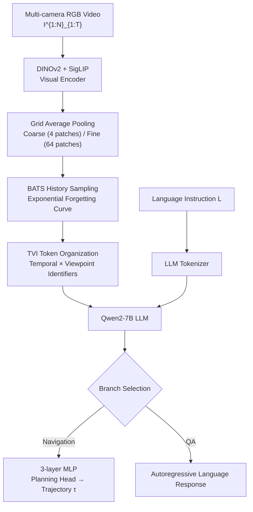

# Embodied Navigation Foundation Model

**Conference**: ICLR 2026  
**Project Page**: https://pku-epic.github.io/NavFoM-Web/  
**Code**: Open-sourced upon paper acceptance (pre-trained weights to be released concurrently)  
**Area**: Embodied Navigation / Robotics  
**Keywords**: Navigation Foundation Model, Cross-Embodiment Navigation, Vision-Language Navigation, Token Budget Sampling, Multi-task Joint Training

## TL;DR

NavFoM is the first cross-embodiment × cross-task embodied navigation foundation model, jointly trained on 8 million navigation samples covering quadrupeds, drones, wheeled robots, and vehicles. It handles arbitrary camera configurations via Temporal-Viewpoint Indicator (TVI) tokens and manages inference overhead through budget-aware history sampling. It achieves SOTA or competitive performance on 7 public benchmarks without fine-tuning.

## Background & Motivation

**Background**: Embodied navigation is a core capability for agents moving in the physical world. Recently, significant progress has been made using Vision-Language Models (VLMs), which demonstrate strong generalization in zero-shot tasks such as retrieval, classification, and captioning.

**Limitations of Prior Work**: Existing navigation methods rely heavily on task-specific scenarios and embodiment-specific architectures. Cross-task methods (e.g., NaVid, Uni-NaVid) assume fixed camera configurations, while cross-embodiment methods (e.g., NoMaD, ViNT) implicitly learn physical priors of specific bodies. These two directions remain fragmented, failing to form a unified navigation intelligence.

**Key Challenge**: Different embodiments have varied camera setups (monocular, 4-cam, 6-cam, 8-cam), and tasks vary vastly in time horizons (VLN ~122 steps, tracking >1000 frames). Processing these uniformly results in an exponential growth in token counts, making direct concatenation infeasible.

**Goal**: To build NavFoM, a navigation foundation model universal across quadrupeds, drones, wheeled robots, and vehicles for multiple tasks (VLN, target search, active tracking, autonomous driving) without task-specific fine-tuning.

**Key Insight**: Utilizing egocentric video and language instructions as a unified input format to output waypoint trajectories, ensuring compatibility with most existing task settings. Dedicated identifier tokens carry viewpoint and temporal information, while budget-aware sampling compresses inference overhead.

**Core Idea**: Decoupling viewpoint and temporal information using Temporal-Viewpoint Indicator (TVI) tokens and retaining critical history within a fixed token budget using Budget-Aware Temporal Sampling (BATS) driven by an exponential forgetting curve, thereby unifying multi-embodiment and multi-task navigation into a single VLM framework.

## Method

### Overall Architecture

Based on a standard video VLM (Qwen2-7B + DINOv2 + SigLIP), NavFoM is extended into a dual-branch architecture: the navigation branch outputs trajectory waypoints, and the QA branch autoregressively generates language responses. Both branches share the backbone. Visual tokens from different moments and viewpoints are organized via TVI tokens and fed into the LLM. Finally, a three-layer MLP planning head decodes the LLM hidden states into $M=8$ normalized waypoints $\{(x,y,z,\theta)\}$.

### Key Designs

**1. Temporal-Viewpoint Indicator (TVI) Token: Helping the LLM distinguish "which time and which viewpoint"**

Visual tokens themselves do not carry temporal or viewpoint information; naive concatenation prevents the LLM from distinguishing "front camera at t=3" from "side camera at t=7." TVI tokens introduce three types of embeddings to fill this gap:

$$
E_{\text{TVI}} = \begin{cases}
E_{\text{Base}} + P_{\text{time}}(\text{TimePE}(t)) + P_{\text{angle}}(\text{AnglePE}(\varphi)) & \text{Navigation} \\
E_{\text{Base}} + P_{\text{time}}(\text{TimePE}(t)) & \text{Video QA} \\
E_{\text{Base}} & \text{Image QA}
\end{cases}
$$

where $\text{AnglePE}(\varphi)$ decomposes the azimuth $\varphi$ into $\cos\varphi$ and $\sin\varphi$ before applying sinusoidal position encoding to ensure cyclic continuity ($0 \equiv 2\pi$, satisfying geometric proximity metrics); $\text{TimePE}(t)$ uses sinusoidal encoding for time steps, making it robust to irregular sampling intervals; $P_{\text{time}}/P_{\text{angle}}$ are two-layer MLPs. Different task types use different TVI combinations, allowing the same token sequence to serve both navigation and QA, significantly enhancing the LLM's understanding of input semantics. Ablation studies show that TVI improves RxR Val-Unseen SR by approximately 12% (52.3% → 64.4%) compared to the nearest-neighbor historical viewpoint position embedding (HAMT).

**2. Budget-Aware Temporal Sampling (BATS): Token budget management driven by an exponential forgetting curve**

The number of video frames accumulated during navigation grows linearly with task duration. Retaining all historical frames would cause inference time and memory to expand linearly. Uniform sampling loses critical recent frames, and Token Merging introduces additional training overhead and inconsistent inference speeds. BATS draws inspiration from the human "forgetting curve," assigning exponentially increasing sampling probabilities to historical frames:

$$
P(t) = (1-\epsilon)\,e^{k(t-T)/T} + \epsilon, \quad k > 0
$$

Frames closer to the current time $T$ have higher sampling probabilities, while distant history is randomly retained with lower probability. Given a token budget $B_{\text{token}}$, the expected number of sampled frames is:

$$
\mathbb{E}_{\text{frames}} \approx \int_0^T P(t)\,dt = (1-\epsilon)\frac{1-e^{-k}}{k}T + \epsilon T
$$

By constraining the token consumption of $\mathbb{E}_{\text{frames}}$ to not exceed $B_{\text{token}}$, $k$ values for different frame counts are pre-calculated using Brent's method and looked up during inference. BATS is naturally adaptive to multi-camera setups: as the number of viewpoints $N$ increases, the numerator $(4+1) \times \mathbb{E}_{\text{frames}}$ remains constrained, automatically reducing the frames retained per viewpoint. Ablations show that at a budget $B=1024$, BATS outperforms uniform sampling by 6.2 points in nDTW (64.1 vs 57.9). When the budget is reduced from 2048 to 1024, performance drops only by 1.4% (compared to 6.0% for uniform sampling).

**3. Multi-task Joint Training: Positive transfer from cross-task data**

NavFoM is jointly trained on 12.7 million samples: 8 million navigation samples (VLN 3.37M + Target Nav 1.02M + Active Tracking 897K + Autonomous Driving 681K + Web Video Nav) + 4.76 million QA samples (Image QA 3.15M + Video QA 1.61M). Trajectory loss uses MSE, while QA uses cross-entropy. The total loss is $\mathcal{L} = \beta \mathcal{L}_{\text{nav}} + \mathcal{L}_{\text{QA}}$ ($\beta=10$ balances numerical scales).

Ablations show that when training solely on the search task, SR is only 10.3%; adding all other navigation data increases it to 45.2% (+34.9%). Tracking task performance rises from 12.6% to 62.0% (+49.4%). This improvement stems from the fact that single-task camera configurations and target distributions are narrow; cross-task data provides multi-view observations and open-vocabulary generalization, effectively suppressing task-specific overfitting.

### Training Strategy

The model is initialized with Qwen2-7B + DINOv2 + SigLIP pre-trained weights and fine-tuned for one epoch. Training took approximately 72 hours on 56 NVIDIA H100 GPUs (totaling 4032 GPU hours). Trajectory waypoints are normalized to $[-1, 1]$ before output, using different scaling factors $\alpha_{\text{task}}$ for three scenarios (indoor navigation, drone, car). Deployment on a single RTX 4090 with a token budget of 1600 consumes 19.1 GB VRAM, achieving an inference frequency of 5 Hz (~218 ms/frame).

## Key Experimental Results

### Main Results

| Dataset | Setting | Metric | Ours | Prev. SOTA | Gain |
|--------|------|------|------|-----------|------|
| VLN-CE RxR Val-Unseen | Single-view | SR↑ | **57.4%** | 51.8% (StreamVLN) | +5.6% |
| VLN-CE RxR Val-Unseen | 4-view | SR↑ | **64.4%** | 56.3% (HNR, w/ Depth+Odom) | +8.1% |
| VLN-CE R2R Val-Unseen | 4-view | SR↑ | **61.7%** | — | — |
| HM3D-OVON Val-Unseen | Zero-shot | SR↑ | **45.2%** | 43.6% (MTU3D, Supervised) | +1.6% |
| EVT-Bench Tracking | Single-view | SR↑ | **85.0%** | 85.1% (TrackVLA) | Comp. |
| EVT-Bench Tracking (Distractor) | Single-view | SR↑ | **61.4%** | 57.6% (TrackVLA) | +3.8% |
| NAVSIM Auto-Driving | 8-view | PDMS↑ | **84.3** | 84.6 (LAW) | Comp. |

### Ablation Study

| Configuration | VLN-CE RxR SR (B=2048) | nDTW | Description |
|------|------------------------|------|------|
| Uniform Sampling (baseline) | 62.4% | 63.9 | Method from Cheng et al. 2025 |
| Linear Prob Sampling | 63.0% | 64.8 | Manual linear weights |
| **BATS (Ours)** | **64.4%** | **65.8** | Exponential forgetting curve |
| View-History Pos PE (HAMT) | 52.3% | 58.7 | Interferences from extra components |
| Independent Learnable Special Token | 59.1% | 59.6 | No structural prior |
| Manual Token (no MLP projection) | 53.6% | 58.0 | Lacks learnable transformation |
| **TVI Token (Ours)** | **64.4%** | **65.8** | Full Temporal × Viewpoint representation |

### Key Findings

- Multi-view (4-cam) improves SR by 7.0% on RxR-CE and 5.5% on R2R-CE compared to monocular, indicating that multi-view navigation foundation models are a promising research direction.
- Multi-task joint training provides significantly higher gains for tasks with narrow data distributions (Search +34.9%, Tracking +49.4%) than for VLN (+2–3%), showing that data diversity is crucial for OOD generalization.
- In a zero-shot setting, NavFoM outperforms the supervised fine-tuned MTU3D on HM3D-OVON (45.2% vs 40.8%), validating the generalization advantage of foundation models.

## Highlights & Insights

- **Elegant Design of TVI Token**: By using three sets of sinusoidal encodings (decomposing angles into sin/cos to ensure cyclic continuity) + learnable MLP projections, it simultaneously satisfies viewpoint-awareness, temporal-awareness, and task-separability. It is lighter and significantly more effective than specialized position embeddings. The key is injecting information into "prefix identifiers" rather than the visual tokens themselves, allowing the LLM to leverage these identifiers flexibly via attention mechanisms.
- **Analogy between BATS and Forgetting Curves**: Transferring human memory patterns to token budget allocation, using exponential sampling probabilities to align with the navigation intuition of "recent is critical, distant is sparse." Parameters can be pre-calculated, resulting in zero extra inference overhead—making it engineering-friendly.
- **8 Million Samples + QA Joint Training**: The data scale is twice that of previous methods (NaVid 1.2M, Uni-NaVid 5.9M). The introduction of QA data not only enhances language understanding but also provides a visual-semantic foundation for navigation through the shared backbone.

## Limitations & Future Work

- A small gap remains between NavFoM and specialized methods (LAW 84.6 PDMS) in NAVSIM autonomous driving, suggesting that general-purpose models still trail customized solutions for tasks requiring high perceptual precision.
- BATS has theoretical boundaries: when frame counts are extreme (e.g., 4-cam × 1120 steps), the lower bound probability constraint $\epsilon$ can make the expected frame count equation unsolvable. This is rare but represents a systematic gap.
- Current trajectory prediction is purely vision-based without map, semantic priors, or memory mechanisms. Complex long-range tasks (multi-room, city-scale) remain challenging.
- Experiments focus primarily on English instructions; multi-lingual navigation generalization has yet to be verified.

## Related Work & Insights

- **vs NaVid / Uni-NaVid**: Both are video VLM-driven navigation methods but only support single or fixed camera configurations. NavFoM breaks camera configuration constraints via TVI tokens and doubles the data scale.
- **vs NaVILA / StreamVLN**: These focus on single-task VLN optimization. NavFoM requires no task-specific fine-tuning yet remains competitive in multi-task evaluations.
- **vs NoMaD / ViNT**: Classic cross-embodiment navigation methods that rely on topological maps or implicit physical priors. NavFoM models navigation end-to-end via a pure VLM approach without any map construction.
- **vs TrackVLA**: A method specialized for active tracking. NavFoM matches its performance in monocular tracking and outperforms it in distractor scenarios, demonstrating the robustness gained from multi-task training.

## Rating

- Novelty: ⭐⭐⭐⭐ First to achieve cross-embodiment × cross-task navigation foundation modeling. TVI token design is simple and universal.
- Experimental Thoroughness: ⭐⭐⭐⭐⭐ Comprehensive coverage across 7 benchmarks, multi-platform real-robot experiments, and detailed ablations.
- Writing Quality: ⭐⭐⭐⭐ Clear architecture diagrams, complete ablation and analysis logic, and rich detail.
- Value: ⭐⭐⭐⭐⭐ Establishes a convincing baseline for embodied navigation foundation models. TVI+BATS designs are reusable for other embodied tasks.

<!-- RELATED:START -->

## Related Papers

- [\[ICLR 2026\] From Seeing to Experiencing: Scaling Navigation Foundation Models with Reinforcement Learning](from_seeing_to_experiencing_scaling_navigation_foundation_models_with_reinforcem.md)
- [\[CVPR 2026\] SocialNav: Training Human-Inspired Foundation Model for Socially-Aware Embodied Navigation](../../CVPR2026/robotics/socialnav_training_human-inspired_foundation_model_for_socially-aware_embodied_n.md)
- [\[ICLR 2026\] Ground Slow, Move Fast: A Dual-System Foundation Model for Generalizable Vision-Language Navigation](ground_slow_move_fast_a_dual-system_foundation_model_for_generalizable_vision-la.md)
- [\[ICLR 2026\] From Spatial to Actions: Grounding Vision-Language-Action Model in Spatial Foundation Priors](from_spatial_to_actions_grounding_vision-language-action_model_in_spatial_founda.md)
- [\[ICLR 2026\] Vlaser: Vision-Language-Action Model with Synergistic Embodied Reasoning](vlaser_vision-language-action_model_with_synergistic_embodied_reasoning.md)

<!-- RELATED:END -->
