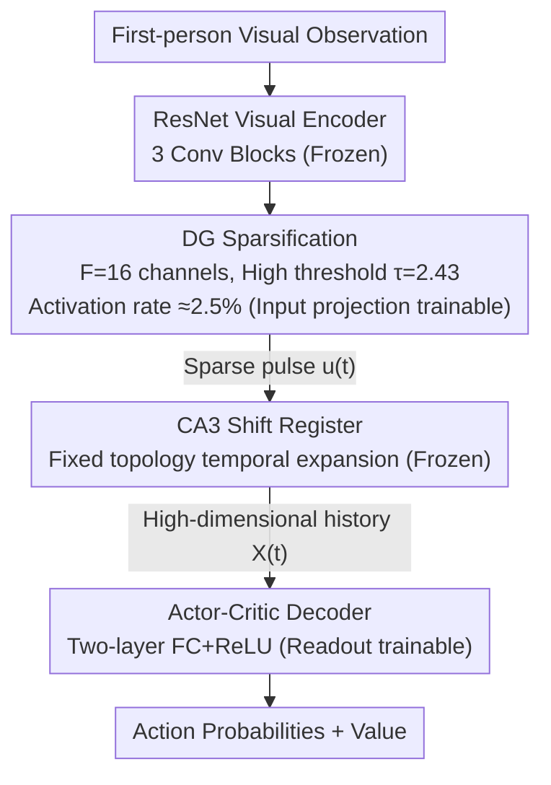

# Emergence of Spatial Representation in an Actor-Critic Agent with Hippocampus-Inspired Sequence Generator

**Conference**: ICLR 2026  
**arXiv**: [2510.09951](https://arxiv.org/abs/2510.09951)  
**Code**: [Available](https://github.com/xiaoxionglin/SF_hipposlam)  
**Area**: Reinforcement Learning  
**Keywords**: Hippocampal Sequence Generator, Spatial Representation, Actor-Critic, Sparse Coding, Place Cells

## TL;DR
Inspired by the intrinsic recurrent loops in the hippocampal CA3 region, this paper proposes a minimal sequence generator (shift register) integrated with an actor-critic agent. This approach achieves maze navigation using sparse visual inputs while facilitating the emergence of neurobiological phenomena such as place fields, DG orthogonalization, distance-dependent spatial kernels, and task-dependent remapping.

## Background & Motivation
- Hippocampal place cells fire in an orderly fashion as theta sequences; the traditional view suggests this is driven by sensory input along a trajectory.
- The authors propose a more minimalist explanation: sequences originate from the **intrinsic recurrent loops of the CA3 region**, which can propagate activity for extended periods without external input, acting as a temporal memory buffer.
- This intrinsic sequence generation mechanism is particularly critical when reliable sensory evidence is sparse (e.g., navigation with few landmarks).
- In the dentate gyrus (DG), only approximately 2-5% of granule cells are active in any given environment, providing sparse coding with extremely low activity rates.
- This mechanism resonates with SSM/Structured Linear RNN concepts in machine learning: first expanding input into a high-dimensional temporal feature space, then compressing it through a shallow non-linear readout.
- Existing successor representations, reservoir models, and probabilistic methods can reproduce place field activity but rarely explicitly address the origin of the sequences.

## Method

### Overall Architecture
The model converts first-person visual observations into navigable spatial representations along the hippocampal pathway: a fixed, pre-trained ResNet (3 convolutional blocks, matching IMPALA) extracts visual features; the Dentate Gyrus (DG) module sparsifies these into a minimal set of active units; the CA3 shift register expands these sparse pulses into a canonical historical trajectory; finally, a two-layer actor-critic decoder reads out action probabilities and values. In this system, only the DG input mapping and the decoder output weights are trainable; the visual encoder and CA3 recurrent loop are frozen throughout to isolate the effects of "sequence generation."

### Key Designs

**1. DG Sparsification: Blocking Noise with Extremely Low Activity Rates**

Biologically, only about 2–5% of granule cells in the dentate gyrus are active in any environment. The authors adopt this ultra-sparse coding as a core design rather than an auxiliary one. ResNet features are linearly mapped to $F=16$ channels, processed with batch normalization (0.95 retention), and then passed through a high threshold $\tau=2.43$ to suppress the activation rate to ~2.5%. The significance is that maze textures are intentionally uniform, and spatial relationships cannot be inferred from visual similarity; most visual responses are uninformative noise. The high threshold ensures only strong signals that can localize spatial regions pass through, making each supra-threshold pulse a reliable "landmark evidence" rather than mixing ambiguous features into the recurrent module.

**2. CA3 Shift Register: Generating Temporal Sequences via Fixed Topology as a Memory Buffer**

This is the central hypothesis of the paper—orderly sequences of place cells do not necessarily originate from continuous sensory input but can be spontaneously generated by CA3 intrinsic recurrent loops. Each DG feature corresponds to a pre-wired register of length $\ell=L+(R-1)$. The state is updated as $x_{t+1}=Sx_t+Ju_t$, where $S\in\mathbb{R}^{\ell\times\ell}$ is a shift operator with 1s on the lower sub-diagonal, and $J\in\mathbb{R}^{\ell\times 1}$ injects instantaneous input into the first $R$ slots. Once an input triggers activity in the first $R$ positions, it automatically propagates backward in the register at a rate of one step per time point, persisting for several steps even in the absence of external evidence. Thus, it serves as a natural temporal memory buffer. The $F$ features evolve independently, forming a block-diagonal update using Kronecker products $A=I_F\otimes S$ and $B=I_F\otimes J$. The complete CA3 state is $X_t\in\mathbb{R}^{F\ell}$. Here, $L$ determines the number of theta cycles the sequence spans (how far back history goes), and $R$ determines how many units are lit simultaneously per cycle, also acting as a temporal smoothing prior to prevent abrupt representation changes.

**3. Frozen Recurrence, Trainable Read/Write: Isolating Sequence Generation Effects**

CA3 weights are completely fixed and do not participate in gradient updates. This is a deliberate control variable—since the recurrence matrix is not learned, any emerging phenomena like place fields, orthogonalization, or spatial kernels must be attributed to the "sparse input + fixed sequence expansion" mechanism itself rather than backpropagation shaping. Trainable parameters are restricted to the DG→CA3 input projection and the CA3→Decoder two-layer FC+ReLU readout. This division of labor between "high-dimensional temporal feature expansion" and "shallow non-linear readout" aligns with SSM/Structured Linear RNN logic: expanding input into a high-dimensional space rich in history, then using a learnable shallow network to compress it into policy and value, preserving long-term information without indiscriminately mixing all features like a fully connected RNN.

### Loss & Training
The environment is a 19×19 DeepMind Lab continuous maze where walls randomly cover 15% of the grid, supporting multiple paths to the goal. The training objective is standard advantage actor-critic: policy gradient + value baseline + entropy regularization, using Sample Factory (IMPALA architecture) for distributed training. Each episode lasts up to 900 steps, with the agent randomly placed at least 5 units from the goal. All results are aggregated over 6 random seeds.

## Key Experimental Results

### Architecture Comparison

| Input Type | CA3 (L=64,R=8) | Random RNN | HiPPO-LegS | LSTM |
| :--- | :--- | :--- | :--- | :--- |
| Sparse (Frames to 80% success) | **173.6±77.6M** | ✗ | ✗ | ✗ |
| Sparse (Final Success Rate) | **0.86±0.10** | 0.51±0.12 | 0.52±0.11 | 0.56±0.06 |
| Dense (Frames to 80% success) | ✗ | ✗ | ✗ | **135.9±27.6M** |
| Dense (Final Success Rate) | 0.71±0.07 | 0.78±0.15 | 0.64±0.21 | **0.93±0.09** |

Key Finding: Under sparse input, CA3 is the **only** architecture to reach an 80% success rate; under dense input, LSTM performs better—revealing a strong interaction effect between representational sparsity and memory architecture.

### Transfer Learning

| Transfer Scenario | Required Training Frames |
| :--- | :--- |
| New Reward Location | ~50M (Existing map representation reused) |
| New Map | ~150M |
| Path Blocker | Rapid adaptation |

This indicates the agent acquires a generalizable representation of the spatial layout rather than simply memorizing specific paths.

### Ablation Study
- **Sequence Length**: L=1, R=1 (pure feedforward, bypassing CA3) fails completely; L=16, R=8 reaches some success but is unstable; L=64, R=8 is optimal.
- **Causality of Spatial Information**: Permuting the 32 Decoder units with the highest Spatial Information (SI) $\rightarrow$ success rate drops by 4.9%, trajectory length increases from 1065 to 2794 frames; permuting low SI units $\rightarrow$ no effect.
- **Noise Robustness**: After adding pixel-level Gaussian noise to suppress weak signals, DG+CA3 is far less affected than LSTM.
- **R Parameter**: Performance is stable across a wide range of R values, though more sensitive to R during slow movement.

### Key Findings (Behavioral & Representational)
- **Occupancy Map Evolution**: The agent gradually develops stable trajectories, tending to reach salient inputs/landmarks before converging on the goal, similar to habitual navigation strategies in familiar environments.
- **Emergence of Place Fields**: DG and CA3 units naturally develop localized place fields; LSTM hidden units do not exhibit place cell characteristics.
- **DG Orthogonalization**: Correlations between DG population activity maps gradually decrease during learning, forming unique encodings for each location.
- **Spatial Broadening within Sequences**: CA3 units further from the DG input in the sequence show broader spatial tuning (higher entropy), consistent with experimental observations.
- **Distance-Dependent Spatial Kernels**: Population vector correlations across all layers show smooth distance dependency. the CA3 kernel is smoother than the DG kernel, and Decoder Layer 1 spatial tuning is most significant; LSTM only shows a weak, non-isotropic spatial kernel at the output layer.
- **Task-Dependent Remapping**: Place field centroids shift when reward locations change, indicating representational remapping; the similarity between trained and new reward conditions is higher than between initial and trained, suggesting generalization of spatial knowledge.

## Highlights & Insights
- **Minimalist yet effective** bio-inspired design: fixed-weight shift registers without the need to learn recurrence matrices, ensuring structural transparency and interpretability.
- Clearly reveals the pattern of different recurrent architectures being suitable for different sensory modalities: Sparse coding + sequence expansion vs. dense input + hybrid recurrence (LSTM).
- The CA3 module expands sparse DG encodings into a temporally smooth canonical basis set, providing long-term history without the indiscriminate feature mixing of fully connected RNNs.
- Behavioral patterns (habitual trajectories, landmark-oriented convergence) are consistent with animal navigation strategies; the LSTM agent behaves more like a visual search strategy.
- A middle-ground stance on the "Bitter Lesson": structural priors (sparsity, sequences) do not dictate the representation scheme but narrow the hypothesis space without sacrificing scalability.

## Biological Predictions
- Larger environments or sparser inputs require longer sequences for successful navigation.
- Hippocampal spatial representation may primarily rely on intrinsic sequence generation circuits, with experience mainly shaping feedforward and readout connections.
- Provides an explanation for why place cells persist after entorhinal cortex lesions.
- This mechanism applies even to species without obvious theta oscillations (e.g., hippocampal sequences locked to wing beats in bats).

## Limitations
- CA3 weights are entirely fixed without local plasticity rules; incorporating DG-CA3 pathway plasticity might be closer to biological reality.
- Tested only in a single maze environment (DeepMind Lab); performance in more complex 3D environments and multi-task scenarios remains to be verified.
- No modeling of interaction with path integration or entorhinal grid cells.
- Training requires approximately 350M frames; sample efficiency needs improvement.
- Did not explore hierarchical coordination of theta sequences across regions.

## Related Work & Insights
- **Successor Representation (SR)**: CA3 activity shares structure with SR (policy-dependent, temporally ordered, prospective), but CA3’s predictive structure stems from fixed topology rather than TD learning.
- **HiPPO/S4/SSM**: The CA3 shift register generates a finite-length temporal basis, contrasting with the rotation patterns of Legendre SSMs and decay patterns of Laguerre SSMs; it resonates with shift-diagonal architectures but targets sparse sensations.
- **Reservoir Computing**: CA3 is essentially a bio-constrained reservoir network, but the shift structure provides interpretable sequence semantics.
- Complementary to previous hippocampal RL research using allocentric inputs: this work demonstrates the emergence of Gaussian-like place fields from egocentric observations.

## Rating
- Novelty: 4/5 (Minimalist bio-inspired design, novel sparse-sequence synergy hypothesis)
- Experimental Thoroughness: 5/5 (Multidimensional verification: behavior, place fields, SI, population kernels, causal intervention, noise robustness)
- Writing Quality: 4/5 (Clear structure, accurate interdisciplinary terminology, balancing neuroscience and RL perspectives)
- Value: 4/5 (Provides a unified mechanistic explanation for hippocampal theta sequences and RL navigation, opening new directions for bio-inspired sparse architectures)

<!-- RELATED:START -->

## Related Papers

- [\[AAAI 2026\] Actor-Critic for Continuous Action Chunks: A Reinforcement Learning Framework for Long-Horizon Robotic Manipulation with Sparse Reward](../../AAAI2026/robotics/actor-critic_for_continuous_action_chunks_a_reinforcement_le.md)
- [\[ICLR 2026\] From Spatial to Actions: Grounding Vision-Language-Action Model in Spatial Foundation Priors](from_spatial_to_actions_grounding_vision-language-action_model_in_spatial_founda.md)
- [\[ICLR 2026\] RoboInter: A Holistic Intermediate Representation Suite Towards Robotic Manipulation](robointer_a_holistic_intermediate_representation_suite_towards_robotic_manipulat.md)
- [\[ICLR 2026\] AnyTouch 2: General Optical Tactile Representation Learning For Dynamic Tactile Perception](anytouch_2_general_optical_tactile_representation_learning_for_dynamic_tactile_p.md)
- [\[ICLR 2026\] Theory of Space: Can Foundation Models Construct Spatial Beliefs through Active Exploration?](theory_of_space_can_foundation_models_construct_spatial_beliefs_through_active_e.md)

<!-- RELATED:END -->
