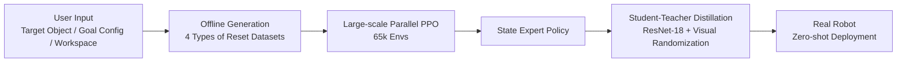

# Emergent Dexterity via Diverse Resets and Large-Scale Reinforcement Learning

**Conference**: ICLR 2026  
**Code**: https://omnireset.github.io  
**Area**: Robotic Dexterous Manipulation / Reinforcement Learning  
**Keywords**: Dexterous manipulation, diverse resets, large-scale RL, sim-to-real, emergent behavior

## TL;DR
OmniReset enables the emergence of complex multi-stage dexterous manipulation strategies by automatically generating four types of diverse initial state distributions. Using Large-scale PPO in massively parallel simulations, it requires no human demonstrations, curricula, or task-specific rewards, and achieves zero-shot transfer to real robots.

## Background & Motivation

**Background**: Reinforcement learning based on massively parallel simulation (e.g., IsaacLab) has made significant progress in quadrupedal locomotion and simple grasping. However, it still lags behind human levels in long-horizon, contact-rich manipulation tasks such as peg insertion, leg twisting, and drawer insertion.

**Limitations of Prior Work**: Standard exploration strategies (PPO/SAC) saturate quickly under large-scale parallelism by repeatedly sampling the same narrow state distribution, leading to local optima. Consequently, researchers must introduce heavy manual engineering: task-specific reward shaping, carefully designed curricula, or expert demonstrations, all of which limit generalizability and scalability.

**Key Challenge**: Increasing compute and the number of parallel environments should ideally yield benefits. However, if the initial state distribution is too narrow, more parallelism merely results in redundant and inefficient exploration of the same regions. RL struggles to "discover" sparse rewards and cannot chain multiple sub-behaviors into long-horizon policies.

**Goal**: To implement a scalable framework where RL performance continuously improves with increased compute without human demonstrations, curricula, or task-specific rewards, ultimately solving long-horizon dexterous manipulation tasks that were previously unattainable.

**Key Insight**: Since long-horizon dexterous manipulation is essentially a combination of various "interaction modes" (approaching, contacting, stable grasping, fine insertion/rotation), the RL algorithm can autonomously discover how to stitch these fragments into a complete policy—without being told "grasp then insert"—as long as the training **fully covers** the state space regions corresponding to these interaction modes.

**Core Idea**: Use four types of automatically generated diverse reset states (reach, near-object, stable grasp, near-goal) to densely cover the critical interaction state space of manipulation tasks. Combined with large-scale parallel PPO, dexterous behaviors emerge from computation.

## Method

### Overall Architecture

The OmniReset workflow consists of two phases: **offline generation** of a diverse reset dataset, followed by **online RL training** where PPO is driven by uniform sampling from these reset states. After convergence, the state-based expert policy is compressed into a visuo-motor policy (RGB input) deployable on real robots via **student-teacher distillation**.

### Key Designs

**1. Four Types of Diverse Reset States: Densely Covering Interaction Modes**

Traditional RL training starts from a fixed "reaching" initial state, making it difficult for the robot to explore sparse reward regions (e.g., the moment of successful insertion). OmniReset's core insight is that long-horizon tasks can be decomposed into recurring interaction modes, and the state space regions corresponding to these modes can be explicitly covered.

OmniReset automatically constructs four reset datasets offline: **Reach Reset** $\mathcal{D}_R$ (random robot end-effector positions in the workspace, objects randomly on the table) provides the starting point for the full task; **Near-Object Reset** $\mathcal{D}_{NO}$ (end-effector aligned to one of 1000 pre-computed grasp points with small offsets, gripper randomly open/closed) covers non-prehensile contact and grasp initialization; **Stable Grasp Reset** $\mathcal{D}_G$ (target object suspended at random heights, end-effector in valid grasp poses) covers mid-air manipulation; **Near-Goal Reset** $\mathcal{D}_{NG}$ (object placed at pre-computed offsets near the target configuration, end-effector in contact) covers contact-rich terminal stages like insertion. During training, $\mathcal{D} = \mathcal{D}_R \cup \mathcal{D}_{NO} \cup \mathcal{D}_G \cup \mathcal{D}_{NG}$ is sampled uniformly. Resets are verified for validity via collision detection and short-step simulation before being cached to the GPU.

This design ensures that the four reset types approximately cover all paths to the goal from "task end" to "task start," allowing sparse success rewards to propagate smoothly across the state space via value function updates.

**2. Task-Agnostic General Reward Function**

Prior methods required manual reward shaping for each task. OmniReset uses a unified reward structure with identical weights across all tasks:

$$r(s_t, a_t) = r_{\text{success}}(s_t) + r_{\text{dist}}(s_t) + r_{\text{reach}}(s_t) + r_{\text{smooth}}(s_t, a_t) + r_{\text{term}}(s_t)$$

Where $r_{\text{success}}$ is a sparse binary completion reward, $r_{\text{dist}}$ encourages the object to approach the goal, $r_{\text{reach}}$ encourages the gripper to approach the object, $r_{\text{smooth}}$ penalizes large or abrupt actions, and $r_{\text{term}}$ penalizes unsafe states. This simple design works because diverse resets solve the exploration problem; rewards no longer need to "guide" the discovery of contact or grasping.

**3. Large-Scale Parallelism + gSDE Exploration Noise**

While diverse resets solve state coverage, large-scale parallelism is required to exploit it. Ablation studies show that performance (especially full-task success rate) improves continuously from 4,096 to 65,536 environments. The algorithm uses **Asymmetric Actor-Critic**: the Actor receives 5 steps of history (robot state, object pose, actions), while the Critic receives privileged environmental parameters. **Generalized State-Dependent Exploration** (gSDE) is introduced, where exploration noise is conditioned on the policy network's last layer features, allowing the robot to learn different temporally correlated exploration strategies for heterogeneous multi-stage tasks.

**4. Student-Teacher Distillation for Sim-to-Real Transfer**

The state-based expert cannot run directly on real robots. OmniReset uses distillation to convert it into a visuo-motor policy relying solely on RGB images. 10,000 expert rollouts are collected (using three cameras: front, side, and wrist at 224×224), training a student policy with an ImageNet-pretrained ResNet-18 encoder. Visual randomization (lighting, background, appearance, camera jitter) and image augmentations bridge the sim-to-real visual gap, while dynamics randomization (friction, latency calibration, gain randomization) addresses physical discrepancies.

## Key Experimental Results

### Main Results

OmniReset significantly outperforms three baselines (all provided with optimal demonstrations) on "Hard" variants (wide initial distributions) of 6 tasks:

| Task | OmniReset Success Rate | BC-PPO | DeepMimic | Demo Curriculum |
|------|-----------------|--------|-----------|-----------------|
| Peg Insertion (Hard) | ~1.0 | ~0 | ~0 | Low |
| Leg Twisting (Hard) | ~0.9 | ~0 | ~0 | Low |
| Drawer Insertion (Hard) | ~0.8+ | ~0 | ~0 | Low |
| Cube Stacking (Hard) | ~0.9+ | ~0 | Very Low | Very Low |
| Wall Slide (Hard) | ~0.9+ | Very Low | Very Low | Very Low |
| Cupcake Placement (Hard) | ~0.9 | Very Low | Very Low | Very Low |

**Real Robot**: In the Peg Insertion task, the distilled OmniReset policy achieved a **25% success rate** zero-shot, whereas a Diffusion Policy trained with 100 real-world demonstrations achieved only **4%**. Qualitatively, OmniReset exhibited robust "retry behavior," autonomously recovering after failing an initial insertion.

### Ablation Study

| Configuration | Full Task Success Rate | Description |
|------|------------|------|
| 65,536 Envs | ~0.85 | Optimal configuration |
| 32,768 Envs | ~0.65 | Significant decline |
| 8,192 Envs | ~0.2 | Near failure |
| Wide Grasp Range | ~0.9 | Optimal |
| Moderate Grasp Range | ~0.6 | Low sample efficiency |
| Narrow Grasp Range | ~0.3 | Difficult to converge |

### Key Findings
- Baselines can solve near-goal sub-tasks but fail completely to scale to full long-horizon tasks (reaching-start success rate near 0).
- OmniReset policies maintain success rates under strong perturbations, whereas baselines drop significantly under small perturbations.
- In Drawer Insertion, a non-prehensile "flip then push" strategy emerged autonomously. In Leg Twisting, a composite strategy of "adjusting grasp using the table then screwing in" emerged.
- Combined with a simple scripted scheduler, OmniReset can complete extremely long-horizon tasks like four-leg table assembly.

## Highlights & Insights
- **Resets as the Simplest Curriculum**: OmniReset demonstrates that "dense state space coverage" is simpler and more scalable than "hand-designed curricula." The latter requires manual difficulty gradients, whereas the former only requires random physical sampling; this aligns with the "simple large-scale data beats complex algorithms" paradigm in LLMs.
- **Emergence vs. Engineering**: In Drawer Insertion, the robot invented a "push-over then slide-in" strategy rarely seen in human-designed curricula or demos, suggesting that wide exploration spaces can catalyze solutions exceeding human priors.
- **Computational Scalability**: Unlike most RL methods, OmniReset shows continuous performance gains across the 4,096 to 65,536 environment range, realizing "more compute = better performance," consistent with LLM Scaling Laws.
- **Minimal Human Input**: Users only specify the target object, configuration, and workspace; no prior knowledge of "how-to" is required.

## Limitations & Future Work
- Currently a **single-task, single-object** framework; multi-task expansion is a direct next step.
- The zero-shot success rate on real robots (25%) still has room for improvement; the sim-to-real gap is not fully closed.
- Not yet extended to anthropomorphic dexterous hands (high-dim action spaces), though grasp sampling methods (e.g., UniGrasp) could theoretically be integrated.
- The partition of four reset types assumes "key interaction stages," which might require finer state space analysis for extremely long or highly branched tasks.
- Lack of systematic quantitative research on Scaling Laws (noted as an open direction).

## Related Work & Insights
- **vs. BC-PPO / DeepMimic / Demo Curriculum**: These require expert demos and only succeed under narrow initial conditions; OmniReset requires no demos and performs better under wide distributions.
- **vs. Reverse Curriculum**: Reverse curricula generate initial conditions backwards from the goal using success trajectories as anchors. OmniReset's resets are a more general "forward coverage" independent of existing success signals.
- **vs. Intrinsic Exploration (ICM/RND)**: Curiosity-driven exploration adds complexity and is hard to scale; OmniReset "replaces" exploration by diversifying the initial state distribution.
- **vs. Motion Planning Hybrids (Tang et al. 2024)**: Hybrids reduce exploration burden but increase system complexity; OmniReset relies entirely on RL, trading compute for a more unified and scalable framework.

## Rating
- Novelty: ⭐⭐⭐⭐ The core idea (diverse resets) is not entirely new, but systematizing it into a scalable framework and proving its scaling behavior is a major contribution.
- Experimental Thoroughness: ⭐⭐⭐⭐⭐ 6 manipulation tasks × Hard/Easy variants, detailed ablations, robustness analysis, and real-robot validation.
- Writing Quality: ⭐⭐⭐⭐ Clear analogy to LLM Scaling Laws and strong narrative, though some results lack numerical quantification in text.
- Value: ⭐⭐⭐⭐⭐ Provides a path for "RL-driven dexterity" to scale without expert knowledge, offering a substantial push to the field.

<!-- RELATED:START -->

## Related Papers

- [\[ICLR 2026\] Rethinking Policy Diversity in Ensemble Policy Gradient in Large-Scale Reinforcement Learning](rethinking_policy_diversity_in_ensemble_policy_gradient_in_large-scale_reinforce.md)
- [\[ICLR 2026\] Towards Bridging the Gap between Large-Scale Pretraining and Efficient Finetuning for Humanoid Control](towards_bridging_the_gap_between_large-scale_pretraining_and_efficient_finetunin.md)
- [\[ICLR 2026\] RoboCasa365: A Large-Scale Simulation Framework for Training and Benchmarking Generalist Robots](robocasa365_a_large-scale_simulation_framework_for_training_and_benchmarking_gen.md)
- [\[ICLR 2026\] RFS: Reinforcement Learning with Residual Flow Steering for Dexterous Manipulation](rfs_reinforcement_learning_with_residual_flow_steering_for_dexterous_manipulatio.md)
- [\[ECCV 2024\] GraspXL: Generating Grasping Motions for Diverse Objects at Scale](../../ECCV2024/robotics/graspxl_generating_grasping_motions_for_diverse_objects_at_scale.md)

<!-- RELATED:END -->
