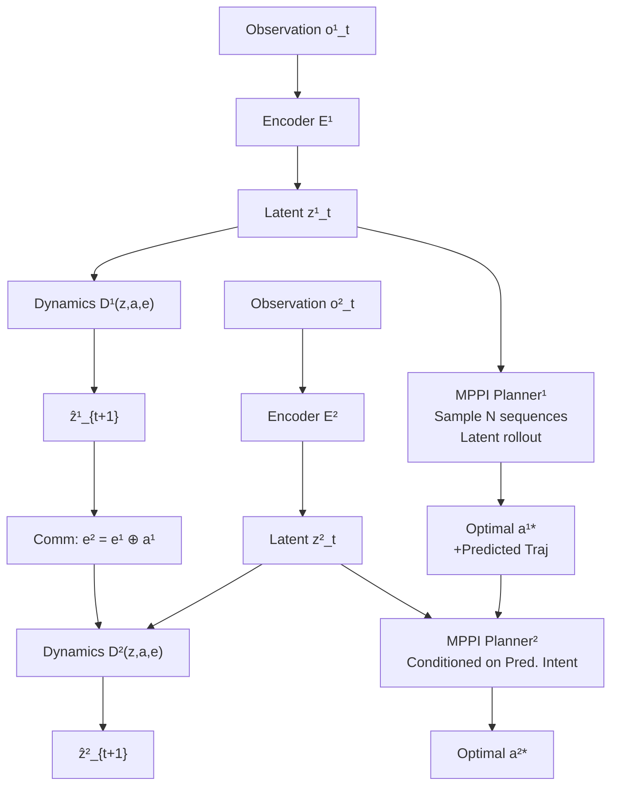

# Empowering Multi-Robot Cooperation via Sequential World Models

**Conference**: ICLR 2026  
**OpenReview**: [https://openreview.net/forum?id=IvUM6UwYCJ](https://openreview.net/forum?id=IvUM6UwYCJ)  
**Code**: [SeqWM](https://openreview.net/forum?id=IvUM6UwYCJ) (Available on the paper homepage)  
**Area**: Robotics / Multi-Agent Systems  
**Keywords**: Multi-robot cooperation, world models, sequential paradigm, Model Predictive Path Integral, autoregressive dynamics modeling

## TL;DR

This paper proposes SeqWM (Sequential World Model), which introduces the sequential (autoregressive) paradigm into multi-robot model-based reinforcement learning. Each robot independently maintains a world model and sequentially passes predicted trajectories. While reducing modeling complexity, the system naturally evolves advanced collaborative behaviors such as proactive adaptation, temporal alignment, and role division through intent sharing, successfully achieving sim-to-real transfer.

## Background & Motivation

**Background**: Model-Based Reinforcement Learning (MBRL) has achieved significant success in single-robot tasks due to its high sample efficiency and multi-step planning capabilities. However, extending it to multi-robot cooperation faces the core challenge of the "joint dynamics" modeling complexity explosion.  
**Limitations of Prior Work**: Decentralized methods model each agent independently, ignoring coupling relationships and resulting in poor coordination. Centralized methods (e.g., CoDreamer, MARIE) predict in the combined state-action space, which suffers from extremely high computational costs in high dimensions ($O \in \mathbb{R}^{229}, A \in \mathbb{R}^{26}$), making them difficult to deploy on real robots.  
**Key Challenge**: Decentralized modeling loses coordination capability, while centralized modeling cannot afford the computational cost of high-dimensional joint spaces—neither satisfies the dual needs of "efficient modeling" and "precise coordination."  
**Goal**: To find a middle ground of "ordered communication" between the two, satisfying both low modeling complexity and explicit intent sharing for multi-robot MBRL.  
**Core Idea**: Drawing inspiration from multi-agent sequential decision-making paradigms (MAT, HARL), the joint dynamics are decomposed into **autoregressive per-agent world models**. Each robot learns only its local dynamics but is conditioned on the predicted trajectories of predecessor robots during prediction. During planning, optimal action plans are also passed sequentially to achieve "intent sharing."

## Method

### Overall Architecture

SeqWM consists of two collaborative components: **Sequential World Modelling** (autoregressive modeling of joint dynamics in latent space) and **Sequential Planning** (a sequential multi-agent planner based on MPPI). Training follows a sequential update strategy to ensure that each agent's world model is always conditioned on the latest predecessor predictions, guaranteeing monotonic improvement.

### Key Designs

**1. Autoregressive Latent World Model: Reducing Complexity via Predecessor Conditioning**

The core of SeqWM is decomposing the joint dynamics $P(s_{t+1}|s_t,\mathbf{a}_t)$ into the product of $n$ conditional probabilities. For the $i$-th agent, the world model is defined as:

$$
z^i_t = E^i(o^i_t), \quad
\hat{z}^i_{t+1} = D^i(z^i_t, a^i_t, e^i_t), \quad
e^{i+1}_t = e^i_t \oplus a^i_t
$$

where $e^i_t$ is the communication message sent by the predecessor agent via **concatenation**, containing latent predictions and actions of all $j<i$. Key aspects include: (a) Encoders and dynamics predictors of each agent are independent with no parameter sharing, facilitating distributed deployment. (b) Communication uses simple concatenation instead of Cross-Attention or RNNs; ablation studies show this preserves full content while avoiding gradient instability from additional parameters. (c) Training losses strictly follow sequential updates—when training agent $i+1$, inputs come from the predictions of the **latest versions** of the preceding $i$ agents.

Training objective (prediction horizon $H$, decay weight $\lambda$):

$$
\mathcal{L}_i(\theta) = \sum_{t}^{H} \lambda^t \Big[
\underbrace{\|\hat{z}^i_{t+1} - \text{sg}(z^i_{t+1})\|^2}_{\text{dynamics loss}}
+ \underbrace{\text{Soft-CE}(\hat{r}^i_t, r_t)}_{\text{reward loss}}
+ \underbrace{\text{Soft-CE}(\hat{q}^i_t, G_t)}_{Q\text{-value loss}}
\Big]
$$

The stop-gradient operator $\text{sg}(\cdot)$ is applied to the latent target $z^i_{t+1}=E^i(o^i_{t+1})$ to prevent cyclic gradient flows.

**2. Sequential MPPI Planning: Joint Planning via Intent Transfer**

The planning phase also follows a sequential structure. Agent $i$ first samples $N$ candidate action sequences from the initial distribution provided by the actor, performs latent space rollouts in the local world model, and estimates the value of each trajectory:

$$
V^i_{t+H} = \gamma^H Q^i(\hat{z}^i_{t+H}, a^i_{t+H}, e^i_{t+H}) + \sum_{h=t}^{t+H-1} \gamma^{h-t} R^i(\hat{z}^i_h, a^i_h, e^i_h)
$$

Based on the Cross-Entropy Method, an elite subset is retained to iteratively update the action distribution. Once converged, agent $i$ passes the **optimized action sequence + predicted trajectory** as a message to agent $i+1$. This is the core of "intent sharing": subsequent robots can directly reference the complete future plans of predecessors rather than just current actions.

**3. Robust Communication Design: Random Masking + Low-pass Filtering + Cache Fallback**

- **Random Masking Training** (inspired by MAE): During training, inter-agent communication is randomly masked and sequence orders are shuffled with a certain probability. This forces the world model to predict robustly even when communication is missing.
- **Low-pass Action Smoothing**: In each planning iteration, sampled action sequences are processed with a low-pass filter along the time dimension to suppress high-frequency jitter, ensuring hardware safety.
- **Communication Cache Fallback**: If communication fails at time $t+1$, agent $i+1$ retrieves the predicted message $\hat{z}^i_{t+1}=D^i(E^i(o^i_t))$ stored by agent $i$ at time $t$.
- **Heuristic Early Termination**: Planning terminates if the KL divergence of the action distribution between iterations falls below a threshold, reducing online latency.

## Key Experimental Results

### Main Results

| Task | Metric | SeqWM (Ours) | Prev. SOTA (Best Baseline) | Description |
|------|----------|-------|--------------|------|
| Bi-DexHands: Over | Episode Return | **Highest** | MARIE | Near-optimal at 2–4M steps |
| Bi-DexHands: Scissors | Episode Return | **Highest** | MARIE | Near-optimal at 2–4M steps |
| Bi-DexHands: Pen | Episode Return | **Highest, Lowest Var** | HASAC | Significantly better stability |
| Multi-Quad: Gate | Success Rate | **~100% early** | MAT | Leading in sample efficiency |
| Multi-Quad: Shepherd | Success Rate | **~100% early** | MAT | Sequential intent sharing is key |

(Learning curves for all tasks are provided in Figure 3 and Appendix Figure 12 of the paper.)

### Ablation Study

| Configuration | BottleCap Performance | Description |
|------|--------------|------|
| SeqWM (concat) | **Highest & Stable** | Complete info + No extra parameters |
| MLP fusion | Decrease | Extra parameters disrupt gradient stability |
| Cross-Attn fusion | Decrease | Gradient instability in long horizons |
| RNN fusion | Lower than Dec (no comm) | Sensitive to input order; harmful in MAS |
| DecWM (No intent sharing) | Medium | Significant drop without trajectory passing |
| SeqFree (No WM, 1-step comm) | **Lowest** | Both world model and intent sharing are essential |

### Key Findings

- The sequential model (SeqWM) achieves prediction errors similar to centralized models and significantly lower than decentralized models, proving that autoregressive decomposition maintains accuracy while reducing complexity.
- SeqWM generalizes successfully in a 5-agent Gate task, where robots naturally form a "predict-wait-pass-yield" rhythm, showing excellent scalability.
- Three tasks on real Unitree Go2-W robots (PushBox, Gate, Shepherd) reproduced the collaborative behaviors seen in simulation, confirming successful sim-to-real transfer.

## Highlights & Insights

- **Sequential Paradigm fits World Models Naturally**: The autoregressive structure of sequential decision-making (MAT/HARL) is highly compatible with multi-step trajectory prediction. SeqWM achieves this unity across the full pipeline from modeling to planning.
- **Convincing Emergent Behaviors**: Proactive adaptation (catching hand lowering early), temporal alignment (bimanual synchronous grasping), and role division (spontaneous separation of direction control and power output in PushBox) are not hard-coded but emerge naturally from per-agent intent sharing.
- **Elegant Communication Failure Handling**: Cache fallback combined with random masking training forms a robust communication system without extra modules, making it deployment-friendly.
- **Concat > Complex Fusion**: Ablation results provide a counter-intuitive but clear conclusion: in multi-step prediction scenarios, retaining full information and letting downstream modules learn to filter is more stable than attention or recurrent mechanisms.

## Limitations & Future Work

- Currently supports only **fully cooperative** (shared reward) settings; competitive or mixed-motive scenarios are not verified.
- The execution sequence is **fixed or random**, lacking a mechanism to dynamically adjust priority based on the task, which may be sub-optimal in dynamic role-changing scenarios.
- Planned extensions include heterogeneous robot teams (legged + arm + aerial) and human-robot semantic intent sharing, where independent world models are naturally suited for different dynamics and perception modalities.

## Related Work & Insights

- **vs. CoDreamer / MARIE**: The former uses Transformer/GNN to fuse global states for a centralized world model, while the latter still requires step-wise communication aggregation. SeqWM models each agent independently with communication occurring only during sequential transfer, resulting in a simpler and more scalable structure.
- **vs. MAT / PMAT**: Both share the sequential paradigm, but the MAT series consists of model-free methods lacking multi-step intent lookahead. SeqWM introduces the multi-step prediction and planning capabilities of MBRL into the sequential framework, serving as a "world model upgrade" for MAT.
- **vs. TD-MPC2**: The single-agent world model in SeqWM directly inherits the latent space self-supervised design (TOLD) of TD-MPC2, extending it sequentially in the multi-agent dimension with high modularity.
- **Insight**: For multi-robot tasks requiring physical deployment, the choice of communication structure (sequential vs. all-to-all broadcast) significantly impacts engineering costs and should be considered during the algorithm design phase.

## Rating

- Novelty: ⭐⭐⭐⭐ Integrating the sequential paradigm into multi-robot MBRL is a natural and pragmatic idea with clear formulation; sequential planning with MPPI is a novel and complete contribution.
- Experimental Thoroughness: ⭐⭐⭐⭐ Covers various tasks including high-dimensional dexterous manipulation and multi-legged coordination, involving ablations, scalability (5 agents), behavioral visualization, and real-world robot verification.
- Writing Quality: ⭐⭐⭐⭐ Clearly structured with good alignment between text and figures; the behavioral visualization in Section 5.2 provides intuitive insights.
- Value: ⭐⭐⭐⭐ Simultaneously achieves real-world deployment, emergent behaviors, and sample efficiency, providing a substantial advancement for the multi-robot MBRL community.

<!-- RELATED:START -->

## Related Papers

- [\[ICLR 2026\] World-In-World: World Models in a Closed-Loop World](world-in-world_world_models_in_a_closed-loop_world.md)
- [\[ICLR 2026\] Ctrl-World: A Controllable Generative World Model for Robot Manipulation](ctrl-world_a_controllable_generative_world_model_for_robot_manipulation.md)
- [\[ICLR 2026\] WMPO: World Model-based Policy Optimization for Vision-Language-Action Models](wmpo_world_model-based_policy_optimization_for_vision-language-action_models.md)
- [\[CVPR 2026\] Dexterous World Models](../../CVPR2026/robotics/dexterous_world_models.md)
- [\[NeurIPS 2025\] VIKI-R: Coordinating Embodied Multi-Agent Cooperation via Reinforcement Learning](../../NeurIPS2025/robotics/viki-r_coordinating_embodied_multi-agent_cooperation_via_reinforcement_learning.md)

<!-- RELATED:END -->
