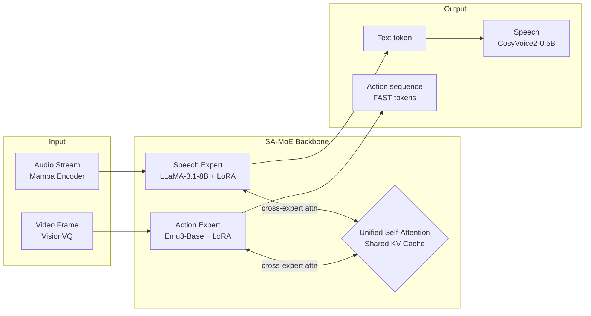

# End-to-end Listen, Look, Speak and Act

**Conference**: ICLR 2026  
**Code**: [bytedance/SALMONN](https://github.com/bytedance/SALMONN)  
**Area**: Robotics / Embodied AI · Multimodal Generation  
**Keywords**: Full-duplex interaction, SA-MoE, Multimodal MIMO, VLA, Embodied Conversation

## TL;DR

ELLSA is the first truly end-to-end full-duplex multimodal system. Through the SA-MoE architecture, it connects speech experts and action experts with unified attention, enabling a robot to "listen, look, speak, and act" simultaneously while supporting previously impossible interactions such as barge-in, speaking-while-acting, and contextual visual question answering.

## Background & Motivation

**Background**: Existing AI models are divided into two categories of isolated systems: full-duplex speech dialogue LLMs (e.g., Moshi, Freeze-Omni) can listen and speak fluently but cannot manipulate objects; VLA models (e.g., $\pi_0$, OpenVLA) can perform precision operations but only accept text instructions and cannot speak, rendering them "mute" and "deaf." **Limitations of Prior Work**: Speech dialogue models are "disembodied observers," and VLA models are "half-duplex executors." Neither can handle barge-in, synchronous execution, and linguistic interlacing in real human-robot interaction. **Key Challenge**: In multimodal joint modeling, forcing speech, vision, text, and action into a single dense model causes modal interference, leading to performance degradation across tasks and extremely high training costs. **Goal**: To build the first end-to-end full-duplex model capable of perceiving speech + vision and generating speech + action simultaneously. **Core Idea**: Use SA-MoE (Self-Attention Mixture-of-Experts) to connect two pre-trained experts (a speech expert and an action expert) via a unified self-attention mechanism. This allows each expert to focus on its own modality to reduce interference while achieving cross-modal information fusion through a shared KV Cache.

## Method

### Overall Architecture

ELLSA consists of three core components: a **Speech Expert** (Streaming Mamba encoder + LLaMA-3.1-8B + LoRA) for processing audio input and text output, an **Action Expert** (UniVLA/Emu3-Base + FAST action tokenizer) for processing visual input and robotic arm action output, both connected by an **SA-MoE Backbone**. At the end, a CosyVoice2-0.5B speech synthesizer is attached for end-to-end speech generation. The system processes multimodal interleaved sequences in rolling $1$-second time-chunks. Within each time-chunk, it synchronously receives audio and visual frames to generate text tokens, action sequences, and speech codes, naturally supporting full-duplex streaming interaction.

### Key Designs

**1. SA-MoE: Connecting Experts via Attention Rather than Hard Merging**  
The core insight of SA-MoE is that data from different modalities have their QKV projections and FFNs handled independently by respective experts, but all experts share a unified Self-Attention process. The attention query at each timestep can see the KV Cache of the entire sequence, including KV values generated by other experts at previous moments. From a sequence perspective, the information flow is equivalent to a standard Transformer; from a single-step perspective, the Q/K/V of different modalities come from different expert weights but interact through unified attention. Inspired by $\pi_0$ (connecting VLM backbones and action experts via attention), ELLSA generalizes this to full-sequence interaction between two independent LLM backbones. Consequently, even if a speech expert was never trained on visual data, it can understand visual information and answer contextual questions via KV sharing.

**2. Interleaved Time-chunk Sequences: Full-duplex MIMO via Sequence Structure**  
A key challenge in full-duplex streaming interaction is "how the model decides when to speak and when to stop." ELLSA solves this with a minimalist sequence design: within each $1$-second time-chunk, audio input, image input, text output, and action output are arranged in a fixed order, separated by modality boundary tokens `<bos>/<eos>/<boi>/<eoi>/<bot>/<eot>/<boa>/<eoa>`. By outputting `<silence>` or actual content at text token positions, or placeholders versus real actions at action token positions, the model decides whether to speak or execute. This turns behaviors like action barge-in and speaking-while-acting into standard conditional sequence generation without additional control modules.

**3. Three-stage Training Strategy: From Experts to Unification to End-to-End**  
Stage 1 independently trains the two experts: the speech expert is trained on ASR + speech QA tasks (unfreezing only connectors + LoRA), while the action expert directly uses pre-trained UniVLA (already fine-tuned via world-model post-training and policy learning). Stage 2 involves joint fine-tuning under the SA-MoE framework, covering basic capabilities (ASR, QA, speech-conditioned manipulation) and advanced capabilities (speaking-while-acting, instruction rejection, barge-in response), with LoRA updates for both experts. Stage 3 freezes the ELLSA backbone and trains only the speech synthesizer connector to map LLM hidden states to CosyVoice2 speech codecs. This progressive strategy leverages pre-trained expert knowledge while minimizing data requirements.

**4. Advanced Interaction Task Design: Speaking-while-acting and Instruction Rejection**  
ELLSA defines four new evaluation scenarios. Speaking-while-acting requires the model to answer spoken questions while executing actions; Context-grounded VQA requires the speech expert to use the visual state "seen" by the action expert to answer execution-related questions like "where is the black bowl now?"; Defective instruction rejection constructs flawed commands across four dimensions (visual feasibility, semantic rationality, motion range, scene relevance), requiring the model to reject and explain via speech; Action barge-in injects "pause" commands during execution to test real-time responsiveness. These tasks serve as both evaluation benchmarks and data construction strategies, with flawed instructions and barge-in scenarios heavily augmented via synthesis.

## Key Experimental Results

### Main Results

| Task | Metric | Ours (ELLSA) | Prev. SOTA | Gain |
|------|------|------|----------|---|
| LIBERO Avg. | Success Rate | **89.4%** | $\pi_0$-FAST 85.5% | +3.9% |
| LIBERO LONG | Success Rate | **84.4%** | $\pi_0$-FAST 60.2% | +24.2% |
| TriviaQA S2S | Acc. | **41.7%** | Freeze-Omni 28.5% | +13.2% |
| AlpacaEval S2S | GPTScore | 2.80 | Freeze-Omni 2.46 | +0.34 |
| Turn-taking Pred. | Success Rate | **100%** | Freeze-Omni 99.7% | - |

### Ablation Study

| Configuration | Key Metric | Description |
|------|----------|------|
| SA-MoE vs. Dense | Significantly better than dense | See Table 7, proving advantage of expert architecture |
| Speaking-while-acting vs. Single Task | QA accuracy drops ~8-12% | Caused by dual-task distraction, especially on hard benchmarks |
| Context VQA (Manual / Gemini) | 82.5% / 83.3% | Two evaluation methods are highly consistent |

### Key Findings

- ELLSA significantly outperforms $\pi_0$-FAST (**84.4%** vs. 60.2%) on LIBERO LONG (the most difficult long-sequence task), suggesting that speech instructions + full-duplex design actually aid long-task execution.
- Turn-taking and action-taking success rates both reach **100%**, whereas Moshi's turn-taking is only 85%, indicating that longer time-chunks ($1\text{s}$ vs. $0.16\text{s}$) make full-duplex dynamics easier to learn.
- SA-MoE enables the speech expert to understand visual context without visual training data (Context VQA accuracy ~83%), proving that KV sharing achieves genuine cross-expert knowledge transfer.
- Performance degradation during speaking-while-acting is concentrated in difficult sub-tasks: LIBERO LONG drops from 84.4% to 73.2%, and TriviaQA S2S drops from 41.7% to 30.7%.

## Highlights & Insights

- SA-MoE provides a multimodal architectural paradigm of "interconnected experts rather than merged ones": each expert retains pre-trained capabilities and achieves soft fusion through attention KV sharing, offering an elegant middle ground between complete independence (no interaction) and complete merging (severe interference).
- The full-duplex design naturally supports barge-in without external VAD or state machines; real-time responses like "Action Cancelled" are achieved purely through sequence modeling, greatly simplifying engineering complexity.
- Defining speaking-while-acting and action barge-in as standard evaluation tasks establishes a framework for future embodied dialogue systems.

## Limitations & Future Work

- Observed performance drops when speaking-while-acting suggest that the allocation of attention resources between concurrent tasks is not yet fully optimized.
- The fixed $1$-second time-chunk granularity lacks fine-grained analysis of real-time latency; finer dynamic time-chunks might improve user experience.
- Currently limited to two experts (speech + action); the impact of increasing the number of experts (e.g., touch, smell) on computation and training remains to be verified.
- LIBERO is a tabletop manipulation benchmark; transfer effects to real-world robots have not yet been validated.

## Related Work & Insights

- **vs. Moshi / Freeze-Omni**: These represent full-duplex speech LLMs but lack action capabilities; ELLSA adds an action branch via SA-MoE without sacrificing speech performance.
- **vs. $\pi_0$ / OpenVLA**: Representative VLA models; ELLSA adopts the $\pi_0$ concept of "VLM backbone connecting to action experts via attention" and generalizes it to two independent LLM backbones. ELLSA surpasses $\pi_0$-FAST on LIBERO and supports speech instructions.
- **vs. Unified-IO 2**: An early autoregressive model attempting to unify vision, language, audio, and action, but it was half-duplex turn-based; ELLSA is its full-duplex upgrade.

## Rating

- Novelty: ⭐⭐⭐⭐⭐ First end-to-end full-duplex listen+look+speak+act system; original SA-MoE architecture; first systematic study of scenarios like speaking-while-acting and action barge-in.
- Experimental Thoroughness: ⭐⭐⭐⭐ Covers speech QA, robot manipulation, turn-taking, barge-in, and contextual VQA; solid SA-MoE vs. dense model ablation.
- Writing Quality: ⭐⭐⭐⭐ Clear structure, well-motivated task design, and intuitive diagrams; some advanced task details are in the appendix, making the main text slightly dense.
- Value: ⭐⭐⭐⭐⭐ Establishes a new system paradigm for "natural human-robot interaction" in embodied AI; SA-MoE is reusable for other multi-expert multimodal scenarios.

<!-- RELATED:START -->

## Related Papers

- [\[ICLR 2026\] LeRobot: An Open-Source Library for End-to-End Robot Learning](lerobot_an_open-source_library_for_end-to-end_robot_learning.md)
- [\[ICLR 2026\] RAVEN: End-to-end Equivariant Robot Learning with RGB Cameras](raven_end-to-end_equivariant_robot_learning_with_rgb_cameras.md)
- [\[CVPR 2026\] RoboTAG: End-to-end Robot Pose Estimation via Topological Alignment Graph](../../CVPR2026/robotics/robotag_end-to-end_robot_pose_estimation_via_topological_alignment_graph.md)
- [\[CVPR 2026\] End-to-End Language-Action Model for Humanoid Whole Body Control](../../CVPR2026/robotics/end-to-end_language-action_model_for_humanoid_whole_body_control.md)
- [\[NeurIPS 2025\] SutureBot: A Precision Framework & Benchmark for Autonomous End-to-End Suturing](../../NeurIPS2025/robotics/suturebot_a_precision_framework_benchmark_for_autonomous_end-to-end_suturing.md)

<!-- RELATED:END -->
