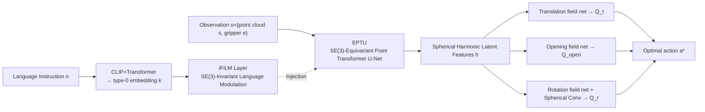

# EquAct: An SE(3)-Equivariant Multi-Task Transformer for 3D Robotic Manipulation

**Conference**: ICLR 2026  
**OpenReview**: [https://openreview.net/forum?id=d1wuA8oIH0](https://openreview.net/forum?id=d1wuA8oIH0)  
**Code**: [github.com/ZXP-S-works/EquAct](https://github.com/ZXP-S-works/EquAct)  
**Area**: robotics (robotic manipulation / equivariant policy learning)  
**Keywords**: SE(3)-equivariant, multi-task policy, keyframe actions, spherical harmonic Fourier features, language conditioning

## TL;DR
EquAct proposes the first multi-task, language-conditioned keyframe manipulation policy that achieves continuous SE(3) equivariance (rotation + translation) within a single unified model. By utilizing an equivariant point Transformer U-Net, spherical harmonic Fourier features, and an SE(3)-invariant iFiLM language modulation layer, it achieves SOTA performance across 18 RLBench tasks (including SE(3) perturbations) and 4 real-world tasks.

## Background & Motivation
**Background**: Mainstream multi-task manipulation policies (PerAct, RVT, SAM2Act, etc.) rely on Transformers to tokenize language, 3D observations, and keyframe actions into a shared embedding space, learning policies through cross-modal fusion.

**Limitations of Prior Work**: The tokenization process loses the underlying 3D geometric structure, causing policies to fail when generalizing to novel 3D object poses—yet real-world tasks (picking fruit at different orientations, installing pipe fittings, assembling angled pins) are filled with SE(3) pose variations. Existing methods must rely on massive robotic data to learn geometric priors from scratch.

**Key Challenge**: Either adopt a shared embedding space for strong cross-modal fusion at the cost of geometric consistency, or pursue geometric equivariance. However, existing equivariant methods are limited to **single tasks**, or multi-task methods only achieve **translation equivariance** (excluding rotation).

**Goal**: Achieve a multi-task language-conditioned policy with continuous SE(3) (rotation + translation) equivariance using a single unified model, theoretically ensuring generalization to novel 3D scene transformations while maintaining computational overhead comparable to non-equivariant baselines.

**Core Idea**: Constrain the "observation-to-action" mapping to be SE(3)-equivariant ($\pi(g\cdot o, n)=g\cdot a$), while recognizing that "actions should be SE(3)-invariant to language instructions"—when the instruction remains constant, actions only change according to the rigid body transformation of the observation. This is implemented via an equivariant architecture in the spherical harmonic Fourier domain for the former and an invariant FiLM layer (iFiLM) for the latter.

## Method

### Overall Architecture
EquAct is an implicit action value function $Q_a(o,n,a)\in\mathbb{R}$ that evaluates the value of a query action $a$ given observation $o=\{s,e\}$ (point cloud + gripper state) and language goal $n$. Inference consists of three steps: an equivariant U-Net encodes observations into per-point spherical harmonic latent features $h$; an iFiLM layer injects CLIP+Transformer language embeddings as type-0 features into the U-Net; and an equivariant field network propagates $h$ to any query action, outputting values for translation $Q_t$, opening $Q_\text{open}$, and rotation $Q_r$. The highest-value action is selected as the final output. Training treats policy learning as a classification problem, using cross-entropy to select expert actions from uniformly sampled candidates.

### Key Designs
**1. Equivariant Point Transformer U-Net (EPTU): Multi-scale geometric reasoning in the spherical harmonic Fourier domain.** Compared to non-equivariant Point Transformer + U-Net, EPTU uses spherical harmonic Fourier features for continuous SE(3) equivariance. It inserts two new operators between EquiformerV2 graph attention blocks: **spherical harmonic Fourier maxpooling**—selecting the Fourier coefficient with the largest 2-norm per degree $l$ among k-nearest neighbors $c'_{l,x}=c_{l,p^*},\ p^*=\arg\max_{p\in knn(x)}\|c_{l,p}\|_2^2$, ensuring SE(3) equivariance via the orthogonality of Wigner D-matrices; and **spherical harmonic Fourier upsampling**—performing softmax interpolation of k-nearest neighbor coefficients weighted by distance $c'_{l,x}=\text{softmax}_{p}(1/\|x-p\|)\,c_{l,p}$, proven equivariant by Schur’s Lemma.

**2. Invariant Feature Linear Modulation Layer (iFiLM): Making language conditioning geometrically invariant.** Standard FiLM does not guarantee equivariance/invariance. iFiLM receives spherical harmonic features $c$ and type-0 condition $k$, projecting $k$ into modulation parameters via an MLP: $\alpha_l,\beta,\gamma=\text{MLP}(k)$. Then, for $l>0$ features, only scaling is applied $c'_l=\alpha_l c_l$; for type-0 features, an affine transformation is applied $c'_0=\beta c_0+\gamma$. Since the scaling factor is orientation-independent, the layer is SO(3)-invariant to $k$ and SO(3)-equivariant to input features $c$, achieving semantic modulation while maintaining geometric equivariance.

**3. Equivariant field network: Evaluating actions across the entire SE(3) pose space.** Instead of anchoring actions to point cloud points, EquAct evaluates actions in the pose space $A_T\subset SE(3)$, decomposing actions into translation and rotation $a_T=a_t\rtimes a_r$. **Translation**: Builds a graph with $h$ as source and query point $a_t$ as destination, using EquiformerV2 to aggregate features and outputting rotation-invariant type-0 features as values $q_t(a_t,h)=q_t(a_t,g\cdot h)$. **Rotation**: Aggregates spherical harmonic features $\hat\phi$ at the predicted translation $a_t^*$, then performs spherical convolution with learnable filters $\hat\psi$: $q_r(a_r,a_t,h)=(\phi\star\psi)[a_r]=\mathcal{F}^{-1}(\hat\phi\cdot\hat\psi)[a_r]$, evaluating 36,864 HEALPix rotation candidates simultaneously, avoiding gimbal lock or high diffusion iteration overhead.

## Key Experimental Results

### Main Results
Evaluated on 18 RLBench tasks with 249 language instructions and 25 episodes/task across three settings: 2D/100 (SE(2) initialization, 100 demos), 2D/10 (SE(2), 10 demos), and 3D/10 (SE(3), 10 demos).

| Task Setting | Metric | EquAct | SAM2Act | 3DDA | Δ vs 2nd Best |
|------|------|------|------|---|---|
| 2D/100 (SE(2), 100 demo) | Avg. Success Rate | 89.4 | 86.8 | 81.3 | +2.6 |
| 2D/10 (SE(2), 10 demo) | Avg. Success Rate | 60.1 | 52.2 | 50.3 | +6.2 (vs SAM2Act) |
| 3D/10 (SE(3), 10 demo) | Avg. Success Rate | 53.3 | 37.0 | 37.9 | +15.4 (vs 3DDA) |
| Real-world 4 Tasks (11 variants) | Avg. Success Rate | 65.0 | — | 12.5 | +52.5 |

As the task difficulty increases, EquAct's lead grows—surpassing baselines by 15.4% in SE(3) settings, demonstrating strong sample efficiency and 3D generalization. Advantages are significant in high-precision tasks like place_cups and sort_shape. Training/inference time and VRAM usage are comparable to baselines (Inference: 0.7s, VRAM: 21GB).

### Ablation Study
Average success rate across 4 RLBench tasks in the 10 demo setting:

| Configuration | Avg. Success Rate | Description |
|------|------|------|
| Ours (Full) | 52.8 | Complete EquAct |
| aug. → no aug. | 50.5 | No data augmentation (slight drop; augmentation reduces numerical errors) |
| iFiLM → FiLM | 50.3 | Replaced with standard FiLM; high-precision tasks (place_cups: 62→24) drop significantly |
| l=3 → 2 | 45.5 | Lower spherical harmonic resolution; drop of 7.3; high-order coefficients critical |
| EPTU → VN | 22.0 | Replaced with VN-DGCNN (only type-1); drop of 30+; high-order features essential |
| equ. → no equ. | 12.3 | Replacing even one layer with non-equivariant versions causes failure; geometric structure is key |

### Key Findings
- Geometric equivariance is the core: Replacing a single equivariant layer (equ.→no equ.) leads to the largest performance drop (52.8→12.3).
- High-order spherical harmonic features (up to type-3) significantly outperform type-1 only VN-DGCNN (+30%); higher resolution $l$ leads to more accurate action reasoning.
- iFiLM outperforms FiLM in high-precision tasks, although FiLM occasionally performs better on tasks with constant actions due to overfitting potential.
- Real-world: 3DDA often fails by skipping keyframe actions, whereas EquAct learns robust SE(3) policies from limited demos.

## Highlights & Insights
- First multi-task language-conditioned keyframe policy to achieve continuous SE(3) (rotation + translation) equivariance within one model, supported by mathematical proofs of equivariance/invariance.
- Key insight: Recognizing the symmetry that "language instructions are SE(3)-invariant relative to actions" and implementing it with the minimalist iFiLM layer is the bridge between equivariance and natural language conditioning.
- Using spherical harmonic Fourier representations + U-Net style pooling/upsampling ensures equivariant computational overhead is on par with non-equivariant baselines, dispelling the myth that "equivariant = slow."
- Evaluating actions in the entire SE(3) field rather than point cloud anchors, combined with spherical convolution for 36,000+ candidates, avoids Euler angle discretization and diffusion iteration.

## Limitations & Future Work
- Slightly underperforms non-equivariant baselines on tasks with fixed object poses (e.g., sweep_to_dustpan)—equivariant inductive biases provide limited or even negative gain in settings without pose variation.
- Data augmentation still improves performance, suggesting numerical errors in equivariant networks; architectural equivariance is not yet strictly perfect in practice.
- The keyframe action formulation relies on motion planners for trajectory generation; its suitability for contact-rich or continuous control tasks remains to be fully validated.
- While 36,864 rotation candidates are evaluated simultaneously, the memory and scalability of the field network in even larger action spaces require further investigation.

## Related Work & Insights
- **vs SAM2Act / RVT (Multi-view methods)**: Projecting 3D scenes into orthogonal images for ViT is efficient but sacrifices geometric fidelity; EquAct maintains stronger geometric consistency in the 3D spherical harmonic domain.
- **vs 3D Diffuser Actor (3DDA)**: Uses diffusion for multi-modality but rotation depends on iterative denoising (slow) and may skip keyframes; EquAct performs one-shot evaluation in 0.7s.
- **vs Single-task SE(3) methods (Simeonov et al.)**: Previous SE(3)-equivariant policies were task-specific; EquAct handles multi-tasking in a single model.
- **vs Multi-task Trans-equivariant methods**: Previous multi-task methods (e.g., PerAct) were only translation-equivariant; EquAct completes the rotation equivariance.
- **Insight**: Expanding "symmetry recognition" from observations to conditional inputs (language)—any conditional signal invariant to geometric transformations can be injected into equivariant networks via iFiLM-like mechanisms, transferable to other multi-modal equivariant tasks.

## Rating
- Novelty: ⭐⭐⭐⭐⭐ First single-model continuous SE(3) multi-task language policy; iFiLM is an original insight; EPTU operators are novel.
- Experimental Thoroughness: ⭐⭐⭐⭐ Extensive coverage across 18 tasks, 3 settings, and real-world tests; however, baseline comparison is limited to 2 models.
- Writing Quality: ⭐⭐⭐⭐ Clear motivation, rigorous proofs, and complete diagrams; minor typos do not affect understanding.
- Value: ⭐⭐⭐⭐⭐ Leads significantly in low-data + SE(3) generalization scenarios; comparable overhead to non-equivariant methods; high deployment value for real robotic manipulation.

<!-- RELATED:START -->

## Related Papers

- [\[CVPR 2026\] Structural Action Transformer for 3D Dexterous Manipulation](../../CVPR2026/robotics/structural_action_transformer_for_3d_dexterous_manipulation.md)
- [\[CVPR 2026\] DiffuView: Multi-View Diffusion Pretraining for 3D-Aware Robotic Manipulation](../../CVPR2026/robotics/diffuview_multi-view_diffusion_pretraining_for_3d_aware_robotic_manipulation.md)
- [\[ICLR 2026\] Cortical Policy: A Dual-Stream View Transformer for Robotic Manipulation](cortical_policy_a_dual-stream_view_transformer_for_robotic_manipulation.md)
- [\[ICCV 2025\] Resolving Token-Space Gradient Conflicts: Token Space Manipulation for Transformer-Based Multi-Task Learning](../../ICCV2025/robotics/resolving_token-space_gradient_conflicts_token_space_manipulation_for_transforme.md)
- [\[ICLR 2026\] OmniEVA: Embodied Versatile Planner via Task-Adaptive 3D-Grounded and Embodiment-aware Reasoning](omnieva_embodied_versatile_planner_via_task-adaptive_3d-grounded_and_embodiment-.md)

<!-- RELATED:END -->
