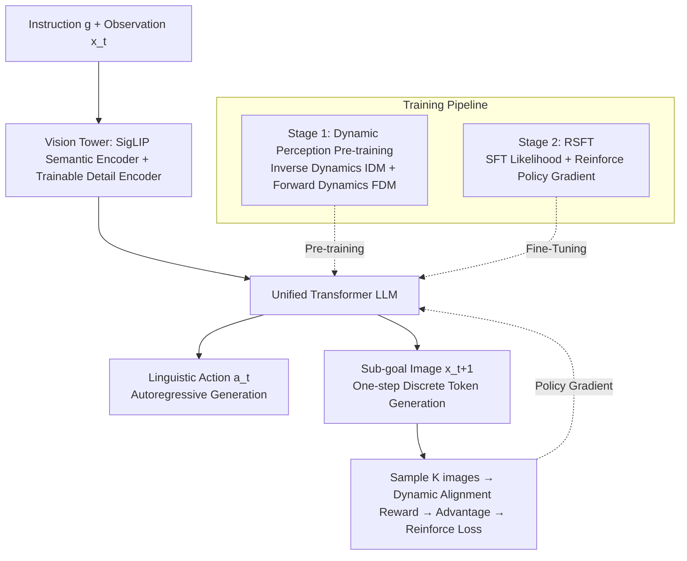

# EVLP: Learning Unified Embodied Vision-Language Planner with Reinforced Supervised Fine-Tuning

**Conference**: ICLR 2026  
**OpenReview**: [https://openreview.net/forum?id=eJcCW9oNfH](https://openreview.net/forum?id=eJcCW9oNfH)  
**Code**: TBD  
**Area**: Embodied AI / Robotic Long-horizon Manipulation Planning  
**Keywords**: Embodied Planning, Unified Multimodal Generation, Vision-Language Planning, Reinforced Supervised Fine-Tuning, World Model  

## TL;DR
EVLP utilizes a unified multimodal generation framework to simultaneously model linguistic reasoning and visual imagination. Coupled with "Bidirectional Dynamic Perception Pre-training" and "Reinforced Supervised Fine-Tuning (RSFT)", the model generates the next linguistic action and sub-goal image from high-level instructions in one step, significantly outperforming various language, visual, and multimodal planning baselines in long-horizon manipulation tasks.

## Background & Motivation
**Background**: Task decomposition for robotic long-horizon manipulation currently follows two main paradigms: Language Planning decomposes a goal into atomic action sequences (e.g., "tidy the room" $\to$ "pick up clothes $\to$ put in closet"), answering "What to do"; Visual Planning generates intermediate goal images (e.g., an image of "clothes in the closet"), answering "How to do". Recent multimodal planning (e.g., PERIA) attempts to output both to bridge the gap between "process execution" and "goal achievement."

**Limitations of Prior Work**: Existing multimodal planning methods lack a unified generation framework. They typically use an LLM for language planning and an external Diffusion model for visual rendering, leading to inconsistencies between modalities. Specifically, applying a unified multimodal architecture to embodied planning faces three hurdles: (1) Standard multimodal models focus on vision-language matching (e.g., identifying "a cup on the table") but fail to capture precise spatial coordinates required for grasping/moving; (2) Traditional tasks are based on static understanding and lack a temporal dimension to reason about state transitions (e.g., how "pouring" changes the scene from "upright cup" to "tilted cup"); (3) Conventional Maximum Likelihood Estimation (MLE) treats all visual details equally, whereas manipulation tasks prioritize functional consistency (e.g., the clothes are inside the closet) over visual perfection (e.g., the specific folds or shadows of the clothes).

**Key Challenge**: Unified multimodal generation models (within a single Transformer) have shown cross-modal synergy, but **directly applying them to embodied planning results in a "triple misalignment" of spatial perception, temporal dynamics, and optimization targets.** Specifically, they lack spatial localization at the perception level, state transition modeling at the task level, and carry excessive constraints on task-irrelevant details during optimization.

**Goal**: Build a long-horizon manipulation planner that seamlessly unifies linguistic reasoning and visual imagination within a single multimodal architecture, ensuring linguistic actions and sub-goal images are generated collaboratively within the same distribution.

**Core Idea**: **Unified Generation + Dynamic Pre-training + Reinforced Alignment**. A unified architecture is built using a "Dual-Tower Vision Module (SigLIP semantics + trainable detail compensator) + One-step Discrete Image Generation." Temporal dynamic understanding is injected via "Forward/Inverse Dynamics Prediction" pre-training. Finally, RSFT employs policy gradients under MLE constraints to specifically reinforce the spatial-logical consistency between linguistic actions and generated images.

## Method

### Overall Architecture
EVLP processes step-by-step linguistic instructions and visual sub-goal images within a single Transformer. It consists of three layers: (1) **Unified Multimodal Generation Model**—A vision tower (with decoupled understanding and generation) connected to a pre-trained LLM, utilizing "one-step" image generation; (2) **Dynamic Perception Pre-training**—Reinforcing cross-modal associations in a unified feature space via Inverse Dynamics (predicting action from two frames) and Forward Dynamics (predicting the next frame from an action); (3) **Reinforced Supervised Fine-Tuning (RSFT)**—SFT jointly supervises action and image token distributions, while policy gradients reinforce spatial consistency.

### Key Designs

**1. Dual-Tower Vision Module + One-Step Discrete Image Generation: Bridging spatial perception and bypassing multi-step sampling bottlenecks.** For understanding, a frozen SigLIP extracts high-level semantics, while a parallel low-level vision encoder (Spatial Detail Compensator, updated during training) is pre-trained with image reconstruction loss to capture missing spatial details. These signals are fed to the LLM via an adapter, addressing the "spatial localization" pain point. For generation, a lookup-free quantizer is trained within the Open-MAGVIT2 framework (codebook size $K=262{,}144$), encoding $256{\times}256$ images into $16{\times}16$ discrete tokens. Crucially, while Diffusion models typically model $x_{0:N}^{t-1}\sim p(\cdot|c,x_{0:N}^{t})$, EVLP introduces learnable image tokens as input, allowing the LLM to **directly model** $x_{0:N}\sim p(\cdot|c)$. This enables sampling $n$ independent samples in a single forward pass, eliminating the computational explosion associated with autoregressive or Diffusion sampling and enabling efficient RL.

**2. Bidirectional Dynamic Perception Pre-training: Embedding "Temporal State Transitions" into the unified feature space.** The dataset consists of transition triplets $T=\{x_t, a_t, x_{t+1}\}$. The **Inverse Dynamics Task (IDM)** predicts "what action occurred" between two frames, optimizing $L_{\text{IDM}}=-\mathbb{E}\big[\frac{1}{L}\sum_{i=1}^{L}\log P(a_t^{(i)}\mid a_t^{(<i)},x_t,x_{t+1};\theta)\big]$. The **Forward Dynamics Task (FDM)** predicts "the next frame" given the current frame and action, optimizing $L_{\text{FDM}}=-\mathbb{E}\big[\log P(x_{t+1}^{(0:N)}\mid x_t,a_t;\theta)\big]$. Co-training these tasks provides the foundation for "world model" capabilities and addresses the lack of temporal dimension.

**3. Reinforced Supervised Fine-Tuning (RSFT): Correcting spatial logic via policy gradients under MLE constraints.** Standard SFT jointly supervises actions and images: $L_{\text{SFT}}=-\mathbb{E}\big[\frac{1}{L}\sum_i\log P(a_t^{(i)}\mid a_t^{(<i)},g,x_t;\theta)+\log P(x_{t+1}^{(0:N)}\mid g,x_t,a_{0:L}^t;\theta)\big]$. However, MLE suffers from **perceptual over-constraint** (enforcing alignment on task-irrelevant details like table textures) and **insufficient causal constraint** (failing to model physical dynamics). EVLP leverages its "one-step multi-sample" capability to sample $K$ candidates $x_k\sim P(x_{t+1}^{(0:N)}\mid g,x_t,a_{0:L}^t)$ and uses a dynamic alignment reward $r=R(x)$ to evaluate consistency between generated and ground-truth dynamics. After batch normalization to obtain advantages, the reinforcement loss is defined as $L_{\text{RL}}=-\mathbb{E}\big[\frac{1}{K}\sum_{k=1}^{K}A_k\cdot\log P(x_{t+1}^k\mid g,x_t,a_{0:L}^t;\theta)\big]$. The final objective is $L=-\mathbb{E}[L_{\text{SFT}}+\lambda\cdot L_{\text{RL}}]$, where SFT ensures global vision-language alignment and RL improves temporal consistency through preference-aware sampling.

## Key Experimental Results

### Main Results: LoHoRavens Success Rate (Mean ± Std over 5 seeds)

| Model | Stacking | Sort | Matching | Shape | Orders | Spell |
|---|---|---|---|---|---|---|
| CLIPort (End-to-End) | 18.4 | 19.2 | 17.8 | 9.8 | 8.1 | 2.3 |
| PAR (Language Plan) | 34.7 | 32.8 | 31.1 | 31.5 | 30.7 | 27.3 |
| EmbodiedGPT (Language Plan) | 48.6 | 49.1 | 43.4 | 40.9 | 48.2 | 52.7 |
| SuSIE (Visual Plan) | 34.1 | 32.6 | 33.2 | 37.8 | 35.2 | 34.1 |
| CoTDiffusion (Visual Plan) | 47.9 | 44.3 | 56.6 | 46.1 | 53.9 | 44.8 |
| PERIA (Multimodal Plan) | 63.9 | 65.0 | 72.3 | 60.6 | 65.2 | 71.1 |
| **EVLP (Ours)** | **79.4** | **77.3** | **82.5** | **75.3** | **78.2** | **81.8** |

EVLP achieves SOTA performance across all tasks, typically leading the strongest baseline, PERIA, by 10-16 percentage points. End-to-end CLIPort performs worst due to a lack of intermediate guidance.

### Ablation Study (Meeting Preparation performance, Table 2)

| Variant | SR↑ | LA↑ | LPIPS↓ | SSIM↑ |
|---|---|---|---|---|
| A. EVLP (Full) | 67.6 | 87.0 | 0.051 | 0.95 |
| B. w/o En (No Spatial Encoder) | 56.5 | 82.9 | 0.092 | 0.92 |
| C. w/o Se (No SigLIP) | 50.1 | 73.9 | 0.116 | 0.89 |
| D. w/o IDM (No Inverse Dynamics) | 63.9 | 83.6 | 0.052 | 0.95 |
| E. w/o FDM (No Forward Dynamics) | 26.8 | 72.1 | 0.192 | 0.84 |
| F. w/o RL (SFT Only) | 62.2 | 87.4 | 0.054 | 0.95 |
| G. RL only (Collapse) | 0.0 | 14.0 | 0.712 | 0.29 |

### Key Findings
- **Dual Towers are Essential**: Removing the spatial encoder significantly degrades image quality, while removing SigLIP causes language planning to collapse (as the spatial encoder lacks semantic depth).
- **FDM is the Lifeblood**: Without FDM, SR drops from 67.6 to 26.8. Pre-training both directions is critical for modal alignment.
- **One-Step > Autoregressive**: The AR variant shows much lower fidelity and more hallucinations due to unnatural causal priors and error accumulation.
- **RSFT Requires SFT Foundation**: RL only (G) leads to total collapse. RSFT provides sharper details and better dynamic consistency than pure SFT.

## Highlights & Insights
- **Sampling efficiency as an RL enabler**: Directly modeling $p(\cdot|c)$ for multi-sample sampling in one forward pass eliminates the multi-step bottleneck of Diffusion/AR models, allowing advantage-weighted policy gradients at virtually zero extra cost.
- **RSFT as a reconciliation of SFT and RL**: SFT constrains the distribution but is "preference-blind"; RL understands preferences but is prone to drift. RSFT combines them to achieve stable preference alignment.
- **Reward focused on "Functional Consistency"**: By rewarding the consistency of dynamics rather than pixel-perfect reconstruction, the model focuses on task-relevant visual semantics.

## Limitations & Future Work
- The specific definition of the reward $R(\cdot)$ is relegated to the appendix; the robustness and transferability of reward design require further validation.
- Evaluation is primarily focused on LoHoRavens and simulation-based Meeting Preparation; large-scale real-world closed-loop execution is needed.
- Low-level execution is handled by an independent policy; error coupling between the planner and the policy remains a potential bottleneck.

## Related Work & Insights
- **Language Planning** (SayCan/PAR/EmbodiedGPT) answers What, **Visual Planning** (SuSIE/CoTDiffusion) answers How. EVLP unifies both within a single generative framework.
- **Unified Multimodal Generation** (SEED, Chameleon, Open-MAGVIT2) provides the foundation for joint text-image Transformers; EVLP transfers this to "Embodied Planning."
- **Insight**: "One-step multi-sample generation" is an undervalued lever when embedding RL into unified models, as it allows for low-cost reinforcement signals.

## Rating
- **Novelty**: ⭐⭐⭐⭐ Combines unified generation, bidirectional dynamics, and RSFT into a closed loop. "One-step RL" and "RSFT reconciliation" are creative framings.
- **Experimental Thoroughness**: ⭐⭐⭐⭐ Comprehensive comparison across four planning paradigms and six baselines, with clear ablation conclusions. Lacks extensive real-robot validation.
- **Writing Quality**: ⭐⭐⭐⭐ Clear correspondence between problems and designs. Good visualization of SFT/RL/RSFT states.
- **Value**: ⭐⭐⭐⭐ Provides a robust template for unified multimodal embodied planners. RSFT + one-step sampling is a highly transferable paradigm for modern RL-based generation.

<!-- RELATED:START -->

## Related Papers

- [\[ICLR 2026\] Actions as Language: Fine-Tuning VLMs into VLAs Without Catastrophic Forgetting](actions_as_language_fine-tuning_vlms_into_vlas_without_catastrophic_forgetting.md)
- [\[ICLR 2026\] UniVLA: Unified Vision-Language-Action Model](unified_vision-language-action_model.md)
- [\[ICLR 2026\] Embodied-R1: Reinforced Embodied Reasoning for General Robotic Manipulation](embodied-r1_reinforced_embodied_reasoning_for_general_robotic_manipulation.md)
- [\[ICLR 2026\] Vision-Language-Action Instruction Tuning: From Understanding to Manipulation](vision-language-action_instruction_tuning_from_understanding_to_manipulation.md)
- [\[ICLR 2026\] MomaGraph: State-Aware Unified Scene Graphs with Vision-Language Models for Embodied Task Planning](momagraph_state-aware_unified_scene_graphs_with_vision-language_models_for_embod.md)

<!-- RELATED:END -->
