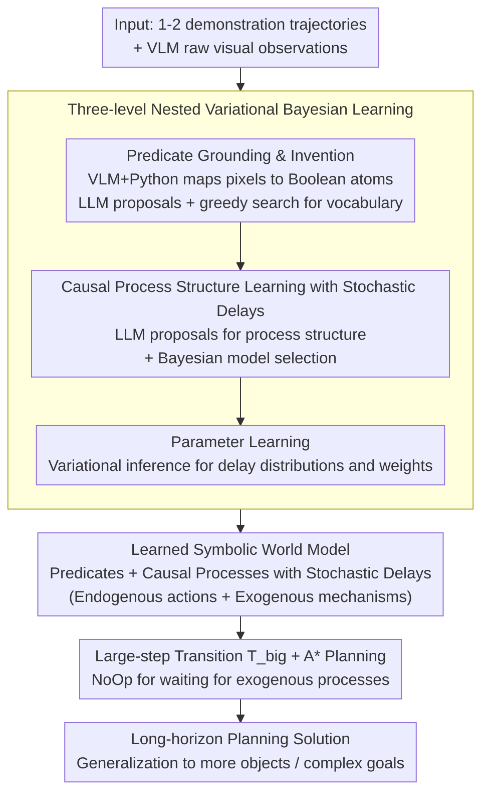

# ExoPredicator: Learning Abstract Models of Dynamic Worlds for Robot Planning

**Conference**: ICLR 2026  
**arXiv**: [2509.26255](https://arxiv.org/abs/2509.26255)  
**Code**: None  
**Area**: Robot Planning / World Models  
**Keywords**: Abstract World Models, Exogenous Causal Processes, Temporal Planning, Predicate Invention, Variational Inference, LLM-guided  

## TL;DR
The ExoPredicator framework is proposed to jointly learn symbolic state abstractions and causal processes (comprising endogenous actions and exogenous mechanisms). By combining Variational Bayesian Inference with LLM proposals, it learns causal world models with stochastic delays from a minimal number of trajectories, enabling rapid generalized planning across five tabletop robotic environments.

## Background & Motivation

### Limitations of Prior Work

1. In long-horizon embodied planning, the world changes not only due to agent actions but also via **exogenous processes** (e.g., water heating, domino cascades) that occur concurrently with agent movements.
2. Existing abstract world models (e.g., STRIPS) assume actions are instantaneous and cannot model delayed effects or autonomous exogenous processes.
3. Classical PDDL does not directly support exogenous processes (requiring PDDL+ extensions), and temporal discretization leads to combinatorial explosion.
4. VLM/VLA models lack compositional world models, making it difficult to generalize to novel tasks.
5. **Core Problem**: How to learn a world model that abstracts both the state space and the temporal progression of causal processes?

## Method

### Overall Architecture

ExoPredicator learns a dynamic world by decomposing it into two layers: the lower layer uses VLM-grounded symbolic predicates to compress continuous observations into a set of Boolean atoms (e.g., `IsHot(kettle)`), while the upper layer uses a set of **causal processes** to describe how these atoms change over time—including active endogenous actions triggered by the agent and autonomous exogenous mechanisms that unfold when conditions are met. Each process effect includes a stochastic delay. Given 1-2 demonstration trajectories, the framework learns this model through a three-level nested loop: the outer loop uses LLM proposals and greedy search to invent the predicate vocabulary; the middle loop uses LLM proposals and Bayesian model selection to search for process structures; the inner loop utilizes variational inference to fit delay distributions and weights. Finally, the learned symbolic world model is utilized by an A* planner equipped with large-step transitions and fast-forward heuristics to solve long-horizon tasks requiring waiting for exogenous processes.

### Key Designs

**1. Predicate Grounding & Invention: Compressing the Pixel World into a Compositional Symbolic Space**

Planning directly on raw observations suffers from the curse of dimensionality. Each predicate is implemented as a Python function coupled with a VLM query, mapping the current observation to a set of Boolean grounded atoms (e.g., `IsHot(kettle)`, `NOT-IsImmovable`). The vocabulary is not manually designed; instead, the LLM proposes a large number of candidate predicates, leveraging its visual common sense to name physical concepts. The outer search (see Design 3) then selects the specific predicates necessary to explain the trajectories. This approach preserves the compositionality of symbolic spaces for generalization while avoiding tedious manual definition.

**2. Causal Processes with Stochastic Delays: Unified Characterization of Actions and Exogenous Mechanisms**

Classical STRIPS / PDDL treat actions as instantaneous, failing to represent temporal phenomena such as "heating takes time" or "dominoes fall sequentially." This work unifies all world changes into causal processes $L = \langle \text{Par}, C, O, E, W, p^{\text{delay}} \rangle$, where $C$ is the trigger condition, $E$ is the effect, $W$ is the weight, and crucially, each process carries a stochastic delay distribution $p^{\text{delay}}$. Once conditions are met, the effect does not trigger immediately but takes effect after a number of steps sampled from $p^{\text{delay}}$. Endogenous processes are bound to executable skills (e.g., Pick/Place/SwitchBurnerOn) triggered by the agent, while exogenous processes (kettle filling, domino cascading, fan blowing a ball) proceed autonomously. During planning, a NoOp action allows the agent to wait until the abstract state changes, extending instantaneous operators into a world model capable of expressing concurrent delayed dynamics.

**3. Three-Level Nested Variational Bayesian Learning: Learning Predicates, Structures, and Delays from 1-2 Demos**

Simultaneously learning predicates, process structures, and delay parameters expands the hypothesis space to a magnitude of $2^{50}$. Thus, learning is organized into three nested loops. The outer loop handles predicate invention (LLM proposals + greedy local search to maximize data likelihood with a parsimonious model prior). The middle loop handles process structure learning (LLM proposals + Bayesian model selection scoring). The inner loop performs parameter learning. A challenge in the inner loop is that the true arrival time of causal effects is unobserved. A variational distribution $q$ is introduced to approximate arrival times, transforming the combinatorial explosion of "summing over all possible timings" into an Evidence Lower Bound (ELBO) optimizable by Adam. This ELBO decomposes into the delay model, abstract dynamics, and entropy regularization. The LLM constrains the search to reasonable candidates while Bayesian scoring makes reliable selections, enabling model learning from extremely sparse data.

**4. Large-Step Transitions and A* Planning: Skipping Irrelevant Timesteps for Long-Horizon Search**

Exogenous processes often persist for multiple steps while the abstract state remains unchanged; step-by-step forward search would waste computation on redundant timesteps. The framework defines a large-step transition function $\mathcal{T}_{\text{big}}$ that skips the entire duration where abstract atoms do not change, branching only at actual state transitions. This compresses the planning graph to key decision points. A* search, guided by a modified fast-forward heuristic, allows the learned delayed world model to support long-horizon task planning involving wait times.

## Main Results

### 5 PyBullet Environments

| Environment | Description | Exogenous Process |
|------|------|---------|
| Coffee | Coffee machine produces coffee → Pour into cup | Coffee production, Pouring |
| Grow | Watering flowers (color matching) | Plant growth |
| Boil | Fill water + Boil (avoid overflow) | Filling, Heating, Overflowing |
| Domino | Push dominoes to cascade | Inter-domino collisions |
| Fan | Blow ball to target with fan | Wind blowing ball |

### Main Results (Success Rate)

| Method | Coffee | Grow | Boil | Domino | Fan |
|------|--------|------|------|--------|-----|
| Manual | ~100% | ~70% | ~85% | ~80% | ~100% |
| **Ours** | ~100% | ~85% | ~80% | ~90% | ~100% |
| ViLa-fs | ~80% | ~30% | ~30% | ~10% | ~20% |
| MAPLE | ~20% | ~10% | ~5% | ~5% | ~5% |
| VisPred | ~60% | ~20% | ~20% | ~15% | ~30% |

- ExoPredicator consistently outperforms VLM planning, HRL, and STRIPS learning baselines across all domains.
- Convergence is achieved with only 1-2 demonstrations and at most 3 rounds of online learning.
- In Grow and Domino, it even outperforms the human-designed Manual baseline (attributed to variational inference learning superior delay parameters).

### Ablation Study
- No LLM: Search space reaches $2^{50}$, rendering search infeasible.
- No Bayes: Relies entirely on LLM priors, which are unreliable.
- Manual-d (Manual abstraction without delay tuning): Near-zero performance, highlighting the criticality of delay parameter learning.

## Highlights & Insights
- First framework to jointly learn symbolic state abstractions and exogenous causal processes with stochastic delays.
- Elegant use of variational inference to handle the combinatorial explosion of timing for causal effects.
- The search strategy combining LLM proposals with Bayesian scoring balances efficiency and reliability.
- Learns generalizable world models from minimal data (1-2 demos) that scale to more objects and complex goals.

## Limitations & Future Work
- Validated only in PyBullet tabletop environments; not yet extended to large-scale or high-noise scenarios.
- Incomplete learning of exogenous process conditions (e.g., disjunctive conditions for overflow in Boil).
- Relies on predefined closed-loop skills (Pick/Place, etc.) rather than learning the skills themselves.
- Predicate proposals depend on LLM quality and may fail for rare physical phenomena.

## Related Work & Insights
- **PDDL/PDDL+**: Traditionally requires manual engineering of temporal planning domains; this work automates the learning.
- **HRL (MAPLE)**: Does not explicitly model exogenous dynamics, leading to exploration difficulties.
- **VLM Planning (ViLA)**: Lacks a world model, resulting in poor compositional generalization.
- **VisualPredicator**: STRIPS-style operator learning that does not model delays or exogenous processes.
- **Causal RL**: Focuses on causal graphs at the feature level; does not address symbolic abstraction or temporal processes.

## Rating
- Novelty: ⭐⭐⭐⭐⭐
- Experimental Thoroughness: ⭐⭐⭐⭐
- Writing Quality: ⭐⭐⭐⭐⭐
- Value: ⭐⭐⭐⭐⭐

<!-- RELATED:START -->

## Related Papers

- [\[ICLR 2026\] SLAP: Shortcut Learning for Abstract Planning](slap_shortcut_learning_for_abstract_planning.md)
- [\[ICLR 2026\] VER: Vision Expert Transformer for Robot Learning via Foundation Distillation and Dynamic Routing](ver_vision_expert_transformer_for_robot_learning_via_foundation_distillation_and.md)
- [\[ICLR 2026\] AnyTouch 2: General Optical Tactile Representation Learning For Dynamic Tactile Perception](anytouch_2_general_optical_tactile_representation_learning_for_dynamic_tactile_p.md)
- [\[ICLR 2026\] Empowering Multi-Robot Cooperation via Sequential World Models](empowering_multi-robot_cooperation_via_sequential_world_models.md)
- [\[ICLR 2026\] RoboPARA: Dual-Arm Robot Planning with Parallel Allocation and Recomposition Across Tasks](robopara_dual-arm_robot_planning_with_parallel_allocation_and_recomposition_acro.md)

<!-- RELATED:END -->
