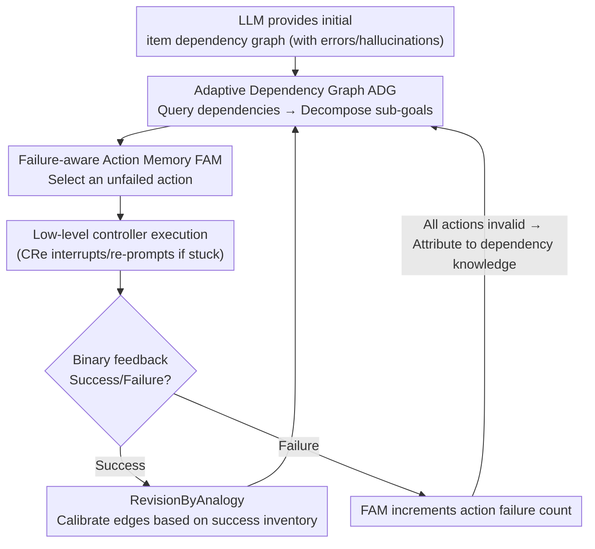

# Experience-based Knowledge Correction for Robust Planning in Minecraft

**Conference**: ICLR 2026  
**arXiv**: [2505.24157](https://arxiv.org/abs/2505.24157)  
**Code**: None  
**Area**: Robotics  
**Keywords**: LLM planning, knowledge correction, Minecraft, embodied agent, self-correction failure

## TL;DR
The study demonstrates that LLMs cannot self-correct erroneous planning priors (item dependencies) through prompting alone. It proposes XENON—an algorithmic knowledge management system (Adaptive Dependency Graph ADG + Failure-aware Action Memory FAM) that learns from binary feedback, enabling a 7B LLM to outperform SOTA methods using GPT-4V + oracle knowledge in long-term Minecraft planning.

## Background & Motivation
**Background**: LLM-driven agents require accurate item dependency knowledge (e.g., a diamond pickaxe requires diamonds + sticks) for long-term planning tasks like those in Minecraft, but the parametric knowledge of LLMs often contains errors.

**Limitations of Prior Work**: Self-correction—using prompts to let LLMs reflect and revise knowledge—is ineffective for parametric knowledge errors. LLMs repeatedly make the same mistakes because the errors are encoded in the weights and cannot be changed by prompts.

**Key Challenge**: LLMs possess strong language understanding but unreliable factual knowledge; external mechanisms, rather than prompting, are needed to correct knowledge.

**Goal**: How to algorithmically correct the planning knowledge of an LLM using only binary feedback (success/failure)?

**Key Insight**: Shift knowledge correction from "letting the LLM fix itself" to "modifying an external knowledge base using algorithms."

**Core Idea**: Algorithmic knowledge management (revising dependency graphs with successful experiences + filtering invalid actions with failed experiences) is superior to LLM self-correction.

## Method

### Overall Architecture
XENON addresses a previously overlooked issue: LLM planning failures often result not from a lack of "reasoning" but from misremembered facts (e.g., believing an item requires a non-existent material), which cannot be fixed via prompt-based reflection. XENON moves knowledge from LLM weights to an external, algorithmically rewritable structure and updates it using success/failure signals from the agent's trials in Minecraft. It splits planning knowledge into two external modules: the **Adaptive Dependency Graph (ADG)** for item dependencies ("what requires what") and the **Failure-aware Action Memory (FAM)** for action knowledge ("which action actually obtains the item").

The planning cycle proceeds as follows: the LLM provides an initial item dependency graph for cold-start $\to$ the agent reads the ADG to decompose the current sub-goal and reads the FAM to select an action not yet deemed "failed" $\to$ the low-level controller executes the action, and the environment returns a binary success/failure signal. The two knowledge modules are updated separately: upon success, the ADG uses *RevisionByAnalogy* to calibrate dependency edges; upon failure, the FAM increments the failure count for that action. A critical link is that FAM acts as an "attributor"—when all actions for an item are deemed invalid by FAM, it indicates the problem lies in dependency knowledge rather than actions, **triggering the ADG to perform a correction** for that item. The LLM remains responsible only for high-level language planning, while factual accuracy is calibrated by these modules through an experience-driven closed loop. An auxiliary mechanism, **Context-aware Re-prompting (CRe)**, handles execution gaps where "knowledge is correct but the controller is stuck," which is enabled specifically for long-term planning in MineRL.

### Key Designs

**1. Adaptive Dependency Graph ADG: Correcting misinterpreted item dependencies with success experience**

LLMs often misremember or hallucinate Minecraft item dependencies. Once these errors enter the planning premises, the task stalls. ADG stores dependencies in an external directed graph and uses the *RevisionByAnalogy* algorithm while maintaining a revision count $C(v)$ for each item $v$. When an item's dependencies need correction, its current requirement set is cleared, and two cases are handled based on whether $C(v)$ exceeds a threshold $c_0$: if $C(v) \le c_0$ (Case 2), requirements are "borrowed" from similar items successfully obtained previously—the actual inventory combination is the truth, and old contradictory edges are rewritten; if $C(v) > c_0$ (Case 1), the item is deemed a likely hallucinated unreachable item, and dependencies from its descendants are recursively deleted, forcing the agent to find alternative paths. This handles hallucinated items naturally: non-existent items never appear in any successful inventory and are eventually pruned. Through this "trial-and-correction" approach, the EGA accuracy of the dependency graph can reach approximately 0.90 after 400 rounds in Mineflayer.

**2. Failure-aware Action Memory FAM: Filtering actions and attributing failure sources**

The environment only provides success/failure signals without detailed explanations. FAM maintains success/failure counts for every action under each item. Once a threshold is crossed, an action is labeled "experimentally valid" or "experimentally invalid"—invalid actions are filtered out in subsequent planning. Crucially, FAM performs **failure attribution**: when all potential actions for an item are deemed invalid, it concludes that the root cause is "wrong dependency knowledge" rather than "wrong action selection." This triggers the ADG's *RevisionByAnalogy* and resets the FAM history for that item to allow re-exploration under the corrected dependencies. While ADG fixes "goal-material" knowledge, FAM fixes "action-effect" reliability.

**3. Context-aware Re-prompting CRe: Rescuing the low-level controller when stuck**

XENON relies on imperfect low-level controllers like STEVE-1, which often get stuck (e.g., getting trapped in deep water) where actions are issued but the state remains unchanged. CRe allows the LLM to analyze current visual observations and the sub-goal to decide whether to replace the sub-goal with a temporary one (e.g., "leave the water"). Adapted from Optimus-1 and optimized for small models, it uses a two-stage reasoning process: generating a text description of the observation followed by text-based decision-making. This bridges the gap between planning and control.

## Key Experimental Results

### Main Results (Learning Knowledge vs. Oracle)

| Target Type | Oracle Knowledge SR | Learned Knowledge SR |
|-------------|---------------------|----------------------|
| Gold items  | 0.83                | 0.74                 |
| Diamond items| 0.82               | 0.64                 |
| Redstone items| 0.75              | 0.28                 |
| Overall     | 0.80                | 0.54                 |

### Dependency Learning Accuracy (EGA)

| Platform    | After 400 Rounds |
|-------------|------------------|
| MineRL      | ~0.60            |
| Mineflayer  | ~0.90            |

### Model Comparison
- 7B Qwen2.5-VL + XENON > Optimus-1 (GPT-4V + oracle) across multiple target categories.

### Key Findings
- Accurate dependency knowledge is critical for successful planning—Redstone success drops significantly due to controller limitations despite oracle knowledge reaching 0.75 SR.
- XENON is robust against hallucinated items generated by LLMs by identifying and removing them via *RevisionByAnalogy*.
- LLM self-correction (via prompting) failed across all baselines—it cannot correct parametric knowledge errors.

## Highlights & Insights
- **Empirical proof that "LLMs cannot self-correct parametric knowledge"**: This finding is a major takeaway for LLM Agent design—one should not rely on prompt-based self-correction for factual errors.
- **Algorithm > Prompting Paradigm**: When the essence of the problem is a knowledge error rather than a reasoning error, algorithmic correction (external memory + statistical updates) is far superior to natural language reflection.
- **Small Model + Good Knowledge Management > Large Model + Poor Knowledge**: A 7B model with XENON beating GPT-4V with oracle knowledge proves that knowledge management strategies are more important than model scale.

## Limitations & Future Work
- Performance is bottlenecked by low-level controller capabilities—STEVE-1 cannot execute certain complex actions, leading to failures in the Redstone category.
- *RevisionByAnalogy* has multiple hyperparameters requiring tuning.
- Validation is primarily in Minecraft (preliminary household tasks in the appendix).
- Assumes dependencies form a DAG (no cycles).

## Related Work & Insights
- **vs. Optimus-1**: While Optimus-1 uses GPT-4V + oracle dependencies, XENON outperforms it in several categories using a 7B model + learned dependencies.
- **vs. Voyager/DEPS**: These are Minecraft agents using LLM prompting but do not address the correction of knowledge errors.

## Rating
- Novelty: ⭐⭐⭐⭐ The "algorithm replacing self-correction" concept is novel and powerful.
- Experimental Thoroughness: ⭐⭐⭐⭐ Multiple platforms × Multiple target types × Detailed ablations.
- Writing Quality: ⭐⭐⭐⭐ Clear problem definition.
- Value: ⭐⭐⭐⭐ Significant paradigm shift for LLM Agent knowledge management.

<!-- RELATED:START -->

## Related Papers

- [\[ICLR 2026\] ReCAPA: Hierarchical Predictive Correction to Mitigate Cascading Failures](recapa_hierarchical_predictive_correction_to_mitigate_cascading_failures.md)
- [\[ICML 2026\] R2R2: Robust Representation for Intensive Experience Reuse via Redundancy Reduction in Self-Predictive Learning](../../ICML2026/robotics/r2r2_robust_representation_for_intensive_experience_reuse_via_redundancy_reducti.md)
- [\[ICLR 2026\] Scaling up Memory for Robotic Control via Experience Retrieval](scaling_up_memory_for_robotic_control_via_experience_retrieval.md)
- [\[ICCV 2025\] Interaction-Merged Motion Planning: Effectively Leveraging Diverse Motion Datasets for Robust Planning](../../ICCV2025/robotics/interaction-merged_motion_planning_effectively_leveraging_diverse_motion_dataset.md)
- [\[ICLR 2026\] RoboPARA: Dual-Arm Robot Planning with Parallel Allocation and Recomposition Across Tasks](robopara_dual-arm_robot_planning_with_parallel_allocation_and_recomposition_acro.md)

<!-- RELATED:END -->
