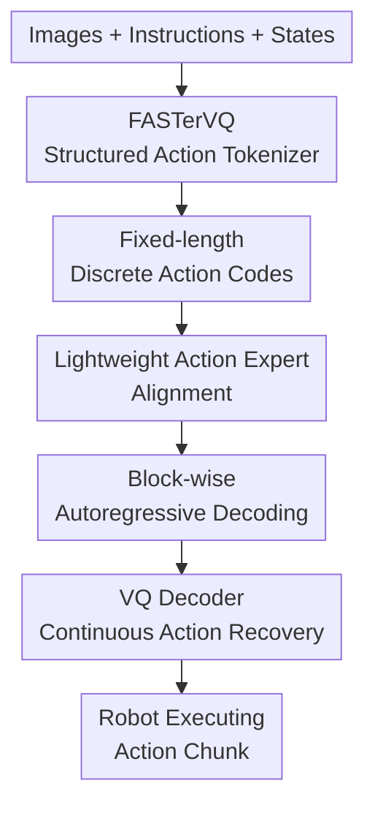

# FASTer: Toward Powerful and Efficient Autoregressive Vision-Language-Action Models with Learnable Action Tokenizer and Block-wise Decoding

**Conference**: ICLR2026  
**OpenReview**: [https://openreview.net/forum?id=k6nTUFoqeT](https://openreview.net/forum?id=k6nTUFoqeT)  
**Code**: Not yet released  
**Area**: Robotics / Embodied AI / Efficient VLA  
**Keywords**: Vision-Language-Action models, action tokenizer, Residual Vector Quantization, block-wise decoding, robot generalization  

## TL;DR
FASTer compresses continuous robot actions into structured discrete action codes and utilizes block-wise autoregressive VLA to generate action tokens in blocks. This approach significantly reduces autoregressive inference latency while maintaining high control precision, outperforming existing VLA baselines across various simulated and real-world robot platforms.

## Background & Motivation
**Background**: VLA models are transferring pre-trained vision-language models to robot control, where inputs typically consist of multi-view images, language instructions, and proprioceptive states, and outputs are continuous action sequences. Current mainstream approaches are divided into two categories: continuous action generation via diffusion/flow matching, and discrete action prediction via autoregressive Transformers. The latter aligns better with VLM/LLM modeling paradigms, making it easier to inherit language understanding, visual grounding, and common-sense transfer capabilities.

**Limitations of Prior Work**: The bottleneck of autoregressive VLA lies in action tokenization. Tokenizing each action dimension individually results in long sequences, requiring multiple model forward passes for inference. Conversely, excessive compression leads to reconstruction errors that act as faulty supervision, causing the policy to learn biased actions. Methods like FAST/FAST+ have proven the importance of action tokens for VLA, but a significant trade-off remains between token length, reconstruction quality, codebook utilization, and cross-embodiment generalization.

**Key Challenge**: Robot actions are not standard text sequences. they possess both temporal and action dimensions: temporally adjacent actions are smooth and redundant, while the action dimensions correspond to different physical meanings like position, orientation, gripper, base, and torso, which have vastly different distributions. Direct flattening wastes tokens, while crude compression destroys control precision; meanwhile, every additional token in an autoregressive model increases the generation burden.

**Goal**: This work aims to solve three sub-problems simultaneously: first, learning a highly compressed yet nearly lossless action tokenizer; second, ensuring the tokenizer is reusable across single-arm, dual-arm, whole-body control, and different action representations; third, enabling the autoregressive VLA to generate local blocks in parallel rather than token-by-token while maintaining action structure.

**Key Insight**: The authors treat robot action chunks as continuous time-series signals and draw inspiration from Residual Vector Quantization (RVQ) used in audio codecs, while leveraging physical grouping of action dimensions. A key observation is that early residual codebooks capture coarse-grained, low-frequency action trends, while subsequent codebooks fill in high-frequency details. This coarse-to-fine structure naturally fits stable generation for downstream autoregressive VLAs.

**Core Idea**: Replace manual or weakly compressed action tokens with a learnable structured RVQ action tokenizer and use block-wise autoregressive decoding to reduce generation steps, achieving shorter tokens, more accurate actions, and faster inference.

## Method

### Overall Architecture
FASTer consists of two parts: FASTerVQ and FASTerVLA. FASTerVQ first patchifies a continuous action chunk of length $H$ according to time and physical action dimensions, encoding them into discrete code tensors of fixed shape. FASTerVLA then uses images, language, and proprioceptive states as conditions, employing a lightweight action expert and a block-wise autoregressive strategy to generate these codes, which are finally restored to continuous actions by the VQ decoder.

The focus is not merely on shortening sequences, but on aligning "action compression" and "action generation" structures: the codes output by the tokenizer inherently follow a 3D layout of codebook, temporal horizon, and action dimension. The decoding order and block partitioning of the VLA follow this layout, ensuring the model sees a predictable action structure rather than arbitrary tokens.

### Key Designs
**1. Structured Action Patchifier: Physical Semantics Before Compression**

FASTerVQ does not simply flatten the action sequence. It first segments it into 2D blocks: temporally into $m$ groups of fixed length $h$, and action-wise into non-uniform groups based on physical meanings (e.g., end-effector position, rotation, gripper, base, torso). The resulting patches cover a short time window and a group of related physical variables before being sent to the encoder.

This design addresses the unbalanced distribution common in robot actions. Gripper states might be binary, the base may be zero in tabletop tasks, while arm positions change continuously. Grouping by physical semantics prevents the tokenizer from being distracted by high-frequency but low-information dimensions, allowing it to exploit temporal redundancy without contaminating the entire action representation.

**2. Transformer Action AutoEncoder + RVQ: Coarse-to-Fine Residual Codebooks**

The backbone of FASTerVQ is a Transformer Action AutoEncoder. The encoder compresses patched actions into a latent $z \in R^{C_h \times C_a}$, followed by $N_c$ layers of residual vector quantization. The $i$-th layer quantizes the current residual $r_i$ by selecting the nearest codebook entry, updating the residual to $r_{i+1}=r_i-Q_i(r_i)$. The final quantized representation is $z_q=\sum_{i=1}^{N_c}Q_i(r_i)$.

This RVQ structure provides specific benefits: the first few codebooks represent low-frequency, global action trends, while subsequent layers only need to compensate for the remaining details. For robot control, this is more stable than single-token discrete selection because a single token error won't necessarily destroy the entire action sequence.

**3. Temporal + DCT Frequency Domain Reconstruction**

During training, FASTerVQ optimizes temporal L1 reconstruction and Discrete Cosine Transform (DCT) frequency domain L1 reconstruction, along with a commitment loss. The objective is summarized as:

$$
L = \|a_{t:t+H}-\hat a_{t:t+H}\|_1 + \|DCT(a_{t:t+H})-DCT(\hat a_{t:t+H})\|_1 + \lambda \|z-sg(z_q)\|_2^2
$$

While temporal L1 ensures step-by-step accuracy, the DCT term constrains the low-frequency trend of the entire trajectory. This combination is better suited for real robot data, where sensor noise or motor jitter exists; the model learns to ignore noise while preserving motion shapes critical for task success.

**4. Block-wise Autoregressive + Action Expert: Reducing Steps Without Losing AR Benefits**

FASTerVLA maintains the standard VLM structure (vision tower for images, text pipeline for instructions, proprioception as tokens) but adds a lightweight action expert. This expert is architecturally aligned with the VLM backbone but has fewer parameters, specializing in action token decoding. This prevents action supervision from interfering with pre-trained language/vision weights.

Inference efficiency comes from block-wise autoregression (BAR). Instead of generating $C=(c_1,\ldots,c_N)$ token-by-token, FASTerVLA partitions action codes into $J$ blocks. Tokens within each block of size $B$ are predicted simultaneously in a single forward pass, with the training objective $p(c_{j,i}\mid C_{<j}, I_t, s_t, x)$. A block-wise causal mask allows intra-block attention, and special `<BoBlk>` / `<EoBlk>` tokens toggle between text and action generation. The decoding order aligns with the RVQ structure, moving from coarse to fine details, reducing theoretical generation steps from $N$ to roughly $N/B$.

### Key Experimental Results

#### Main Results
FASTer was compared against strong VLA baselines on LIBERO and Simpler-Bridge. FASTer achieved a 97.9% average success rate on LIBERO and 87.9% on Simpler-Bridge, outperforming π0 and π0-FAST-D.

| Benchmark | Metric | Ours | Prev. SOTA | Gain |
|------|------|--------|------------|------|
| LIBERO average | Success Rate | 97.9 | OpenVLA-OFT 97.1 | +0.8 |
| LIBERO long | Success Rate | 95.4 | OpenVLA-OFT 94.5 | +0.9 |
| Simpler-Bridge average | Success Rate | 87.9 | π0-FAST-D 76.5 | +11.4 |
| Simpler-Bridge eggplant | Success Rate | 99.2 | π0 88.3 | +10.9 |

In terms of inference efficiency, the advantage of FASTer is pronounced in high-token scenarios. For single-arm LIBERO, total inference is ~112ms, faster than π0 (176ms) and π0-FAST (up to 556ms).

| Environment | Ours | π0 | π0-FAST | Note |
|------|----|----|---------|------|
| LIBERO | 112 ms | 176 ms | 197-556 ms | Single-arm, 20-step chunk |
| R1Lite-WBC | 237 ms | 225 ms | 1100-3000 ms | 21 DoF, Whole-body control |

#### Ablation Study
Ablations show that the TAAE tokenizer, 4096 codebook size, and 3-layer RVQ are optimal. Without the pre-trained action expert, success rates drop significantly. BAR reduces latency from 323ms (token-wise) to 140ms while slightly improving success rates.

| Configuration | Key Metric | Note |
|------|---------|------|
| CNN tokenizer | SR 96.2 / L1 0.0027 | Local modeling only |
| TAAE tokenizer | SR 97.9 / L1 0.0021 | Global and local balance |
| Token-wise AR | SR 95.5 / 323 ms | Standard AR |
| Block-wise | SR 96.7 / 140 ms | Faster and more stable |

#### Key Findings
- The value of FASTerVQ lies in reconstruction quality, not just token count. Valid Reconstruction Rate (VRR) metrics show FASTer outperforms MiniVLA, VQ-VLA, and FAST+.
- Tokenizers exhibit a scaling trend; larger datasets (FASTer-XL) continuously improve VRR and generalize across different action representations (velocity, pos).
- BAR's success depends on the stable structure of action codes. Structured RVQ output allows safe parallel prediction within blocks.

## Highlights & Insights
- FASTer centers the design of the VLA around the quality of the "action tokenizer," reframing a core bottleneck of the field.
- The coarse-to-fine nature of RVQ matches robot control hierarchy: low-frequency trends determine "where to go," while high-frequency residuals handle "how to align."
- DCT frequency domain loss is a practical trick to focus the model on motion shapes rather than sensor noise.
- BAR proves that autoregressive VLAs do not have to be slow if action tokens are properly structured.

## Limitations & Future Work
- FASTerVQ requires diverse robot data for pre-training to achieve high generalization.
- Optimal BAR block sizes may vary across different robot DOFs and control frequencies, requiring further heuristics.
- In high-dimensional whole-body control, the latency gain over π0 is narrower, suggesting the AR bottleneck persists as dimensions grow.
- Future work could explore FASTerVQ as a general-purpose action foundation tokenizer and investigate closed-loop performance in highly dynamic environments.

## Related Work & Insights
- **vs π0**: π0 uses continuous flow matching; FASTer sticks to discrete AR, leveraging VLM architectural patterns while solving speed via the tokenizer and BAR.
- **vs FAST / FAST+**: While FAST uses DCT+BPE, FASTer uses a learnable RVQ codec which achieves better reconstruction and codebook utilization.
- **vs MiniVLA / VQ-VLA**: FASTer overcomes their limitations in reconstruction and OOD generalization through the TAAE architecture and physical grouping.

## Rating
- Novelty: ⭐⭐⭐⭐⭐ (Integrates RVQ and BAR effectively for VLA).
- Experimental Thoroughness: ⭐⭐⭐⭐⭐ (Extensive coverage across simulation and real benchmarks).
- Writing Quality: ⭐⭐⭐⭐ (Clear methodology, though details require appendix cross-referencing).
- Value: ⭐⭐⭐⭐⭐ (Highly relevant for low-latency autoregressive robotics).

<!-- RELATED:START -->

## Related Papers

- [\[CVPR 2026\] MoEActok: A MoE-based Action Tokenizer for Vision-Language-Action Models](../../CVPR2026/robotics/moeactok_a_moe-based_action_tokenizer_for_vision-language-action_models.md)
- [\[ICLR 2026\] Spatially Guided Training for Vision-Language-Action Model](spatially_guided_training_for_vision-language-action_model.md)
- [\[ICLR 2026\] Block-wise Adaptive Caching for Accelerating Diffusion Policy](block-wise_adaptive_caching_for_accelerating_diffusion_policy.md)
- [\[ICLR 2026\] Action-aware Dynamic Pruning for Efficient Vision-Language-Action Manipulation](action-aware_dynamic_pruning_for_efficient_vision-language-action_manipulation.md)
- [\[ICLR 2026\] VLM4VLA: Revisiting Vision-Language-Models in Vision-Language-Action Models](vlm4vla_revisiting_vision-language-models_in_vision-language-action_models.md)

<!-- RELATED:END -->
