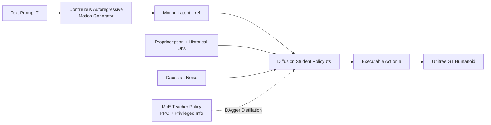

# From Language to Locomotion: Retargeting-free Humanoid Control via Motion Latent Guidance

**Conference**: ICLR 2026  
**OpenReview**: [https://openreview.net/forum?id=k3Cyx3Uets](https://openreview.net/forum?id=k3Cyx3Uets)  
**Code**: Project Page (Mentioned in the paper, no open-source repository provided)  
**Area**: Robotics / Embodied AI (Language-driven humanoid whole-body control)  
**Keywords**: Humanoid Robot, Language-guided Motion, Retargeting-free, Diffusion Policy, Motion Latent, MoE Teacher Policy  

## TL;DR
RoboGhost proposes a **retargeting-free** language-driven humanoid control framework: it allows text-generated "motion latents" to directly serve as conditions for a diffusion policy to denoise executable actions from noise. This bypasses the multi-stage pipeline of "decode motion $\rightarrow$ retarget to robot $\rightarrow$ physical tracking," which is prone to error accumulation and high latency, reducing the time from text to deployment from 17.85s to 5.84s.

## Background & Motivation
**Background**: Commanding humanoid robots using natural language is intuitive—first use a text-to-motion (T2M) model to generate semantically reasonable human motion, then deploy it to a real robot. However, implementation typically follows a hierarchical pipeline: **decoding** human motion from language $\rightarrow$ **retargeting** to the robot morphology $\rightarrow$ **tracking** this trajectory using a physics-based controller.

**Limitations of Prior Work**: This seemingly usable pipeline has systemic flaws. (1) Errors **accumulate** across the three stages of decoding, retargeting, and tracking, eroding both semantic fidelity and physical feasibility; (2) Multiple serial stages introduce **high latency**, making real-time interaction difficult; (3) Language and control are **loosely coupled**—each stage is optimized in isolation rather than end-to-end. Recent improvements (modifying decoders or controllers) are partial fixes, while the entire pipeline remains fragile and inefficient.

**Key Challenge**: To achieve semantic precision, one must explicitly decode motion and perform fine retargeting, but retargeting itself is slow, introduces errors, and is limited by the motion generator's capabilities. To achieve speed and robustness, this "precise" link must be sacrificed.

**Goal**: To find a **more direct path** from language to action, eliminating fragile intermediate steps while maintaining semantic intent and achieving fast, reactive control.

**Core Idea**: **Treat motion latents as "first-class citizen" conditioning signals**—no longer decoding them into explicit motion, but directly using the latents to condition a diffusion humanoid policy, allowing the policy to denoise executable actions from noise. The authors name the framework RoboGhost, emphasizing that these latents are invisible like "ghosts" yet powerfully drive the robot's behavior.

## Method

### Overall Architecture
RoboGhost is a two-stage design. **Stage 1** uses a continuous autoregressive motion generator $G$ to encode text prompts $T$ into compact motion latents $l_{ref}=G(T)$ (note: it is **not decoded into explicit motion** at this point). **Stage 2** involves policy training: first, an MoE teacher policy (oracle) is trained using PPO + privileged information, followed by the distillation of a **diffusion student policy** $\pi_s$. This student policy is conditioned on $l_{ref}$, proprioceptive state, and historical observations to denoise executable actions from Gaussian noise. During deployment, only "Text $\rightarrow$ Latent $\rightarrow$ Diffusion Student Policy $\rightarrow$ Action" is executed, completely avoiding retargeting, privileged information, and explicit reference motions.

### Key Designs

**1. Retargeting-free latent driving**: This is the soul of the paper. Traditional pipelines decode $l_{ref}$ into explicit motion sequences and then retarget them to the robot morphology, losing precision and adding latency at every step. RoboGhost directly feeds $l_{ref}$ along with the proprioceptive state $p_o$ and historical observations $o_{t-H:t}$ to the policy, outputting $a=\epsilon_\theta(\epsilon\mid l_{ref}, p_o, o_{t-H:t})$. This skips error-prone decoding and retargeting and mitigates the issue where "limited motion generator capability leads to poor explicit motion quality"—because the policy does not blindly copy the generator output. Instead, a **trainable latent encoder** "translates" coarse latents into executable, stable commands, producing robust actions even if the latents themselves lack physical realism.

**2. Diffusion student policy denoising actions from noise**: Unlike traditional distillation that uses explicit reference motions, the student policy performs diffusion denoising with motion latents as conditions. Training follows a DAgger-style process—rolling out the student policy in simulation, querying the teacher for the optimal action $\hat{a}_t$, and progressively injecting Gaussian noise into the teacher's actions to form a forward noising Markov process $q(x_t\mid x_{t-1})=\mathcal{N}(x_t;\sqrt{1-\alpha_t}\,x_{t-1}, \alpha_t I)$. For solvability, $x_0$-prediction is used, supervised by an MSE loss $L=\lVert a-\hat{a}_t\rVert_2^2$, where $a=\frac{x_t-\sqrt{1-\bar{\alpha}_t}\,\epsilon_\theta(x_t,t)}{\sqrt{\bar{\alpha}_t}}$. During inference, for smoothness and low latency, DDIM accelerated sampling is used with an MLP-based diffusion model, injecting latent conditions via AdaLN. Diffusion policies naturally capture diverse action distributions, making them more robust to noise perturbations and "imperfect latents" than MLP policies (experiments show they tolerate noise scales up to 0.33, compared to 0.12 for MLP).

**3. MoE teacher policy providing high-generalization supervision signals**: Text is naturally open-ended, making generalization key. The teacher policy first trains an initial policy $\pi_0$ on a high-diversity dataset $D_0$, then evaluates each sequence using a lower-body error metric $e(s)=\alpha\cdot E_{key}(s)+\beta\cdot E_{dof}(s)$, filtering out hard-to-converge samples where $e(s)>0.6$. A general teacher is then trained on the remaining data. The teacher network introduces Mixture-of-Experts: multiple expert networks and a gating network each receive robot state observations and reference motions, with the final action being the weighted sum of expert outputs based on gating probabilities $a=\sum_{i=1}^n p_i\cdot a_i$. MoE enhances the policy's expressiveness and generalization, providing precise supervision for the student policy.

**4. Causal adaptive sampling**: The difficulty of different segments in long-horizon motions is heterogeneous; uniform sampling over-samples simple segments and under-samples difficult ones, leading to high variance and low sample efficiency. The authors divide sequences into $K$ equal-length intervals and attribute "failures" to their **causal predecessors**—assuming failures terminating in interval $k_t$ often originate from errors/collisions in the preceding $s$ steps. An exponential decay kernel $\alpha(u)=\gamma^u$ ($\gamma\in(0,1)$) is used to weight time steps near the termination: $\Delta p_i=\alpha(t-i)\cdot p,\ i\in[t-s,t]$ (0 outside the interval). $p'_i\leftarrow p_i+\Delta p_i$ is updated and normalized, then a multinomial distribution is used to sample the starting interval, followed by uniform selection of a starting frame within the interval. This concentrates training compute on high-difficulty segments, improving sample efficiency and allowing the teacher to master longer, more agile motions.

## Key Experimental Results

### Main Results

Motion Tracking (HumanML / Kungfu subsets of MotionMillion, IsaacGym & MuJoCo, Success Rate as primary metric):

| Method | IsaacGym Succ↑ | Empjpe↓ | Empkpe↓ | MuJoCo Succ↑ | Empjpe↓ |
|------|----------------|---------|---------|--------------|---------|
| Baseline (MLP Teacher-Student) - HumanML | 0.92 | 0.23 | 0.19 | 0.64 | 0.34 |
| Ours-DDPM - HumanML | **0.97** | 0.12 | 0.09 | **0.74** | 0.24 |
| Ours-SiT - HumanML | **0.98** | 0.14 | 0.08 | 0.72 | 0.26 |
| Baseline - Kungfu | 0.66 | 0.43 | 0.37 | 0.51 | 0.58 |
| Ours-DDPM - Kungfu | **0.72** | 0.34 | 0.31 | **0.57** | 0.54 |

Text-to-Motion Generation (HumanML3D): Ours-SiT achieves R@1=0.641, FID=11.743, comparable to or better than strong baselines like MoMask and MotionStreamer.

### Ablation Study

Retargeting-free vs. Explicit Retargeting (Q1, HumanML/Kungfu):

| Method | IsaacGym Succ↑ | Empjpe↓ | MuJoCo Succ↑ | Pipeline Latency (s)↓ |
|------|----------------|---------|--------------|----------------|
| Ours-Explicit (Inc. PHC-1000 Retargeting + Decoding) | 0.93 | 0.21 | 0.66 | 17.85 |
| Ours-Implicit (Ours) | **0.97** | **0.12** | **0.74** | **5.84** |

Diffusion vs. MLP Policy (Q2, generalization to unseen subsets): Diffusion policy Succ=0.68 vs MLP 0.54, Empjpe 0.42 vs 0.48; Diffusion significantly outperforms in generalization and robustness on unseen motions.

Diffusion Backbone (Q3): DiT only showed marginal gains in generation metrics (FID 14.28 vs 11.71, actually worse than MLP), with no tracking success improvement and higher latency (14.28s vs 5.84s). Thus, a 16-layer MLP is the default.

### Key Findings
- **Latent driving is the core source of gain**: Eliminating retargeting compresses the entire process from 17.85s to 5.84s (approx. $3\times$) while actually increasing success rates (0.93 $\rightarrow$ 0.97), proving that retargeting is not only slow but also a bottleneck for precision.
- **Diffusion policy robustness crushes MLP**: At a noise scale of 0.2, the MLP policy maps noise to jittery actions causing the robot to fall, while the diffusion policy maintains stable tracking; the maximum tolerable noise scale is 0.33 (vs. 0.12 for MLP).
- **Real-world verification**: Smooth, semantically aligned execution of highly dynamic motions like backflips, jumps, and dances was achieved on Unitree G1, without manual parameter tuning across IsaacGym $\rightarrow$ MuJoCo $\rightarrow$ Real World.

## Highlights & Insights
- **Paradigm Shift**: Compressing "Semantics $\rightarrow$ Latent $\rightarrow$ Explicit Motion $\rightarrow$ Retargeting $\rightarrow$ Tracking" into "Semantics $\rightarrow$ Latent $\rightarrow$ Direct Action Denoising." This is the first diffusion humanoid policy driven directly by motion latents. Latents serve as conditions rather than intermediate products, preserving semantics while avoiding error accumulation.
- **"Not blindly following the generator" is crucial**: The trainable latent encoder allows the policy to treat imperfect latents as "soft proposals" rather than "hard commands," fundamentally decoupling "motion generation quality" from "control quality." This explains its robustness to unseen subsets.
- **Causal attribution sampling** is clever: Recurrently weighting and re-sampling $s$ steps before a failure is a rational use of sparse failure signals in long-horizon tasks, proving practical for training agile motions.
- **Naturally extendable to multi-modality**: The framework is agnostic to the source of conditions; beyond text, it could incorporate images, audio, or music, providing a reference architecture for Vision-Language-Action (VLA) humanoid systems.

## Limitations & Future Work
- **Still relies on retargeting datasets for teacher training**: Stage 2 teacher policy training uses retargeted datasets and privileged information; "retargeting-free" only occurs on the deployment/student side. The training pipeline has not fully escaped retargeting.
- **Success rates in highly dynamic scenes like Kungfu are still low** (0.55~0.57 on MuJoCo), with limited sim-to-real margin for extreme agility.
- **Weak latent interpretability**: The authors compare it to a "ghost"; while latent-driven control is effective, it lacks interpretable diagnostic tools for failure, making debugging and safety guarantees difficult.
- **Dependency on pre-trained T2M generator quality**: Although robust to imperfect latents, the generator's coverage of certain semantics or out-of-distribution commands remains an upper bound constraint.
- **Future Work**: Truly training multi-modal conditions (image/audio/music), introducing closed-loop feedback and safety constraints, and validating on larger motion libraries and long-horizon real-world tasks.

## Related Work & Insights
- **Human Motion Synthesis (T2M)**: Discrete token routes (T2M-GPT, MoMask) vs. diffusion continuous routes (MDM, MLD). This work builds on continuous autoregressive frameworks (MAR category) and adopts SiT/MARDM to change the training target from noise prediction to velocity prediction to improve motion quality.
- **Humanoid Whole-Body Control (WBC)**: OmniH2O, HumanPlus, ExBody2, GMT, Hover, etc., make different trade-offs between robustness and generalization; language-guided LangWBC, RLPF, UH-1, LeVERB each have limitations (weak generalization, catastrophic forgetting, reliance on retargeting and discrete action tokens, no support for high dynamics). RoboGhost improves both generalization and deployment costs using "MoE oracle + latent-driven diffusion student."
- **Insight**: For any "multi-stage intermediate representation $\rightarrow$ explicit reconstruction $\rightarrow$ re-adaptation" pipeline, it is worth reconsidering whether **intermediate latent representations can directly drive downstream policies**, bypassing fragile explicit reconstruction steps; the robustness of diffusion policies to out-of-distribution/noisy conditions is a powerful tool for engineering "imperfect upstream signals" into real-world applications.

## Rating
- Novelty: ⭐⭐⭐⭐ The first diffusion humanoid policy directly driven by motion latents; the "retargeting-free" cut is clean, contributing at a paradigm level (latents as first-class conditions).
- Experimental Thoroughness: ⭐⭐⭐⭐ Covers generation + tracking, two subsets, two simulators, real-world G1, noise robustness, and multiple ablations; Q1-Q4 are clearly designed. However, it lacks head-to-head comparisons with more language-guided WBC methods, and real-world data is primarily qualitative.
- Writing Quality: ⭐⭐⭐⭐ Logic from motivation to method is smooth, tables/figures are well-organized, and formulas/processes are clearly stated; minor typos exist in some notation (e.g., normalization formula $\sum_i p'_1=1$).
- Value: ⭐⭐⭐⭐ Reduces latency from language to humanoid control to about 1/3 with better performance, offering direct engineering value and scalability for real-time, deployable humanoid VLA systems.

<!-- RELATED:START -->

## Related Papers

- [\[ICLR 2026\] HWC-Loco: A Hierarchical Whole-Body Control Approach to Robust Humanoid Locomotion](hwc-loco_a_hierarchical_whole-body_control_approach_to_robust_humanoid_locomotio.md)
- [\[CVPR 2026\] Do You Have Freestyle? Expressive Humanoid Locomotion via Audio Control](../../CVPR2026/robotics/do_you_have_freestyle_expressive_humanoid_locomotion_via_audio_control.md)
- [\[NeurIPS 2025\] Adversarial Locomotion and Motion Imitation for Humanoid Policy Learning](../../NeurIPS2025/robotics/adversarial_locomotion_and_motion_imitation_for_humanoid_policy_learning.md)
- [\[ICLR 2026\] WholeBodyVLA: Towards Unified Latent VLA for Whole-Body Loco-Manipulation Control](wholebodyvla_towards_unified_latent_vla_for_whole-body_loco-manipulation_control.md)
- [\[CVPR 2026\] Iterative Closed-Loop Motion Synthesis for Scaling the Capabilities of Humanoid Control](../../CVPR2026/robotics/iterative_closed-loop_motion_synthesis_for_scaling_the_capabilities_of_humanoid_.md)

<!-- RELATED:END -->
