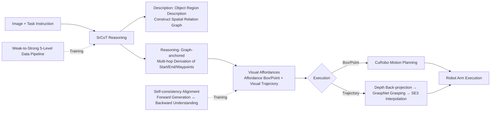

# From Seeing to Doing: Bridging Reasoning and Decision for Robotic Manipulation

**Conference**: ICLR 2026  
**OpenReview**: [https://openreview.net/forum?id=yngvAamNQi](https://openreview.net/forum?id=yngvAamNQi)  
**Code**: Project Page (Mentioned in the paper, repository to be confirmed)  
**Area**: Robotic Manipulation / Embodied AI / VLA / Spatial Reasoning  
**Keywords**: Vision-Language-Action, Spatial Reasoning, Visual Chain-of-Thought, Visual Affordance, Zero-shot Manipulation, Affordance  

## TL;DR
FSD transforms the task of "predicting grasp points/trajectories" in robotic manipulation into an **explicit spatial reasoning process**: it first utilizes a spatial relationship graph for visual Chain-of-Thought (SrCoT) and then generates embodiment-agnostic intermediate visual affordances (affordance boxes/points + visual trajectories). This enables zero-shot manipulation without fine-tuning and significantly outperforms affordance baselines across 8 spatial reasoning benchmarks and real-world tasks.

## Background & Motivation

**Background**: The mainstream approach involves connecting VLMs pre-trained on internet data to large-scale embodied datasets and fine-tuning them end-to-end into VLAs (OpenVLA, $\pi$0, RT series), hoping the generalization capabilities of the VLM will transfer to robotic control.

**Limitations of Prior Work**: Empirical evidence shows that this path yields poor zero-shot performance on completely new tasks. The root causes are the **scarcity** and **heterogeneity** of embodied data—robotic data volume is far below that of language/vision data, failing to trigger scaling laws. Furthermore, differences in action spaces and physical interactions across different morphologies are immense; learning a direct "vision $\rightarrow$ action" mapping easily leads to forgetting pre-trained knowledge and task interference. Alternative modular approaches (serial detection + grasping) suffer from cascading errors, slow inference, and a lack of holistic scene understanding. Existing affordance methods (predicting grasp points, etc.) provide insufficient auxiliary information and **directly output raw coordinates without an explicit reasoning process**, making it difficult to anchor instructions to the correct semantic entities.

**Key Challenge**: The key to generalization is not just the ability to predict visual affordances, but to first perform **explicit reasoning** on spatial and semantic contexts to produce an expressive, embodiment-agnostic intermediate representation. Hard-aligning RGB images directly with coordinate points is prone to overfitting, and it is difficult for VLMs to map future actions to image coordinates in a single step.

**Goal**: To enable VLMs to "generate" visual affordances through structured spatial reasoning, obtaining an intermediate representation that is both compact and information-rich, which can be used either for open-loop control or as a high-level planner for hierarchical closed-loop policies.

**Core Idea**: **[Treat the generation of visual affordances as a reasoning task rather than a prediction task]**—mimicking the human cognitive process of putting vegetables into a pot (locating objects, planning paths based on relative positions, and considering feasibility for obstacle avoidance). By using a **spatial relationship graph as a reasoning anchor** for multi-hop analysis, the "difficult-to-map action generation" is transformed into a "reasonable problem based on known object relationships."

## Method

### Overall Architecture

FSD is based on a LLaVA-1.5 style architecture (frozen CLIP-ViT-L image encoder + Vicuna-13B + trainable linear projection layer, initialized by ASMv2). The core is deconstructing "Seeing $\rightarrow$ Doing" into a three-part suite: using **SrCoT** to reason the scene into structured visual affordances, a **weak-to-strong hierarchical data pipeline** to fuel this reasoning ability, and a **self-consistency mechanism** to align the coordinate space with image-text modalities. All visual affordances are defined in normalized image coordinates (discretized into integer text 0–999) and finally projected into real-world execution via depth back-projection, grasp matching, or motion planning.

### Key Designs

**1. Spatial Relation Graph Anchored Visual Chain-of-Thought (SrCoT): Splitting generation into "Description then Reasoning" phases.** Direct SFT to align models with coordinate points is prone to overfitting. SrCoT takes the opposite approach: the **Description phase** first generates object-centric region descriptions to build a spatial relationship graph, where nodes are objects with coordinates and edges represent relative relationships (top/bottom/left/right/behind, etc.). The **Reasoning phase** uses this graph as an anchor to determine start/end coordinates through object referencing and free-space reasoning, then derives intermediate waypoints with explicit logic ("Raise first to avoid obstacles, then move above the pot, finally lower it"). This provides the VLM with a templated reasoning path, converting the difficult problem of "mapping future actions to image coordinates" into a simpler "multi-hop analogical reasoning problem based on known object relationships." To stabilize the reasoning path and reduce hallucination, SrCoT forces the model to use `<ref>` for objects and `<point>`/`<box>` for coordinates, strictly binding each object to its coordinates for object-centric reasoning.

**2. Weak-to-Strong Five-Level Capability Data Pipeline: Feeding the decomposed reasoning abilities layer by layer.** SrCoT places high demands on the VLM (precise grounding, spatial understanding, complex instruction following), where mainstream models often fall short. The authors constructed 300K SFT data samples covering 10+ morphologies across five levels: ① Region grounding (VLM proposes objects + vision model crops boxes) → ② Spatial relationship understanding (using Metric3Dv2 + WildCamera to reconstruct 3D scene graphs for relative positions, keeping only pairs with relative depth difference $\ge 20\%$ for quality) → ③ Spatial reasoning (automatically generating Q&A based on 3D scene graphs) → ④ Spatial affordance generation (extracting the final position of the manipulated object from the terminal frame and calculating affordance regions based on reference objects) → ⑤ Visual trajectory generation (using self-supervised keypoint extraction for grasp points + Cotracker for temporal dynamics, projected back to the initial frame). The pipeline uses strict rule-based filtering and iterative parameter tuning against human-annotated sets. Notably, SrCoT serves as a general vision-spatial reasoning mechanism beyond just visual trajectories.

**3. Self-consistency Alignment: Forcing the model to understand the physical meaning of coordinates through "Backward Understanding."** High-quality SFT data allows the model to "generate" visual affordances, but coordinate spaces never appeared in pre-training, so models may not understand their physical meaning. FSD treats the generation task as an understanding task in reverse: while the forward task is $(X_v, X_q) \rightarrow \tau$ (inferring visual trajectory $\tau$ from image and instruction), the inverse task $(X_v, \tau) \rightarrow X_q$ is constructed (inferring the likely instruction given image and trajectory). This bidirectional training aligns coordinate spaces with image-text modalities, making visual affordances serve as both understanding and generation signals. Training occurs in two stages: first using Level 1–3 data mixed with 1.4M general VQA/internet data to prevent forgetting and build core spatial reasoning, then using Level 4–5 data with self-consistency for specialized training in visual affordance generation and understanding (fixing 8 points for visual trajectory generation as a simplification).

**4. Reasoning $\rightarrow$ Decision Execution Link: Mapping 2D visual affordances to 3D robotic actions.** FSD can reason from initial or intermediate steps and choose the required visual affordance: using the box center for target points, sampling directly from points, or using visual trajectories. For trajectories, it first generates a 2D trajectory $\tau$, applies depth back-projection using a depth camera and pinhole model to get $\tau^{3d}=\{x^{3d}_t\}$, then queries GraspNet at the first point $x_1$ to match the nearest grasp pose $G^*$. A gradient-descent-based interpolation optimizes the path to generate a complete SE(3) motion trajectory. When only affordances are used, motion planning is handed to CuRobo. Unlike LLARVA or EmbodiedCoT, FSD converts the prediction task into a reasoning task, better utilizing vision-spatial common sense without scene-specific fine-tuning.

## Key Experimental Results

### Main Results

**General Spatial Reasoning (5 benchmarks, 15 sub-tasks, comparing 13B open-source models)**:

| Model | Avg Rank ↓ | 3D Depth | Distance Est. | Spatial Rel. |
|------|------|------|------|------|
| GPT-4o (Closed-source ref) | — | 87.8 | 78.2 | 69.2 |
| RoboPoint-13B | 2.8 | 81.5 | 57.7 | 65.7 |
| ASMv2-13B | 3.1 | 68.9 | 68.9 | 65.0 |
| **FSD-13B** | **1.3** | **88.0** | **86.7** | **78.3** |

FSD achieves an average rank of 1.3, significantly leading other 13B open-source models and rivaling the closed-source GPT-4o.

**Object/Free-space Referencing**: FSD achieves 56.7% on RoboRefIt (GPT-4o only 15.3%, RoboPoint 49.8%) and 45.8% on Where2Place, on par with RoboPoint (46.0%) and far exceeding other models.

**Visual Affordance Generation (VABench, 300 self-constructed problems)**:

| Task | Metric | GPT-4o | RoboPoint | RoboBrain | **FSD** |
|------|------|------|------|------|------|
| VABench-P | Acc↑ | 9.30 | 19.09 | 7.00 | **61.82** |
| VABench-V | RMSE↓ | 136.13 | — | 121.6 | **78.26** |
| VABench-V | LLM Score↑ | 4.37 | — | 4.5 | **6.21** |

Affordance point accuracy is over 3 times higher than RoboPoint.

**Zero-shot Manipulation (SimplerEnv, WidowX, 24 episodes per task)**:

| Type | Model | Avg |
|------|------|------|
| End-to-end VLA | $\pi$0-fast | 48.3 |
| End-to-end VLA | OpenVLA-OFT | 41.8 |
| End-to-end VLA | OpenVLA | 5.2 |
| Modular | MOKA | 33.3 |
| Affordance | RoboPoint | 17.7 |
| Affordance | **FSD** | **40.6** |

FSD achieves 40.6% in zero-shot, far exceeding the zero-shot baseline RoboPoint (17.7%); end-to-end VLAs without fine-tuning often crash to near 0% when encountering major changes in background or instructions.

**Real-world (xArm 6, 8 tabletop tasks)**: FSD achieves a 72% success rate in zero-shot, over 30% higher than the strongest baseline, and can complete complex tasks like folding towels that require visual trajectory generation (which baselines cannot do).

### Ablation Study

| Model | VABench-P Acc↑ | VABench-V RMSE↓ | LLM Score↑ |
|------|------|------|------|
| **FSD (Full)** | **61.82** | **78.26** | **6.21** |
| w/o SrCoT | 26.21 | 99.53 | 5.07 |
| w/o Alignment | 55.92 | 80.48 | 5.92 |

### Key Findings
- **SrCoT is core**: Removing it causes affordance accuracy to plummet from 61.82 to 26.21, proving that "reasoning before generation" is far superior to purely data-driven direct prediction.
- **Self-consistency alignment is effective but provides minor gains**: Indicators drop slightly without it, suggesting alignment primarily serves to stabilize coordinate semantics.
- **Reasoning-based affordance tracks crush end-to-end VLA in zero-shot**: End-to-end VLAs typically requires fine-tuning to be usable, whereas FSD naturally adapts to new scenes via embodiment-agnostic intermediate representations.

## Highlights & Insights
- **Downscaling "action generation" to "spatial relationship reasoning"** is the cleverest move in this paper—it bypasses the deadlock of embodied data scarcity/heterogeneity by using general visual data to train generalization capabilities.
- **Object-centric rather than agent-centric** visual trajectory definitions decouple the intermediate representation from specific robot morphologies, which is key to cross-body transfer.
- The **Generation $\leftrightarrow$ Understanding bidirectional self-consistency** idea is elegant: using the reverse task forces the model to truly "understand" coordinates rather than memorizing coordinate-image mappings.
- VABench fills the gap of lacking standard benchmarks for visual trajectory prediction, offering infrastructure value for future work.

## Limitations & Future Work
- Currently primarily **open-loop control**; the authors note that future work should explore **closed-loop policy VLA** explicitly guided by visual trajectories to combine robust planning with precise execution.
- Visual trajectory generation is simplified to 8 points, which may not be fine-grained enough for complex long-horizon tasks.
- The execution link relies on external modules like depth cameras, GraspNet, and CuRobo; the overall system is heavy, and the physical feasibility of affordances/trajectories remains constrained by the accuracy of these downstream modules.
- The gain from self-consistency alignment is limited, indicating that true semantic alignment of coordinates might require stronger supervision signals or pre-training modifications.

## Related Work & Insights
- **Spatial Reasoning VLM** (SpatialVLM, SpatialRGPT, SpatialBot): FSD pushes spatial reasoning toward complex manipulation tasks using SrCoT and self-consistency.
- **Visual Chain-of-Thought** (Shikra, VoCoT, EmbodiedCoT): FSD uniquely uses spatial relationship graphs as reasoning anchors, which is more structured and grounded than anchoring visual regions alone.
- **Affordance-driven Manipulation** (Visual trajectories in LLaRVA, affordance in RoboPoint): FSD upgrades their "prediction" paradigm to a "reasoning" paradigm, trading the VLM's world knowledge for zero-shot generalization.
- Insight: In data-scarce embodied domains, **rather than stacking demos to learn end-to-end mappings, it is better to design a reason-able intermediate representation to channel general pre-trained knowledge**—this "Seeing then Doing via Reasoning Bridge" approach is also applicable to other low-resource decision tasks.

## Rating
- **Novelty**: ⭐⭐⭐⭐ — "Affordance generation as reasoning" + Spatial relation graph anchored CoT + Generation/Understanding consistency is a novel combo that addresses VLA generalization pain points.
- **Experimental Thoroughness**: ⭐⭐⭐⭐ — Covers 8 benchmarks + self-built VABench + SimplerEnv + Real-world, with solid ablations; however, exploration of closed-loop policies, long-horizon tasks, and different LLM backbones is limited.
- **Writing Quality**: ⭐⭐⭐⭐ — Motivation, method, and execution links are clearly narrated; diagrams (graphs/reasoning process) are intuitive, and the 5-level pipeline is well-explained.
- **Value**: ⭐⭐⭐⭐ — Provides a practical "reasoning bridge" route for robotic generalization under data scarcity; VABench also holds infrastructure value.

<!-- RELATED:START -->

## Related Papers

- [\[ICLR 2026\] Embodied-R1: Reinforced Embodied Reasoning for General Robotic Manipulation](embodied-r1_reinforced_embodied_reasoning_for_general_robotic_manipulation.md)
- [\[CVPR 2026\] Localizing, Structuring, and Rendering: Bridging 3D and 2D Vision-Language-Action Models for Robotic Manipulation](../../CVPR2026/robotics/localizing_structuring_and_rendering_bridging_3d_and_2d_vision-language-action_m.md)
- [\[ICLR 2026\] From Seeing to Experiencing: Scaling Navigation Foundation Models with Reinforcement Learning](from_seeing_to_experiencing_scaling_navigation_foundation_models_with_reinforcem.md)
- [\[CVPR 2026\] Action-Sketcher: From Reasoning to Action via Visual Sketches for Robotic Manipulation](../../CVPR2026/robotics/action-sketcher_from_reasoning_to_action_via_visual_sketches_for_robotic_manipul.md)
- [\[ICLR 2026\] Self-Refining Vision Language Model for Robotic Failure Detection and Reasoning](self-refining_vision_language_model_for_robotic_failure_detection_and_reasoning.md)

<!-- RELATED:END -->
