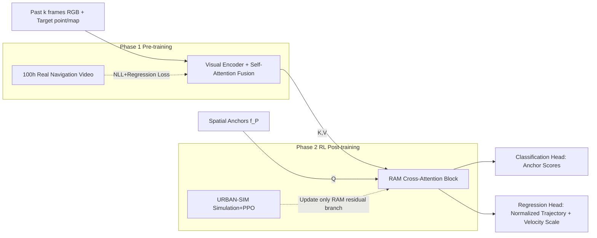

# From Seeing to Experiencing: Scaling Navigation Foundation Models with Reinforcement Learning

**Conference**: ICLR 2026  
**OpenReview**: [https://openreview.net/forum?id=0c7nAZjyr5](https://openreview.net/forum?id=0c7nAZjyr5)  
**Code**: [https://vail-ucla.github.io/S2E](https://vail-ucla.github.io/S2E) (Project homepage, code to be open-sourced)  
**Area**: Robotics / Embodied Navigation / Navigation Foundation Models  
**Keywords**: Navigation Foundation Models, Reinforcement Learning Post-training, Residual Attention, Anchor Distribution Matching, 3DGS Simulation Benchmark  

## TL;DR
S2E proposes a hybrid learning framework "from seeing to experiencing": initial pre-training using anchor-guided Gaussian mixture distributions on 100 hours of real navigation videos, followed by RL post-training in simulation with a zero-initialized Residual Attention Module (RAM). By updating only the cross-attention branches, reactive capabilities for obstacle and pedestrian avoidance are injected, allowing navigation foundation models to break through the scaling ceiling of purely offline data and achieve zero-shot transfer to real wheeled and quadruped robots.

## Background & Motivation
**Background**: Navigation foundation models (GNM, ViNT, NoMaD, CityWalker, etc.) rely on web-scale videos and human demonstrations for passive visual imitation learning, enabling generalization across different environments and embodiments. However, they **only learn visual statistical correlations rather than physical causality**—videos tell agents "what actions look like" but not "how to adjust, recover, or reason about counterfactual consequences when the environment changes."

**Limitations of Prior Work**: Navigation policies trained purely offline react slowly to the surrounding environment, making it difficult to handle interactive safety behaviors such as obstacle avoidance and yielding to pedestrians in urban scenes. Experiments reveal **diminishing marginal returns in offline data scaling**: increasing data from 250k to 750k only yields a 2% gain in success rate. While RL enables interactive learning, training with RL alone in narrow synthetic environments suffers from low sampling efficiency and a lack of inductive priors, failing to generalize to the real world.

**Key Challenge**: Offline videos provide strongly generalizable visual priors but lack interactive capabilities; simulation RL provides interaction but suffers from a severe sim-to-real domain gap. Furthermore, full-parameter RL fine-tuning leads to **Forgetting Pre-trained Capabilities (FPC)** and **observation domain shift** due to pixel statistics differences in simulation—encoders overfit to simulation RGB, causing feature drift $\Delta_\text{feat}=\|\mathbb{E}_{o\sim D_\text{real}}[\mathcal{F}^\text{sim}(o)]-\mathbb{E}_{o\sim D_\text{real}}[\mathcal{F}^\text{pre}(o)]\|$ to increase rapidly when deployed on real images.

**Goal**: To inject reactive interactive capabilities via simulation RL while preserving the generalizable representations from offline pre-training, achieving a scalable, generalizable, and cross-embodiment navigation foundation model.

**Core Idea**: **(1) Anchor-Guided Distribution Matching (AGDM) for pre-training** to learn multi-modal motion distributions for a stable backbone; **(2) Residual Attention Module (RAM) for RL post-training** to fine-tune only the zero-initialized residual branch of cross-attention, gaining reactive behaviors without destroying pre-trained knowledge; **(3) NavBench-GS** using 3DGS-reconstructed real scenes with physical interactions for closed-loop evaluation.

## Method

### Overall Architecture
S2E is a two-stage hybrid framework consisting of "Pre-training + RL Post-training." The model receives the past $k$ RGB frames as context, goal points/maps as guidance, and spatial anchors as queries. The context is fused via self-attention to serve as K/V, while anchor features $f_P$ serve as Q. The RAM block calculates weighted features to obtain refined anchor features, which are decoded by classification and regression heads into scores for each anchor, normalized trajectories, and velocity scales. During pre-training, the full model is trained end-to-end using NLL and regression losses; during the fine-tuning stage, the body is frozen, and only the RAM block is optimized using PPO policy gradients.

### Key Designs

**1. Anchor-Guided Distribution Matching (AGDM): Capturing multi-modal navigation behaviors with structured Gaussian mixtures.** Robot navigation is inherently multi-modal—under the same observation, "going straight, turning, or yielding" are all valid actions. Discrete actions and unimodal Gaussians lack expressiveness, while diffusion policies are overly flexible and hard to control, often producing fragmented trajectories. AGDM uses K-Means to generate $M$ representative intent points (anchors) $p_a \in \mathbb{R}^{M \times 2}$ on a unified dataset. Each anchor corresponds to a Gaussian mode in the mixture model, formulating the action distribution as $q(w_t|o_{t-k+1:t}) = \sum_{m=1}^{M} q_m \cdot \mathcal{N}_m(w_x-\mu_x^m,\sigma_x^m;\,w_y-\mu_y^m,\sigma_y^m;\rho^m)$, where $q_m$ is the anchor selection score, and an additional per-mode velocity scale $v$ is predicted. Anchors serve as interpretable high-level intents and provide structured multi-modal distributions, naturally supporting cross-embodiment deployment due to uniform anchor sampling. Training utilizes NLL loss to supervise the classification and trajectory heads, optimized by selecting mode $h$ using an assignment strategy where the predicted direction best fits the ground truth trajectory: $\mathcal{L}_{nll} = -\log \mathcal{N}_h(\cdot) - \log(q_h)$, plus an L2 regression loss $\mathcal{L}_{reg} = \|\hat v - v\|_2^2$ for the velocity scale. This structured design significantly reduces learning uncertainty and provides a reliable backbone for subsequent online adaptation.

**2. Residual Attention Module (RAM): Fine-tuning only cross-attention via zero-initialized gating for a "progressive curriculum".** Full-parameter RL fine-tuning causes forgetting and domain shift, necessitating more selective fine-tuning. The paper identifies **cross-attention layers** as ideal targets—unlike visual encoders and self-attention, which process raw scene textures and are highly sensitive to domain shifts, cross-attention $\text{Attn}(Q,K,V) = \text{softmax}(QK^\top/\sqrt{d})V$ explicitly models the structural relationship between the "agent state (trajectory tokens as Q)" and "environmental observations (as K/V)," which is far more stable under appearance changes. RAM freezes the pre-trained cross-attention parameters $\Theta_D$, creates a trainable copy $\Theta_l$, and gates it with a zero-initialized linear layer $\mathcal{Z}$: $Q' = \psi_D(Q;K,V;\Theta_D) + \mathcal{Z}(\psi_D(\mathcal{Z}(Q);K,V;\Theta_l))$. Zero-initialization ensures that the residual branch contribution is zero at the start of fine-tuning ($Q' = \psi_D(Q;K,V;\Theta_D)$), and gradients $\nabla_{\Theta_l}\mathcal{L} \propto \frac{\partial\mathcal{L}}{\partial\mathcal{Z}} \cdot W_\mathcal{Z}$ propagated to adaptation parameters initially vanish. The adaptation branch remains dormant during early high-variance exploration and only activates as the gate weight moves away from zero, forming a structured curriculum that progressively injects interactive dynamics. Since $|\Delta\Theta_l| \ll |\Theta_0|$ and visual encoder updates are skipped, it avoids domain shift while significantly saving parameters and computation.

**3. Progressive Reward + PPO Post-training: From basic goals to high-level refinement.** The reward is designed as $R = R_G + R_R + R_H$: Global goals $R_G$ (including dense/sparse arrival rewards and collision penalties) encourage efficient and safe arrival; rule regularization $R_R$ constrains sidewalk centering and social compliance; human-likeness $R_H$ encourages smooth and natural human-style navigation. The pre-trained 10×2 waypoint trajectory is converted into velocity commands via a differentiable controller $F_d$ for the locomotion module. **Only the RAM branch parameters $\Theta_r$ are fine-tuned** (gradients for context and anchor features are truncated), optimized using a PPO objective with entropy regularization: $\min_{\Theta_r} \mathcal{L}_\text{ram} = -\mathcal{L}_\text{policy} + \alpha \mathcal{L}_\text{value} - \beta \mathcal{H}_\pi$, where $\mathcal{H}_\pi$ is a simplified approximation of GMM entropy (as KL divergence lacks a closed-form solution).

**4. NavBench-GS: A 3DGS-based closed-loop interactive evaluation Benchmark.** Existing evaluations rely on offline 2D videos for open-loop testing, which cannot assess reactive behaviors. NavBench-GS uses 3D Gaussian Splatting to reconstruct 26 real-world scenes from Vid2Sim, providing photo-realistic visual appearance and precise physical interactions. Each scene is instantiated with 4 types of tasks (empty / random static obstacles / moving pedestrians / obstacles + pedestrians), measured by Success Rate (SR), Route Completion (RC), and Collision Times (CT), providing a standardized and reproducible assessment of navigation model generalization and safety.

## Key Experimental Results

### Main Results (NavBench-GS, 4 tasks SR↑/RC↑/CT↓)

| Method | Data Vol. | Empty SR | Obstacle SR | Pedestrian SR | Obstacle+Ped SR |
|---|---|---|---|---|---|
| GNM | 70h | 0.23 | 0.16 | 0.09 | 0.07 |
| ViNT | 80h | 0.28 | 0.13 | 0.07 | 0.08 |
| NoMaD | 100h | 0.15 | 0.11 | 0.09 | 0.08 |
| MBRA | 700h | 0.61 | 0.51 | 0.71 | 0.51 |
| CityWalker | 2000h | 0.66 | 0.43 | 0.56 | 0.37 |
| CityWalker* | 100h | 0.67 | 0.52 | 0.63 | 0.47 |
| **S2E** | **100h** | **0.82** | **0.57** | **0.74** | **0.51** |

Using only 100h of data, S2E significantly outperforms CityWalker (trained on 2000h) in SR and RC across all scenarios, with CT in empty scenes dropping to 0.00.

### Real-world Results (Wheeled + Quadruped Robots, SR↑/CT↓)

| Method | Wheeled SR | Wheeled CT | Quadruped SR | Quadruped CT |
|---|---|---|---|---|
| NoMaD | 0.25 | 0.76 | 0.26 | 0.75 |
| CityWalker | 0.28 | 0.78 | 0.31 | 0.79 |
| S2E-BC | 0.32 | 0.78 | 0.34 | 0.91 |
| **S2E-Full** | **0.51** | **0.60** | **0.55** | **0.62** |

Interactive capabilities learned via simulation RL transfer zero-shot to real dual-platform robots; S2E-Full nearly doubles the success rate compared to the pure BC version.

### Ablation Study

| Fine-tuning Strategy (NavBench-GS-Obstacle) | SR↑ | CT↓ |
|---|---|---|
| PPO (Full-parameter RL) | 0.02 | 2.37 |
| SFT | 0.49 | 0.77 |
| DecFT-RL (Fine-tune Decoder Only) | 0.39 | 0.91 |
| **Ours (RAM)** | **0.57** | **0.69** |

- Full-parameter PPO almost completely collapses (SR 0.02), confirming forgetting and domain shift issues; RAM achieves the highest SR and lowest CT with limited module adaptation.
- Anchor-guided multi-modal matching (S2E-BC) shows an 11% SR increase and 0.64 CT reduction in obstacle scenarios compared to the unimodal version (S2E-BC-Single).

### Key Findings
- **RL breaks the offline scaling ceiling**: Pure BC gains only 2% from 250k→750k, whereas simulation RL without additional offline data improves pre-trained model SR by 15%.
- **RL is more sample-efficient and robust than SFT**: As training costs increase, RL maintains or improves SR, while SFT suffers from severe overfitting (especially apparent in OOD testing).

## Highlights & Insights
- Systematic introduction of the "RL vs SFT" discussion from LLM post-training into navigation foundation model scaling, providing empirical evidence that RL mitigates diminishing returns in offline scaling.
- RAM's "frozen backbone + zero-initialized residual gated cross-attention" is a clever application of ControlNet/Flamingo-style residual adaptation to RL post-training. It leverages the inductive bias that "cross-attention is more robust to domain shift," simultaneously addressing forgetting, domain shift, and computational cost.
- NavBench-GS uses 3DGS to unify "photo-realistic appearance, physical interaction, and reproducibility," solving a long-standing pain point in end-to-end robotic evaluation where real-world environments are difficult to replicate.

## Limitations & Future Work
- **Lack of 3D perception**: The pure vision scheme lack explicit 3D structure; S2E still occasionally hits obstacles, an inherent challenge for vision-only navigation. The authors suggest introducing depth or occupancy prediction for 3D cues.
- Simulation RL still depends on specific simulators like URBAN-SIM/Vid2Sim, and reward terms (social compliance, human-likeness) require manual design. Transferability of navigation norms across cities/cultures is not fully verified.
- Code has not yet been open-sourced (at the time of the paper), and reproducibility remains to be verified by the community.

## Related Work & Insights
- **Navigation Foundation Models**: GNM/ViNT/NoMaD/CityWalker follow the "large-scale passive video imitation" path; this paper points out their lack of causal interaction and supplements it with RL.
- **Pre-training + RL Fine-tuning Paradigm**: Continues the paradigm of "supervised pre-training + RL fine-tuning" from AlphaGo/AlphaStar and the RLHF approach of LLM/VLM, but demonstrates that the post-training paradigm in robotics is still being explored.
- **Parameter-efficient Residual Adaptation**: RAM draws inspiration from the frozen backbone + bypass branch ideas of ControlNet, Flamingo, and LoRA. The insight is that in RL post-training, "selecting the right sub-module to fine-tune is more critical than how many parameters are tuned."
- Insight for future work: Combining "structured multi-modal action representations (Anchor GMM)" with "domain-shift robust selective module fine-tuning" may be a universal recipe for sim-to-real post-training of embodied foundation models.

## Rating
- **Novelty**: ⭐⭐⭐⭐ The combination of Anchor GMM and zero-initialized residual cross-attention is a novel approach in navigation RL post-training. Importing the RL/SFT scaling discussion from LLMs into navigation provides a conceptual contribution.
- **Experimental Thoroughness**: ⭐⭐⭐⭐ Includes a custom-built 3DGS Benchmark, 4 simulation tasks, dual real robot platforms, RL/SFT scaling curves, and multiple ablation studies. The evidence chain is complete, though comparisons with more RL post-training baselines and reward term ablations are missing.
- **Writing Quality**: ⭐⭐⭐⭐ Clear motivation narrative (seeing→experiencing). Analysis of FPC/domain shift is well-supported by formulas, and charts are logically organized.
- **Value**: ⭐⭐⭐⭐ Provides empirical proof that "RL breaks the offline scaling ceiling," a reproducible end-to-end evaluation benchmark, and zero-shot real-world transfer, offering strong practical value to the navigation foundation model and embodied post-training communities.

<!-- RELATED:START -->

## Related Papers

- [\[ICLR 2026\] Embodied Navigation Foundation Model](embodied_navigation_foundation_model.md)
- [\[ICLR 2026\] SimpleVLA-RL: Scaling VLA Training via Reinforcement Learning](simplevla-rl_scaling_vla_training_via_reinforcement_learning.md)
- [\[ICLR 2026\] Policy Contrastive Decoding for Robotic Foundation Models](policy_contrastive_decoding_for_robotic_foundation_models.md)
- [\[ICLR 2026\] BFM-Zero: A Promptable Behavioral Foundation Model for Humanoid Control Using Unsupervised Reinforcement Learning](bfm-zero_a_promptable_behavioral_foundation_model_for_humanoid_control_using_uns.md)
- [\[ICLR 2026\] From Seeing to Doing: Bridging Reasoning and Decision for Robotic Manipulation](from_seeing_to_doing_bridging_reasoning_and_decision_for_robotic_manipulation.md)

<!-- RELATED:END -->
