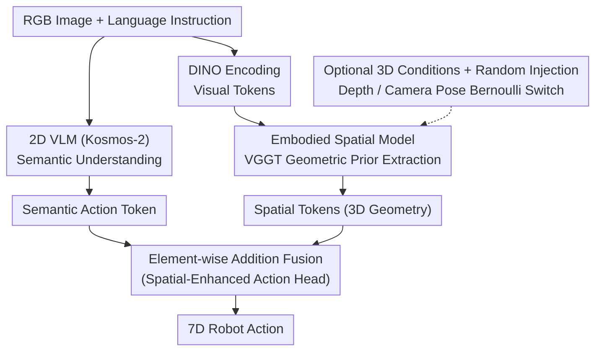

# From Spatial to Actions: Grounding Vision-Language-Action Model in Spatial Foundation Priors

**Conference**: ICLR 2026  
**arXiv**: [2510.17439](https://arxiv.org/abs/2510.17439)  
**Code**: [Yes](https://falcon-vla.github.io/)  
**Area**: Robotics  
**Keywords**: VLA models, 3D spatial understanding, spatial foundation models, modality transferability, robotic manipulation  

## TL;DR

Introduces FALCON (From Spatial to Action), which achieves strong 3D spatial perception for VLA models by injecting rich 3D spatial tokens from a spatial foundation model into the Action Head rather than the VLM backbone. It maintains flexible modality switching from RGB-only to RGB-D and achieves SOTA in both simulation and real-world tasks.

## Background & Motivation

Most existing VLA models are built on 2D encoders but need to perform manipulation tasks in the 3D physical world, creating a critical spatial reasoning gap. Three levels of problems exist:

**Background**: Insufficient Spatial Representation. 2D VLMs lack explicit 3D perception, making it difficult for them to generalize to scenes involving geometry, depth, and spatial relationship reasoning.

**Limitations of Prior Work**: Poor Modality Transferability. Existing 3D enhancement methods either rely on specific sensors (point clouds/depth maps), failing when sensors are unavailable, or inject weak 3D cues (like pseudo-depth), where the signals are insufficient to capture robust 3D priors.

**Key Challenge**: Alignment Difficulty. Concatenating spatial embeddings with text tokens disrupts the original vision-language alignment. The scarcity of 3D data makes re-alignment difficult, leading to degradation in zero-shot generalization.

## Method

### Overall Architecture

FALCON splits VLA into two pathways: "Cerebral Cortex + Cerebellum". The 2D VLM (Kosmos-2, ~1.6B) is responsible for understanding images and language instructions to output semantic action tokens $\hat{\mathbf{t}}_{\text{act}}$. On the spatial side, the Embodied Spatial Model (ESM, based on the spatial foundation model VGGT, ~1.0B) extracts geometry-rich 3D spatial tokens $\mathbf{T}_{\text{spl}}$ from RGB, optionally using depth maps or camera poses as randomly injected additional conditions. The two representations are not concatenated at the VLM input but are fused via element-wise addition in the Spatial-Enhanced Action Head before generating robot actions. The full model consists of approximately 2.9B parameters. This topology, where "spatial information bypasses the VLM and is only injected at the action head," is the starting point for all subsequent designs.

### Key Designs

**1. Embodied Spatial Model: Using a Spatial Foundation Model as a Geometric Prior Extractor**  
The root of the 3D shortcoming in VLA is that 2D encoders cannot perceive depth and geometric relationships. FALCON does not learn 3D from scratch; it directly utilizes the pre-trained VGGT. Input images are encoded by DINO into visual tokens $\mathbf{T}_{\text{vis}}$, concatenated with a learnable camera token $\mathbf{t}_{\text{cam}}$, and sent to a spatial encoder (stacked cross-attention + self-attention) to output spatial tokens $\mathbf{T}_{\text{spl}} \in \mathbb{R}^{M \times D_s}$. Since VGGT is trained for multi-view reconstruction (depth, point clouds, poses), its tokens naturally carry dense geometric information, surfacing much stronger cues than pseudo-depth estimation and avoiding the difficulty of zero-shot alignment with scarce 3D data.

**2. Optional 3D Conditions + Random Injection: One Model for Any Sensor Combination**  
In real-world deployment, depth maps and camera poses are not always available. Training separate models for each configuration is too costly. FALCON makes these two pathways pluggable: camera poses $P \in \mathbb{R}^7$ are encoded via MLP as GT camera tokens $\mathbf{t}_{\text{gt-cam}}$, replacing the learnable camera token; depth maps $D_t$ are normalized and concatenated with validity masks, passed through a 14×14 convolution to get $\mathbf{T}_{\text{dpt}}$, and added element-wise to image tokens. Crucially, during training, whether these are injected is determined by two Bernoulli switches $b_d, b_p \sim \text{Bernoulli}(p)$:

$$(\mathbf{T}_{\text{spl}}, \hat{\mathbf{t}}_{\text{cam}}) = \mathcal{E}_{\text{spl}}(\mathbf{T}_{\text{vis}} + b_d \mathbf{T}_{\text{dpt}}, b_p \mathbf{t}_{\text{gt-cam}} + (1-b_p)\mathbf{t}_{\text{cam}})$$

Thus, the same set of weights observes training signals for "RGB-only", "RGB-D", and "with pose". It does not fail if a pathway is missing during testing and can be enhanced if one is available, allowing flexible modality switching.

**3. Element-wise Addition Fusion in Action Head: Protecting the VLM with Zero Extra Parameters**  
Directly concatenating spatial embeddings into VLM inputs flushes out pre-trained vision-language alignments, leading to zero-shot generalization degradation—a common issue in existing 3D enhancement methods. FALCON bypasses the VLM with spatial information, merging only at the action head: spatial tokens are max-pooled into a single vector $\mathbf{t}_{\text{spl}}$, projected into the VLA feature space via a lightweight MLP adapter $\widetilde{\mathbf{t}}_{\text{spl}} = \mathcal{D}(\mathbf{t}_{\text{spl}})$, and then directly added to semantic action tokens $\mathbf{f}_{\text{fused}} = \hat{\mathbf{t}}_{\text{act}} + \widetilde{\mathbf{t}}_{\text{spl}}$. This is sent to an action predictor (MLP or LSTM) to output 7D action sequences. Element-wise addition introduces no new parameters and outperforms cross-attention and FiLM-Gated in ablations because it least disrupts existing VLM representations, treating semantic and geometric features as superimposable complementary signals.

### Loss & Training

Action supervision handles the 7 dimensions separately: the first 6 continuous pose dimensions use MSE, and the 7th discrete gripper dimension uses BCE, summed over the action chunk length $C$:

$$\mathcal{L} = \sum_{i=t}^{t+C-1} \text{MSE}(\hat{a}_{i,\text{pose}}, a_{i,\text{pose}}) + \lambda \cdot \text{BCE}(\hat{a}_{i,\text{gripper}}, a_{i,\text{gripper}})$$

The ESM side continues to use VGGT's multi-task spatial reconstruction supervision (depth/point clouds/poses) to prevent degradation of geometric priors. Post-training is performed in two stages: Stage 1 freezes all pre-trained components and trains only the lightweight adapter for coarse alignment; Stage 2 unfreezes the VLM and adapter for joint fine-tuning (others remain frozen) to let the VLM implicitly absorb spatial cues. Training was completed on 32 A100 GPUs.

## Key Experimental Results

### Main Results

**CALVIN Long-horizon Manipulation (ABCD→D)**:

| Method | 1 Task | 2 Tasks | 3 Tasks | 4 Tasks | 5 Tasks | Mean Len ↑ |
|------|-------|-------|-------|-------|-------|-----------|
| RT-1 | 84.4 | 61.7 | 43.8 | 32.3 | 22.7 | 2.45 |
| RoboVLM | 96.7 | 93.0 | 89.9 | 86.5 | 82.6 | 4.49 |
| **Ours (FALCON)** | **97.2** | **93.3** | **90.3** | **88.0** | **84.0** | **4.53** |

**CALVIN Zero-shot Transfer (ABC→D)**:

| Method | Mean Len ↑ |
|------|-----------|
| 3D Diffuser Actor (w/ GT Point Cloud) | 3.35 |
| RoboVLM | 4.25 |
| **Ours (FALCON, RGB-only)** | **4.40** |

**SimplerEnv WidowX Robot**:

| Method | Put Spoon | Put Carrot | Stack Block | Put Eggplant | Mean |
|------|-----------|------------|-------------|--------------|------|
| SpatialVLA | 16.7% | 25.0% | 29.2% | 100% | 42.7% |
| **Ours (FALCON)** | **62.5%** | **41.7%** | 20.8% | 100% | **56.3%** |

**SimplerEnv Google Robot**:

| Method | Pick Coke | Move Near | Open/Close | Drawer Apple | Mean |
|------|-----------|-----------|------------|--------------|------|
| RT-2-X (55B) | 78.7% | 77.9% | 25.0% | 3.7% | 46.3% |
| SpatialVLA | 86.0% | 77.9% | 57.4% | 0.0% | 55.3% |
| **Ours (FALCON, 2.9B)** | **90.7%** | **79.2%** | 39.8% | **41.7%** | **62.9%** |

### Ablation Study

**Spatial token injection position**:

| Injection Method | ABCD→D Avg.Len | ABC→D Avg.Len |
|----------|----------------|---------------|
| Inject into VLM | 4.00 | 3.79 |
| **Inject into Action Head (Ours/FALCON)** | **4.08** | **3.91** |

**Fusion strategy comparison (CALVIN ABC→D)**:

| Strategy | Avg.Len ↑ |
|------|----------|
| Cross-Attention | 3.68 |
| FiLM-Gated | 3.76 |
| **Element-wise Addition** | **3.91** |

**Modality input ablation (CALVIN ABC→D)**:

| Configuration | Avg.Len ↑ |
|------|----------|
| Kosmos-VLA (RGB-only, no ESM) | 3.48 |
| Kosmos-VLA (RGB-D, point cloud encoder) | 3.98 |
| Ours (FALCON, RGB-only) | 3.91 |
| Ours (FALCON, RGB-D) | **3.97** |
| Ours (FALCON, trained on RGB-D, test w/ RGB) | 3.95 |

### Key Findings

1. **Action Head Injection >> VLM Injection**: Injecting spatial tokens into VLM disrupts pre-trained semantic representations, while Action Head injection maintains VLM integrity.
2. **Simplest Fusion is Optimal**: Element-wise addition outperforms cross-attention and FiLM-Gated with 0 extra parameters.
3. **RGB-only Beats Explicit 3D Input**: FALCON with RGB-only exceeds 3D Diffuser Actor using GT point clouds (4.40 vs 3.35).
4. **Flexible Modality Switching**: Training with depth/pose and removing them during testing still maintains high performance (3.97 → 3.95).
5. **Significant Real-world Spatial Understanding Lead**: In tasks requiring perception of object size and height, FALCON's success rate far exceeds baselines.
6. **Strong Few-shot Adaptation**: 27% higher performance than the runner-up in few-shot settings.

## Highlights & Insights

1. **Precise Brain Division Analogy**: The VLM handles high-level semantics (cerebral cortex), while the Action Head manages fine motor control and spatial integration (cerebellum). This design is intuitive and effective.
2. **Elegant Random Condition Strategy**: Using Bernoulli switches to randomly inject depth and pose during training allow a single model to handle flexible multimodal switching, avoiding separate training for each sensor configuration.
3. **New Application of Spatial Foundation Models**: First use of DUSt3R/VGGT reconstruction tokens as VLA geometric priors, bridging reconstruction and control.
4. **RGB-only Beats GT Point Cloud**: Indicates that implicit 3D representations from spatial foundation models are more suitable for strategy networks than explicit point clouds.

## Limitations & Future Work

1. **Static Camera Assumption**: ESM processes 3rd-person static imagery; its applicability to egocentric view changes in mobile robots needs verification.
2. **Tabletop Manipulation Focus**: Experiments focus on tabletop tasks; navigation and whole-body control are not covered.
3. **ESM Parameter Overhead**: ESM accounts for 1B out of 2.9B parameters; the impact on real-time edge deployment needs evaluation.
4. **Interchangeability of ESM**: Whether future spatial foundation models can serve as plug-and-play replacements remains to be verified.
5. **Lack of 3D annotations in Open X-Embodiment**: While the random condition strategy mitigates this, datasets with aligned 3D annotations could further enhance performance.

## Related Work & Insights

- **Difference from SpatialVLA**: SpatialVLA concatenates learnable spatial embeddings into the VLM input, which is weak and disrupts alignment. FALCON injects rich foundation tokens directly into the Action Head.
- **Difference from PointVLA/GeoVLA**: These methods require explicit 3D input (point clouds); FALCON works with RGB-only and supports optional 3D enhancement.
- **Difference from 3D-VLA**: 3D-VLA embeds 3D features into the VLM, requiring expensive instruction tuning; FALCON decouples spatial processing from the VLM.
- **Insight**: Spatial foundation models (DUSt3R series) as universal geometric prior injectors can be extended to other 3D-heavy downstream tasks (e.g., navigation, scene understanding).

## Rating

- Novelty: ⭐⭐⭐⭐ — The combination of Action Head injection and the ESM random condition strategy is original.
- Experimental Thoroughness: ⭐⭐⭐⭐⭐ — Three simulation benchmarks + 11 real-world tasks + extensive ablations.
- Writing Quality: ⭐⭐⭐⭐ — Clear motivation and well-structured contributions.
- Value: ⭐⭐⭐⭐⭐ — Highly practical; deployable with RGB-only while supporting enhancement with additional sensors.

<!-- RELATED:START -->

## Related Papers

- [\[ICLR 2026\] Spatial Forcing: Implicit Spatial Representation Alignment for Vision-language-action Model](spatial_forcing_implicit_spatial_representation_alignment_for_vision-language-ac.md)
- [\[ICLR 2026\] Theory of Space: Can Foundation Models Construct Spatial Beliefs through Active Exploration?](theory_of_space_can_foundation_models_construct_spatial_beliefs_through_active_e.md)
- [\[CVPR 2026\] Learning Surgical Robotic Manipulation with 3D Spatial Priors](../../CVPR2026/robotics/learning_surgical_robotic_manipulation_with_3d_spatial_priors.md)
- [\[ICLR 2026\] UniVLA: Unified Vision-Language-Action Model](unified_vision-language-action_model.md)
- [\[ICML 2026\] Spatial Memory for Out-of-Vision Manipulation in Vision-Language-Action](../../ICML2026/robotics/spatial_memory_for_out-of-vision_manipulation_in_vision-language-action.md)

<!-- RELATED:END -->
