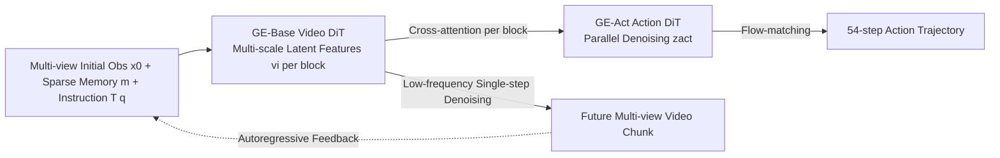

# Genie Envisioner: A Unified World Foundation Platform for Robotic Manipulation

**Conference**: ICLR 2026  
**OpenReview**: [https://openreview.net/forum?id=fHLtSxDFKC](https://openreview.net/forum?id=fHLtSxDFKC)  
**Code/Homepage**: [https://genie-envisioner.github.io](https://genie-envisioner.github.io)  
**Area**: Robotic Manipulation / World Models / Video Generation Policy Learning  
**Keywords**: World Model, Robotic Manipulation, Video Diffusion, VLA, Flow Matching, Cross-Embodiment  

## TL;DR
GE integrates a "multi-view video world model (GE-Base)" and a "lightweight parallel action decoder (GE-Act)" into a unified video generation framework. The action branch directly reads multi-scale, full-resolution latent representations from the video DiT via block-wise alignment. Combined with slow-fast asynchronous inference, it generates 54-step action trajectories within 200ms on a single RTX 4090 and enables transfer to new robotic embodiments using only 1 hour of teleoperation data.

## Background & Motivation
**Background**: The mainstream approach in robotic manipulation is VLA (Vision-Language-Action) imitation learning, which compresses visual observations into low-bandwidth semantic embeddings followed by a policy head. Recntly, "video-centric world models" have emerged, shifting the paradigm from "vision $\rightarrow$ language" to "language $\rightarrow$ future video," using future videos to explicitly encode fine-grained cues like motion and contact evolution.

**Limitations of Prior Work**: VLA models based purely on semantic embeddings excel at high-level understanding but fail to explicitly model future dynamics, making it difficult to support precise motion control. Integrating VLMs with diffusion policies often leads to "action losses overshadowing language objectives," which can disrupt pre-trained weights. Existing video policy methods mostly rely on **single-view** generation (inconsistent with multi-view ego-perception on real robots) and utilize **sequential** "video $\rightarrow$ action" pipelines. These pipelines require compressing video latents before decoding actions, which is slow and discards critical fine-grained spatial and contact cues.

**Key Challenge**: The core difficulty lies in constructing a world model that retains high-fidelity, fine-grained visual representations (for precise control) while satisfying the low-latency requirements of real-time closed-loop control. Sequential compression pipelines force a sub-optimal trade-off between the two.

**Goal**: Construct a unified closed-loop generation architecture that integrates first-person multi-view visual world modeling and policy learning. The system aims to retain fine-grained latent representations, operate in real-time, and generalize across different embodiments.

**Core Idea**: **[Parallel Block Alignment]** Instead of waiting for video decoding, the action branch runs in parallel with the video generator, directly reading full-resolution multi-scale latent features from each DiT block via cross-attention. **[Slow-Fast Asynchrony]** The heavy video branch performs low-frequency single-step denoising, while the lightweight action branch performs high-frequency multi-step denoising, allocating computational resources where they are most effective.

## Method

### Overall Architecture
GE consists of two components: **GE-Base** (a large-scale instruction-conditioned multi-view video diffusion world model based on LTX-Video 2B, predicting future head and wrist view videos autoregressively by chunks) and **GE-Act** (a 160M parameter lightweight parallel action decoder, block-aligned with GE-Base, mapping latent representations to executable action trajectories using flow matching). GE-Base is pre-trained on approximately 1 million dual-arm manipulation episodes (3000 hours) from AgiBot-World-Beta. GE-Act then derives policies through a three-stage pipeline, utilizing slow-fast asynchronous inference for real-time control.

**1. Multi-view Autoregressive Video Generation & Cross-view Consistency**: Aligning generation with real-robot first-person embodiments. GE-Base predicts $N$ frames of chunk $x^t_{1:N} = W(x_0, m_{0:t-1}, T(q))$ at autoregressive step $t$, conditioned on initial multi-view observation $x_0$, instruction embedding $T(q)$, and long-range sparse memory $m_{0:t-1}$ (obtained by sparsely sampling keyframes from historical chunks to preserve temporal context). Tokens for each view $i$ are encoded by a shared video encoder, with 3D rotary positional embeddings and learnable view embeddings added: $\tilde{v}^i = \text{RoPE}(t,h,w) + v^i + e^i_{view}$. All view tokens are concatenated and fed into the DiT. To ensure geometric and motion consistency across views, **cross-view attention** is introduced only in **selected** blocks—merging multi-view tokens into a single sequence for mutual attention—while other blocks process views independently to balance consistency and computation. Training uses a latent diffusion velocity prediction objective, supervised only on future frames (via condition mask $M$): $L_{video} = w(\tau)\lVert (v_\theta - (\epsilon - l)) \odot (1-M)\rVert^2_2$.

**2. Multi-stage Robot Adaptation Pre-training**: Aligning general video priors with embodied dynamics. Directly using a general video model as a robotic world model is ineffective. GE-Base uses two-stage pre-training to bridge this gap: **Stage I: Multi-resolution Temporal Adaptation (GE-Base-MR)** trains on 57-frame clips sampled at 3–30Hz (including 4 sparse memory frames compressed into 8 latent frames), making representations invariant to sampling rates and exposing them to diverse motion speeds and partial observations; **Stage II: Low-frequency Policy Alignment (GE-Base-LF)** fine-tunes on 9-frame clips at 5Hz (with 4 memory frames encoded into 2 latent frames, updating only generation components), aligning temporal granularity with downstream action steps. The data pipeline intentionally samples sparse memory frames randomly from history to increase prediction difficulty and enhance robustness to temporal perturbations.

**3. GE-Act Parallel Block-Aligned Action Decoding**: Bypassing sequential compression to access high-resolution latent features. This is the core distinction of GE from traditional VLAs. GE-Act mirrors the DiT depth of GE-Base but with smaller hidden dimensions. For each block, GE-Base generates visual features $v_i = B^{vis}_i(v_{in}, T(q))$; GE-Act action tokens, initialized from Gaussian noise $z_{act}$, cross-attend to the corresponding multi-scale visual features at the **matching depth** within the action DiT block: $a_i = B^{act}_i(z_{act}, \text{CrossAttn}(z_{act}, v_i))$. By being block-aligned rather than reading only the final latent layer, GE-Act utilizes high-resolution spatial cues and cross-view correspondences throughout the generation process, preserving geometric, motion, and contact details often lost in compressed VLAs. Notably, GE-Act's memory is sampled directly from the robot's actual historical observations (rather than GE-Base generated frames), ensuring actions are conditioned on accurate perception history. Policy decoding also uses a velocity matching loss: $\tilde{u} = (1-\sigma_\tau)u + \sigma_\tau\epsilon$, $L_{act} = w(\tau)\lVert v^{act}_\theta - (\epsilon - u)\rVert^2_2$.

**4. Slow-Fast Asynchronous Inference**: Utilizing dual asynchrony to reduce the computational burden of heavy video modules without sacrificing control precision. GE-Act training involves two stages: action space pre-training and task adaptation (Video Adaptation $\rightarrow$ Action Specialization). During inference, two types of asynchrony are introduced: **Diffusion Step Asynchrony**—the video DiT performs only **single-step** denoising for each visual latent refresh, while the action decoder continues to perform **multi-step** denoising for stability in fine control; **Frequency Asynchrony**—the video branch updates at a low frequency (5Hz), while the action branch updates at a high frequency (30Hz). This results in two modes: GE-Act Slow (both branches at the same frequency) and GE-Act Fast (Video 5Hz / Action 30Hz). This "sparse video refresh + dense action generation" allows for executing 30 action steps within a 200ms window on an RTX 4090, achieving integration of video world modeling and real-time execution.

## Key Experimental Results

### Main Results: Policy Performance and Video Generation
- **Real-time Performance**: GE-Act generates 54-step torque trajectories within 200ms on a single commodity GPU (RTX 4090), enabling end-to-end low-latency closed-loop control.
- **Real-Robot Policy (AgiBot G1, 5 Tasks)**: Compared against $\pi 0$, UniVLA, and GR00T N1 using identical fine-tuning data and protocols, GE-Act leads across Step-wise SR and End-to-End SR. Asynchronous modes perform comparably to or better than synchronous modes in latency-sensitive tasks (e.g., dynamic tracking) and significantly outperform standard modes in short-horizon tasks (e.g., loading detergent).
- **Cross-Embodiment Generalization**: With only ~1 hour (250 demos) of teleoperation fine-tuning, the model transfers to **unseen** embodiments like Dual Franka, Agilex Cobot Magic, and RoboTwin simulators, outperforming task-specific baselines. Even against $\pi 0$ or GR00T N1 trained on large-scale Franka data, GE-Act remains superior. In complex tasks involving deformable objects (e.g., folding clothes/boxes), where UniVLA/GR00T N1 often achieve 0% success, GE-Act performs reliably.
- **Video Generation (EWMBench)**: Compared to 7 SOTA video models including Kling, Hailuo, OpenSora, LTX, and COSMOS, GE-Base achieved the highest aggregate score across scene, motion, and semantic levels (Total 4.7010 vs. runner-up 3.8698), excelling particularly in temporal alignment and dynamic consistency.

### Ablation Study: Impact of Pre-training (AgiBot-G1 Red Cylinder Grasping, 305 demos, 40k steps)

| VidAW (GE-Base Init) | VidAda (Task Video Adaptation) | E2E (w/ S) | E2E (w/o S) | SR (w/ S) | SR (w/o S) |
|---|---|---|---|---|---|
| ✗ | ✗ | 0.15 | 0.30 | 0.05 | 0.11 |
| ✗ | ✓ | 0 | 0.05 | 0 | 0 |
| ✓ | ✗ | 0.81 | 0.49 | 0.64 | 0.26 |
| ✓ | ✓ | **0.89** | 0.37 | **0.76** | 0.37 |

('S' = Robot state input; Training from scratch or using only general video model LTX-Video initialization resulted in near-zero success.)

### Key Findings
- **In-domain Embodied Pre-training is Essential**: In-domain pre-training alone achieves 64 SR / 81 E2E, which increases to 76% / 89% when combined with general video pre-training. General video priors alone are nearly ineffective without robot domain adaptation.
- **Robot State Input Gains**: Adding state input to the embodied pre-trained model yields improvements. However, adding it directly to a general video pre-trained model causes performance drops due to shortcut learning.
- **Parallel Block Alignment > Sequential Compression**: The retention of fine-grained details via direct access to full-resolution multi-scale latent features is the primary reason for GE-Act's performance gap in delicate or deformable tasks.

## Highlights & Insights
- **Unified Closed-loop Architecture**: World generation and policy learning share a single video generation framework rather than forcing VLMs and diffusion policies together, fundamentally avoiding training instability where action loss dominates language objectives.
- **Ingenious Parallel Block Alignment**: Using cross-attention to extract features block-by-block at matching depths bypasses the latency bottleneck of sequential compression and preserves fine-grained spatial/contact cues inherently lost in serial pipelines. This is an elegant solution to the "fidelity vs. real-time" contradiction.
- **Slow-Fast Asynchrony as Engineering and Cognitive Fusion**: Refreshing heavy perception at low frequencies while maintaining high-frequency control responses aligns with the intuition that "the world changes slower than actions are executed," providing high practical value.
- **Data and Transferability**: Pre-training on 1 million real-world episodes followed by 1-hour cross-embodiment transfer demonstrates the scaling potential of the world foundation model approach in robotics.

## Limitations & Future Work
- **Dependency on Large-scale Real-world Data**: GE-Base pre-training requires private datasets like AgiBot-World-Beta (3000 hours), creating a high barrier to reproducibility and limited openness.
- **Task Interference in Joint Training**: On RoboTwin, all-in-one joint fine-tuning slightly underperformed task-specific baselines in the "lift pot" task, suggesting interference in multi-task training and the need for better task decoupling or routing.
- **Multi-view and Embodiment Assumptions**: The method is designed around dual-arm multi-view (head + dual wrist) setups. Its effectiveness when transferred to single-arm, heterogeneous sensor layouts, or non-visual modalities remains to be verified.
- **Evaluation Methodology**: Main experiments focus on real-world success rates. There is a lack of fine-grained quantitative analysis like trajectory error or contact force, and systematic benchmarks for long-term memory tasks are limited.

## Related Work & Insights
- **VLA Policies** (e.g., RT-2, OpenVLA, $\pi 0$) excel at semantic grounding but lack explicit generative rollouts of dynamics. GE uses language-conditioned generative world models to maintain a direct path to control while providing predictive simulation capabilities.
- **Embodied Video World Models** (e.g., COSMOS, UniPi, various latent/pixel world models) are the direct precursors to GE. GE differs by introducing multi-view ego-centric generation and parallel block-aligned action decoding, specifically addressing the shortcomings of single-view and sequential compression.
- **Insight**: When "fidelity" and "real-time" conflict, rather than compressing information, it is more effective to change the topology of the information flow (parallel vs. sequential) and use asynchronous computational scheduling. This approach is applicable to other systems requiring heavy perception backbones and real-time decision-making (e.g., autonomous driving, interactive generation).

## Rating
- **Novelty**: ⭐⭐⭐⭐⭐ The unified world foundation model design with parallel block alignment and slow-fast asynchrony provides a compelling alternative to the sequential compression VLA paradigm.
- **Experimental Thoroughness**: ⭐⭐⭐⭐ Covers multi-task real-robot experiments, transfer across 4 embodiment types, video generation benchmarks, and pre-training ablations. However, results are primarily success rates, and fine-grained quantification and reproducibility are weaker points.
- **Writing Quality**: ⭐⭐⭐⭐ Clear motivation, well-explained architecture diagrams, and sufficient detail regarding training pipelines and asynchronous inference engineering.
- **Value**: ⭐⭐⭐⭐⭐ Provides a real-time, cross-embodiment foundation platform for robotic worlds, significantly advancing the scaling route for embodied AI.

<!-- RELATED:START -->

## Related Papers

- [\[ICLR 2026\] Ctrl-World: A Controllable Generative World Model for Robot Manipulation](ctrl-world_a_controllable_generative_world_model_for_robot_manipulation.md)
- [\[ICLR 2026\] Policy Contrastive Decoding for Robotic Foundation Models](policy_contrastive_decoding_for_robotic_foundation_models.md)
- [\[ICLR 2026\] WholeBodyVLA: Towards Unified Latent VLA for Whole-Body Loco-Manipulation Control](wholebodyvla_towards_unified_latent_vla_for_whole-body_loco-manipulation_control.md)
- [\[CVPR 2026\] From Manuals to Actions: A Unified VLA Model for Chain-of-Thought Manual Generation and Robotic Manipulation](../../CVPR2026/robotics/from_manuals_to_actions_a_unified_vla_model_for_chain-of-thought_manual_generati.md)
- [\[ICLR 2026\] RoboInter: A Holistic Intermediate Representation Suite Towards Robotic Manipulation](robointer_a_holistic_intermediate_representation_suite_towards_robotic_manipulat.md)

<!-- RELATED:END -->
