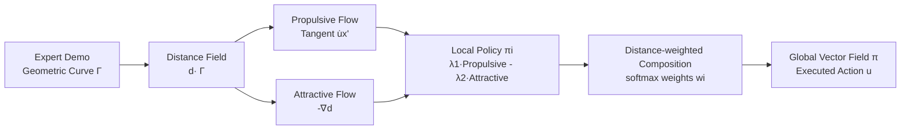

# Geometry-Aware Policy Imitation

**Conference**: ICLR 2026  
**OpenReview**: [https://openreview.net/forum?id=ggofj6tyr3](https://openreview.net/forum?id=ggofj6tyr3)  
**Code**: [Project Page](https://yimingli1998.github.io/projects/GPI/)  
**Area**: Robotics / Imitation Learning  
**Keywords**: Imitation Learning, Distance Fields, Stream Control, Non-parametric Policy, Multimodal, Dynamical Systems  

## TL;DR
GPI treats expert demonstrations as geometric curves in state space rather than sets of state-action samples. It derives two complementary control primitives—"propulsive flow + attractive flow"—from the distance field induced by these curves. These are combined into a non-parametric, interpretable vector field that directly drives the robot. While achieving higher success rates than diffusion policies, it is 20–100× faster in inference and requires two orders of magnitude less memory.

## Background & Motivation
- **Background**: Imitation learning (IL) is the dominant path for robots to acquire skills from expert demonstrations. Existing methods belong to three main families: explicit policies (supervised regression from state to action, fast but struggles with multimodality), implicit policies (learning state-action energy functions, difficult to train and slow optimization during deployment), and generative policies (diffusion/flow matching, excellent at multimodality but computationally heavy and fragile to distribution shift).
- **Limitations of Prior Work**: All three categories compress demonstrations into **parametric models**—adding new data requires retraining, and the geometric structure behind expert behavior is often discarded. Generative policies are particularly expensive: diffusion denoising requires multiple iterations, leading to high deployment latency and large memory footprints.
- **Key Challenge**: The essence of imitation is inherently simple—(i) move along the direction of expert motion, and (ii) stay as close to the expert state as possible. However, mainstream approaches use heavy parametric models to fit a policy that could otherwise be obtained through "geometric reasoning."
- **Goal**: To make imitation learning more direct, interpretable, and efficient—removing parametric policy fitting and decoupling "metric learning" from "behavior synthesis" to create a modular, training-free (given state inputs) framework that naturally supports multimodality and incremental composition.
- **Key Insight**: **Geometric reformulation of imitation** — a demonstration is a geometric curve annotated with tangential (expert action) labels, which induces a distance field. The negative gradient of the distance field provides "attraction," and the trajectory tangent provides "propulsion." Superimposing the two yields a stable first-order dynamical system that asymptotically converges to the demonstration without training any policy network.

## Method

### Overall Architecture
Given $N$ demonstrations $\mathcal{D}=\{\Gamma^{(i)}\}$, each trajectory $\Gamma^{(i)}=\{(x_t,u_t)\}$ is viewed as a geometric curve in state space. Each curve induces a distance field $d(x_o\mid\Gamma^{(i)})$, from which two complementary control primitives are derived and superimposed into a local policy. These local policies from multiple demonstrations are then combined into a global policy using distance-based weights. The entire inference process only requires "calculating distance + weighted averaging," with no parameter fitting.

### Key Designs

**1. Dual-stream Policy Induced by Distance Fields: Decomposing Imitation into "Proceeding" and "Correcting."** This is the foundation of GPI. For each demonstration, the state $x$ is first projected onto the robot-controllable **actuation subspace** $x'=P(x)$ (joint angles, end-effector poses, etc.), where control is applied. Environmental variables (object poses, images) cannot be directly actuated and are only used for demonstration similarity comparison. The distance field provides two flows: the **propulsive flow** takes the tangential action $u^{(i)}_{\kappa(x_o)}=\dot{x}'^{(i)}$ of the nearest demonstration point to move the state along the expert trajectory; the **attractive flow** takes the negative gradient of the distance field with respect to the actuation coordinates $-\nabla_{x'_o}d(x_o\mid\Gamma^{(i)})$ to pull deviant states back to the trajectory. These are linearly superimposed into a local policy:

$$\pi_i(x_o)=\lambda_1(x_o)\,u^{(i)}_{\kappa(x_o)}-\lambda_2(x_o)\,\nabla_{x'_o}d(x_o\mid\Gamma^{(i)}),$$

where $\kappa(x_o)=\arg\min_t d(x_o,x^{(i)}_t)$ is the nearest demonstration point, and weights $\lambda_1, \lambda_2 \ge 0$ are tuned such that "attraction dominates when far from the demonstration, and propulsion dominates when close." If discrete trajectories are represented by continuous functions like splines, this policy is proven to be a stable first-order dynamical system asymptotically converging to the demonstration curve, making behaviors predictable and robust to perturbations. The authors also point out that the effectiveness of diffusion policies stems from the denoising steps implicitly inducing an "attractive flow," rather than relying solely on propulsion—GPI makes this implicit mechanism explicit.

**2. Distance-Weighted Composition Across Demonstrations: Natural Multimodality without Averaging Collapse.** A single demonstration only covers a local area. The global policy retrieves the $K$ nearest demonstrations for a query state and combines them using softmax temperature weights:

$$\pi(x_o)=\sum_{i=1}^{K} w_i(x_o)\,\pi_i(x_o),\qquad w_i(x_o)=\frac{\exp(-\beta\,d(x_o\mid\Gamma^{(i)}))}{\sum_j \exp(-\beta\,d(x_o\mid\Gamma^{(j)}))}.$$

The temperature $\beta$ controls the sharpness of selection. This distance-based retrieval composition ensures that actions are only taken from the "most relevant" demonstrations. Thus, in multimodal scenarios like Y-shaped forks, the policy smoothly branches to the nearest demonstration mode instead of averaging conflicting actions into meaningless intermediate values—a common failure in explicit regression policies. Incrementally adding new demonstrations merely requires "adding an attraction basin" to the distance field without retraining.

**3. Decoupling Metric Learning and Behavior Synthesis: Unified Framework for Low and High Dimensions.** The distance metric is decomposed into a robot term $d_{\text{rob}}$ and an environment term $d_{\text{env}}$, each playing a different role: $d_{\text{env}}$ only affects the similarity ranking and weights of demonstrations, while $d_{\text{rob}}$ additionally shapes the attractive flow in the actuation subspace. Low-dimensional quantities use Euclidean distance $\|x_1-x_2\|_2$ directly; end-effector orientations use quaternion geodesic distance $2\arccos(|\langle x_1,x_2\rangle|)$ to respect rotational geometry. High-dimensional observations (images) are mapped to a latent space $z=\Psi(x)$ for distance comparison. $\Psi$ can be a lightweight task-specific head, a self-supervised VAE, or pre-trained encoders like SAM/DINO/CLIP, or even PCA. Since GPI only requires a state representation that can "calculate distance" rather than fitting a complete policy function, the learning problem is much simpler than generative models. Lightweight encoders are usually sufficient, leading to fast training and inference.

## Key Experimental Results

### Main Results Table (Push-T, State/Visual Input)

| Method | State Avg./Max. (%) | Training/Inference Time | Memory | Visual Avg./Max. (%) | Training/Inference Time | Memory |
|------|------|------|------|------|------|------|
| DDPM (100 steps) | 82.3 / 86.3 | 1.0 h / 641 ms | 252 MB | 80.9 / 85.5 | 2.5 h / 647 ms | 353 MB |
| DDIM (10 steps) | 81.5 / 85.1 | 1.0 h / 65 ms | 252 MB | 79.1 / 83.1 | 2.5 h / 67 ms | 353 MB |
| FMP | 77.6 / 80.2 | 1.0 h / 58 ms | 251 MB | 75.1 / 79.3 | 2.5 h / 60 ms | 352 MB |
| SFP | 83.1 / 87.8 | 0.8 h / 51 ms | 240 MB | 77.5 / 81.2 | 2.0 h / 55 ms | 341 MB |
| **GPI (Ours)** | **85.8 / 89.0** | **0 h / 0.6 ms** | **0.7 MB** | **83.3 / 86.9** | **0.3 h / 3.3 ms** | **44 MB** |

GPI achieves the highest success rates overall. The state-based version has an inference time of 0.6 ms (~100× faster than diffusion) and requires only 0.7 MB of memory (two orders of magnitude savings, training-free). The visual version uses ResNet-18 as a feature extractor, with a training time of 0.3 h and inference time of 3.3 ms.

### Ablation Study (Robomimic/Adroit)

| Robomimic/Adroit | Lift | Can | Square | Door | Pen | Hammer | Relocate |
|------|------|------|------|------|------|------|------|
| DP | 1.00 | 0.94 | **0.87** | 1.00 | 0.89 | 0.83 | 0.91 |
| **GPI** | 1.00 | **0.96** | 0.82 | 1.00 | **0.95** | **0.88** | 0.91 |

Visual Representation Ablation (Push-T Avg. Score): Task-specific head 87% / VAE **88%** / ResNet+PCA 84% / Diffusion Policy 85% / BYOL 67% / Pre-trained SAM (zero-shot) 41%.

### Key Findings
- **Efficiency Gap**: Under state input, it is completely training-free with 0.6 ms inference, which is 20–100× faster than diffusion policies, saving two orders of magnitude in memory.
- **Insensitive to Hyperparameters**: Performance curves for neighbor count $K=1,3,5,10$ almost overlap; planning horizon up to 16 remains stable (supporting both reactive and receding-horizon modes); also robust to softmax temperature $\beta$.
- **Data Scalability**: Success rate continues to rise with demonstrations from 1K to 20K before saturating, serving as a diagnostic tool for data requirements; relative (object-centric) states slightly outperform absolute states when data is scarce.
- **Multimodality and Controllable Randomness**: Injecting Gaussian noise $\mathcal{N}(0,\sigma^2)$ into the query state enables a trade-off between performance and trajectory diversity, with multimodality appearing at $\sigma=0.2$.
- **Adjustable Control Primitives**: Adjusting $(\lambda_1, \lambda_2)$ allows interpolation between "velocity-based (propulsion-dominant)" and "position-based (attraction-dominant)" control, with stable scores across a wide range of weights.
- **Real-robot Validation**: Completed contact-rich tasks like box flipping on Franka (single-arm) and Aloha (dual-arm), demonstrating robustness to visual perturbations and manifesting multimodal behaviors.

## Highlights & Insights
- **Value of Perspective Shift**: Reformulating "fitting parametric policies" as "geometric reasoning over distance, curvature, and composition" provides efficiency, interpretability, multimodality, and incremental composition, each with a clear geometric explanation.
- **Insight into Diffusion Policies**: Diffusion works for imitation because denoising implicitly generates an "attractive flow"; GPI explicitly decouples this layer, eliminating the need for multi-step denoising.
- **True Modularity through Decoupling**: Separation of metrics and synthesis allows the same framework to handle low-dimensional control vectors and raw images (by swapping encoders), with encoders being potentially reusable across tasks.
- **Why VAE > BYOL**: The VAE reconstruction objective preserves and smoothly parameterizes scene geometry, aligning perfectly with distance fields and flows; BYOL emphasizes augmentation invariance, which discards crucial geometric information.

## Limitations & Future Work
- **Dependency on Metric Quality**: Performance under high-dimensional vision depends strongly on whether the latent space is "geometrically friendly"—pre-trained SAM with zero-shot achieved only 41%, suggesting not all encoders are suitable.
- **Linear Storage Scaling**: As a non-parametric method, it requires storing all demonstrations, raising concerns about memory and retrieval costs for extremely large demonstration sets (though still much smaller than large networks currently).
- **Implicit Assumptions on Contact/Dynamics**: Convergence proofs rely on state-action continuity and continuous function (spline) representation of trajectories; theoretical guarantees under highly discontinuous contact require further extension.
- **Future Directions**: Automatically learning "geometrically friendly" metrics, faster neighbor retrieval, and tighter integration of acceleration/torque control with real-robot dynamics.

## Related Work & Insights
- **Generative Policies** (Diffusion Policy, Flow Matching, Streaming Flow Policy) are direct baselines—GPI replaces heavy generative heads with geometric reasoning.
- **Non-parametric Imitation** (e.g., VINN/Pari et al. using BYOL for nearest neighbor policies) shares similar ideas, but GPI adds the attractive flow from distance field gradients and a provably convergent dynamical system.
- **Dynamical System-based Imitation** (Stable DS by Calinon, Li & Calinon) provides the theoretical foundation, which this paper generalizes to high-dimensional perceptual inputs and multi-demonstration compositions.
- **Insight**: When the "expert behavior" of a task possesses strong geometric structure (trajectories, manifolds), considering whether a policy can be directly constructed using geometric fields is often more efficient, stable, and interpretable than forcing a parametric generative model.

## Rating
- **Novelty**: ⭐⭐⭐⭐⭐ Reformulating imitation learning from "fitting parametric policies" to "geometric reasoning on distance/flow fields" is a fresh, self-consistent perspective that explains the essence of why diffusion policies work.
- **Experimental Thoroughness**: ⭐⭐⭐⭐ Covers Push-T, Robomimic, Adroit, and real-robot Franka/Aloha, with extensive ablations (K, horizon, noise, representation, data scale). Theoretical boundaries under contact dynamics could be further explored.
- **Writing Quality**: ⭐⭐⭐⭐⭐ Clear motivational progression; geometric intuition, formulas, and diagrams are well-coordinated with high readability.
- **Value**: ⭐⭐⭐⭐⭐ Offers higher success rates with orders of magnitude advantages in efficiency and memory. Training-free, incremental, and interpretable properties make it highly attractive for real-robot deployment.

<!-- RELATED:START -->

## Related Papers

- [\[ICLR 2026\] Translating Flow to Policy via Hindsight Online Imitation](translating_flow_to_policy_via_hindsight_online_imitation.md)
- [\[ICLR 2026\] Difference-Aware Retrieval Policies for Imitation Learning](difference-aware_retrieval_policies_for_imitation_learning.md)
- [\[ICLR 2026\] HAMLET: Switch Your Vision-Language-Action Model into a History-Aware Policy](hamlet_switch_your_vision-language-action_model_into_a_history-aware_policy.md)
- [\[ICLR 2026\] Manipulation as in Simulation: Enabling Accurate Geometry Perception in Robots](manipulation_as_in_simulation_enabling_accurate_geometry_perception_in_robots.md)
- [\[ICLR 2026\] Primary-Fine Decoupling for Action Generation in Robotic Imitation](primary-fine_decoupling_for_action_generation_in_robotic_imitation.md)

<!-- RELATED:END -->
