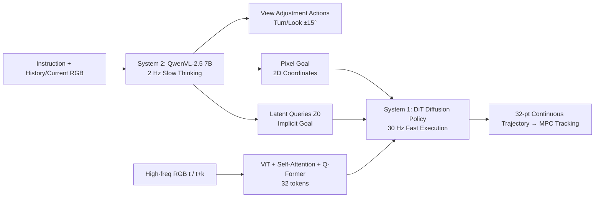

# Ground Slow, Move Fast: A Dual-System Foundation Model for Generalizable Vision-Language Navigation

**Conference**: ICLR 2026  
**OpenReview**: [https://openreview.net/forum?id=GK4rznYwhn](https://openreview.net/forum?id=GK4rznYwhn)  
**Code**: [InternNav (InternVLA-N1)](https://github.com/InternRobotics/InternNav)  
**Area**: Embodied Navigation / Vision-Language Navigation (VLN) / Dual-System VLA  
**Keywords**: Vision-Language Navigation, Dual-System, Diffusion Policy, Pixel Goal, Flow Matching  

## TL;DR
DualVLN (InternVLA-N1) decouples vision-language navigation into a "Slow System" (7B VLM) for pixel goal grounding and a "Fast System" (lightweight diffusion policy) for continuous trajectory generation. Operating asynchronously, the two systems achieve new SOTA results on VLN-CE / VLN-PE and enable real-world dynamic obstacle avoidance.

## Background & Motivation
**Background**: Vision-Language Navigation (VLN) has evolved from early discrete target planning to continuous action spaces (VLN-CE), and recently to realistic simulations with physical controllers (VLN-PE). The introduction of Large VLMs has granted navigation systems strong generalization capabilities across diverse instructions and environments, becoming the current mainstream approach.

**Limitations of Prior Work**: Existing VLA navigation models mostly follow an "end-to-end tightly coupled" paradigm—directly mapping vision-language inputs to short-horizon discrete actions (e.g., "move forward 0.25 meters"). This leads to three major drawbacks: (1) Actions are fragmented and unnatural, requiring a large VLM call at every step, resulting in **high execution latency**; (2) Vision-language reasoning, global planning, and local control are all compressed into a single pipeline, leading to a **lack of explicit coordination** between levels; (3) It is difficult to meet real-world deployment requirements such as agile control and dynamic obstacle avoidance.

**Key Challenge**: Large VLMs are powerful but slow (high latency, low frequency), whereas real-world navigation requires high-frequency, smooth local control that can react to dynamic obstacles in real time—**reasoning capability and control agility cannot be easily reconciled within a single model**.

**Goal**: Construct the first dual-system VLN foundation model that explicitly bridges VLM reasoning strengths with the agility required for real-time control, maintaining generalization while supporting high-frequency dynamic avoidance.

**Core Idea**: **Decoupling "Slow Thinking + Fast Execution"**—System 2 (7B VLM, 2 Hz) performs slow but robust "pixel goal grounding," while System 1 (lightweight Diffusion Transformer, 30 Hz) converts goals into continuous trajectories for fast execution. The two are connected via a dual-channel of **explicit pixel goals + implicit latent goals**, with **decoupled sequential training** to preserve VLM generalization.

## Method

### Overall Architecture
DualVLN consists of two systems running asynchronously. System 2 receives a first-person RGB sequence and language instructions, iteratively deciding whether to "adjust the viewpoint" or "output a pixel goal," predicting the next medium-term waypoint as 2D pixel coordinates on the image. Simultaneously, it extracts compact implicit goal features through learnable latent queries. System 1 is a multimodal conditional Diffusion Transformer (DiT) that consumes the low-frequency latent goals from System 2 alongside its own high-frequency RGB input, using flow matching to generate 32 dense trajectory points. The slow system (2 Hz) and fast system (30 Hz) operate asynchronously, ensuring new trajectories are available at any moment for smooth continuous navigation.

### Key Designs

**1. Farthest pixel goal grounding + autonomous view adjustment: Let the VLM "see clearly before pointing"**. System 2 leverages the spatial grounding capabilities of Qwen-VL-2.5 (7B) to reformulate high-level planning as a "farthest pixel goal grounding" problem: the model outputs the 2D coordinates of the next optimal waypoint in the image. Training samples are generated by projecting 3D trajectories onto the 2D first-person view—using depth maps and camera-point distance to judge visibility. Points exceeding the depth value are discarded as occluded, and VLN-CE trajectories are segmented into pixel goal samples. However, simple projection fails if the viewpoint is too high (ground points occluded) or if the heading is incorrect (waypoint falls outside the FOV). Drawing inspiration from human navigation "looking around and down at the ground before choosing a path," System 2 uses discrete actions (`Turn Left/Right 15°`, `Look Up/Down 15°`) to **autonomously decide when to scan the environment and adjust camera angles**, predicting pixel goals only under informative views.

**2. Dual-channel connection with explicit pixel goals + implicit latent goals**. Relying solely on 2D pixel goals for guiding System 1 would reduce the dual-system to a loose modular pipeline, failing to leverage the VLM's rich hidden features; relying solely on latents loses interpretability. This work uses both: System 2 is first trained on the pixel grounding task and **its weights are frozen**, then a set of randomly initialized learnable latent queries $Z$ is added and optimized via prompt tuning. The context sequence $X$ (instructions, history/current images, view actions, pixel goals) is concatenated with $Z$ as $[X; Z]$ and passed through the VLM, allowing $Z$ to attend to and extract task-relevant semantics from $X$, resulting in the intermediate implicit goal $Z_0$. Thus, the pixel goal provides an interpretable, generalizable explicit anchor, while the latent goal provides richer adaptive guidance, allowing System 1 to automatically select useful representations for local planning from heterogeneous VLM hidden states.

**3. Multimodal conditional Diffusion Transformer + asynchronous stale goal compensation**. System 1 is a compact DiT (hidden dimension 384, 12 layers, 6 heads) generating trajectories based on two conditions: low-frequency latent goals $Z_0$ (linearly projected from 3584 to 768 and cross-attended) and high-frequency RGB. The challenge is that in asynchronous inference, the latent goal generated at time $t$ becomes **stale** by time $t+k$—System 1 must estimate the distance traveled and adapt to dynamic changes. The solution involves encoding both the last RGB frame from System 2 at time $t$ and the current observation at $t+k$. Features are extracted using a ViT (DepthAnythingV2-Small), fused across time steps via self-attention, and compressed into 32 tokens by a Q-Former as high-frequency visual conditions.

**4. Flow Matching trajectory generation**. Given a ground-truth trajectory $X_0$ and dual conditions $(Z_0, F)$, a diffusion timestamp $u\sim U(0,1)$ and noise $\epsilon\sim N(0,I)$ are sampled to construct a noisy trajectory $X_u=\alpha_u X_0+\sigma_u\epsilon$ (where $\alpha_u$ decreases and $\sigma_u$ increases). The DiT predicts the velocity field $\hat{\dot{X}}_u=f_\theta(X_u, u, Z_0\oplus F)$, with the training objective defined by the Mean Squared Error of velocity: $L_{flow}=\mathbb{E}_{u,X_0,\epsilon}\big[\|\hat{\dot{X}}_u-\dot{X}_u\|_2^2\big]$. During inference, System 1 uses TensorRT to handle 32 trajectory points in parallel within 0.03 s, which, coupled with System 2's KV-cache reuse (reducing trajectory token inference from 1.1 s to 0.7 s), achieves near-real-time performance.

## Key Experimental Results

### Main Results (VLN-CE R2R / RxR Val-Unseen)

| Method | R2R SR↑ | R2R SPL↑ | R2R NE↓ | RxR SR↑ | RxR nDTW↑ |
|------|---------|----------|---------|---------|-----------|
| NaVid | 37.4 | 35.9 | 5.47 | – | – |
| NaVILA | 54.0 | 49.0 | 5.22 | 49.3 | 58.8 |
| UniNaVid | 47.0 | 42.7 | 5.58 | 48.7 | – |
| StreamVLN | 56.9 | 51.9 | 4.98 | 52.9 | 61.9 |
| **Ours (DualVLN)** | **64.3** | **58.5** | **4.05** | **61.4** | **70.0** |

Using only first-person RGB, DualVLN exceeds the strongest baseline StreamVLN by **+7.4 points** in R2R SR and outperforms multi-sensor, VLM-free, and Video-LLM baselines across the board.

For VLN-PE (physical controller, zero-shot transfer from VLN-CE): DualVLN achieves an R2R Val-Unseen SR of **51.60** and SPL of 42.49, whereas the zero-shot NaVid only reaches 21.58 and CMA 16.93—significantly outperforming baselines even without fine-tuning on VLN-PE.

### Ablation Study
Goal Representation Ablation (Figure 7, VLN-CE R2R Val-Unseen):

| Variant | SR↑ | SPL↑ | OS↑ | NE↓ |
|------|-----|------|-----|-----|
| **DualVLN (Full)** | **64.3** | **58.5** | **70.7** | **4.05** |
| w/o Sys.2 Train (One-stage joint training) | 55.2 | 51.5 | 60.9 | 4.98 |
| w/o Pixel Goal (Remove explicit goal) | 62.2 | 55.8 | 68.0 | 4.22 |
| w/o Latent Goal (Frozen VLM hidden states only) | 60.9 | 55.1 | 67.7 | 4.26 |

Local Planner Comparison (Table 4, VLN-PE flash controller, R2R Val-Unseen):

| Local Planner | SR↑ | SPL↑ | NE↓ |
|---------------|-----|------|-----|
| iPlanner | 47.07 | 41.09 | 4.91 |
| NavDP | 58.72 | 50.98 | 4.22 |
| **System 1** | **63.62** | — | **3.90** |

### Key Findings
- **Decoupled sequential training is crucial**: One-stage joint training (w/o Sys.2 Train) leads to a 9.1 point drop in SR, with the diffusion policy converging significantly slower and VLM generalization degrading—proving intermediate pixel goals are indispensable for efficient learning and maintaining VLM reasoning.
- **Explicit + Implicit goals are both necessary**: Removing pixel goals drops SR by 2.1 points, and removing latent goals drops SR by 3.4 points; they are complementary. Latent queries allow System 1 to actively select which hidden states to use as conditions rather than passively consuming fixed features.
- **Social-VLN Benchmark**: This work constructs the first Social-VLN based on R2R-CE + Habitat 3.0 humanoid, introducing Human Collision Rate (HCR). In dynamic scenes, DualVLN SR (37.2) still outperforms StreamVLN (31.4), but drops by ~27% compared to static VLN, indicating significant room for improvement in social-aware navigation.
- **Cross-embodiment real-world deployment**: Zero-shot deployment on wheeled (Turtlebot4), quadruped (Go2), and humanoid (G1) platforms demonstrates correct pixel goal selection, smooth obstacle avoidance, and the ability to navigate stairs and pedestrians.

## Highlights & Insights
- **First asynchronous dual-system VLN foundation model**: Extends "slow-fast" reasoning to long-horizon, cross-building navigation for the first time, breaking the latency bottleneck of large VLMs.
- **Clever choice of intermediate representation**: Pixel goal grounding acts as an interpretable output for System 2, a natural supervision signal for data splitting, and an explicit anchor for System 1.
- **"Anthropomorphic" autonomous view adjustment**: Allowing the model to "look down at the ground and around before deciding" elegantly solves occlusion and out-of-FOV issues in 3D→2D projection.
- **Solid engineering execution**: KV-cache reuse + TensorRT + MPC tracking provides a clear frequency hierarchy of 2 Hz/30 Hz/200 Hz, supported by the open-sourced InternNav / InternVLA-N1 / InternData-N1 stack.

## Limitations & Future Work
- **Social-VLN remains unresolved**: Dynamic scene SR is only 37.2, and HCR remains high at 35.4. Obstacle avoidance and task recovery in crowded environments are limited.
- **Dependence on remote compute**: The full model runs on a remote RTX 4090 server (20 GB), requiring real-time RGB-D streaming, posing demands on network and compute without edge-side optimization.
- **Sensitivity to camera extrinsics**: While autonomous view adjustment helps, grounding quality is still affected by camera height/pitch (real-world tests used a fixed 15° downward tilt).
- **System 2 remains at 2 Hz**: High-level replanning frequency is limited, meaning medium-term goals may lag behind extremely fast environmental changes.

## Related Work & Insights
- **Navigation VLA**: NaVid / UniNaVid / NaVILA / StreamVLN treat actions as next-token prediction; UniVLA / TrackVLA map VLM latents directly to continuous trajectories but are restricted by synchronous frameworks; RoboPoint / NaviMaster use pixel grounding but require additional execution modules. DualVLN is the first to support long-horizon, asynchronous, cross-building navigation.
- **Slow-Fast Systems**: FigureAI and related works explore slow-fast reasoning but focus on tabletop manipulation. This work is the first to address long-horizon planning and navigation.
- **Visualization Navigation Policies**: Traditional modular methods (DWA / RRT) suffer from cumulative error; learning-based methods (GNM / ViNT / NoMaD) improve zero-shot generalization. System 1 is an RGB-only diffusion navigation policy conditioned on VLM latents.
- **Insight**: Decoupled dual systems + asynchronous inference is a general paradigm for bringing VLM reasoning to real-time control, applicable to manipulation and mobile manipulation tasks.

## Rating
- **Novelty**: ⭐⭐⭐⭐⭐ First asynchronous dual-system VLN foundation model. The combination of pixel goal grounding, dual-goal connection, and autonomous view adjustment is highly original.
- **Experimental Thoroughness**: ⭐⭐⭐⭐⭐ Comprehensive coverage across VLN-CE/VLN-PE/Social-VLN benchmarks, three-platform real-world tests, and complete ablations.
- **Writing Quality**: ⭐⭐⭐⭐ Clear motivation, well-posed "Why" questions, and smooth explanation of the architecture and frequency hierarchy.
- **Value**: ⭐⭐⭐⭐⭐ Sets new SOTA records, open-sources a full stack (models/data/code), and proposes the Social-VLN benchmark.

<!-- RELATED:START -->

## Related Papers

- [\[ICLR 2026\] SpikePingpong: Spike Vision-based Fast-Slow Pingpong Robot System](spikepingpong_spike_vision-based_fast-slow_pingpong_robot_system.md)
- [\[ICLR 2026\] Embodied Navigation Foundation Model](embodied_navigation_foundation_model.md)
- [\[ICLR 2026\] Genie Envisioner: A Unified World Foundation Platform for Robotic Manipulation](genie_envisioner_a_unified_world_foundation_platform_for_robotic_manipulation.md)
- [\[CVPR 2026\] Towards Open Environments and Instructions: General Vision-Language Navigation via Fast-Slow Interactive Reasoning](../../CVPR2026/robotics/towards_open_environments_and_instructions_general_vision-language_navigation_vi.md)
- [\[ICLR 2026\] JanusVLN: Decoupling Semantics and Spatiality with Dual Implicit Memory for Vision-Language Navigation](janusvln_decoupling_semantics_and_spatiality_with_dual_implicit_memory_for_visio.md)

<!-- RELATED:END -->
