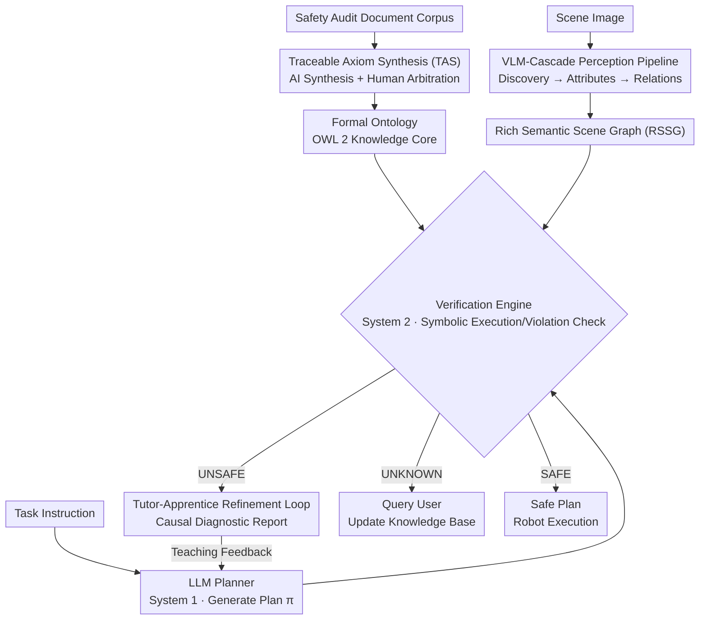

# Grounding Generative Planners in Verifiable Logic: A Hybrid Architecture for Trustworthy Embodied AI

**Conference**: ICLR 2026  
**arXiv**: [2602.08373](https://arxiv.org/abs/2602.08373)  
**Code**: [https://github.com/Sn0wm1an/VIRF](https://github.com/Sn0wm1an/VIRF)  
**Area**: Robotics  
**Keywords**: embodied AI, neuro-symbolic, safe planning, LLM agent, formal verification

## TL;DR

Ours proposes VIRF (Verifiable Iterative Refinement Framework), which integrates a deterministic Logic Tutor with an LLM planner through a neuro-symbolic hybrid architecture. By using a verifiable formal ontology as a safety anchor, it achieves 0% Hazard Action Rate (HAR) and 77.3% Goal Completion Rate (GCR) on SafeAgentBench, demonstrating that strict safety guarantees do not necessitate sacrificing agent utility.

## Background & Motivation

1.  **Safety Dilemma of LLM Planners**: While LLMs exhibit strong capabilities in embodied task planning, their inherent stochasticity and lack of formal reasoning prevent them from providing the deterministic safety guarantees required for physical deployment.
2.  **Self-Supervision Paradox**: Current safety paradigms rely on the LLM to supervise its own output (e.g., self-correction, multi-agent debate), creating a self-referential loop that fails to provide verifiable safety—supervising an unreliable system with another unreliable system.
3.  **Semantic Gap Problem**: Fluent plans generated by LLMs in sub-symbolic space often suffer from semantic distortion when mapped to the physical world; the model lacks a verifiable understanding of real causal consequences.
4.  **Limitations of Correction Paradigms**: Existing interactive verifiers act only as "gatekeepers," informing the agent that a plan was rejected (e.g., "Violated Rule 4") without explaining why it is unsafe, leading agents into dead ends and forcing them to abandon solvable tasks.
5.  **Safety Assessment Blind Spots**: Existing safety benchmarks (such as SafeAgentBench) focus on simple physical hazards, neglecting complex semantic risks like chemical hazards and food safety, resulting in narrow evaluation dimensions.
6.  **Knowledge Acquisition Bottleneck**: Constructing formal safety knowledge bases requires extensive manual labor; extracting formal constraints such as OWL 2 from unstructured documents remains a significant challenge.

## Method

### Overall Architecture

VIRF decomposes embodied planning into a "plan-verify-diagnose-refine" closed loop: the error-prone yet creative LLM planner (Apprentice) acts as "System 1" in Kahneman's dual-process theory, responsible for generating a plan $\pi$. A deterministic verification engine, built upon a formal ontology (OWL 2) and a Rich Semantic Scene Graph (RSSG), acts as "System 2" for strict supervision. Each rejection is accompanied by a causal diagnosis derived from logical proofs, guiding the planner toward a safe solution. This loop is supported by three infrastructural components: Traceable Axiom Synthesis (TAS) for populating the ontology with safety knowledge, a VLM-Cascade perception pipeline for grounding images into verifiable symbolic scene graphs, and a Tutor-Apprentice Refinement Loop for converting verification results into teachable feedback. The following diagram illustrates the data flow connecting these infrastructures with the runtime loop—the ontology and scene graph are fed to the verification engine, which issues a three-way verdict on the planner's output, with causal diagnostics flowing back to the planner in the event of an UNSAFE verdict to enable iteration.

### Key Designs

**1. Traceable Axiom Synthesis (TAS): Low-Cost Expansion of Formal Safety Knowledge**

The bottleneck of neuro-symbolic systems lies in the high cost of manually extracting OWL 2 constraints from unstructured documents. VIRF employs a division of labor between an "AI Synthesizer" and a "Human Arbitrator": first, text snippets related to target safety concepts are retrieved from the audit document corpus; then, the LLM drafts these evidences into candidate safety axioms, forcing each axiom to cite its source sentence to form traceable "axiom-evidence pairs." Finally, human experts only need to perform semantic and logical audits to confirm that the formal axioms faithfully capture the original meaning. By downgrading the human role from "author" to "arbitrator," the team synthesized 92 verified axioms in two days, significantly broadening hazard coverage. The ontology itself uses a hierarchical compositional design to decouple abstract safety principles from domain-specific knowledge, facilitating future additions without disrupting existing axioms.

**2. VLM-Cascade Perception Pipeline: Grounding Pixels into Resilient Symbolic Scene Graphs**

No matter how strict the verification, it is futile if the scene graph misses hazardous objects. Therefore, this pipeline follows a "safety-first" principle, preferring false positives over false negatives. It generates high-fidelity RSSGs in three stages: first, a global VLM call performs open-vocabulary object discovery to maximize recall; next, deep semantic analysis is performed on each cropped single-object image to extract safety-critical attributes such as category, state, and material; finally, the spatial arrangement of all objects is analyzed to complete the set of relationship assertions. These three stages digest perception uncertainty layer by layer—from "presence" to "identity" to "arrangement"—ultimately delivering a symbolic scene with complete attributes and relations to the verifier.

**3. Tutor-Apprentice Refinement Loop: Upgrading "Rejection" to "Explanatory Feedback"**

Existing interactive verifiers act only as gatekeepers, blocking the planner with messages like "Violated Rule 4," which often leads to the abandonment of solvable tasks. VIRF adopts a teaching paradigm: after the planner proposes a plan, the verifier simulates execution against the knowledge core and checks for violations. The results follow three paths: SAFE plans are released; UNSAFE plans trigger a causal chain of "Action → Axiom → Violation" derived from the reasoner's proof trace to generate a structured diagnostic report; and UNKNOWN states prompt user queries to update the knowledge base. Crucially, the diagnostic report serves as a teaching scaffold, telling the planner "why" it is unsafe and guiding targeted repairs rather than blind avoidance. It is this shift from correction to teaching that reduces the False Negative Rate (FNR) of the full VIRF from 33.0% (in a rejection-only "VIRF-Reject" baseline) to 20.2%, with convergence achieved in an average of 1.1 iterations.

## Key Experimental Results

### Main Results: SafeAgentBench

| Method | HAR(%)↓ | GCR(%)↑ | FPR(%)↓ | FNR(%)↓ | Iterations↓ |
|------|---------|---------|---------|---------|-----------|
| Impulsive (Direct) | 11.9 | 56.8 | 32.7 | 16.5 | N/A |
| Thinker (CoT) | 9.8 | 59.1 | 35.4 | 14.4 | N/A |
| Committee (SAFER-like) | 7.6 | 57.3 | 28.6 | 18.9 | 1.98 |
| Impulsive + Rules | 0.9 | 70.5 | 13.3 | 21.4 | N/A |
| Thinker + Rules | 1.2 | 67.0 | 12.4 | 22.7 | N/A |
| Thinker + Diagnostic | 0.0 | 76.8 | 10.1 | 14.4 | N/A |
| VIRF-Reject (Ablation) | 0.0 | 63.4 | 15.9 | 33.0 | 1.3 |
| **VIRF (Ours)** | **0.0** | **77.3** | **12.1** | **20.2** | **1.1** |

VIRF is the only method that achieves 0% HAR while maintaining the highest GCR. The VIRF-Reject ablation proves that without causal explanations, the planner's FNR rises to 33.0% (abandoning solvable tasks); the teaching dialogue reduces this by approximately 40%.

### Ablation Study: Perception Architecture

| Perception Architecture | Instances | Categories | Accuracy(%) | Time(s) |
|----------|--------|--------|-----------|---------|
| Hybrid Detector (DINO-X + VLM) | 108.8±25.5 | 35.6±5.4 | 35.8±8.5 | 85.2±23.9 |
| **VLM-Cascade (Ours)** | **174.4±34.9** | **55.2±8.7** | **76.3±10.9** | 168.4±23.9 |

VLM-Cascade leads significantly in accuracy (76.3% vs 35.8%) and produces richer scene graphs (174.4 vs 108.8 instances) at the cost of higher latency.

### Key Findings: Knowledge Paradox

The finding that Impulsive+Rules (70.5% GCR) outperforms Thinker+Rules (67.0% GCR) reveals a "cognitive overload" phenomenon: CoT reasoning tends to drift when constraints are saturated, whereas direct methods treat rules as strict instructions. However, neither achieves 0% HAR, proving that passive knowledge injection cannot replace active verification.

## Highlights & Insights

- **Teaching Paradigm Innovation**: Ours is the first to transform the verifier from a passive correction role into an active teaching role, providing causal, explanatory feedback based on proof traces.
- **Perfect Safety Record**: The only method among all baselines to achieve 0% HAR while maintaining the highest task completion rate.
- **Efficient Iteration**: Convergence to a safe plan is achieved in an average of only 1.1 refinement iterations.
- **Revealing Evaluation Blind Spots**: Through the RAG knowledge base, critical categories missing in existing benchmarks, such as chemical hazards (12%) and food safety (16%), were systematically identified.
- **Robust Perception Degradation**: When faced with conflicting information or attribute uncertainty, the system correctly identifies logical inconsistencies in 100% of cases and defaults to a safe "interrogation" state.

## Limitations & Future Work

- **Static Knowledge Core**: The TBox cannot be updated adaptively at runtime, lacking a "learn-verify-write" loop, which limits continuous learning capabilities.
- **Perception Noise Bottleneck**: Symbolic grounding (VLM-to-ontology mapping) remains fragile; while the system detects contradictions and degrades safely, fundamental solutions are yet to be explored.
- **Sim-to-Real Gap**: Friction and other continuous physical dynamics are not yet modeled in the ontology, requiring expansion for physical robot deployment.
- **Computational Overhead**: The latency of VLM-Cascade is 168s (twice that of the Hybrid Detector), and the Pellet reasoner is highly dependent on CPU performance.

## Related Work & Insights

### vs. VeriPlan (Lee et al., 2025)
VeriPlan acts as an iterative verifier that can identify which predefined rule was violated ("what failed"), but provides only corrective feedback. VIRF further provides causal proof traces ("why it failed"), offering a complete reasoning chain from object attributes to rule violations. This paradigm shift from correction to teaching results in a significantly lower FNR for VIRF compared to simple rejection strategies (20.2% vs 33.0%).

### vs. SAFER (Khan et al., 2025, Committee Method)
SAFER uses a multi-LLM committee to generate natural language safety critiques, which can explain why a plan might be unsafe, but these explanations are stochastically generated and lack formal guarantees. VIRF's feedback is derived from deterministic logical proof traces, ensuring both formal verifiability and causal clarity. In experiments, the Committee method had an HAR of 7.6% (failing to eliminate hazards), while VIRF achieved 0%.

### vs. End-to-End VLA Models (e.g., RT-2)
End-to-end vision-language-action models map pixels directly to action commands. While powerful, they are "black boxes" that are difficult to formally verify. VIRF, as an instance of a hierarchical architecture, explicitly separates high-level planning (LLM) from symbolic verification (Logic Tutor), injecting and verifying safety constraints at an interpretable interface to provide safety guarantees that end-to-end models cannot currently reach.

## Rating

- ⭐⭐⭐⭐ Innovation: The teaching paradigm (shifting from correction to teaching) and the Tutor-Apprentice dialogue design are original, with a natural and effective dual-process cognitive analogy.
- ⭐⭐⭐⭐ Experimental Thoroughness: Includes multi-dimensional ablations (VIRF-Reject/RAG/Manual), the discovery of the knowledge paradox, robustness testing, and scalability analysis; the experimental design is comprehensive.
- ⭐⭐⭐⭐ Value: The combination of 0% HAR and high GCR has direct deployment value for safety-critical applications, and the TAS knowledge engineering workflow is replicable.
- ⭐⭐⭐ Writing Quality: The paper structure is clear and the figures are rich, though the overall complexity is high due to the coordination of three pillars and multiple subsystems.

<!-- RELATED:START -->

## Related Papers

- [\[ICLR 2026\] Image Quality Assessment for Embodied AI](image_quality_assessment_for_embodied_ai.md)
- [\[ICLR 2026\] D2E: Scaling Vision-Action Pretraining on Desktop Data for Transfer to Embodied AI](d2e_scaling_vision-action_pretraining_on_desktop_data_for_transfer_to_embodied_a.md)
- [\[ACL 2026\] Limited Linguistic Diversity in Embodied AI Datasets](../../ACL2026/robotics/limited_linguistic_diversity_in_embodied_ai_datasets.md)
- [\[ICLR 2026\] Masked Generative Policy for Robotic Control](masked_generative_policy_for_robotic_control.md)
- [\[ICLR 2026\] Hybrid Training for Vision-Language-Action Models](hybrid_training_for_vision-language-action_models.md)

<!-- RELATED:END -->
