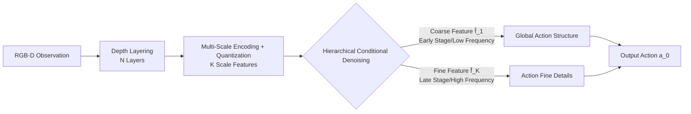

# H$^3$DP: Triply-Hierarchical Diffusion Policy for Visuomotor Learning

**Conference**: ICLR 2026  
**OpenReview**: [https://openreview.net/forum?id=Q1CP0iAmOb](https://openreview.net/forum?id=Q1CP0iAmOb)  
**Code**: [https://h3-dp.github.io/](https://h3-dp.github.io/)  
**Area**: Robotics / Visuomotor Policy / Diffusion Policy  
**Keywords**: Diffusion Policy, Visuomotor Learning, Hierarchical Modeling, Depth Stratification, Multi-scale Representation, Robot Manipulation  

## TL;DR
H3DP simultaneously introduces "Input Hierarchy (depth-slicing RGB-D) + Representation Hierarchy (multi-scale visual features) + Action Hierarchy (coarse-to-fine hierarchical conditional denoising)" into visuomotor diffusion policies. By explicitly coupling visual perception with action generation, it achieves an average improvement of +27.5% across 44 simulation tasks and +72.4% on real-world dual-arm tasks relative to baselines.

## Background & Motivation
**Background**: Visuomotor policy learning has become a mainstream paradigm for robot manipulation. Recently, generative methods such as Diffusion Policy and DP3 have been widely adopted to model action distributions.

**Limitations of Prior Work**: Existing methods typically focus independently on the "visual representation side" or the "action generation side"—either by adopting stronger point cloud/image encoders or by modifying denoising/inference workflows—while **ignoring the tight coupling between perception and action**. Although works like Dense Policy, CARP, and ARP have introduced hierarchical concepts, they only perform hierarchical modeling on the **action generation process**, failing to integrate hierarchy throughout the entire "vision $\rightarrow$ action" pipeline.

**Key Challenge**: Human decision-making inherently involves hierarchical processing from perception to action (the visual cortex extracts features hierarchically $\rightarrow$ hierarchical reasoning $\rightarrow$ generation of structured motor behavior). Current policies treat visual encoding and action generation as two decoupled modules. This lack of correspondence between features and actions leads to fragility in cluttered, occluded, or long-horizon scenarios. Furthermore, the simple concatenation of RGB-D has repeatedly shown limited benefits.

**Goal**: To construct a visuomotor framework that integrates hierarchical structures across the three stages of "input-representation-action," ensuring that action generation is semantically grounded in multi-scale perceptual features.

**Key Insight**: **Triple Hierarchical Coupling** — The input layer slices RGB-D into multiple layers by depth; the representation layer encodes each layer into multi-scale discrete features; the action layer leverages the inherent inductive bias of "low-frequency first, high-frequency later" in diffusion models. Coarse features guide early denoising to generate the global action structure, while fine features guide late denoising to refine details, thereby aligning vision and action at the same hierarchical level.

## Method

### Overall Architecture
H3DP links triple hierarchies through a single pipeline: "Visual Input $\rightarrow$ Depth Layering $\rightarrow$ Multi-Scale Representation $\rightarrow$ Hierarchical Action Generation." Given RGB-D observations, it first discretizes the image into $N$ non-overlapping layers based on depth (distinguishing foreground/background and suppressing interference/occlusions). Each layer is independently encoded and quantized into $K$ scales of discrete features (coarse scales capture global context, fine scales capture local details). On the action side, the $T$ diffusion denoising steps are divided into $K$ stages. Stage $k$ is conditioned on the corresponding scale features $\hat f_k$ for denoising, achieving coarse-to-fine action generation.

### Key Designs

**1. Depth-Aware Layering: Slicing and encoding the scene by depth.** Real-world manipulation depends heavily on 3D structure, but simple RGB and depth concatenation is often ineffective. H3DP defines a set of depth boundaries $\{d_0=d_{\min}, d_1, \dots, d_N=d_{\max}\}$. The $m$-th layer only retains pixels within the interval $[d_{m-1}, d_m)$: mask $M_m^{(i,j)} = \mathbb{I}[d_{m-1}\le D^{(i,j)} < d_m]$, layered image $I_m = I \odot M_m$. Each layer is encoded independently, enabling the policy to selectively focus on different depth planes, explicitly distinguishing foreground/background and suppressing distractors/occlusions. Ablations suggest $N=3$ or $4$ is optimal; too few layers revert to standard RGB-D, while too many fragment the representation and weaken capacity.

**2. Multi-Scale Visual Representation: Compressing each layer into multi-granularity discrete features using VQ codebooks.** Conventional methods often compress image features into a single resolution vector, losing spatial structure and semantics. H3DP encodes each layered image $I_m$ into $K$ scales of feature maps $\{f_{m,k}\in\mathbb{R}^{h_k\times w_k\times C}\}$ and leverages VQ-VAE logic to quantize each feature vector to the nearest neighbor in a learnable codebook $Z_m$: $f_{m,k}^{(i,j)}\leftarrow \arg\min_{z\in Z_m}\|z - f_{m,k}^{(i,j)}\|_2$. Interpolation and lightweight convolutions then produce $\hat f_{m,k}$. Training uses a consistency loss $L_{\text{consistency}}=\sum_{m,k}(\|\hat f_{m,k}-\mathrm{sg}(f_m)\|_2^2 + \beta\|f_m-\mathrm{sg}(\hat f_{m,k})\|_2^2)$ to align scales with the original features ($\mathrm{sg}$ denotes stop-gradient). While the theoretical optimal solution might make features across scales converge, limited codebook capacity and downsampling ensure coarse scales retain global context while fine scales retain local details, forming an inductive bias for action generation. The entire encoder has < 0.7M parameters, making it more efficient than switching to DINOv2.

**3. Hierarchical Conditioned Action Generation: Aligning denoising stages with visual scales.** This is the key to truly coupling vision and action. Diffusion denoising naturally reconstructs "low-frequency first, then high-frequency." H3DP partitions the $T$ denoising steps into $K$ stages $\cup_{k=1}^{K}(\tau_{k-1},\tau_k]$. When $t\in(\tau_{k-1},\tau_k]$, the denoising network predicts noise $\epsilon_t=\epsilon_\theta^{(t)}(a_t|\hat f_k, q)$ conditioned on the corresponding scale features $\hat f_k$ and robot pose $q$. The clean action $a_0$ is then recovered from Gaussian noise $a_T$ via $a_{t-1}=\alpha_t a_t + \beta_t \epsilon_t + \sigma_t \tilde\epsilon_t$. Early stages (high noise) use coarse features to shape the global action structure (low-frequency), while later stages (low noise) use fine features to refine details (high-frequency). During training, applying the standard diffusion loss $L_{\text{diffusion}}=\mathbb{E}\|\epsilon_\theta^{(t)}(a_t|\hat f_K, q)-\epsilon\|^2$ only to the final features $\hat f_K$ allows gradients to propagate through the entire hierarchical encoder, implicitly optimizing all scales while maintaining efficiency. The authors validated through DFT spectral analysis that actions indeed evolve from low-frequency to high-frequency during denoising, supporting this design fundamentally.

## Key Experimental Results

### Main Results
5 simulation benchmarks with a total of 44 tasks (Success Rate %, 3 seeds):

| Method | MetaWorld(Med 11) | MetaWorld(Hard 5) | MetaWorld(Hard++ 5) | ManiSkill(Deform 4) | ManiSkill(Rigid 4) | Adroit(3) | DexArt(4) | RoboTwin(8) | Avg(44) |
|---|---|---|---|---|---|---|---|---|---|
| DP | 78.2 | 52.6 | 58.0 | 22.3 | 27.5 | 79.0 | 44.3 | 22.8 | 48.1±23.1 |
| DP (w/ depth) | 77.7 | 57.2 | 71.2 | 44.5 | 40.8 | 76.0 | 42.0 | 12.6 | 52.8±22.2 |
| DP3 | 89.1 | 52.6 | 88.4 | 26.5 | 33.5 | 84.0 | 54.8 | 45.9 | 59.3±24.9 |
| **H3DP** | **98.3** | **87.8** | **95.8** | **59.3** | **65.3** | **87.3** | 53.3 | **57.4** | **75.6±18.6** |

H3DP, using only single-camera raw RGB-D (no point cloud segmentation/preprocessing required), outperforms DP3 which requires multi-view inputs and manual segmentation, achieving a relative average improvement of +27.5%. In real-world dual-arm tasks (Clean Fridge / Pour Juice / Sweep Trash / Place Bottle), it shows a +72.4% improvement and continues to outperform baselines with only 20% of expert data. Instance generalization (changing object size/shape) improved by +21.0% (66.2 vs. DP 42.2 / DP3 54.7).

### Ablation Study
Ablation of the triple hierarchy components (Mean of MW/MS/RT benchmarks):

| Config | MW | MS | RT | Avg |
|---|---|---|---|---|
| **H3DP** | **65.7** | **68.0** | **45.0** | **59.6** |
| w/o Depth Layering | 55.0 | 52.5 | 32.0 | 46.5 |
| w/o Hierarchical Action | 57.0 | 50.0 | 40.0 | 49.0 |
| w/o Multi-Scale Repr. | 53.7 | 52.5 | 40.0 | 48.7 |
| DP (w/ depth) | 46.7 | 47.5 | 32.0 | 42.1 |

Ablation on number of layers $N$: $N=1\to46.5$, $N=2\to50.2$, $N=3\to59.6$, $N=4\to59.5$, $N=5\to54.6$, $N=6\to49.0$. $N=3{\sim}4$ is optimal.

### Key Findings
- Each of the three hierarchical components is stronger than DP(w/depth) individually, but their combination results in a qualitative leap, indicating that performance stems from a "pipeline-wide hierarchy" rather than single-point improvements.
- DFT spectral analysis confirms that action generation possesses a diffusion inductive bias of "low-frequency first, high-frequency later," providing mechanical evidence for hierarchical conditional denoising.
- The H3DP encoder has < 0.7M parameters, achieving greater performance gains with lower overhead than replacing the DP encoder with DINOv2. The asynchronous inference design also yields approximately 2x speedup.

## Highlights & Insights
- **Extending "Hierarchy" from Action-Side to the Entire Perception-Action Pipeline**: Unlike previous hierarchical policies that only focus on action generation, H3DP is the first to align input layers, representation scales, and denoising stages in a synchronous coupling. The approach is clean and interpretable.
- **Leveraging Diffusion Frequency Inductive Bias for Coarse-to-Fine Action Generation**: By using coarse features for low-frequency global structures and fine features for high-frequency details, H3DP transfers the "contour first, details later" intuition from image generation to action generation, backed by DFT evidence.
- **Implicit Optimization of the Full Hierarchy through Final Scale Conditioning**: Training only on the final scale avoids the complexity of per-scale multi-objective training, remaining lightweight for engineering.
- **Outperforming Point Cloud Methods with Single-Camera RGB-D**: It avoids the multi-view collection and manual segmentation required by DP3, making it deployment-friendly and robust to cluttered real-world scenes.

## Limitations & Future Work
- The setting of depth boundaries $\{d_m\}$ depends on heuristics (see Appendix); robustness to depth noise/transparent objects and self-adaptive layering across scenes remain to be verified.
- The number of layers $N$ and scales $K$ are manual hyperparameters; excessive $N$ leads to performance degradation, and an automatic selection mechanism is missing.
- Real-world experiments are limited to a single Galaxea R1 dual-arm platform and 4 tasks; scalability to more embodiments and longer-horizon tasks needs investigation.
- Quantization codebooks might lose high-frequency information in extremely precise operations (sub-millimeter alignment). The trade-off between discrete representation and continuous precision warrants further exploration.

## Related Work & Insights
- **Diffusion Policy Baselines**: Diffusion Policy (modeling multi-modal action distributions with diffusion), DP3 / 3D-Actor (point cloud input for scene understanding), Consistency Policy / ManiCM (inference acceleration) — H3DP differs by explicitly coupling perception and action.
- **Hierarchical Action Modeling**: Dense Policy (hierarchical action prediction with bidirectional expansion), ARP (action sequences across abstraction levels), CARP (multi-scale VQ-VAE + GPT autoregressive residual action generation) — these only model action hierarchies, whereas H3DP incorporates visual representation hierarchies.
- **Multi-Scale/Quantized Representations**: VQ-VAE, VAR (multi-scale quantized autoregressive image generation), multi-scale features in U-Net — H3DP links these coarse-to-fine ideas to the diffusion denoising stages.
- **Insight**: Hierarchical alignment is an effective method for linking the internal inductive bias (frequency evolution) of generative models with perceptual granularity. This "synchronous coupling" paradigm could potentially be extended to other conditional generation tasks such as video generation or trajectory planning.

## Rating
- **Novelty**: ⭐⭐⭐⭐ First to extend hierarchical structure across the "input-representation-action" pipeline and leverage diffusion frequency bias for coarse-to-fine action generation; novel combination and clear motivation.
- **Experimental Thoroughness**: ⭐⭐⭐⭐ Comprehensive coverage across 5 benchmarks, 44 simulation tasks, 4 real-world dual-arm tasks, instance generalization, and extensive ablations on hierarchies/layers/encoders plus DFT validation.
- **Writing Quality**: ⭐⭐⭐⭐ Logical progression of the triple hierarchy, with diagrams and mechanism analysis (DFT) reinforcing each other. Highly readable.
- **Value**: ⭐⭐⭐⭐ Outperforms point cloud methods using only single-camera RGB-D and a lightweight encoder. Deployment-friendly and data-efficient, offering practical value to the robot manipulation community.

<!-- RELATED:START -->

## Related Papers

- [\[ICLR 2026\] Block-wise Adaptive Caching for Accelerating Diffusion Policy](block-wise_adaptive_caching_for_accelerating_diffusion_policy.md)
- [\[ICML 2026\] Sample from What You See: Visuomotor Policy Learning via Diffusion Bridge with Observation-Embedded Stochastic Differential Equation](../../ICML2026/robotics/sample_from_what_you_see_visuomotor_policy_learning_via_diffusion_bridge_with_ob.md)
- [\[ICLR 2026\] Cosmos Policy: Fine-Tuning Video Models for Visuomotor Control and Planning](cosmos_policy_fine-tuning_video_models_for_visuomotor_control_and_planning.md)
- [\[ICML 2026\] Online Self-Training for Co-Adaptation in Hierarchical Diffusion Policies](../../ICML2026/robotics/online_self-training_for_co-adaptation_in_hierarchical_diffusion_policies.md)
- [\[ICLR 2026\] Rethinking Policy Diversity in Ensemble Policy Gradient in Large-Scale Reinforcement Learning](rethinking_policy_diversity_in_ensemble_policy_gradient_in_large-scale_reinforce.md)

<!-- RELATED:END -->
