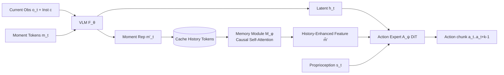

# HAMLET: Switch Your Vision-Language-Action Model into a History-Aware Policy

**Conference**: ICLR 2026  
**OpenReview**: [https://openreview.net/forum?id=KcJ9U0x6kO](https://openreview.net/forum?id=KcJ9U0x6kO)  
**Code**: [https://myungkyukoo.github.io/hamlet/](https://myungkyukoo.github.io/hamlet/)  
**Area**: Robotics / Embodied AI (VLA, History-Aware Policy)  
**Keywords**: Vision-Language-Action, history-aware, moment token, time-contrastive learning, memory module, long-horizon manipulation  

## TL;DR
HAMLET enables "single-frame" pretrained VLAs to gain history-awareness in a plug-and-play, near-zero overhead manner by appending a few learnable moment tokens (initialized via time-contrastive learning) and a lightweight memory module. It improves success rates from 29.2% to 76.4% on real-world long-horizon tasks.

## Background & Motivation
- **Background**: Current mainstream VLAs (OpenVLA, π0, GR00T, CogACT, etc.) mostly adopt the "single-frame assumption," where action prediction depends only on the current observation, leveraging large-scale VLM priors for control.
- **Limitations of Prior Work**: Robotic manipulation is inherently **history-dependent (non-Markovian)**. For instance, whether to lift or release a block depends on whether it has been grasped; single frames cannot resolve ambiguity during occlusions. Consequently, single-frame VLAs frequently fail in long-horizon tasks.
- **Key Challenge**: The direct remedy—stacking multiple past frames (multi-frame)—is extremely costly. Empirical tests show that adding just 4 frames slows inference by ~35% and increases peak memory by ~3.6×. Furthermore, it often suffers from "causal confusion," leading to performance drops (-3.3% on RoboCasa, -8.8% on LIBERO).
- **Goal**: Inject history-awareness into pretrained VLAs **without large-scale retraining**, ensuring low overhead and cross-backbone compatibility.
- **Key Insight**: **Replace "stacking" with "compression."** Instead of storing raw observations for each step, HAMLET stores a compact set of "moment tokens." A lightweight memory module then **selectively aggregates** these tokens across time to produce history-enhanced features for the action expert.

## Method

### Overall Architecture
HAMLET augments the standard VLA pipeline (VLM backbone $F_\theta$ encoding observations and instructions into latent representation $h_t$, followed by action expert $A_\psi$ predicting action chunks) with two components: (i) **moment tokens**, which append to VLM inputs at each step to compress temporal information; and (ii) a **memory module**, which aggregates historical moment tokens to produce history-enhanced features $\tilde{m}'$ for the action expert. The entire system is trained end-to-end with standard action prediction loss while maintaining single-frame visual input.

### Key Designs

**1. Moment Token: Compressing steps into compact summaries instead of stacking raw frames.** Storing raw observations $o_t$ is expensive and contains redundant static backgrounds. HAMLET appends a set of learnable tokens $m_t \in \mathbb{R}^{n_m \times d}$ to the VLM input at each step $t$: $[h_t; m'_t] = F_\theta([o_t, c; m_t])$. Through causal attention, these tokens "summarize" the current step into $m'_t$. By default, only 4 tokens are used per step, reducing the history cost from "multiple images" to "a few vectors."

**2. Time-Contrastive Learning (TCL) Initialization: Capturing discriminative temporal cues.** Randomly initialized tokens might learn mediocre representations. HAMLET uses time-contrastive networks to pre-train tokens by freezing the VLM: using augmented views of the same observation as positive samples $z_t^+$, and **different time steps** $t' \neq t$ within the same trajectory as hard negative samples $z_t^-$, optimizing:
$$\mathcal{L}_{\mathrm{TCL}} = -\sum_{t} \log \frac{\exp(\mathrm{sim}(z_t, z_t^+)/\tau)}{\exp(\mathrm{sim}(z_t, z_t^+)/\tau) + \exp(\mathrm{sim}(z_t, z_t^-)/\tau)}.$$
This forces tokens to emphasize task-relevant regions (e.g., grippers, targets) that change over time while suppressing static backgrounds.

**3. Memory Module: Selective aggregation via shallow Transformers.** Simple concatenation of all moment tokens yields little gain because not all moments are equally important. HAMLET stacks moment tokens from the last $T$ steps into a matrix $M' \in \mathbb{R}^{L \times d}$ (where $L = T \cdot n_m$) and aggregates them using standard self-attention with a causal mask $C$:
$$H = \mathrm{softmax}\!\left(\frac{QK^\top}{\sqrt{d}} + C\right)V.$$
This allows the module to **pick relevant historical moments** (e.g., attending to the step where a block was last visible before being covered) based on the current context.

**4. Integration with Action Prediction: Plug-and-play with single-frame input.** History-enhanced features are concatenated with original VLM representations: $[a_t, \dots, a_{t+k-1}] = A_\psi([h_t; \tilde{m}'], s_t)$. Since the VLM still only processes a single frame while history flows through the external memory, HAMLET preserves the generalization of single-frame VLAs and remains backbone-agnostic (compatible with GR00T, CogACT, etc.).

## Key Experimental Results

### Main Results
Real-world long-horizon tasks (24 trials per task, GR00T N1.5 backbone):

| Method | History? | Pick-and-Place Twice (Success) | Cover-and-Stack (Success) | Swap Cubes (Success) | Avg. |
|------|------|------|------|------|------|
| π0 | ✗ | 25.0 | 58.3 | 12.5 | 31.9 |
| GR00T N1 | ✗ | 25.0 | 33.3 | 33.3 | 30.6 |
| GR00T N1.5 | ✗ | 12.5 | 37.5 | 37.5 | 29.2 |
| + Multi-frame | ✓ | 45.8 | 33.3 | 58.3 | 45.8 |
| **+ HAMLET** | ✓ | **66.7** | **79.2** | **83.3** | **76.4** |

General simulation benchmarks (GR00T N1.5):

| Method | RoboCasa 100-demo | LIBERO Avg. |
|------|------|------|
| GR00T N1.5 | 64.1 | 95.6 |
| + Multi-frame | 60.8 (Drop) | 86.8 (Drop) |
| **+ HAMLET** | **66.4** | **97.6** |

### Ablation Study

Component Ablation (RoboCasa 100-demo):

| Moment Token | TCL | Memory Module | Avg. |
|------|------|------|------|
| ✗ | ✗ | ✗ | 62.6 |
| ✓ | ✗ | ✗ | 63.1 |
| ✓ | ✓ | ✗ | 63.4 |
| ✓ | ✗ | ✓ | 64.8 |
| ✓ | ✓ | ✓ | **65.4** |

Efficiency (A100, per-timestep):

| Method | History | Latency | Peak Mem |
|------|------|------|------|
| GR00T N1.5 | 1 | 80.5ms (1.00×) | 289MB (1.00×) |
| + Multi-frame | 8 | 193.0ms (2.40×) | 2023MB (7.00×) |
| **+ HAMLET** | 8 | **85.8ms (1.07×)** | **578MB (2.00×)** |

### Key Findings
- **Memory module is the core contributor**: Removing it causes the largest performance drop; simple concatenation of tokens provides minimal gain, highlighting "selective aggregation" as key.
- **Multi-frame stacking hurts generalization**: Stacking raw frames induces causal confusion and generalizes poorly to dynamic observations, whereas HAMLET avoids this by maintaining single-frame input.
- **Memory is transferable**: A memory module pretrained on LIBERO provides gains when transferred to RoboCasa.

## Highlights & Insights
- **Shift from "stacking" to "compression"**: Reformulates history-awareness as storing semantic tokens rather than pixels, bypassing the compute/memory wall of multi-frame methods.
- **Backbone-agnostic/Plug-and-play**: Consistently improves performance across GR00T and CogACT without massive retraining, making it highly practical for deployment.
- **Initialization via TCL**: Self-supervised representation learning naturally aligns tokens with task-relevant moving parts (e.g., grippers), as evidenced by attention visualizations.

## Limitations & Future Work
- **Task Scale**: Real-world experiments are limited to three designed tabletop tasks; generalization to open-ended long-horizon scenarios remains to be validated.
- **Hyperparameter Sensitivity**: There is a clear "sweet spot" for token count (performance peaks at 4-8 and drops at 32/64); whether memory capacity suffices for extreme horizons is unexplored.
- **Baselines**: Lacks direct comparison with end-to-end humanoid memory systems (e.g., concurrent work Shi et al. 2025).
- **Saturation**: Gains on LIBERO are marginal (95.6% to 97.6%) as the benchmark is nearly saturated; benefits are primarily seen in specifically designed history-dependent tasks.

## Related Work & Insights
- **VLA Lineage**: Progresses from discrete tokens (RT-2, OpenVLA) to diffusion/flow-matching heads (π0, GR00T); HAMLET fills the "history" gap for the latter.
- **Memory Architectures**: Echoes recurrent policies in RL and memory networks in NLP, but marks the first systematic design of lightweight memory for **large-scale pretrained VLAs**.
- **Insight**: For any single-step foundation model, adding learnable tokens with a lightweight aggregator may be a universal, low-cost paradigm for injecting context/temporal awareness.

## Rating
- **Novelty**: ⭐⭐⭐⭐
- **Experimental Thoroughness**: ⭐⭐⭐⭐
- **Writing Quality**: ⭐⭐⭐⭐
- **Value**: ⭐⭐⭐⭐

<!-- RELATED:START -->

## Related Papers

- [\[ICLR 2026\] WMPO: World Model-based Policy Optimization for Vision-Language-Action Models](wmpo_world_model-based_policy_optimization_for_vision-language-action_models.md)
- [\[ICLR 2026\] OneTwoVLA: A Unified Vision-Language-Action Model with Adaptive Reasoning](onetwovla_a_unified_vision-language-action_model_with_adaptive_reasoning.md)
- [\[ICLR 2026\] HybridVLA: Collaborative Diffusion and Autoregression in a Unified Vision-Language-Action Model](hybridvla_collaborative_diffusion_and_autoregression_in_a_unified_vision-languag.md)
- [\[ICLR 2026\] UniVLA: Unified Vision-Language-Action Model](unified_vision-language-action_model.md)
- [\[ICLR 2026\] Action-aware Dynamic Pruning for Efficient Vision-Language-Action Manipulation](action-aware_dynamic_pruning_for_efficient_vision-language-action_manipulation.md)

<!-- RELATED:END -->
