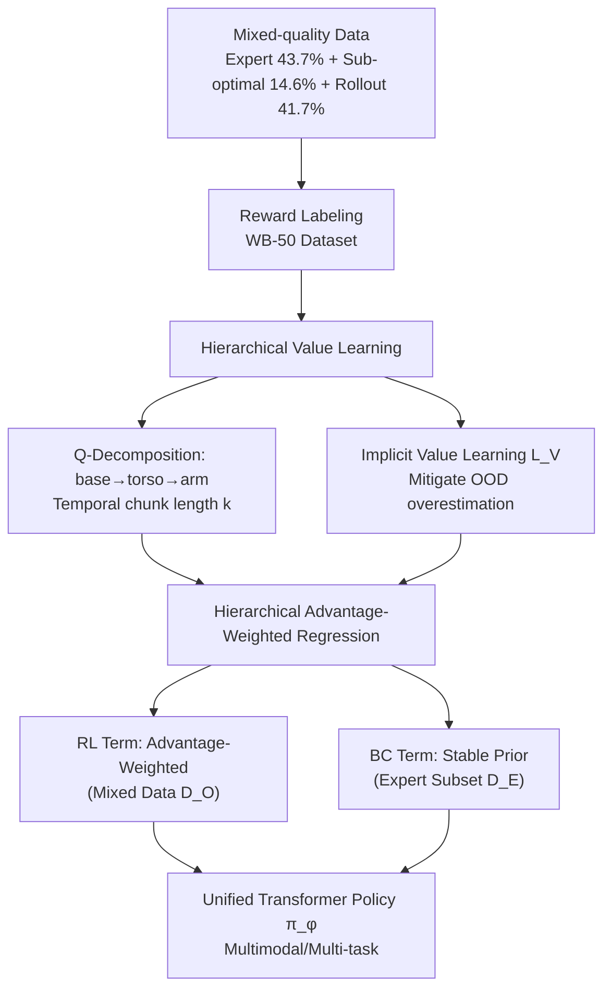

# Hierarchical Value-Decomposed Offline Reinforcement Learning for Whole-Body Control

**Conference**: ICLR 2026  
**OpenReview**: [https://openreview.net/forum?id=eSkDNIGbcd](https://openreview.net/forum?id=eSkDNIGbcd)  
**Code**: [https://github.com/LAMDA-RL/HVD](https://github.com/LAMDA-RL/HVD)  
**Area**: Robotics / Embodied AI, Offline Reinforcement Learning  
**Keywords**: Whole-body control, high degrees of freedom, offline RL, value decomposition, imitation learning, Galaxea R1, imperfect data  

## TL;DR
Addressing the scarcity of expert data for high-DoF whole-body robots, HVD decomposes the value function of offline RL along the robot's kinematic structure (base/torso/arm). It performs value filtering from large-scale imperfect data and implements fine-grained credit assignment via temporal chunking, significantly outperforming imitation learning baselines on five tasks using a real 21-DoF humanoid robot.

## Background & Motivation
**Background**: Imitation learning (BC, Diffusion Policy, VLA, etc.) has become the dominant paradigm for robot policy learning, directly acquiring complex skills from expert demonstrations. However, scaling to **high-DoF whole-body control** involving coordinated movements across multiple joints leads to an exponential increase in expert data collection costs.

**Limitations of Prior Work**: ① **Expert data scarcity**—collecting high-quality whole-body demonstrations via teleoperation is cognitively and physically expensive, making large-scale expert supervision unrealistic; ② conversely, teleoperation and policy rollouts naturally generate **large amounts of sub-optimal data** (partial successes, corrections, failures), which are scalable but of mixed quality; ③ standard offline RL struggles to scale to structured whole-body systems with multimodal observations.

**Key Challenge**: High-DoF control presents two intertwined difficulties: **extracting useful signals** from mixed imperfect trajectories (where good and bad behaviors are interleaved) and performing effective **credit assignment** in high-dimensional, long-horizon settings. The paper theoretically notes that the expert sample complexity of BC is proportional to the log-covering number of the policy class $\log N_{\text{pol}}(\Pi,\varepsilon)$, exploding as the action space expands. This was verified by comparing 21-DoF whole-body vs. 7-DoF single-arm experiments: under the same 50 expert demonstrations, whole-body success rates were significantly lower.

**Goal**: To move beyond reliance on perfect demonstrations for high-DoF policy learning, enabling effective policies to emerge from **abundant imperfect data** through structured learning.

**Key Insight**: **Offline RL for data filtering + Hierarchical value decomposition for credit assignment**—the offline RL framework prioritizes high-quality behaviors and suppresses harmful ones via value, while hierarchical value decomposition organizes learning along the robot's kinematic structure to reduce the complexity of high-DoF systems.

## Method

### Overall Architecture
HVD (Hierarchical Value-Decomposed Offline RL) is built upon IDQL (Implicit Diffusion Q-Learning). It performs **spatial decomposition** of the value function along the robot's physical structure. The pipeline consists of three stages: (1) Data construction and reward labeling (producing the WB-50 dataset); (2) Hierarchical value learning (kinematic-decomposed Q-functions + temporal chunking); (3) Policy extraction via Hierarchical Advantage-Weighted Regression (AWR). The backbone is a Transformer that processes multimodal inputs including RGB images, point clouds, language instructions, and proprioception for multi-task learning.

### Key Designs
**1. Q-Value Hierarchical Decomposition along Kinematic Structure: Mapping Credit to "Which Limb is Responsible"**  
Unlike traditional policy decomposition (task-space control), HVD introduces hierarchy directly into the **Q-value function**. The action space is split into three levels $A = A_{\text{base}} \times A_{\text{torso}} \times A_{\text{arm}}$ (base mobility, torso pose, arm manipulation). For a temporal action chunk $a_{h:h+k}$ of length $k$, Q-values are defined with **progressive accumulation**: $Q^{h:h+k}_{\text{base}} = Q_\theta(s_h, a^{h:h+k}_{\text{base}})$, $Q^{h:h+k}_{\text{torso}} = Q_\theta(s_h, a^{h:h+k}_{\text{base}}, a^{h:h+k}_{\text{torso}})$, and $Q^{h:h+k}_{\text{arm}}$ adds the arm actions. Each Q-value corresponds to a robot component, enabling precise joint-level credit assignment. For instance, in the "standing up to carry basket" frame of the Basket Carry task, HVD assigns higher weights to the arm and torso, whereas a shared-Q version provides nearly identical high weights to all components, failing to distinguish sub-component contributions.

**2. Multi-level TD Learning + Temporal Chunking: Aligning Component Value with Returns**  
During training, a multi-level TD loss aligns each component Q-value with its estimated return: $L^h_i(\theta) = \mathbb{E}[(r(s_h, a_{h:h+k}) + V_\psi(s_{h+k+1}) - Q^{h:h+k}_i)^2]$, where $i \in \{\text{base, torso, arm}\}$ and the chunk reward $r(s_h, a_{h:h+k}) = \sum_{j=h}^{h+k} r(s_j, a_j)$ aggregates step-wise rewards within the segment. The total Q-loss sums all levels: $L_Q(\theta) = \frac{1}{H}\sum_h (L^h_{\text{base}} + L^h_{\text{torso}} + L^h_{\text{arm}})$. Temporal chunking bundles $k$ action steps for estimation, mitigating long-horizon credit assignment difficulties under sparse rewards and improving coordination.

**3. Implicit Value Learning to Suppress OOD Overestimation: Soft Lower Bounds for Component Q-heads**  
A persistent issue in offline RL is the policy querying actions outside the data support (OOD), leading to value overestimation. HVD adopts the in-sample learning paradigm, imposing an implicit value loss on each hierarchical Q-head: $L_V(\psi) = \frac{1}{H}\sum_h \mathbb{E}\big[\sum_i \alpha\exp(Q^{h:h+k}_i - V_\psi(s_h)) - \alpha(Q^{h:h+k}_i - V_\psi(s_h))\big]$, where $\alpha>0$ controls constraint intensity. Optimizing this loss effectively builds a soft lower bound for all Q-estimates, ensuring limb-level value predictions remain consistent with global whole-body goals and preventing OOD actions from biasing specific Q-heads.

**4. Hierarchical Advantage-Weighted Regression + BC Regularization: Learning Policies from Imperfect Data**  
The policy network $\pi_\phi$ is trained using a hierarchical variant of AWR, assigning importance weights to action chunks based on estimated advantages rather than uniformly imitating all data. The per-layer advantage weight is $\omega^{h:h+k}_i = \alpha\frac{\exp(\alpha(Q^{h:h+k}_i - V_\psi(s_h))) - 1}{|Q^{h:h+k}_i - V_\psi(s_h)|}$, giving exponentially higher weights to high-advantage actions while preserving gradient flow near decision boundaries. The final loss combines two terms: an RL term $L^{\text{RL}}_\pi$ weighted by advantages on the mixed dataset $D_O$, and a BC term $L^{\text{BC}}_\pi$ on a small expert set $D_E$ as a stable prior: $L_\pi(\phi) = L^{\text{RL}}_\pi(\phi) + \beta L^{\text{BC}}_\pi(\phi)$. The algorithm alternates between hierarchical value updates for $V_\psi, Q_\theta$ and policy extraction for $\pi_\phi$.

**5. WB-50: A Reward-Labeled Dataset Retaining Real-World Imperfections**  
To support real-world evaluation, the paper introduces WB-50—a 50-hour whole-body robot dataset intentionally mixing three sources: expert demonstrations (43.7%), imperfect teleoperation (14.6%), and policy rollouts (41.7%). The latter two predominate to reflect the "perfect supervision is scarce" reality. Each trajectory is labeled at the sub-task level with discrete reward signals, preserving natural imperfections like partial successes and error corrections.

## Key Experimental Results
Experiments were conducted on a real **Galaxea R1** (21-DoF wheeled humanoid) using the JoyLo interface for teleoperation. Five office tasks were designed (Pen Insert, Cup Upright, Wipe Board, Basket Carry, Trash Dispose), ranging from 40s single-arm tasks to 120s+ multi-step coordinated dual-arm tasks. Each policy was evaluated with 50 independent rollouts per task. Baselines included π0 (VLA), WB-VIMA (3D input), and Diffusion Policy (DP)—baselines were trained on the expert subset, while HVD was trained on the full mixed data.

### Main Results (Success Rate per Task, IL/HVD)

| Method | Pen Insert | Cup Upright | Wipe Board | Basket Carry | Trash Dispose | Avg SR (IL/HVD) |
|------|-----------|-------------|------------|--------------|---------------|-----------------|
| π0 | 0.64/**0.86** | 0.82/**0.90** | 0.18/**0.32** | 0.26/**0.44** | 0.28/**0.36** | 0.44/**0.58** |
| WB-VIMA | 0.52/**0.78** | 0.58/**0.82** | 0.12/**0.26** | 0.10/0.10 | 0.20/**0.32** | 0.30/**0.46** |
| DP | 0.54/**0.64** | 0.66/**0.72** | 0.00/0.00 | 0.00/**0.08** | 0.08/**0.16** | 0.26/**0.32** |

HVD consistently improved average success rates across all three baseline architectures, with particularly significant gains in difficult tasks requiring robustness to initial states and handling partial observability, such as Wipe Board and Basket Carry.

### Ablation Study (Success Rate Change after Removing Hierarchy, Avg Diff)

| Method | Pen Insert | Cup Upright | Wipe Board | Basket Carry | Trash Dispose | Avg Diff |
|------|-----------|-------------|------------|--------------|---------------|----------|
| DP | -0.02 | 0.00 | 0.00 | -0.08 | -0.06 | -0.03 |
| WB-VIMA | -0.02 | 0.00 | -0.12 | -0.08 | -0.12 | -0.07 |
| π0 | +0.04 | -0.02 | -0.14 | -0.10 | -0.04 | -0.05 |

Removing hierarchical decomposition (switching to a shared Q-value, HVD w/o hierarchy) resulted in consistent performance drops across most tasks, proving that gains originate from the hierarchical value structure itself, not just the offline RL training paradigm.

### Key Findings
- **Gains from Structure, Not Just Paradigm**: Given the same mixed data and hyperparameters, removing hierarchy led to an average drop of 0.03–0.07 across baselines, validating the independent contribution of hierarchical value decomposition.
- **More Accurate Credit Assignment**: Visualization of advantage weights during critical Basket Carry frames showed that HVD dynamically weights the arm/torso during the "lift" phase, whereas the shared-Q version assigned uniform high weights to all parts, failing to differentiate sub-components.
- **Mitigating Multi-task Negative Transfer**: When training a single policy for all five tasks, standard IL exhibited negative transfer (π0 average dropped from 0.44 to 0.36), while HVD suppressed interference and even exceeded single-task expert policies in some cases. Gains primarily stemmed from more robust torso control and more generalizable grasping.
- **Reliability Across Stages**: HVD achieved higher normalized stage scores for nearly all sub-tasks, indicating improvement not just in final success rates but in the reliability of the entire execution trajectory.

## Highlights & Insights
- **Adapting "Value Decomposition" from MARL to Single-Agent High-DoF Control**: QMIX-style value decomposition, originally for multi-agent credit assignment, is creatively mapped to a single robot's kinematic hierarchy (base/torso/arm), representing a clever paradigm shift.
- **Hierarchy in Q-Values Rather Than Policy**: While traditional whole-body control uses policy/task-space decomposition, HVD maintains a unified policy network and only hierarchizes the value side, gaining fine-grained assessment without sacrificing end-to-end coordination.
- **Shift in Data Philosophy**: The core narrative—"effective policies can emerge from abundant imperfect data rather than relying solely on perfect demonstrations"—is highly relevant for embodied AI currently facing data collection bottlenecks.
- **Real Robot + Real Dataset**: Successfully deployed on a real 21-DoF humanoid and open-sourcing WB-50 (retaining natural flaws) makes the results far more convincing than simulation-only findings.

## Limitations & Future Work
- **Absolute Success Rates Still Low**: Difficult tasks like Wipe Board and Basket Carry only reached 0.08–0.44 even with HVD, indicating that high-DoF long-horizon tasks remain far from solved.
- **Fixed Hierarchy as Prior**: The base/torso/arm levels are manually defined based on humanoid structure. Whether different robot morphologies require redesigns or can learn hierarchies automatically was not discussed.
- **Dependence on Reward Labeling**: WB-50's discrete rewards are annotated manually or via rules at the sub-task level. Reward quality and scalability directly impact value filtering; automated reward labeling is a potential future direction.
- **Limited Evaluation Scope**: Restricted to 5 tasks and a single robot platform; generalization across morphologies or scenes remains to be verified.

## Related Work & Insights
- **Offline RL Foundations**: Built on IQL/IDQL, HVD exemplifies migrating mature offline RL tools (in-sample learning, AWR) to robot control to bypass OOD overestimation.
- **Value Decomposition**: Echoes Multi-Agent RL value decomposition (e.g., VDN/QMIX) but applied to the spatial structure of a single agent.
- **Whole-Body/VLA Policies**: Baselines including π0 (VLA) and WB-VIMA demonstrate the universality of the method as a plug-and-play enhancement for various backbones.
- **Insight**: For other high-dimensional structured control problems (e.g., dexterous hands, quadruped robots), the paradigm of "kinematic value decomposition + temporal chunking + filtering from imperfect data" presents a reusable and valuable framework.

## Rating
- **Novelty**: ⭐⭐⭐⭐ Mapping multi-agent value decomposition to single-agent high-DoF control at the Q-level (rather than policy level) combined with temporal chunking is novel and well-motivated.
- **Experimental Thoroughness**: ⭐⭐⭐⭐ Solid evaluation on a real 21-DoF platform across 5 tasks and 3 baselines with 50 rollouts per task. Includes hierarchy ablations and credit assignment visualizations, though limited by task variety and platform diversity.
- **Writing Quality**: ⭐⭐⭐⭐ Clear theoretical (BC sample complexity) and empirical motivation. Formulas are complete and architecture diagrams are intuitive.
- **Value**: ⭐⭐⭐⭐ Directly addresses the data bottleneck in embodied AI. Open-sourcing WB-50 and the code provides significant practical and demonstrative value for learning whole-body control from imperfect data.

<!-- RELATED:START -->

## Related Papers

- [\[ICLR 2026\] HWC-Loco: A Hierarchical Whole-Body Control Approach to Robust Humanoid Locomotion](hwc-loco_a_hierarchical_whole-body_control_approach_to_robust_humanoid_locomotio.md)
- [\[ICLR 2026\] WholeBodyVLA: Towards Unified Latent VLA for Whole-Body Loco-Manipulation Control](wholebodyvla_towards_unified_latent_vla_for_whole-body_loco-manipulation_control.md)
- [\[ICLR 2026\] Cross-Embodiment Offline Reinforcement Learning for Heterogeneous Robot Datasets](cross-embodiment_offline_reinforcement_learning_for_heterogeneous_robot_datasets.md)
- [\[CVPR 2026\] End-to-End Language-Action Model for Humanoid Whole Body Control](../../CVPR2026/robotics/end-to-end_language-action_model_for_humanoid_whole_body_control.md)
- [\[ICLR 2026\] Scalable Exploration for High-Dimensional Continuous Control via Value-Guided Flow](scalable_exploration_for_high-dimensional_continuous_control_via_value-guided_fl.md)

<!-- RELATED:END -->
