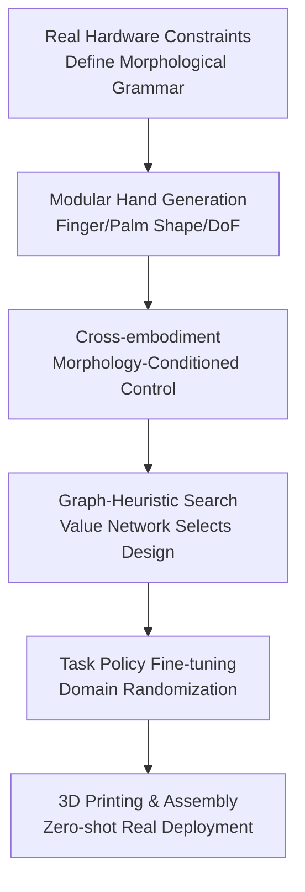

# House Of Dextra : Cross-Embodied Co-Design for Dexterous Hands

**Conference**: ICLR2026  
**OpenReview**: [https://openreview.net/forum?id=k8ovuXEQQu](https://openreview.net/forum?id=k8ovuXEQQu)  
**Code**: Yes, the authors claim the full framework and hardware designs are open-sourced; see the project page for the specific entry.  
**Area**: Robotics / Dexterous Hands / Embodied AI  
**Keywords**: Dexterous Hand Design, Morphology-Control Co-optimization, Cross-embodiment Control, Sim-to-real, In-hand Rotation  

## TL;DR
House of Dextra proposes a cross-embodiment co-design framework for dexterous hands that connects a manufacturable modular hand grammar, morphology-conditioned control policies, and graph-heuristic search. It filters and fine-tunes hand morphologies in simulation, eventually deploying multiple designs (3-fingered, 4-fingered, 5-fingered, etc.) zero-shot to real hardware for blind in-hand rotation.

## Background & Motivation
**Background**: Dexterous manipulation is usually divided into two parallel development paths: one optimizes control, enabling policies on fixed hardware to learn contact-rich movements like grasping, rotating, and flipping; the other optimizes hardware, designing mechanical structures with more degrees of freedom (DoF), human-like features, or task-specific suitability. Many prior reinforcement learning works assume hardware is given (e.g., LEAP, Allegro, or other anthropomorphic hands) and focus on policy training and sim-to-real.

**Limitations of Prior Work**: This "hardware-first, control-second" pipeline treats hardware morphology as an exogenous condition. However, the upper bound of dexterous manipulation is often limited by morphology: finger count, finger length, palm width, fingertip shape, and DoF per finger all change contact patterns and achievable gaits. Conversely, traditional co-design methods that attempt to search morphology and control simultaneously often remain in simulation because the search space is too large, training policies for each design is too slow, and many auto-generated morphologies do not correspond to real, printable, assembleable, or drivable hardware.

**Key Challenge**: The contradiction identified is that dexterous hand co-design requires a sufficiently large morphology space to discover non-anthropomorphic, task-specific structures, while ensuring each candidate can be rapidly evaluated and manufactured. Expanding the design space alone leads to evaluation cost explosion, while using only manufacturable templates restricts the search to a few manual designs.

**Goal**: The authors aim to establish an end-to-end pipeline: first generating a large number of candidate hands under real hardware constraints, then rapidly evaluating them with a control policy capable of working across different embodiments, followed by using a search algorithm to find the morphology best suited for a specific task, and finally 3D printing, assembling, and deploying the chosen design directly in the real world.

**Key Insight**: A key observation is that although candidate hands are numerous, they are not entirely unrelated. Different hand designs can share part of the control experience. As long as the policy knows the fingers, joints, and geometric parameters of the current morphology, it can learn cross-embodied manipulation patterns within a family. Thus, the outer-loop search does not need to train a full PPO from scratch for every new hand but can use a morphology-conditioned policy as a fast evaluator.

**Core Idea**: By combining "manufacturable grammar-based hand generation + morphology-conditioned control policy evaluation + graph-value-network-guided search," the hardware design and control policy training of dexterous hands are synthesized into a deployable closed loop.

## Method

### Overall Architecture
House of Dextra formulates the problem as a bilevel optimization: the outer loop selects the hand morphology $G$, and the inner loop learns a policy $\pi_G$ for that morphology, aiming to maximize task reward $J(\pi, G)$. Solving this directly is too expensive, so the authors first train a cross-embodiment foundation policy on a large set of random hand types. The search algorithm then uses this policy to quickly evaluate candidate morphologies, and the optimal design is fine-tuned for real-world deployment.

Specifically, the framework starts by generating candidate hands with real collision bodies, joint limits, and manufacturing constraints using a modular grammar. It then uses morphology encoding to condition the control policy, sharing control across different finger counts, joint configurations, and geometric scales. A GNN design encoder and design value network predict the performance of candidate morphologies to guide graph-heuristic search. Finally, the top-ranked designs are converted into 3D-printed parts and Dynamixel servo assembly schemes, and blind policies are deployed under proprioception-only conditions without vision or tactile sensing.

### Key Designs
**1. Manufacturable Morphology Grammar: Ensuring every hand in the search space can be built**

The issue with many co-design methods is the reality gap between generated morphologies and real hardware. This paper builds the morphology space directly on modular hardware: each hand is represented as an attributed graph $G=(V,E,X_v)$ with a fixed topology, including a palm node and up to five finger-slot nodes, with star-shaped connections from the center of the palm to the slots. Node attributes record finger existence, servo count, segment-scale grammar code, fingertip type, active/terminal status, and finger index.

This representation is more constrained than arbitrary graph generation but ensures every graph maps to printable parts. The grammar allows 3 to 5 fingers, 2 or 3 joint configurations per finger, different length stacks, various fingertips, and different palm shapes and finger positions. Simultaneously, collision geometry, joint limits, and actuator specs are pre-calculated. Thus, simulated morphologies are real designs aligned with 3D printing, Dynamixel assembly, and PID tuning.

**2. Morphology-Conditioned Control: Using one policy for rapid evaluation across many hands**

Co-design is computationally infeasible if PPO is trained from scratch for every candidate. The paper trains a morphology-conditioned cross-embodiment policy. For a fixed morphology $G$, the task is an MDP $M_G=(S,A,T,R,\gamma)$ where state includes robot joint state $q$, object pose $p_o$, and morphology encoding $m(G)$. The policy outputs position commands for all possible actuators, masked by $M(G)$: $a_t=\pi_\theta(s_t)\odot M(G)$.

The core of this design is placing different DoF hands into the same control interface. The policy is pre-trained on 2,000 to 8,000 hand types within the same family, learning patterns such as "given these available joints, how should contact sequences produce rotation/grasp/flip." This allows the search phase to evaluate candidates directly without waiting for each to learn basic movements from scratch.

**3. Graph-Heuristic Search: Teaching the search where to go using evaluated designs**

The morphology space remains huge. Random search wastes simulation budget. This paper uses a GNN to encode the morphology graph, $y(G)=f_\phi(G)$, and trains a design value network $V_{design}(y(G))$ to predict task performance. Each search iteration generates $K$ candidates evaluated in parallel simulations using the cross-embodiment policy. The task scores update a lookup table $T:D\rightarrow R$ and the value network with loss $L_{design}=\mathbb{E}_{d\sim D_{evaluated}}[(V_{design}(y(G_d))-T(d))^2]$.

The search process involves finger-by-finger expansion: starting from a random palm layout and finger base, legal parameters for non-terminal fingers are enumerated. The GNN predicts scores for successor designs, using Gumbel noise for exploration. The highest-scoring successor is kept until all fingers are complete. The lookup table records full designs and incorporates scores of partial ancestors for credit assignment. Symmetries and equivalent relations (e.g., thumb slots in anthropomorphic layouts) are used to reduce redundancy.

**4. Blind Policy Fine-tuning for Real Deployment: Pulling co-design from simulation to hardware**

The final step is manufacturing the selected morphology. The optimal design undergoes fine-tuning with domain randomization (actuator, contact, friction, object pose). For real deployment, the authors remove object state input and train a blind policy where observations consist only of morphology encoding and joint positions. This proprioceptive loop is harder than pose-informed simulation but matches the actual hardware: no cameras, no tactile sensors, and no prior knowledge of object class or position.

The manufacturing process aligns with the grammar: design graphs are converted to modular hardware specs, mounting interfaces are added to the palm, joints and links are 3D printed, and Dynamixel actuators are assembled. Because the generation space adheres to physical constraints from the start, the authors claim a new hand can go from design to deployment within 24 hours.

### Mechanism
In the in-hand rotation task, the system first samples candidate hands from the grammar space. Some are 3-fingered radially symmetric, some are 5-finger symmetric, some are anthropomorphic, and some are 4-fingered with thin fingertips. The pre-trained cross-embodiment policy evaluates these candidates in 2,048 randomized simulation environments.

The first search round might find that anthropomorphic designs can grasp but struggle with finger gait transitions during rotation. Thin fingertips might flip objects but cause displacement. The GNN-based value network then leans towards generating candidates with shorter palm widths, suitable finger lengths, standard fingertips, and 3-fingered radial layouts. If a 3-fingered design hits 1.85 rad/s and reaches 3.3 rad/s after fine-tuning, it is manufactured. In real tests, this hand uses only its joint positions and morphology encoding to rotate unseen objects (polygons, tennis balls, cubes) continuously through 360 degrees.

### Loss & Training
The control policy uses a PPO-style clipped objective with morphology vector $m(G)$ as input; non-existent actuators are masked. Each morphology family is trained separately, covering thousands of variations to allow shared control without forcing vastly different structures into the same action patterns.

The design value network uses supervised regression on task scores with L2 regularization and gradient clipping. Search involves 50 rounds of 40 designs each, evaluated in 2,048 parallel environments. Sim-to-real robustness is enhanced via domain randomization of object mass/size/pose, joint noise, friction, and actuator parameters. The deployment policy is a proprioception-only blind controller.

## Key Experimental Results

### Main Results
Three tasks are evaluated: continuous in-hand rotation, tabletop grasping, and flipping around the $z$-axis. In-hand rotation includes both simulation comparisons and zero-shot real hardware deployment. 17 unseen objects with different friction, compliance, and geometry are used in real tests.

| Method | Runtime | Continuous Angular Velocity | Description |
|------|----------|------------|------|
| House of Dextra | 6.48 h | 3.3 rad/s | Optimal design after fine-tuning |
| House of Dextra w/o fine tuning | 5.18 h | 1.85 rad/s | Design using only cross-embodiment policy |
| House of Dextra w/ MPPI | 20.0 h | 0.62 rad/s | Using MPPI control in the same framework |
| LEAP, single cube w/ vision | 2.0 h | 0.47 rad/s | Default LEAP environment/single-object vision policy |
| RoboGrammar | 23.0 h | 0.26 rad/s | Graph grammar design baseline |
| Monte Carlo | 15.2 h | 0.20 rad/s | Tree search/random rollout baseline |
| Blind LEAP Hand | 2.0 h | 0.0 rad/s | Fails in random object blind policy setting |

Ours is not just faster than traditional search; it maintains controllability in sparse-reward, contact-rich tasks. RoboGrammar's best design achieves only 0.26 rad/s. Ours (even without fine-tuning) reaches 1.85 rad/s and keeps objects from falling during the 3-minute evaluation window.

| Pipeline Component | Time |
|------------|------|
| 3D Printing | 12.0 h |
| Design Algorithm | 6.48 h |
| Assembly | 0.8 h |
| Sim-to-real Preparation | 2.0 h |

This timeline supports the claim that the workflow can produce new hardware and policies within a single day.

### Ablation Study
| Configuration / Design | Key Metric | Description |
|-------------|----------|------|
| Full model + fine tuning | 3.3 rad/s | Continuous rotation speed of optimal 3-finger design |
| w/o fine tuning | 1.85 rad/s | Still significantly higher than external baselines, showing morphology impact |
| w/ MPPI | 0.62 rad/s | Planning-based control struggles with long-horizon stability |
| Single Morphology PPO | ~0.56 rad/s for 5-fingered | Cross-embodiment policy improves performance for the same morphology by ~65% |
| 3-finger optimal real hand | Fails only 2 of 17 objects | Significantly outperforms 4/5-fingered and anthropomorphic baselines in blind rotation |
| 4-finger / Anthropomorphic real hand | ~3 successes out of 17 | Tend to get stuck in finger gaits, consistent with simulation rankings |

Ours 3-fingered hand rotated a tennis ball for over 10 minutes, whereas other designs caused displacement or failed to infer object states from blind proprioception.

### Key Findings
- Morphology is a primary factor in the success of in-hand rotation. In a sensitivity analysis on LEAP hand parameters, finger body length scale positively correlated with performance ($r=0.748$), while palm width scale negatively correlated ($r=-0.729$), suggesting wider palms hinder manipulation.
- Preferred morphologies vary by task. Grasping favors 5 fingers and thin fingertips; rotation favors 3 fingers and standard fingertips; flipping requires a combination of wedge-shaped and standard fingertips.
- Cross-embodiment learning solves the evaluation bottleneck. Training individual PPO for each design takes ~26 hours (20 designs total); Ours evaluates 2,000 designs in 5.18 hours—a ~400x acceleration.
- Blind policy deployment is a rigorous and successful setting. By relying only on joint position and morphology encoding, the 3-fingered hand generalized to pinecones, soft objects, and irregular shapes.

## Highlights & Insights
- The system's value lies in making co-design "manufacturable." It unifies grammar, collision bodies, actuators, and printing, ensuring simulation search results are verified by hardware.
- Cross-embodiment learning serves as a design search accelerator. The policy doesn't need to be a universal controller; it just needs to reliably distinguish "good" from "bad" hands within a family.
- The results provide a counter-example to the assumption that anthropomorphic hands are always superior. For blind in-hand rotation, task-specific 3-fingered hands clearly outperform human-like baselines.
- Morphological analysis suggests that some control challenges are better solved by mechanical structure and actuator dynamics than by increasing policy capacity.

## Limitations & Future Work
- The morphology space is modular and pre-defined, exploring a "quickly manufacturable combinatorial space" rather than a full free-form design space.
- Each design is currently biased toward a specific task. Developing multi-task design averaging or weighting mechanisms is necessary to avoid producing overly specialized hardware.
- While successful, real-world deployment is focused on rotation. Grasping and flipping require equal levels of hardware validation.
- Blind proprioception proves the power of morphology but limits the task range. Incorporating vision, tactile, or force sensors into the co-design could shift the optimal morphology.
- Search and policy depend on simulation reward shaping; biased rewards could lead to biased design conclusions.

## Related Work & Insights
- **vs RoboGrammar**: RoboGrammar uses graph grammar and local search but lacks sufficient control and sim-to-real capabilities for contact-rich dexterous manipulation. House of Dextra maintains structural compositionality while using cross-embodied RL as the evaluation core.
- **vs LEAP Hand**: LEAP is a fixed low-cost platform. Ours asks if more suitable hardware exists. Results show blind LEAP fails at random object rotation where the task-specific 3-fingered design succeeds.
- **vs Single-Morphology PPO**: Traditional RL is platform-specific and makes search costs unacceptable. Ours uses morphology-conditioned policies to place many hand designs into one distribution, enabling both control and design evaluation.
- **vs Traditional Sim-to-Real**: Most sim-to-real methods keep hardware constant. House of Dextra matches simulation morphology with real components at the grammar level, ensuring the joint migration of design and control.

## Rating
- Novelty: ⭐⭐⭐⭐⭐ Strong system integration of manufacturable grammar, cross-embodied control, and graph search.
- Experimental Thoroughness: ⭐⭐⭐⭐ Simulation multi-tasking and real zero-shot deployment are present, though real-world tests focus heavily on rotation.
- Writing Quality: ⭐⭐⭐⭐ Clear main line and helpful diagrams; some appendix details are slightly dense.
- Value: ⭐⭐⭐⭐⭐ High impact for dexterous manipulation research, proving non-anthropomorphic hands can exceed human-like baselines in blind tasks.

<!-- RELATED:START -->

## Related Papers

- [\[ICLR 2026\] Accelerated co-design of robots through morphological pretraining](accelerated_co-design_of_robots_through_morphological_pretraining.md)
- [\[ICLR 2026\] DexMove: Learning Tactile-Guided Non-Prehensile Manipulation with Dexterous Hands](dexmove_learning_tactile-guided_non-prehensile_manipulation_with_dexterous_hands.md)
- [\[ICLR 2026\] DemoGrasp: Universal Dexterous Grasping from a Single Demonstration](demograsp_universal_dexterous_grasping_from_a_single_demonstration.md)
- [\[ICLR 2026\] MetaVLA: Unified Meta Co-Training for Efficient Embodied Adaptation](metavla_unified_meta_co-training_for_efficient_embodied_adaptation.md)
- [\[ICLR 2026\] RFS: Reinforcement Learning with Residual Flow Steering for Dexterous Manipulation](rfs_reinforcement_learning_with_residual_flow_steering_for_dexterous_manipulatio.md)

<!-- RELATED:END -->
