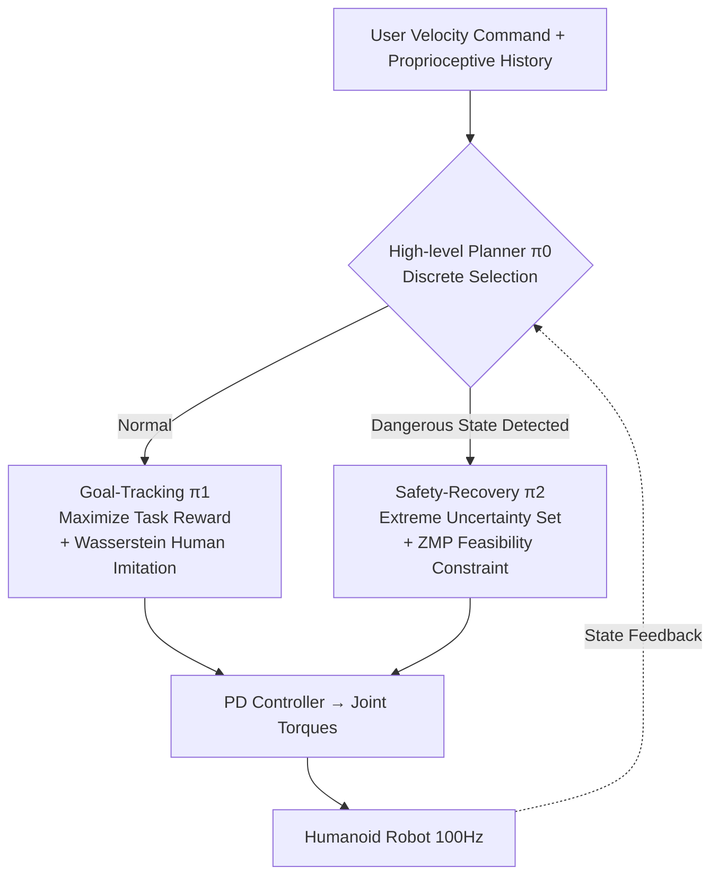

# HWC-Loco: A Hierarchical Whole-Body Control Approach to Robust Humanoid Locomotion

**Conference**: ICLR 2026  
**OpenReview**: [https://openreview.net/forum?id=3UE3Aatcjy](https://openreview.net/forum?id=3UE3Aatcjy)  
**Code**: TBD  
**Area**: Robotics / Embodied AI (Humanoid Locomotion)  
**Keywords**: Humanoid Robot, Whole-Body Control, Robust Reinforcement Learning, ZMP Constraint, Hierarchical Policy, Sim2Real  

## TL;DR
HWC-Loco reformulates humanoid locomotion control as a "robust optimization" problem, utilizing a high-level planner to dynamically switch between two low-level policies: "goal-tracking" and "safety-recovery." This ensures ZMP stability without sacrificing task performance, achieving SOTA results across various terrains, disturbances, and embodiments in both simulation and real-world hardware.

## Background & Motivation
- **Background**: Humanoid robot control has shifted from early model-based optimization to RL-based end-to-end policies. The latter can traverse terrains using only proprioception and human demonstrations, offering far better scalability than traditional methods requiring precise dynamics modeling.
- **Limitations of Prior Work**: RL policies are almost exclusively trained in simulation, leading to a significant Sim2Real gap during deployment. Common mitigation strategies—such as regularizing actions or employing domain randomization—either over-constrain the agent at the cost of control efficiency or utilize "unstructured" randomization that fails to capture critical, real-world safety-critical patterns (external impacts, hardware failures, sensor noise).
- **Key Challenge**: Formulating the problem as a standard max-min robust RL (worst-case control) tends to make policies **overly conservative**, sacrificing the ability to follow commands to ensure safety under worst-case dynamics. Conversely, ignoring robustness leads to falls on real hardware. A difficult trade-off exists between safety and task performance that is hard to balance statically.
- **Goal**: To learn a control policy that can **dynamically** solve the "task performance ↔ safety" trade-off in different deployment environments, rather than fixing a single level of conservatism.
- **Core Idea**: **[Robust Optimization + Hierarchical Switching]** Policy learning is reformulated as robust optimization that "ensures worst-case feasibility under mismatched dynamics." Task rewards are maximized, while safety and stylistic behavior are managed through constraints learned from human motion datasets. A high-level planner switches in real-time between a task-focused goal-tracking policy and a ZMP-focused safety-recovery policy, allowing the trade-off to adapt to the scenario.

## Method

### Overall Architecture
HWC-Loco decomposes the robust locomotion target (Eq. 4: max-min over the mismatched dynamics set $\mathcal{P}^L_\alpha$, subject to human imitation constraints $D_f$ and feasibility constraints $\phi$) into two phases and three policies. **Phase One** involves training the goal-tracking policy $\pi_1$ (maximizing task rewards + imitating humans under training dynamics) and the safety-recovery policy $\pi_2$ (ensuring ZMP feasibility under an uncertainty set of extreme cases). **Phase Two** freezes the low-level policies and trains a high-level discrete policy $\pi_0$ to learn optimal switching. During deployment, a VAE estimator infers privileged information from historical observations, and the system outputs low-level actions at 100 Hz.

### Key Designs

**1. Robust Optimization Reformulation: Shifting safety from "worst-case control" to "worst-case feasibility."** Standard robust RL uses $\max_\pi \min_{M} J(\pi,M)$ for worst-case control over an uncertainty set, which results in overall conservatism. This work instead lets only the **feasibility constraints** bear the weight of the worst-case scenario. Mismatched dynamics are modeled as an uncertainty set $\mathcal{P}^L_\alpha = \{\alpha P^L_T + (1-\alpha)\bar{P}_T\}$ (where $\alpha$ controls the mismatch scale, capturing Gaussian noise, terrain changes, etc.). The objective becomes $\max_\pi \min_{\hat{P}_T \in \mathcal{P}^L_\alpha} \mathbb{E}[\sum \gamma^t r_T]$ s.t. $D_f(\rho^{\pi_E}\|\rho^\pi)\le\epsilon_f$ and $\mathbb{E}[\phi(\tau)]\le\epsilon_\phi$. The intuition is: reward maximization and human imitation are performed on the nominal dynamics $P^L_T$, while only feasibility (safety) is required to hold across all mismatched dynamics, ensuring safety without excessive conservatism.

**2. Using Wasserstein Distance to transform "human style" from hard regularization into a learnable constraint.** Traditional methods rely on manual regularization of upper/lower body poses, which is task-dependent and difficult to tune. This work formulates stylistic constraints as an occupancy measure distance $D_f(\rho^{\pi_E}\|\rho^{\pi})$ from imitation learning, implemented via the Wasserstein-1 distance under Kantorovich-Rubinstein duality: $D_f = \sup_{\|f_d\|_L\le1} \mathbb{E}_{\rho^{\pi_E}}[f_d] - \mathbb{E}_{\rho^\pi}[f_d]$. The discriminator $f_d$ is learned via an adversarial objective with a gradient penalty $(\|\nabla f_d\|_2 - 1)^2$ (ensuring Lipschitz continuity, being more stable than KL/JS, and functioning even with non-overlapping distributions). Since this constrained RL problem has zero duality gap, it can be converted into an unconstrained Lagrangian form $\max_{\pi_1}\mathbb{E}[\sum\gamma^t(r_T - \lambda f_d(s_d))]$, using PPO to alternately update the policy and discriminator. Expert data is sourced from CMU MoCap (standing, walking, running) retargeted to the robot, eliminating the need for manual pose regularization.

**3. ZMP Feasibility Constraint: Attaching a physically interpretable stability index to safety recovery.** Bipedal robots can be modeled as a linear inverted pendulum; if the Zero Moment Point (ZMP) leaves the support polygon, the robot destabilizes rapidly. The feasibility metric is implemented as $\phi(s,a) = \|p_{ZMP}(s,a) - p_{ac}\|_2$, where $p_{ZMP} = p_{CoM} - \frac{z_{CoM}}{g}\ddot{p}_{CoM}$ (the Center of Mass position minus terms related to height, gravity, and acceleration) and $p_{ac}$ is the center of the support polygon. This reflects real-time stability and adapts to support phases, allowing the robot to utilize whole-body coordination to satisfy the ZMP constraint. The safety-recovery policy $\pi_2$ optimizes this constraint over an "extreme case uncertainty set" (consisting of multi-scale external forces/torques, high-intensity noise in proprioception and PD gains, malicious command resampling, and domain randomization), specifically learning to recover from imbalance.

**4. High-level Planner: A lightweight discrete policy for dynamic trade-off scheduling.** The two low-level policies have distinct strengths; the key is when to use each. The high-level policy $\pi_0$ optimizes over a discrete action space (one-hot selection of $\pi_1$ or $\pi_2$) with the objective $\max_{\pi_0}\mathbb{E}[\sum\gamma^t(r_T(s_t,\bar{a}_t) - \mathbb{1}(\bar{a}_{t-1}\ne\bar{a}_t) - \alpha\mathbb{1}(s_t))]$, covering task rewards, a continuity penalty to suppress frequent switching, and a termination penalty to prevent task failure. The $\alpha$ parameter is the primary control knob: increasing $\alpha$ makes the planner more sensitive to failure and biased toward safety. Experiments found that for $\alpha\in\{0,20,50\}$, $\pi_1$ remains dominant and $\pi_2$ is rarely invoked, while $\alpha=200$ leads to unstable training and over-conservative behavior due to sparse termination rewards. This provides practitioners with a direct interface for performance/safety balancing. During deployment, a VAE estimator $P(e_t,z_t|o^H_t)$ infers privileged information (including ZMP features) and employs frequency encoding for $\phi$ to catch subtle changes.

## Key Experimental Results

### Main Results
Success rates across various terrains in simulation (Isaac Gym) / Target Tracking / Human Similarity (lower is closer), selected from high-speed scenarios:

| Method | Ramp Success↑ | Stairs Success↑ | Stairs Tracking↑ |
|------|------|------|------|
| DreamWaQ | 90.46 | 60.58 | 1.06 |
| AHL | 97.36 | 67.48 | 1.09 |
| Goal-tracking (w/o recovery) | 98.51 | 72.60 | 1.11 |
| HWC-Loco-l (Low α) | 99.95 | 78.92 | 1.10 |
| **HWC-Loco** | **100.0** | **84.34** | 1.07 |

In low-speed scenarios, HWC-Loco achieved ~100% success on ramps and stairs (99.98% for stairs), leading across all categories.

### Ablation Study
Disturbance robustness (Success Rate↑ / ZMP Deviation Ratio↓), selected from low-frequency force / low-impulse / low-load:

| Method | Force Success↑ | Force ZMP↓ | Impulse Success↑ | Load Success↑ |
|------|------|------|------|------|
| DreamWaQ | 85.92 | 5.94 | 85.24 | 67.63 |
| AHL | 87.15 | 6.42 | 85.87 | 79.29 |
| Goal-tracking | 90.00 | 7.64 | 88.90 | 78.34 |
| **HWC-Loco** | **best** | **lowest** | **94.84** | **best** |

Under constant strong disturbances, HWC-Loco maintained a success rate of 75.95% (ZMP 6.61%); under high-impulse pushes, it stayed at 81.27% (ZMP 7.90%), with the gap widening as disturbance intensity increased.

### Key Findings
- **Removing the safety-recovery policy** (leaving only Goal-tracking) dropped the success rate on high-speed stairs from ~85% to ~60%, proving hierarchical switching is the primary source of robustness.
- On high-speed stairs, HWC-Loco's target tracking slightly decreased while success rate rose significantly, indicating that the policy **actively sacrifices speed for stability** in safety-critical scenes (like stair liftoff), rather than blindly following speed commands.
- For load disturbances (adding +10kg to hands—a **condition not seen during training**), the model maintained the highest success rate and low ZMP, showing generalization to unseen perturbations.
- On real hardware, the robot immediately switches to the recovery policy to adjust posture and gait under continuous push/pull/kick disturbances, smoothly returning to tracking once stable. It can climb 15cm stairs and 20° slopes, and walk on outdoor grass and slopes.

## Highlights & Insights
- **Shifting trade-offs from "static tuning" to "online decision-making"**: Unlike traditional methods that tune regularization or randomization once, this approach uses a high-level policy to let conservatism adapt in real-time, with $\alpha$ providing a human-interpretable safety knob.
- **"Worst-case feasibility" rather than "worst-case control"** is the key insight to resolve over-conservatism in robust RL—allowing only safety constraints to bear the robustness burden while rewards are optimized on nominal dynamics.
- **Mixing Physics Priors (ZMP) with Learning (Wasserstein Imitation)**: Stability is anchored by interpretable mechanical indices, while style is managed via adversarial imitation to avoid manual regularization, allowing each component to excel in its niche.
- Engineering completeness: Systematic evaluation across simulation and real hardware, multiple embodiments, various terrains, and diverse disturbances provides strong credibility.

## Limitations & Future Work
- **Dependency on privileged information estimation**: ZMP, external forces, and terrain height are not available during deployment and must be inferred by the VAE estimator; the impact of estimation error on safety constraints was not analyzed in depth.
- **Linear Inverted Pendulum Assumption for ZMP** may not hold during highly dynamic or airborne movements (e.g., running, parkour jumps); the paper focuses primarily on walking, ramp climbing, and stair climbing.
- **Discrete two-policy switching** is a coarse granularity; complex tasks might require more specialized policies or continuous blending; excessively large $\alpha$ (200) leads to training instability, requiring manual tuning of the robustness range.
- **Lack of exteroception** (vision/LiDAR): Pure proprioception limits forward planning for complex terrains.

## Related Work & Insights
- **Learning-based Legged Locomotion**: While RL for quadrupeds/bipeds is mature, humanoids represent a challenge due to high DOF and complex structures; this work continues the proprioception-only lineage while adding a safety mechanism.
- **Humanoid Whole-Body Control**: Recent works like HumanPlus, H2O, and OmniH2O rely on human motion priors to imitate complex movements but often depend on fine-tuned reward shaping and struggle with cross-embodiment; this work uses Wasserstein imitation and constrained RL to reduce manual parameter tuning.
- **Robust RL / Sim2Real**: Compared to the domain randomization of DreamWaQ or the two-phase history-aware extensions of AHL, the "worst-case feasibility + hierarchical switching" presented here offers a new paradigm for decoupling safety from performance, which is applicable to other high-dimensional safety-critical control tasks (robotic arms, exoskeletons).

## Rating
- **Novelty**: ⭐⭐⭐⭐ Reformulating humanoid control as robust optimization with "worst-case feasibility" paired with high-level dynamic switching is novel. The decoupled design of ZMP and Wasserstein imitation provides good insight, though the components (PPO imitation, domain randomization, ZMP) are mostly clever integrations of existing tools.
- **Experimental Thoroughness**: ⭐⭐⭐⭐ Evaluation across four dimensions (Sim/Real, Terrain, Disturbance, Embodiment) is comprehensive, with clear ablation proving the contribution of hierarchical switching. The lack of deep analysis on VAE estimation error and failure cases is a minor drawback.
- **Writing Quality**: ⭐⭐⭐⭐ Problem modeling (POMDP → Constrained RL → Robust Optimization) is progressive and mathematically rigorous, with clear breakdowns of the framework and objectives.
- **Value**: ⭐⭐⭐⭐ Safety-oriented humanoid locomotion control for real-world deployment has significant practical value. The $\alpha$ knob and decoupling paradigm are engineering-friendly.

<!-- RELATED:START -->

## Related Papers

- [\[ICLR 2026\] WholeBodyVLA: Towards Unified Latent VLA for Whole-Body Loco-Manipulation Control](wholebodyvla_towards_unified_latent_vla_for_whole-body_loco-manipulation_control.md)
- [\[ICLR 2026\] Hierarchical Value-Decomposed Offline Reinforcement Learning for Whole-Body Control](hierarchical_value-decomposed_offline_reinforcement_learning_for_whole-body_cont.md)
- [\[ICLR 2026\] From Language to Locomotion: Retargeting-free Humanoid Control via Motion Latent Guidance](from_language_to_locomotion_retargeting-free_humanoid_control_via_motion_latent_.md)
- [\[CVPR 2026\] End-to-End Language-Action Model for Humanoid Whole Body Control](../../CVPR2026/robotics/end-to-end_language-action_model_for_humanoid_whole_body_control.md)
- [\[CVPR 2026\] Beyond Mimicry: Learning Whole-Body Human-Humanoid Interaction from Human-Human Demonstrations](../../CVPR2026/robotics/beyond_mimicry_learning_whole-body_human-humanoid_interaction_from_human-human_d.md)

<!-- RELATED:END -->
