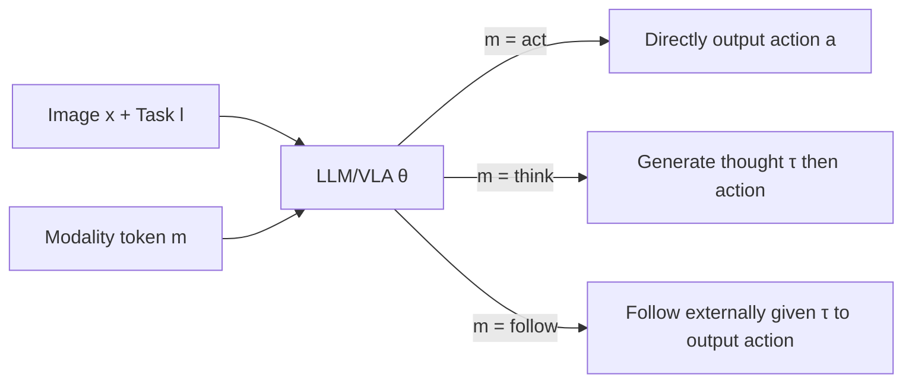

# Hybrid Training for Vision-Language-Action Models

**Conference**: ICLR 2026  
**OpenReview**: [https://openreview.net/forum?id=IBJtOltTbx](https://openreview.net/forum?id=IBJtOltTbx)  
**Code**: To be confirmed  
**Area**: Robotics / Embodied AI (VLA)  
**Keywords**: Vision-Language-Action, Embodied Chain-of-Thought, Hybrid Training, Inference Acceleration, Modality Variables  

## TL;DR
This paper proposes **Hybrid Training (HyT)**: an approach that enables VLAs to learn simultaneously from "Chain-of-Thought (CoT)" and "Action" data during training, while bypassing time-consuming thought generation during inference via a "modality variable." This achieves the performance gains of CoT while maintaining the high control frequency of standard VLAs.

## Background & Motivation
- **Background**: Introducing Embodied Chain-of-Thought (ECoT)—generating linguistic "plans/subtasks/object positions/motion directions" before outputting actions—has been proven to significantly improve robotic manipulation performance and enhance explainability (allowing humans to read and intervene in agent intentions).
- **Limitations of Prior Work**: CoT consists of **long language sequences** with token counts far exceeding the action itself. In real-world robot execution, generating thoughts at every step drastically reduces inference frequency—ECoT is 3× slower than standard VLA, and hierarchical VLAs (HiRobot) are 4× slower. Since manipulation tasks require long action sequences, latency severely compromises usability.
- **Key Challenge**: Difficulty in balancing **performance (via CoT) ↔ inference speed (via omitting CoT)**.
- **Goal**: To answer "Is generating a long CoT a **necessary prerequisite** for obtaining performance gains?" and to design a training scheme that is both fast and powerful.
- **Core Idea**: The **"Skilled Intuition" hypothesis**—drawing from Kahneman's System I/II dual-process theory, the authors hypothesize that the primary gains from CoT training do **not stem from the thoughts generated at test time, but from the knowledge internalized** by the model through "predicting thoughts + action conditioning on thoughts." Therefore, a well-trained VLA should be able to predict actions directly and more accurately using internalized "intuition" **without intermediate thoughts**.

## Method

### Overall Architecture
HyT unifies standard VLA, ECoT (thought-based), and hierarchical VLA (following-based) into a **single model with a single set of parameters $\theta$** under a hybrid objective. The key is the introduction of a **modality variable $m$** (encoded as text tokens like `<act>` / `<think>`): during training, Monte Carlo sampling ensures the model encounters three types of "input-output" combinations to learn three conditional action distributions. During inference, simply setting the modality token to `<act>` allows the model to output actions directly, maintaining the same inference overhead as a standard VLA.

### Key Designs

**1. Hybrid Training Objective: Unifying three VLAs via modality variable marginalization.** The starting point is expressing the action distribution as a marginalization over thoughts $\tau$ and the modality variable $m$: $p(a_t|x_t,l)=\sum_i\sum_j p_\theta(a_t,\tau^i|x_t,l,m^j)p(m^j)$. Under this framework, the authors specifically instantiate three conditional distributions: $p(a_t|x_t,l)=\underbrace{p_\theta(a_t|x_t,l,m_a)}_{\text{act}}+\underbrace{p_\theta(a_t|x_t,l,\tau_t)p_\theta(\tau_t|x_t,l,m_\tau)}_{\text{think}}+\underbrace{p_\theta(a_t|x_t,\tau_t,m_f)}_{\text{follow}}$. Here, **act** mimics standard VLA (setting $p_\theta(\tau=\varnothing|m_a)=1$, predicting action directly); **think** mimics ECoT (thought then action); **follow** mimics the low-level policy of hierarchical systems (executing given an external thought/instruction). This unified perspective allows one model to possess "fast, slow, and following" behaviors simultaneously, rather than training three independent models.

**2. Monte Carlo Sampling Implementation instead of weighted sum loss.** The total objective is a weighted sum of three negative log-likelihood terms: $\min_\theta \mathcal{L}_{hyt}=w_a\mathcal{L}_{act}+w_\tau\mathcal{L}_{think}+w_f\mathcal{L}_{follow}$. However, calculating three weighted terms for every sample would cause redundant thoughts and actions within a batch, reducing batch diversity. The authors re-interpret the weights $\{w_a,w_\tau,w_f\}$ as **sampling probabilities**: when constructing each batch, a combination of (modality token, thought, action) is randomly sampled for each data point based on these probabilities. In this paper, $\{w_a{:}0.25,\ w_\tau{:}0.5,\ w_f{:}0.25\}$ is used, meaning half the samples use think mode, one-quarter use act, and one-quarter use follow. Thus, the model learns three distributions through random exposure.

**3. One-click switching via modality tokens with zero overhead.** During testing, $m_a=\langle act\rangle$ is set by default to force the model to predict actions directly. The model leverages knowledge internalized from thoughts during training **without incurring additional token generation costs**, keeping the control frequency on par with standard VLAs (~3Hz). If explainability or fine-grained instruction following is needed, one can switch to $\langle think\rangle$ (to read agent intent) or follow mode (injecting human/oracle-given thoughts to override intent). It is observed that HyT-trained models "faithfully" obey the modality tokens, and performance across modes is similar, so the modality variable is set at the start of a task and not dynamically switched within an episode (dynamic switching is left for future work).

## Key Experimental Results

### Main Results: LIBERO Benchmark (Success Rate %, higher is better)

| Method | Spatial | Object | Goal | Long | Avg. |
|------|---------|--------|------|------|------|
| OpenVLA | 84.7 | 88.4 | 79.2 | 53.7 | 76.5 |
| CoT-VLA | 87.5 | 91.6 | 87.6 | 69.0 | 81.1 |
| π0-FAST | 96.4 | 96.8 | 88.6 | 60.2 | 85.5 |
| MolmoAct | 87.0 | 95.4 | 87.6 | 77.2 | 86.6 |
| VLA-OFT | 94.2 | 97.8 | 91.4 | 84.8 | 92.1 |
| **HyT (Ours)** | 94.0 | 97.2 | **96.2** | **89.4** | **93.7** |

When combined with the OFT recipe, HyT achieves SOTA average scores, with the most significant improvements in the most difficult **Goal / Long** horizon suites.

### Real-world Experiments (UFactory xArm 6, Success Rate %)

| Task Category | OpenVLA | HyT |
|----------|---------|-----|
| In-distribution | 52 ±10 | **72 ±9** |
| Out-of-distribution | 29 ±9 | **54 ±10** |
| **Overall** | 41 ±7 | **63 ±7** |

The improvement in OOD scenarios is particularly notable (29→54); HyT reaches grasp/place positions more accurately and never grasps the wrong object.

### Key Findings
- **ClevrSkills (9 tasks, 300–3000 demos)**: HyT surpasses not only standard VLA but also generally outperforms ECoT and HiRobot across **all data scales**. ECoT is second best, while hierarchical VLA is overtaken by standard VLA after ≥1500 demos. Gains are larger for **more complex, long-horizon** tasks.
- **Inference Speed**: HyT is consistent with standard VLA at ~3Hz, while ECoT is 3× slower and HiRobot is 4× slower. HyT achieves "ECoT-level performance + standard VLA-level speed."
- **Mode Equivalence**: Without oracle thoughts, HyT performs similarly in act and think modes—consistent with the idea that "generating thoughts at test time may not be necessary." Providing oracle thoughts (follow/think mode) further improves performance for all methods.
- **Saturation Scenarios**: When fine-tuning from a fully robotics-pretrained OpenVLA, both HyT and baselines approach saturation (~95.3%), suggesting HyT’s gains primarily **compensate for insufficient pre-training or scarce fine-tuning data**.

## Highlights & Insights
- The hypothesis that **"the value of thinking lies in training, not inference"** is systematically validated, providing a clean counter-example to the "fast vs. slow thinking" debate: one can harvest the benefits of CoT during training alone.
- A **single model + modality variable** unifies the standard, thought-based, and hierarchical VLA paradigms, offering engineering elegance with zero additional inference cost.
- The small trick of **re-interpreting loss weights as sampling probabilities** simply solves the batch diversity issue and can be reused in other multi-objective imitation learning scenarios.
- The three inference modes offer a flexible trade-off between "speed, explainability, and controllability," with follow mode naturally supporting fine-grained instruction injection from humans or oracles.

## Limitations & Future Work
- The conclusion that "act and think modes perform similarly" holds for the evaluated tasks; whether this remains true for **tasks requiring more complex embodied reasoning** requires further validation.
- The modality variable is **fixed** within an episode, leaving the exploration of **dynamic switching** mechanisms between fast and slow systems (e.g., switching to think for difficult steps and act for simple ones) to future work.
- Extraction of thoughts relies on oracle/simulator annotations or LLM generation (LIBERO); the cost of obtaining high-quality thought annotations in real-world scenarios is not fully discussed.
- The sampling coefficients $\{0.25, 0.5, 0.25\}$ are empirical; the robust optimal ratio across different tasks remains to be studied.

## Related Work & Insights
- **ECoT (Zawalski et al., 2024)**: Directly compared to and inspired this work, proving embodied thinking improves performance but slows inference; HyT builds on this by "removing the thought at inference."
- **DualFormer (Su et al., 2025)**: Systematically dropping reasoning traces during language model training aligns with HyT's "thought dropout" philosophy.
- **RFST / Hierarchical VLA (HiRobot, Shi et al., 2025)**: Uses discriminators or two-level models to switch between fast/slow systems; HyT replaces explicit hierarchy with a single model + modality variable.
- **Concurrent Work (Chen et al., 2025)**: Similarly found that reasoning pre-training/co-training/dropout can improve VLA by refining representations, supporting the explanation that "CoT primarily improves representations."
- **Insight**: "Distilling slow thinking during training and degrading to fast intuition during inference" is a scalable paradigm for general agents; modality tokens as low-cost behavior switches are also worth adopting.

## Rating
- Novelty: ⭐⭐⭐⭐ —— Unifying three VLA paradigms with marginalization + modality variables to achieve "training with CoT, inference without CoT" is a clear and practical perspective. It builds on DualFormer/CoT dropout, making it a solid application.
- Experimental Thoroughness: ⭐⭐⭐⭐ —— Covers ClevrSkills (data scale scan), LIBERO (SOTA comparison), and real xArm 6 (including OOD), reporting both inference speed and multi-mode analysis.
- Writing Quality: ⭐⭐⭐⭐ —— Driven by the question "Is CoT necessary?", the hypothesis-method-verification logic is coherent, with readable charts and Q&A style subheadings.
- Value: ⭐⭐⭐⭐ —— Directly addresses the "performance vs. speed" pain point for VLA deployment. The method is plug-and-play and can be combined with existing techniques like OFT, offering direct significance for real-world robotics.

<!-- RELATED:START -->

## Related Papers

- [\[ICLR 2026\] VLM4VLA: Revisiting Vision-Language-Models in Vision-Language-Action Models](vlm4vla_revisiting_vision-language-models_in_vision-language-action_models.md)
- [\[ICLR 2026\] Spatially Guided Training for Vision-Language-Action Model](spatially_guided_training_for_vision-language-action_model.md)
- [\[CVPR 2026\] QuantVLA: Scale-Calibrated Post-Training Quantization for Vision-Language-Action Models](../../CVPR2026/robotics/quantvla_scale-calibrated_post-training_quantization_for_vision-language-action_.md)
- [\[ICLR 2026\] villa-X: Enhancing Latent Action Modeling in Vision-Language-Action Models](villa-x_enhancing_latent_action_modeling_in_vision-language-action_models.md)
- [\[ICML 2026\] Test-Time Training for Visual Foresight Vision-Language-Action Models](../../ICML2026/robotics/test-time_training_for_visual_foresight_vision-language-action_models.md)

<!-- RELATED:END -->
