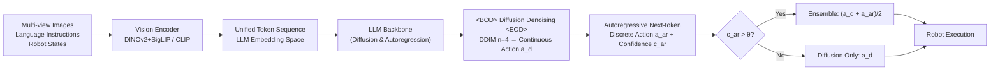

# HybridVLA: Collaborative Diffusion and Autoregression in a Unified Vision-Language-Action Model

**Conference**: ICLR 2026  
**OpenReview**: [https://openreview.net/forum?id=H1KDMNOKQn](https://openreview.net/forum?id=H1KDMNOKQn)  
**Code**: To be confirmed  
**Area**: Robotics / Embodied AI (VLA)  
**Keywords**: Vision-Language-Action, Diffusion Policy, Autoregressive, Unified Model, Collaborative Ensemble  

## TL;DR
HybridVLA enables a single LLM backbone to simultaneously perform diffusion denoising and autoregressive action prediction within a unified token sequence. By adaptively fusing both paradigms through a confidence-based collaborative ensemble, it achieves performance gains of 17% in simulation and 19% on real robots over SOTA models.

## Background & Motivation
- **Background**: VLA models transfer the reasoning and generation capabilities of VLMs to robotic manipulation. Currently, there are two main technical routes: autoregression, which discretizes continuous actions into bins predicted as tokens (e.g., OpenVLA), and diffusion, which adds a diffusion head to a VLM to predict continuous actions (e.g., π0, CogACT).
- **Limitations of Prior Work**: Autoregressive discretization breaks the continuity of action poses, making precise control difficult. Conversely, the diffusion head in current routes acts as an independent external module, treating the VLM merely as a multimodal feature extractor and **failing to utilize the pre-trained LLM as an iterative "action expert,"** thus wasting internet-scale pre-training knowledge.
- **Key Challenge**: Both paradigms have strengths—diffusion excels at continuous control for precise/dynamic objects, while autoregression inherits the VLM's generative paradigm, learning quickly and understanding flexible instructions or unseen objects. Existing works force a choice between the two, failing to combine their benefits in a single model.
- **Goal**: Construct a unified VLA model where a single LLM backbone performs both autoregressive and diffusion-based action generation, allowing them to reinforce each other and adaptively complement one another based on the scenario.
- **Core Idea**: **Collaborative generation within a unified sequence**—embedding the Markov denoising steps of diffusion into the LLM's next-token prediction process. Each denoising step is treated as an inference iteration, and an action ensemble mechanism fuses the outputs based on the confidence of autoregressive tokens.

## Method

### Overall Architecture
All multimodal inputs (multi-view images, language, robot states, diffusion timesteps with noisy actions, and autoregressive actions) are encoded into the LLM's embedding space and organized into a meticulously designed unified token sequence. The LLM first iteratively denoises continuous actions within a diffusion segment wrapped by `<BOD>`...`<EOD>`, then generates discrete action tokens autoregressively using these continuous conditions as a prefix. During inference, the two action paths are adaptively integrated based on autoregressive confidence to drive the robotic arm.

### Key Designs

**1. Unified Token Sequence Arrangement: Using markers to serialize two paradigms without conflict**
The paper systematically compares four sequence layouts (Table 1) and selects Type 4. Robot states are no longer discretized into the language query but are mapped directly into continuous vectors $f_r \in \mathbb{R}^{B\times 1\times 4096}$ via a learnable MLP to enhance temporal consistency. Diffusion timesteps and noisy actions are similarly projected into continuous vectors, wrapped by `<BOD>` (Beginning of Diffusion) and `<EOD>` (End of Diffusion) tokens. This boundary design is crucial for clarifying the limits of each generation type and avoiding confusion during next-token prediction (e.g., preventing diffusion tokens from predicting discrete mask tokens). More subtly, the **order of placement** matters: during autoregressive training, both the question and answer (including ground truth discrete actions) are visible. If autoregression is placed before diffusion, these GTs leak into the diffusion condition (Type 3). Therefore, the paper places diffusion tokens first, which provides continuous latent conditions for subsequent tokens and naturally avoids information leakage since diffusion operates on noise.

**2. Collaborative Training Recipe: Embedding diffusion denoising into next-token prediction**
Both paradigms share the LLM and jointly optimize a hybrid objective. The diffusion side follows the denoising MSE of diffusion policies: $L_{dif}=\mathbb{E}_{a,i,c}\lVert \epsilon - \epsilon_\pi(a_t^i, i, c)\rVert^2$, where $\epsilon\sim\mathcal{N}(0,1)$ and $c$ is the conditional context. The autoregressive side minimizes the cross-entropy of discrete actions $L_{ar}$, resulting in $L_{hybrid}=L_{dif}+L_{ar}$. Since action data is normalized to $[-1,1]$ and discrete actions are quantized representations of this distribution, both branches approximate the same conditional action distribution, leading to mutual reinforcement (verified by PCA and ablation). During inference, diffusion uses DDIM with as few as $n=4$ sampling steps to balance performance and speed. Each step feeds only the current noisy sample into the LLM to predict the next noise; the sequence does not retain historical noise, making each step an "inference iteration." To accelerate this, KV cache is introduced: after the first step processes vision/language tokens, subsequent steps only forward updated timesteps and noise, reusing cached K/V values to reduce redundant computation.

**3. Collaborative Action Ensemble: Adaptive fusion using autoregressive confidence**
The authors observed two phenomena: different action types perform differently across tasks, and the confidence of autoregressive tokens is a reliable indicator of action quality (average confidence of autoregressive tokens exceeds 0.96 in >80% of successful samples). Based on this, an ensemble rule is designed: guided by the average confidence of autoregressive tokens $c^{ar}_{t+1}$, if it exceeds a threshold $\theta=0.96$, the autoregressive action is considered accurate and averaged with the diffusion action $a_{t+1}=(a^d_{t+1}+a^{ar}_{t+1})/2$; otherwise, only the diffusion action $a_{t+1}=a^d_{t+1}$ is used. This strategy of "fusion only at high confidence, fallback to diffusion at low confidence" makes the control more robust.

The model is initialized with a pre-trained Prismatic VLM and trained in two stages: first, large-scale pre-training on 35 datasets including Open X-Embodiment, DROID, and RoboMIND (760K trajectories, 33M frames, >10K A800 GPU hours), followed by fine-tuning on self-collected simulation and real-world data. Both 7B (LLaMA-2) and 2.7B (Phi-2) scales are provided.

## Key Experimental Results

### Main Results (RLBench 10-task multi-task setting, Success Rate S.R.↑)

| Method | Mean S.R. | Inference Speed |
|---|---|---|
| ManipLLM (7B) | 0.38 | 2.2 Hz |
| OpenVLA (7B) | 0.41 | 6.3 Hz |
| OpenVLA-OFT (7B) | 0.45 | 13.4 Hz |
| π0 (2.6B) | 0.61 | 13.8 Hz |
| CogACT (7B) | 0.60 | 9.8 Hz |
| HybridVLA-ar (Ours 7B) | 0.65 | 6.3 Hz |
| HybridVLA-dif (Ours 7B) | 0.72 | 9.4 Hz |
| **HybridVLA (Ours 7B)** | **0.78** | 6.1 Hz |
| HybridVLA (Ours 2.7B) | 0.67 | 12.3 Hz |

HybridVLA (7B) outperforms the autoregressive SOTA (OpenVLA) and diffusion SOTA (π0) by 37% and 17% respectively. Even looking strictly at the diffusion branch, HybridVLA-dif outperforms CogACT/π0 by 12%/11%, indicating that a shared LLM releases more diffusion potential than an external diffusion head.

### Ablation Study (Table 3, 10 RLBench Tasks)

| Configuration | Training Loss | LSP | Mean ↑ |
|---|---|---|---|
| Ex1 AR Only | $L_{ar}$ | ✓ | 0.57 |
| Ex2 AR Only | $L_{hybrid}$ | ✓ | 0.65 |
| Ex3 Dif Only | $L_{dif}$ | ✓ | 0.65 |
| Ex4 Dif Only | $L_{hybrid}$ | ✓ | 0.72 |
| **Ex5 AR+Dif+CAE** | $L_{hybrid}$ | ✓ | **0.78** |
| Ex6 AR+Dif+CAE | $L_{hybrid}$ | ✗ | 0.22 |

- Ex1→Ex2, Ex3→Ex4: Switching to the hybrid objective improves single-branch performance (0.57→0.65, 0.65→0.72), proving that joint training of the two paradigms provides mutual gains.
- Ex5 (Collaborative Ensemble) reaches 0.78, superior to either single branch.
- Ex6 removing large-scale pre-training (LSP) causes performance to drop to 0.22, highlighting cross-embodiment pre-training as the foundation.

### Key Findings
- Sequence layout is critical: Type 4 is optimal under both diffusion and autoregressive inference (Dif 0.72 / AR 0.65). Incorrect layouts cause GT leakage or token confusion.
- Real-world: Achieves an average 19% improvement over SOTA on single-arm and dual-arm tasks, showing strong generalization to unseen objects, backgrounds, spatial layouts, and lighting.
- The autoregressive branch can be replaced with linguistic task planning without harming diffusion action stability (this setup still reaches 74%).

## Highlights & Insights
- **Elegant Paradigm Fusion**: Rather than running diffusion and autoregression separately and concatenating them, the model interprets diffusion denoising as a form of next-token inference iteration for the LLM. Both share a backbone and approximate the same distribution, resulting in reinforcement rather than simple stacking.
- **Confidence as a Quality Signal**: The discovery that autoregressive token confidence strongly correlates with action correctness allows it to function as an effective ensemble switch.
- **Solid Engineering**: The use of KV cache accelerates diffusion steps, and the effectiveness of DDIM with only 4 steps ensures that the unified model's inference speed remains comparable to single-paradigm baselines.

## Limitations & Future Work
- The ensemble threshold $\theta=0.96$ is empirical. Whether it requires retraining across tasks/embodiments and its sensitivity remains a potential vulnerability despite appendix analysis.
- The 7B model infers at 6.1 Hz, which may be slow for high-frequency closed-loop control (e.g., dexterous hands). The 2.7B model is faster but less accurate.
- High pre-training cost (>10K A800 hours) creates a high barrier to reproduction; ablations show performance collapses without pre-training, indicating heavy data dependence.
- Actions are still SE(3) end-effector poses (7/14-DOF). Performance on higher degrees of freedom or contact-rich manipulation is not yet verified.

## Related Work & Insights
- **Autoregressive VLA**: RT-2, OpenVLA, ManipLLM, and FAST discretize actions into tokens, which is efficient but sacrifices continuity.
- **Diffusion VLA**: π0/π0.5, CogACT, DiVLA, and TinyVLA add diffusion/flow-matching heads after the VLM, which is precise but treats the LLM merely as a feature extractor.
- **Insights**: This paper suggests that "multi-paradigm collaboration within a unified sequence" is a promising path. Rather than decoupling systems (slow reasoning + fast control), a single backbone can learn to switch generation modes within one sequence. The confidence-guided adaptive ensemble can also be transferred to other multi-expert or multi-head prediction scenarios.

## Rating
- **Novelty**: ⭐⭐⭐⭐ First to embed diffusion denoising into LLM next-token prediction and fuse two generation paradigms in a unified sequence.
- **Experimental Thoroughness**: ⭐⭐⭐⭐ Includes simulation (RLBench/SimplerEnv) and real-world (single/dual-arm), SOTA comparisons, component ablations, sequence layout ablations, and generalization tests on a scale of 760K trajectories.
- **Writing Quality**: ⭐⭐⭐⭐ Clear motivation, high-quality diagrams and tables, and well-structured methodology.
- **Value**: ⭐⭐⭐⭐ Provides a strong baseline and reusable design for VLA paradigm fusion with significant performance improvements.

<!-- RELATED:START -->

## Related Papers

- [\[ICLR 2026\] UniVLA: Unified Vision-Language-Action Model](unified_vision-language-action_model.md)
- [\[ICLR 2026\] Unified Diffusion VLA: Vision-Language-Action Model via Joint Discrete Denoising Diffusion Process](unified_diffusion_vla_vision-language-action_model_via_joint_discrete_denosing_d.md)
- [\[ICLR 2026\] CoNavBench: Collaborative Long-Horizon Vision-Language Navigation Benchmark](conavbench_collaborative_long-horizon_vision-language_navigation_benchmark.md)
- [\[ICLR 2026\] HAMLET: Switch Your Vision-Language-Action Model into a History-Aware Policy](hamlet_switch_your_vision-language-action_model_into_a_history-aware_policy.md)
- [\[ICLR 2026\] Hybrid Training for Vision-Language-Action Models](hybrid_training_for_vision-language-action_models.md)

<!-- RELATED:END -->
