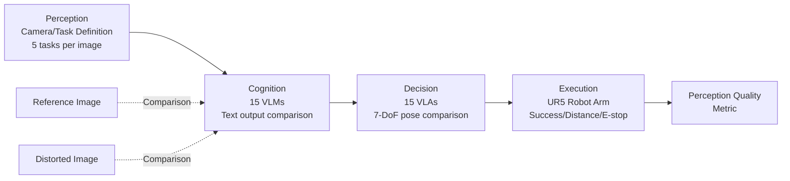

# Image Quality Assessment for Embodied AI

**Conference**: ICLR 2026  
**OpenReview**: [https://openreview.net/forum?id=azj53PLJRL](https://openreview.net/forum?id=azj53PLJRL)  
**Code**: [https://github.com/aiben-ch/EmbodiedIQA](https://github.com/aiben-ch/EmbodiedIQA)  
**Area**: Embodied AI / Image Quality Assessment / Datasets & Benchmarks  
**Keywords**: Embodied AI, Image Quality Assessment, VLM, VLA, Robot Perception, Benchmark  

## TL;DR
This work extends Image Quality Assessment (IQA) from "predicting human preference" to "predicting robot task success" for the first time. Based on the Mertonian system, a four-step **Perception-Cognition-Decision-Execution** pipeline is established. The Embodied-IQA database is constructed, containing 36.9k distorted image pairs and 5.53M fine-grained annotations (compiled from 15 VLMs, 15 VLAs, and 1.5k real-robot experiments). Evaluations using 15 mainstream IQA methods demonstrate that existing metrics designed for humans fail significantly in embodied contexts.

## Background & Motivation

**Background**: While Embodied AI has progressed rapidly, most models remain confined to laboratories. In real-world environments, distortions such as camera shake, noise, compression, and lighting changes often cause tasks successful in the lab to fail. A natural requirement arises: can a "robot usability" score be assigned to embodied scene images to filter low-quality frames, similar to how IQA is used in media streaming?

**Limitations of Prior Work**: Traditional IQA is **human-oriented**, focusing on fitting human subjective preferences for distorted images. However, the sensitivities of the Human Visual System (HVS), General Machine Visual System (MVS), and Robot Visual System (RVS) differ significantly: (1) HVS is sensitive to noise/compression which may barely affect downstream robot tasks, whereas brightness/contrast exhibit the opposite trend; (2) General machine "perceptual quality" depends only on **cognition** tasks like detection/segmentation, but robots involve subsequent **decision** and **execution** steps—high fidelity in one stage does not guarantee success in the next.

**Key Challenge**: HVS and MVS can be viewed as **Newtonian systems** (where states and controls precisely predict the next step), while RVS is a **Mertonian system**. A single-character error in cognition can lead to vastly different poses in decision-making; a 1 cm deviation in decision-making can result in a collision during execution. This amplification of "step-by-step unpredictability" makes it impossible to directly transfer existing IQA methods to embodied scenarios.

**Goal**: To formally introduce "IQA for Embodied AI" and provide reliable perceptual quality metrics for future embodied applications.

**Core Idea**: **Define image quality through the success rate of downstream robot tasks**. The negative impacts of distortion across cognition, decision, and execution are quantified. This subjective scoring is formalized into a database via large-scale VLM/VLA/real-robot annotations to verify the failure of existing IQA methods.

## Method

### Overall Architecture

Ours does not propose a new IQA model but **establishes a subjective scoring system + database + benchmark**. Borrowing the Mertonian Law from sociology, the visual link of embodied AI is decomposed into Perception → Cognition → Decision → Execution, with a specific "scoring agent" assigned to each step: Perception corresponds to the camera (task definition), Cognition to VLMs (brain), Decision to VLAs (cerebellum), and Execution to the robotic arm (motor system). The quality of a distorted image is defined by how much it "derails" the task along this pipeline.

The scoring logic for the entire link is built on **reference/distorted image pairs**: for the same task, both images are fed to the same agent, and the output difference is measured. Larger differences indicate greater harm to the robot and lower image quality.

### Key Designs

**1. Four-step Pipeline under Mertonian Systems: Why Robots Need Dedicated IQA.** The fundamental design is the argument that RVS cannot reuse HVS/MVS paradigms. HVS and MVS work with existing IQA because they are Newtonian—their decision and execution processes are robust and predictable. In contrast, robot decision and execution **do not strictly follow cognition**: a character-level cognitive bias can be magnified into a drastic pose change, and a 1 cm path shift can result in an obstacle collision. Due to this unpredictable amplification, Cognition, Decision, and Execution must be **scored separately**.

**2. Embodied-IQA Database and Distortion System.** 1,230 high-quality reference images were collected (filtered with Q-Align), covering Sim2Real, first/third-person perspectives, 5 agent types, and 5 backgrounds. For each reference, **30 distortion types categorized into 7 classes** (Blur, Luminance, Chrominance, Noise, Compression, Spatial, Others) were applied. Each distortion has 5 intensity levels aligned with HVS perception, resulting in **36,900 distorted images**. Five natural language tasks of increasing difficulty (using verbs like Cover, Insert, Move, Pick, Place, Pour, Press, Pull, Push, Twist) were manually annotated for each reference image.

**3. Cognition Scoring: Three-dimensional Comparison of VLM Text Outputs.** 15 mainstream VLMs with $<8B$ parameters (InternVL series, Qwen2.5-VL, Phi, Ovis, etc.) were used. Each VLM answers tasks in approximately 10 words. Differences between reference and distorted outputs are measured across **accuracy, recall, and semantics** using the mean of BLEU, ROUGE, and CIDEr metrics. Distortions often affect VLMs at the character level rather than the semantic level.

**4. Decision Scoring: 7-DoF Pose Decomposition for VLA.** 15 VLAs (OpenVLA, Pi0, Octo, CogACT, RT-X-1, etc.) output actions. Ours introduces VLA into IQA for the first time, decomposing action quality into three 7-DoF dimensions: the first 3 dimensions for **position** (mm), the next 3 for **rotation** (rad), and the last for gripper **state** ($[0,1]$). Scores are based on the spatial distance between reference and distorted results. Experimentally, Rotation is found to be the most sensitive to distortion, while State is the least affected.

**5. Execution Scoring: Real-robot Tri-state Scoring.** A UR5 arm with a Robotiq 2F-140 gripper was used for real-robot tasks. Scores are: **Success** = 100; **Failure** = penalty based on Euclidean distance (cm) from the reference pose; **Emergency stop** (collision) = 0. To ensure failure results from distortion rather than task complexity, only the simplest tasks were executed. 1.5k experiments connect "internal reasoning" (VLM/VLA) with "external reality" (execution).

## Key Experimental Results

### Main Results: 15 IQA Methods Predicting Decision Scores (SRCC, extract Position / Viewpoint)

| Group | Method | Position SRCC↑ | Rotation SRCC↑ | State SRCC↑ | First-person | Third-person |
|---|---|---|---|---|---|---|
| Zero-shot | PSNR | 0.2762 | 0.2594 | 0.2284 | 0.4059 | 0.3949 |
| Zero-shot | SSIM | 0.4862 | 0.4246 | 0.3607 | 0.5834 | 0.5478 |
| Zero-shot | Q-Align | 0.5325 | 0.5387 | 0.3791 | 0.6658 | 0.5854 |
| **FR** | AHIQ | 0.7481 | 0.6454 | 0.6465 | 0.8011 | 0.7989 |
| **FR** | **TOPIQ-FR** | **0.7748** | 0.6428 | **0.6684** | **0.8307** | **0.8322** |
| NR | **TOPIQ-NR** | 0.7496 | 0.5981 | 0.7036 | 0.7791 | 0.8269 |
| NR | CLIPIQA | 0.1784 | 0.0708 | 0.1348 | 0.0048 | 0.2155 |

- **Rotation is the hardest to predict, Position is the easiest**. Full-reference (FR) methods generally outperform No-reference (NR) (NR typically $<0.6$). Even the best (TOPIQ-FR) only reaches $SRCC \approx 0.75$, compared to $\sim 0.9$ on HVS IQA, proving existing metrics are unsuitable for embodied scenes.

### Key Findings

| Dimension | Conclusion |
|---|---|
| Inter-model Consistency (SRCC) | $\sim 0.3$ for VLMs and $\sim 0.25$ for VLAs. This is much lower than HVS ($>0.6$), necessitating the aggregation of multiple model preferences. |
| Failure of Frozen Metrics | LPIPS/DISTS/CLIPIQA parameters frozen on HVS perform worse than zero-shot baselines after training, highlighting the HVS $\leftrightarrow$ RVS gap. |
| Distortion Levels | IQA performance remains nearly constant across 5 absolute levels, suggesting levels should be defined by RVS Just Noticeable Difference (JND). |
| Cross-database Validation | Fine-tuning on VLA decision scores leads to a collapse in HVS performance (SRCC $<0.4$ on LIVE), yet it can predict VLM cognition scores ($0.7$ for AHIQ). |
| Real-robot Correlation | **Cognition $\leftrightarrow$ Execution SRCC $<0.5$; Decision $\leftrightarrow$ Execution SRCC $>0.6$ (0.671)**. Decision represents execution to some degree, but real experiments remain irreplaceable. |

## Highlights & Insights
- **Problem Definition as the Major Contribution**: Redefining "image aesthetics" as "robot task feasibility" opens a new sub-field of IQA for embodied AI.
- **Mertonian vs. Newtonian Analogy**: The concept of "step-by-step unpredictable amplification" clarifies the intrinsic difference between robot IQA and human IQA, justifying the Perception-Cognition-Decision-Execution framework.
- **VLA Integration**: First work to introduce VLA into IQA with an actionable 7-DoF pose scoring scheme, and the first to use real-robot execution to quantify the bridge between reasoning and physical action.
- **Large-scale & Multi-agent**: 36.9k pairs, 5.53M annotations, 30 models plus real robots—exceeding previous quality databases in scale and dimension.

## Limitations & Future Work
- **Lack of a New IQA Model**: The work identifies the failure of existing methods but leaves the creation of a dedicated Embodied IQA model (best $SRCC \approx 0.75$) as an open problem.
- **Simplified Execution Task**: To maintain control, real-robot tests were limited to the simplest difficulty level; conclusions for complex tasks remain unverified.
- **Bias in First-person Results**: Performance in first-person views is significantly worse, likely due to data biases in VLA training regarding tool/effector sampling rather than pure image quality.
- **Real-robot Correlation Gap**: The $0.671$ correlation indicates that simulation/reasoning cannot yet fully replace real-robot testing, making scalable annotation expensive.

## Related Work & Insights
- **Traditional IQA Databases** (LIVE, TID2013, KADID-10K) are human-oriented and single-subject. Machine-oriented databases (MPD, EPD) only cover cognition. Embodied-IQA is the first to cover all three layers (Cognition/Decision/Execution).
- **Machine-oriented IQA** previously focused on detection/segmentation; ours pushes the boundary two steps further toward downstream decision and execution.
- **Insights**: (1) Evaluation paradigms must follow the "user"—robot metrics must be defined by robot success rates. (2) Multi-model aggregation is necessary for low-consistency scenarios. (3) JND should be redefined for RVS. Future directions include end-to-end Embodied IQA models, integration of quality metrics into VLA training for data filtering, and specialized distortion grading for RVS.

## Rating
- **Novelty**: ⭐⭐⭐⭐⭐ First to propose IQA for Embodied AI; the Mertonian framework and VLA/real-robot scoring are highly original.
- **Experimental Thoroughness**: ⭐⭐⭐⭐ Solid evidence from 36.9k images and 15+15 models. Minor deduction as execution was limited to low-difficulty tasks.
- **Writing Quality**: ⭐⭐⭐⭐ Logical progression from HVS to MVS to RVS; informative visual aids.
- **Value**: ⭐⭐⭐⭐⭐ Provides essential infrastructure for real-world deployment of Embodied AI and establishes a sustainable research direction.

<!-- RELATED:START -->

## Related Papers

- [\[ICLR 2026\] D2E: Scaling Vision-Action Pretraining on Desktop Data for Transfer to Embodied AI](d2e_scaling_vision-action_pretraining_on_desktop_data_for_transfer_to_embodied_a.md)
- [\[ICLR 2026\] Grounding Generative Planners in Verifiable Logic: A Hybrid Architecture for Trustworthy Embodied AI](grounding_generative_planners_in_verifiable_logic_a_hybrid_architecture_for_trus.md)
- [\[ICLR 2026\] Interleave-VLA: Enhancing Robot Manipulation with Image-Text Interleaved Instructions](interleave-vla_enhancing_robot_manipulation_with_image-text_interleaved_instruct.md)
- [\[ACL 2026\] Limited Linguistic Diversity in Embodied AI Datasets](../../ACL2026/robotics/limited_linguistic_diversity_in_embodied_ai_datasets.md)
- [\[ICLR 2026\] Planning with an Embodied Learnable Memory](planning_with_an_embodied_learnable_memory.md)

<!-- RELATED:END -->
