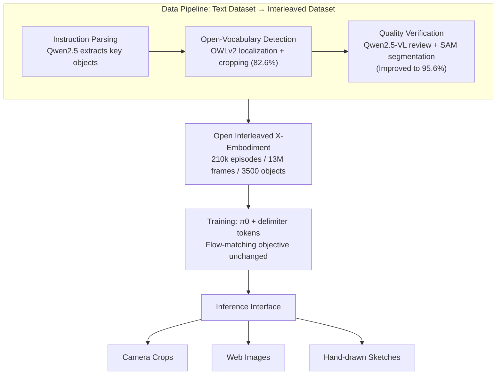

# Interleave-VLA: Enhancing Robot Manipulation with Image-Text Interleaved Instructions

**Conference**: ICLR 2026  
**OpenReview**: [https://openreview.net/forum?id=ULTWUuGhC3](https://openreview.net/forum?id=ULTWUuGhC3)  
**Code**: Project page open-sourced (210k episodes dataset + code)  
**Area**: Robot Manipulation / Vision-Language-Action Models (VLA)  
**Keywords**: Interleaved Instruction, VLA, Out-of-Domain Generalization, In-Context Visual Grounding, Open X-Embodiment  

## TL;DR
This paper proposes Interleave-VLA: a model-agnostic paradigm requiring minimal architectural changes that enables existing VLAs to process "image-text interleaved" instructions (replacing text descriptions of target objects with their images). Along with an automated pipeline that transforms Open X-Embodiment into a 210k interleaved instruction dataset, the approach improves out-of-domain generalization for unseen objects by approximately 2× and demonstrates emergent zero-shot understanding of sketches and web images.

## Background & Motivation
- **Background**: Foundation models have enabled "generalist robot policies." The mainstream approach extends VLMs into VLAs (Vision-Language-Action) to directly generate continuous actions from text instructions and visual observations (e.g., π0, OpenVLA, RT-2). However, almost all modern VLAs remain confined to the **pure text instruction** paradigm (referred to as Text-VLA).
- **Limitations of Prior Work**: Pure text instructions are often **ambiguous or cumbersome** in out-of-domain scenarios. When a user wants to say "pick up the thing that looks like this," text struggles to precisely describe objects with unique shapes or colors. The authors attribute generalization failures to three types of **attentional hallucination**: ① **attention bias** (focus incorrectly lands on a salient distractor); ② **diffused attention** (attention spreads across the scene without a focus, indicating model uncertainty); ③ **attention leakage** (target is correctly identified but focus spills into the irrelevant background). These stem from **semantic ambiguity** (e.g., picking the wrong item when a "toy dinosaur" is next to a similarly shaped toy elephant) and **training distribution bias** (rare words like "redbull" being tokenized into "red" + "bull," causing over-focus on "red" and mistaking Coca-Cola for Red Bull).
- **Key Challenge**: While digital-world VLMs have long benefited from **arbitrary image-text interleaved** inputs for stronger generalization, physical-world VLAs have yet to leverage this advantage. VIMA pioneered the concept of interleaved instructions but was limited to high-level planning in 2D stylized simulations, without verifying feasibility or generalization gains for low-level continuous actions in the real world.
- **Goal**: To migrate "image-text interleaved instructions" from the digital world to continuous action generation in the physical world while remaining **natural, flexible, model-agnostic, and minimally invasive**, and to systematically verify the real gains of interleaved instructions over pure text.
- **Core Idea**: **(1) Use images to replace ambiguous object descriptions** in text, providing "low-bias" in-context visual grounding to directly mitigate ambiguity-induced hallucinations; **(2) Automated data generation**: Design a pipeline to automatically convert existing pure-text robot datasets into interleaved instructions, solving the bottleneck of lacking interleaved training data; **(3) Minimal adaptation**: Only add delimiters to the tokenizer and modify input processing without changing the core architecture, allowing SOTA VLAs to be used "plug-and-play."

## Method

### Overall Architecture
Interleave-VLA formalizes the state as a triplet $s_t = (I_t, q_t, \mathcal{I})$: the current visual observation $I_t$, proprioception $q_t$, and an **interleaved instruction sequence** $\mathcal{I} = (u_1, \dots, u_M)$, where each token $u_j \in V_{\text{text}} \cup V_{\text{img}}$ is either a text token or an image token. The policy $a_t \sim \pi_\theta(\cdot \mid s_t)$ samples continuous actions based on this input. When all $u_j$ are text, the model degrades to a standard Text-VLA. The paradigm consists of three components—an **adaptation module** (allowing existing VLAs to understand interleaved formats), **scalable training** (training on 210k interleaved samples without changing hyperparameters or objectives), and a **universal inference interface** (accepting camera crops, web images, or sketches at test time); plus an **automated data generation pipeline** that converts Open X-Embodiment into interleaved data.

### Key Designs

**1. Minimal Adaptation Module: Delimiters only, zero architectural changes.** Interleave-VLA keeps the VLA backbone intact. It only introduces **special delimiter tokens** (e.g., `<BOI>`/`<EOI>` to mark the start and end of image segments) into the base model's tokenizer and upgrades the input processor to support "text-image-text" interleaved layouts. A typical instruction changes from pure text `Place [the blue spoon near microwave] into [silver pot on towel]` to `Place [image1] into [image2]`—replacing ambiguous noun phrases directly with object crops. The paper primarily applies this to π0 (whose Paligemma base does not natively support interleaved input) and validates that it also works for OpenVLA, which has a different architecture and training objective, proving it is truly "model-agnostic." This "minimal intrusion" is key to maintaining pre-trained capabilities while enabling plug-and-play usage.

**2. Automated Interleaved Data Pipeline: Three stages to "image-ify" text data.** Since real-world robot datasets only contain text instructions, the authors use three steps to convert them: ① **Instruction Parsing** uses Qwen2.5 to extract key object nouns from linguistic instructions (more adaptable than rule-based tools like SpaCy and better at summarizing long instructions); ② **Open-Vocabulary Detection** uses OWLv2 to locate and crop target objects within trajectory frames based on keywords (82.6% accuracy); ③ **Data Quality Verification** addresses OWLv2 failures by using Qwen2.5-VL to review detection results and, if necessary, provide keypoints for Segment Anything (SAM) to perform fine-grained segmentation, raising overall accuracy to **95.6%**. This pipeline integrates 11 sub-datasets from Open X-Embodiment (RT-1, Bridge, Jaco Play, Language Table, etc.), producing a real-world interleaved dataset with **210k episodes, 13 million frames, and 3500 object categories**. To increase instruction diversity, internet images are randomly mixed in to replace original object images.

**3. Ablation of Three Training Modalities: Locating the source of gains.** To clarify why "interleaved" works, the authors compare three variants: **Text-VLA** (text for both training/testing), **Interleave-VLA (Partial)** (interleaved training, text testing), and **Interleave-VLA (Full)** (interleaved training + testing). Results show: Partial already outperforms pure text due to the multimodal nature of interleaved data (reducing overfitting), while Full doubles semantic OOD generalization through explicit visual grounding at test time. This suggests gains come from both **data/modality diversity** (mitigating distribution bias hallucinations) and the **in-context visual information provided by the interleaved format** (mitigating ambiguity hallucinations). Further image prompt ablations show that a **mix of task-specific and web images** outperforms any single source (71.0 in-domain vs. 59~67 for single), indicating that prompt image diversity is a dimension for scaling.

**4. Universal Inference Interface: Zero-shot availability for unseen instruction modalities.** During inference, the model supports both pure text and interleaved instructions. Interleaved images can come from camera crops, web images, or even hand-drawn sketches—even if the style differs vastly from training data. Because the model learns the general capability of "using images to anchor targets in-context" rather than memorizing specific image styles, zero-shot understanding of **crops/web images/sketches** emerges, making human-robot interaction through GUIs more intuitive (e.g., "directing a robot by drawing a simple sketch").

## Key Experimental Results

### Main Results: SimplerEnv (WidowX / BridgeData V2)
4 In-domain tasks + 3 Out-of-domain suites (Visual / Novel Object / Novel Category), 3 seeds, success rate (%).

| Model | Paradigm | Train/Test Modality | In-Domain | Visual | Novel Object | Novel Category | Avg |
|------|------|------|-----------|--------|--------------|----------------|-----|
| RT-1-X | Text-VLA | Text/Text | 1.1 | 0.0 | 3.5 | 5.8 | 3.2 |
| Octo | Text-VLA | Text/Text | 17.4 | 12.5 | 10.8 | 8.2 | 10.5 |
| Spatial-VLA | Text-VLA | Text/Text | 38.4 | 19.6 | 17.1 | 17.6 | 18.0 |
| π0.5 | Text-VLA | Text/Text | 57.2 | 53.9 | 50.9 | 41.8 | 49.0 |
| π0 | Text-VLA | Text/Text | 68.1 | 72.4 | 26.0 | 19.3 | 39.5 |
| π0 | Interleave (Partial) | Interleave/Text | 70.1 | 76.8 | 35.8 | 20.9 | 43.6 |
| **π0** | **Interleave (Full)** | **Interleave/Interleave** | **70.5** | 73.2 | **53.8** | **57.3** | **60.6** |

- In-domain performance is largely maintained (70.5 vs. 68.1), showing interleaved instructions do not hurt familiar tasks. **OOD semantic generalization for Novel Object 26.0→53.8 and Novel Category 19.3→57.3 represents a ~2× improvement**, surpassing even π0.5 which uses additional object grounding/detection VQA pre-training.

### Main Results: Real Robot (FANUC LRMate 200iD/7L, 20 teleop demos per object)
PT indicates pre-training on the interleaved dataset (Note: pre-training data **does not include FANUC**, yet cross-embodiment transfer occurs).

| Paradigm | PT | In-Domain (Succ Avg) | Out-of-Domain (Succ Avg) |
|------|----|----------------------|--------------------------|
| Interleave-VLA | ✗ | 6 / 19 | 0 / 0 |
| Text-VLA | ✓ | 39 / 50 | 13 / 21 |
| **Interleave-VLA** | ✓ | **67 / 47** | **71 / 38** |

- Direct fine-tuning of π0 in low-data scenarios nearly fails; **with pre-training, Interleave-VLA is 2-3× higher than Text-VLA in OOD performance**, reflecting how cross-embodiment transfer reduces data collection burdens.

### Ablation Study & Key Findings
- **Cross-architecture Validation (VIMA-Bench / OpenVLA)**: Applying the paradigm to OpenVLA consistently leads across all four generalization levels (L1-L4), outperforming Text-VLA by **~2×** without task-specific engineering.
- **Zero-shot Instruction Modalities (Table 4)**: For hand-drawn sketches, user crops, and web images (never seen during training), success rates are mostly 70-80%+, with accuracy often reaching 100%.
- **Prompt Image Diversity (Table 5)**: Internet-only 59.2/69.1, Task-specific-only 67.5/67.1, **Mixed 71.0/71.7** (optimal).
- **Format vs. Content (Table 6)**: Visual target cues primarily drive OOD generalization (by providing explicit image information), while the interleaved format provides complementary gains, especially in disambiguating underdetermined instructions like "Move Near."

## Highlights & Insights
- **Systematic Application of Interleaved Benefits**: For the first time, the "interleaving" advantage proven in the digital world is systematically applied to real-world low-level actions. The ~2-3× OOD improvement transforms the intuition that "interleaving is useful" into a quantitative conclusion.
- **"Attentional Hallucination" Framework**: The three-way classification (bias/diffused/leakage) is an elegant failure analysis framework. It decomposes Text-VLA generalization failures into visualizable, attributable attention patterns and uses attention maps to demonstrate how interleaved instructions force focus back to the target.
- **Engineering Contribution via Data Pipeline**: The "LLM Parse + Open-Vocab Detect + VLM/SAM Verify" collaboration raises accuracy from 82.6% to 95.6%. Automatically converting Open X-Embodiment into 210k interleaved samples and open-sourcing it provides high reuse value.
- **Model-Agnostic & Minimal Changes**: Upgrading π0 and OpenVLA architectures simply by adding delimiter tokens demonstrates a low barrier to adoption and "plug-and-play" capability.

## Limitations & Future Work
- **Dependency on Detection/Segmentation**: The 95.6% pipeline accuracy implies that ~5% of interleaved samples are noisy. Cropping quality for small objects, occlusions, or dense clutter remains a potential bottleneck.
- **Object-Level Focus**: Currently, interleaved instructions mainly replace "noun objects." Benefits for spatial relationships, action adverbs, or abstract goals (e.g., "tidy up") that are hard to represent with a single image are limited.
- **Embodiment and Task Constraints**: Real-world experiments focused on single-arm pick-and-place (FANUC + food/kitchenware). Long-horizon, multi-step, dual-arm, or dexterous tasks have yet to be verified.
- **Sketch/Web Robustness Boundaries**: Appendix notes failure modes for sketches; zero-shot capabilities might degrade with extremely abstract or ambiguous hand-drawn inputs.
- **Future Work**: Extending interleaved grounding from objects to regions, trajectories, or relationships, and combining it with stronger open-vocabulary segmentation and online error correction, could move closer to a "point-and-act" universal manipulation interface.

## Related Work & Insights
- **Interleaved VLM** (Flamingo, Qwen-VL, InternVL, etc.): The digital world moved from image-text pairs to arbitrary interleaved sequences to exploit web corpora; this paper extends that trajectory to the action modality.
- **VLA Models** (RT-2, OpenVLA, π0, Octo, GR00T N1): Mainstream models still rely on text instructions + visual observations; this work is among the few to introduce interleaved instructions for real low-level actions.
- **VIMA**: A conceptual pioneer for interleaved robot instructions, but limited to high-level planning in 2D simulation. This paper fills the gap for "real world + low-level actions + large-scale data + generalization gains."
- **Insight**: ① Replacing ambiguous text with in-context images is a universal strategy to reduce hallucinations and can be generalized to navigation and mobile manipulation. ② Using off-the-shelf VLMs/detectors to automatically transform existing datasets is a reproducible paradigm for low-cost multimodal data generation.

## Rating
- **Novelty**: ⭐⭐⭐⭐ — While interleaved instructions aren't new (VIMA), the combination of "real world + low-level continuous action + model-agnostic adaptation + automated data pipeline + attentional hallucination attribution" is a first systematic breakthrough.
- **Experimental Thoroughness**: ⭐⭐⭐⭐ — Covers simulation (SimplerEnv), real robots (FANUC), cross-architecture (OpenVLA/VIMA-Bench), zero-shot modalities, and multi-dimensional ablations. Real-world tasks were somewhat limited in variety.
- **Writing Quality**: ⭐⭐⭐⭐ — Problem definition is clear; the visualization of the three types of hallucinations is convincing and illustrations are intuitive.
- **Value**: ⭐⭐⭐⭐ — Open-sourcing a 210k interleaved dataset and a plug-and-play paradigm provides a significant push for the VLA community with low barriers to entry and significant generalization gains.

<!-- RELATED:START -->

## Related Papers

- [\[ICLR 2026\] Image Quality Assessment for Embodied AI](image_quality_assessment_for_embodied_ai.md)
- [\[ICLR 2026\] WholeBodyVLA: Towards Unified Latent VLA for Whole-Body Loco-Manipulation Control](wholebodyvla_towards_unified_latent_vla_for_whole-body_loco-manipulation_control.md)
- [\[CVPR 2026\] SIR: Structured Image Representations for Explainable Robot Learning](../../CVPR2026/robotics/sir_structured_image_representations_for_explainable_robot_learning.md)
- [\[ICLR 2026\] villa-X: Enhancing Latent Action Modeling in Vision-Language-Action Models](villa-x_enhancing_latent_action_modeling_in_vision-language-action_models.md)
- [\[ICLR 2026\] Ctrl-World: A Controllable Generative World Model for Robot Manipulation](ctrl-world_a_controllable_generative_world_model_for_robot_manipulation.md)

<!-- RELATED:END -->
