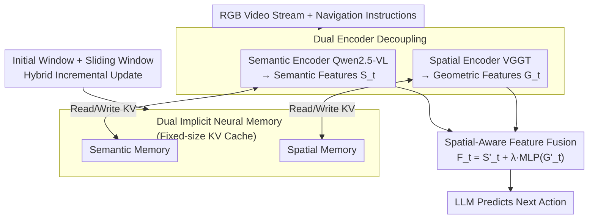

# JanusVLN: Decoupling Semantics and Spatiality with Dual Implicit Memory for Vision-Language Navigation

**Conference**: ICLR2026  
**arXiv**: [2509.22548](https://arxiv.org/abs/2509.22548)  
**Code**: [Project Homepage](https://miv-xjtu.github.io/JanusVLN.github.io/)  
**Area**: Robotics  
**Keywords**: Vision-Language Navigation, Dual Implicit Memory, Spatial-Geometric Encoding, KV Cache, Embodied AI  

## TL;DR
Inspired by the human brain's left-hemisphere semantic understanding and right-hemisphere spatial cognition, this paper proposes JanusVLN—the first dual implicit neural memory framework designed for VLN. It models spatial-geometric and visual-semantic memories as fixed-size KV Caches, achieving efficient spatial reasoning using only RGB video and reaching SOTA performance on the VLN-CE benchmark.

## Background & Motivation
Vision-Language Navigation (VLN) requires agents to navigate unseen environments based on natural language instructions. While Multimodal Large Language Model (MLLM)-based methods have recently emerged, they generally face three major bottlenecks:

1. **Limitations of Prior Work in Explicit Semantic Memory**: One category of methods (e.g., MapNav) constructs cognitive maps using text descriptions, yet pure text struggles to convey precise spatial relationships, leading to the loss of critical visual, geometric, and contextual information. Another category (e.g., NaVILA, StreamVLN) stores historical observation frames, requiring the reprocessing of the entire history for every decision step, which results in significant computational redundancy.
2. **Memory Expansion**: In both categories, explicit memory grows exponentially with navigation time, making it difficult for models to extract key information from massive, fragmented memories.
3. **Spatial Blind Spots of 2D Encoders**: Almost all visual encoders in existing VLN models inherit the CLIP-style 2D image-text pre-training paradigm. These are adept at capturing high-level semantics but lack an understanding of 3D geometric structures and spatial information, whereas navigation is essentially a 3D physical interaction.

## Core Problem
How can (1) spatial information loss, (2) computational redundancy, and (3) memory expansion be addressed simultaneously in VLN while using only RGB video input?

## Method

### Overall Architecture
JanusVLN mimics the division of labor between the human brain's left and right hemispheres by processing the same RGB video stream through two independent encoding paths: one uses the visual encoder of Qwen2.5-VL to extract semantic features $S_t$, and the other uses VGGT to extract 3D spatial-geometric features $G_t$. Both paths maintain a fixed-size implicit KV Cache as historical memory, which is then fused into a unified feature $F_t$ and passed to the LLM to predict the next action. The entire pipeline utilizes only monocular RGB without requiring depth maps, point clouds, or odometry.

### Key Designs

**1. Dual Encoder Decoupling: Assigning Roles to Semantics and Spatiality**

Most VLN visual encoders inherit CLIP-style 2D image-text pre-training, which is strong in high-level semantics but nearly blind to 3D geometry—yet navigation is fundamentally a 3D physical interaction. Instead of modifying a single encoder, JanusVLN retains the Qwen2.5-VL semantic encoder to extract $S_t$ while operating VGGT (Visual Geometry Grounded Transformer) in parallel. VGGT is a feed-forward geometric foundation model pre-trained on pixel-3D point cloud pairs, extracting spatial-geometric features $G_t$ from pure RGB video. The 3D geometric prior inherent in VGGT compensates for the spatial blind spots of the semantic path. These two streams are complementary rather than redundant, a claim verified by ablation studies: replacing VGGT with 2D encoders like DINOv2 or SigLIP 2 yielded almost no gain (SR 47.5/47.9 vs. 47.0 without spatial memory), as their information heavily overlaps with Qwen2.5-VL. A randomly initialized VGGT was also ineffective (SR 47.2), proving the advantage stems from the geometric prior rather than parameter count.

**2. Dual Implicit Neural Memory: Replacing Bloated Explicit Memory with Fixed-size KV Cache**

Existing methods either convert history into textual cognitive maps (where spatial relationships are flattened and information is lost) or store raw historical frames (where every decision step reprocesses everything, causing computational redundancy and infinite memory expansion over time). JanusVLN models both historical paths as implicit neural representations—specifically, cached historical KV pairs processed by the Transformer attention modules. These KVs are high-level abstractions distilled by the network rather than stacks of raw pixels. Consequently, processing a new frame $x_t$ only requires its image tokens to perform cross-attention with the memory to retrieve history, eliminating the need to replay old frames: $G_t = \text{Decoder}(\text{CrossAttn}(\text{Encoder}(x_t), \{M_{initial}, M_{sliding}\}))$ . Memory capacity is capped at a fixed size, fundamentally solving the expansion issue. Removing the dual implicit memory caused SR to plummet from 52.8 to 24.8, and removing spatial or semantic memory individually dropped scores to 47.0 and 45.5, respectively, demonstrating that both are indispensable.

**3. Initial + Sliding Window Hybrid Incremental Update: Balancing Global Anchors and Recent Context**

To manage which frames the fixed-size memory should hold, JanusVLN uses two segments: a sliding window queue $M_{sliding}$ (capacity $n$) maintains the KV Cache of the $n$ most recent frames to help the model focus on the present; an initial window $M_{initial}$ permanently retains the KV Cache of the first few navigation frames. Leveraging the "Attention Sinks" phenomenon—where the first frame consistently attracts high attention weights—this serves as a global anchor throughout the trajectory. As a result, inference time grows linearly with new frames rather than exploding with history length. Recomputing the entire 32-frame sequence with VGGT took 1549 ms, whereas using the KV cache reduced it to 149 ms, a cost reduction of approximately 90%, while SR slightly improved from 51.2 to 51.7. Implementation uses 8 frames for the initial window and 48 frames for the sliding window.

**4. Spatial-Aware Feature Fusion: Weighted Addition with Semantic Primacy**

After obtaining shape-aligned semantic features $S'_t$ and spatial-geometric features $G'_t$ (the latter aligned via spatial merging), JanusVLN uses a lightweight two-layer MLP to project the geometric features before adding them to the semantic features: $F_t = S'_t + \lambda \cdot \text{MLP}(G'_t)$, where the weight $\lambda = 0.2$. The smaller share for geometry is intentional, as the semantic path remains the backbone of navigation decisions, while geometric information serves as a supplement to inject spatial constraints. The fused $F_t$, combined with the instruction text embedding, is fed into the LLM to output actions.

### Loss & Training
The base model is Qwen2.5-VL 7B paired with VGGT. Both encoders are frozen throughout training; only the LLM and projection layers are fine-tuned (with learning rates of 2e-5 and 1e-5, respectively) to preserve the geometric priors of VGGT and the semantic capabilities of Qwen2.5-VL as stable pre-training knowledge. The training data includes the standard VLN-CE dataset supplemented by 155K trajectories from the ScaleVLN subset and 14K trajectories collected online via DAgger.

## Key Experimental Results

### R2R-CE Val-Unseen (Core Metrics: SR / SPL)

| Method | Input | SR↑ | SPL↑ |
|------|------|-----|------|
| NaVILA | RGB | 54.0 | 49.0 |
| StreamVLN | RGB | 56.9 | 51.9 |
| **JanusVLN** | **RGB** | **60.5** | **56.8** |
| JanusVLN* (No extra data) | RGB | 52.8 | 49.2 |

- Compared to multi-input methods using panoramic views + odometry + depth, using only monocular RGB improves SR by 10.5-35.5.
- Compared to g3D-LF and NaVid-4D which use depth data, SR improves by 12.6-16.7.
- JanusVLN* without extra data still outperforms methods relying on extra data in SPL by 3.7-18.8.

### RxR-CE Val-Unseen

| Method | SR↑ | SPL↑ | nDTW↑ |
|------|-----|------|-------|
| NaVILA | 49.3 | 44.0 | 58.8 |
| StreamVLN | 52.9 | 46.0 | 61.9 |
| **JanusVLN** | **56.2** | **47.5** | **62.1** |

### Ablation Study (R2R-CE, No extra data)

| Configuration | SR↑ | SPL↑ |
|------|-----|------|
| JanusVLN Full | 52.8 | 49.2 |
| Remove Spatial Implicit Memory | 47.0 | 40.9 |
| Remove Semantic Implicit Memory | 45.5 | 40.0 |
| Remove Dual Implicit Memory | 24.8 | 16.8 |

- Replacing VGGT with DINOv2 or SigLIP 2 showed only marginal gains (SR 47.5/47.9 vs. 47.0), as 2D pre-trained encoders are highly redundant with the information from Qwen2.5-VL.
- A randomly initialized VGGT provided no significant gain (SR 47.2), proving the advantage derives from 3D geometric priors rather than increased model capacity.

### Inference Efficiency

| Memory Method | 32-frame Inference Time | SR↑ |
|---------|-------------|-----|
| Original VGGT (Full Seq Recomp) | 1549 ms | 51.2 |
| Cached Memory (KV Cache) | 149 ms | 51.7 |

The KV caching method reduces inference overhead by 69%-90% while slightly improving performance.

## Highlights & Insights
1. **Paradigm Innovation**: First to introduce dual implicit neural memory to VLN, replacing bloated explicit memory with a fixed-size KV Cache—a novel memory paradigm.
2. **Clever 3D Prior Integration**: Extracts 3D spatial-geometric information from pure RGB video via VGGT without any extra 3D sensors or data, significantly bolstering spatial reasoning.
3. **Efficient Incremental Updates**: The hybrid initial + sliding window strategy preserves global anchors while focusing on recent context; inference time grows only linearly with frame count.
4. **Rigorous Ablation**: By replacing encoders (DINOv2/SigLIP 2/Random VGGT), the authors effectively prove that the performance gain originates from 3D geometric priors rather than model capacity.

## Limitations & Future Work
1. The sliding window size (48 frames) is a fixed hyperparameter, which may not be optimal for navigation tasks of varying complexity; adaptive window adjustment is worth exploring.
2. The spatial-geometric feature weight $\lambda = 0.2$ is fixed across all scenarios; a dynamic adjustment mechanism might further improve performance.
3. The VGGT encoder is completely frozen; end-to-end or partial fine-tuning of the spatial encoder could unlock more potential.
4. Validation is limited to VLN-CE in Matterport3D; generalizability to larger-scale real-world environments needs further investigation.
5. Real-world experiments are presented only as qualitative results, lacking systematic quantitative evaluation.

## Related Work & Insights
- **vs. MapNav** (Textual Cognitive Maps): JanusVLN replaces explicit text descriptions with implicit KV Caches, avoiding spatial information loss and textual redundancy, leading to a 20.8 SR Gain.
- **vs. NaVILA/StreamVLN** (Historical Frame Storage): Eliminates the need to reprocess all historical frames at every step, significantly enhancing inference efficiency and yielding a 3.6-10.8 SR Gain.
- **vs. g3D-LF / NaVid-4D** (Requires Depth Data): Outperforms depth-dependent methods using only RGB, with a 12.6-16.7 SR Gain, removing reliance on expensive 3D sensors.
- **vs. Uni-NaVid / NaVid** (RGB-only Baselines): Maintains a significant lead under identical input conditions, validating the effectiveness of the dual implicit memory paradigm.

## Rating
- Novelty: ⭐⭐⭐⭐⭐ (Dual implicit memory paradigm is a first in VLN; 3D prior introduction is clever)
- Experimental Thoroughness: ⭐⭐⭐⭐ (Comprehensive ablations, though real-world tests are primarily qualitative)
- Writing Quality: ⭐⭐⭐⭐⭐ (Clear structure, intuitive analogies, rich visuals)
- Value: ⭐⭐⭐⭐⭐ (Establishes a new paradigm with significant SOTA results, providing a leading direction for future VLN research)

<!-- RELATED:START -->

## Related Papers

- [\[ICLR 2026\] Ground Slow, Move Fast: A Dual-System Foundation Model for Generalizable Vision-Language Navigation](ground_slow_move_fast_a_dual-system_foundation_model_for_generalizable_vision-la.md)
- [\[ICLR 2026\] Spatial Forcing: Implicit Spatial Representation Alignment for Vision-language-action Model](spatial_forcing_implicit_spatial_representation_alignment_for_vision-language-ac.md)
- [\[CVPR 2026\] NavForesee: A Unified Vision-Language World Model for Hierarchical Planning and Dual-Horizon Navigation Prediction](../../CVPR2026/robotics/navforesee_a_unified_vision-language_world_model_for_hierarchical_planning_and_d.md)
- [\[ECCV 2024\] DISCO: Embodied Navigation and Interaction via Differentiable Scene Semantics and Dual-Level Control](../../ECCV2024/robotics/disco_embodied_navigation_and_interaction_via_differentiable_scene_semantics_and.md)
- [\[ICLR 2026\] Uncertainty-Aware Gaussian Map for Vision-Language Navigation](uncertainty-aware_gaussian_map_for_vision-language_navigation.md)

<!-- RELATED:END -->
