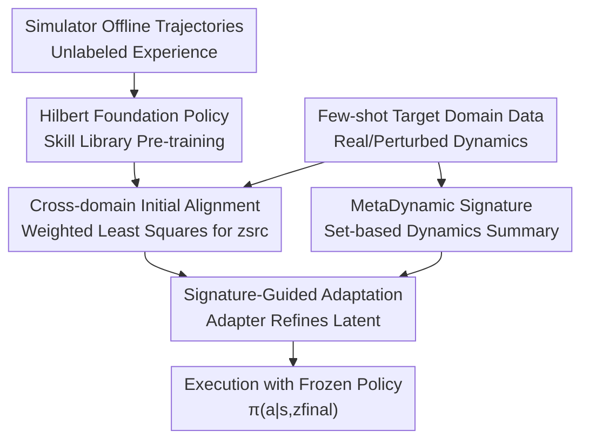

# Latent Adaptation of Foundation Policies for Sim-to-Real Transfer

**Conference**: ICLR 2026  
**OpenReview**: [https://openreview.net/forum?id=yn9dzttHvT](https://openreview.net/forum?id=yn9dzttHvT)  
**Paper**: [OpenReview Forum](https://openreview.net/forum?id=yn9dzttHvT)  
**Code**: The paper claims availability of implementation and experiments, but no specific repository link is provided in the cache  
**Area**: Robotics / Sim-to-Real / Foundation Policies  
**Keywords**: sim-to-real transfer, foundation policies, offline reinforcement learning, latent space adaptation, robot locomotion

## TL;DR
This paper proposes Found-adapt: it first pre-trains a reusable latent-conditioned foundation policy on offline simulator trajectories, and then corrects the latent variable $z$ during deployment using a small amount of target domain data. This mitigates the dynamics sim-to-real gap in robot locomotion without retraining the policy network.

## Background & Motivation
**Background**: The standard deployment path for robot reinforcement learning remains training a policy in a simulator and transferring it to the real world or another high-fidelity environment. To narrow the gap between simulation and reality, existing methods typically employ domain randomization, domain adaptation, system identification, grounded action transformation, or deployment-time policy adaptation, exposing the policy to more dynamics perturbations during training or continuing to adjust the policy/action mapping during deployment.

**Limitations of Prior Work**: The issue with these methods is that adaptation is too tightly coupled with the task policy itself. When encountering a new task, traditional sim-to-real workflows often require training a task-specific policy first and then adapting it to the target environment. When facing new friction, gravity, actuator response, or sensor noise, an expensive cycle of online data collection, system identification, or policy updates must be rerun. For real robots, this consumes computational power and time while increasing deployment risks.

**Key Challenge**: The fundamental contradiction of sim-to-real is not just that "simulators are inaccurate," but that current policy representations lack a reusable intermediate layer. A person who knows how to walk does not relearn the skill of "walking" when moving to a slippery surface; they adjust their gait and force. Traditional RL policies, however, often mix skill learning and environmental adaptation within the same network update, making every new task or dynamics condition feel like starting from scratch.

**Goal**: The authors aim to decouple the problem into two layers: the first layer learns a long-horizon skill library, i.e., a foundation policy, from massive unlabeled offline trajectories in a source simulator; the second layer estimates the current dynamics discrepancy using a small amount of interaction data in the target environment and reflects this discrepancy in the latent variable rather than modifying the entire policy network.

**Key Insight**: The paper borrows the structure of Hilbert representation foundation policies: an encoder $\phi$ maps states to a latent space, and the policy $\pi(a|s,z)$ is conditioned on a latent variable $z$, where different $z$ correspond to different skill directions. Since downstream tasks can already prompt the policy by selecting $z$, sim-to-real can be viewed as a problem of "re-selecting and refining $z$ under target dynamics."

**Core Idea**: Use a small number of target domain trajectories to correct the foundation policy's task latent in the latent space, transforming expensive policy retraining into lightweight latent adaptation.

## Method

### Overall Architecture
The workflow of Found-adapt is divided into offline skill learning and deployment-time latent space adaptation. In the offline phase, the method uses unlabeled trajectories from the simulator $E_{sim}$ to learn a state encoder $\phi$ and a latent-conditioned policy $\pi(a|s,z)$, allowing the policy to possess a set of reusable locomotion skills callable by $z$. In the deployment phase, when facing dynamics changes such as gravity or friction in the target environment $E_{tar}$, the method does not update $\pi$. Instead, it uses a few target domain samples to first solve for a cross-domain aligned latent $z_{src}$, then extracts a target domain dynamics signature $\eta$, and finally obtains $z_{final}$ through a small adapter.

The key point of this framework is that all adaptation revolves around the latent. The policy network and state encoder remain frozen during deployment; target domain data is only used to solve for and correct the conditional variable $z$. Therefore, it is more lightweight than retraining a task policy or a sim-to-real module and is easier to reuse across multiple tasks.

### Key Designs
**1. Hilbert Foundation Policy: Compressing Task Skills into Solvable Latents**

Traditional policies usually learn $\pi(a|s)$ directly, requiring retraining or fine-tuning for new tasks. The foundation policy here is written as $\pi(a|s,z)$, where $z$ is the latent controlling the policy behavior direction. The encoder $\phi:S\rightarrow Z$ embeds states into a Hilbert space such that $\|\phi(s)-\phi(g)\|$ approximately reflects the temporal distance from a state to a goal. The policy is then trained with an intrinsic reward: $r(s,z,s')=\langle \phi(s')-\phi(s),z\rangle$, encouraging state transitions to progress along the latent direction.

The advantage is that the policy no longer corresponds to a single task but to a family of behavioral primitives selectable by $z$. For a given downstream task, as long as one finds $z^*$ that fits the task reward using transition features $\phi(s')-\phi(s)$, a task-ready controller is obtained. The paper formulates this as a least-squares problem: $z^*=\arg\min_z \mathbb{E}[(R(s,a,s')-\langle \phi(s')-\phi(s),z\rangle)^2]$. In matrix form, let $\Phi=[\phi(s'_1)-\phi(s_1),\ldots]^\top$ and $r=[r_1,\ldots]^\top$, then the solution is $\hat z=(\Phi^\top\Phi)^{-1}\Phi^\top r$, normalized to a unit direction. This closed-form solution is the basis for efficient adaptation.

**2. Cross-domain Initial Alignment: Correcting Least-Squares Bias with Target Samples**

Deploying $z$ calculated in the simulator directly to the real environment fails because the transition distribution changes. The paper explicitly formulates this as a shift in the feature matrix: under simulation, it is $\Phi_{sim}$, while under target dynamics, it becomes $\Phi_{real}=\Phi_{sim}+\Delta\Phi$. If $z$ is still solved using $\Phi_{sim}$, one gets $\hat z_{sim}$, whereas the target environment requires $\hat z_{real}$. This indicates that the sim-to-real gap manifests as $\Delta z=\hat z_{real}-\hat z_{sim}$ at the latent solution level.

The first step of Found-adapt is not to retrain $\phi$, but to perform a weighted joint regression with source samples and a small number of target samples while fixing $\phi$: $\min_z \|\Phi_{sim}z-r_{sim}\|_2^2+\lambda\|\Phi_{tar}z-r_{tar}\|_2^2$. Letting $\lambda>1$ biases the solution toward target domain data while retaining source skill priors. This also has a closed-form solution: by stacking $\Phi_{sim}$ and $\sqrt{\lambda}\Phi_{tar}$ into $A$, and stacking reward vectors into $b$, we get $z_{src}=(A^\top A)^{-1}A^\top b$. This step provides a partially cross-domain corrected latent at the cost of a small-scale regression.

**3. MetaDynamic Signature: Describing Higher-order Dynamics Differences with Unordered Samples**

Weighted least squares only aligns first-order transition-reward relationships and may not capture higher-order changes in state visitation distributions, trajectory structures, or dynamics patterns. For instance, even if reward fitting errors are similar, high-gravity and high-friction environments might require completely different gait adjustments. If only a single regression latent is considered, this structural information is compressed too coarsely.

To this end, the paper introduces a MetaDynamic network that compresses a set of target domain state encodings $\{\phi(\tilde s_j)\}_{j=1}^M$ into a dynamics signature $\eta\in\mathbb{R}^K$. It uses a DeepSet-style structure: each state encoding passes through an MLP, followed by mean pooling, and finally a projector outputs a $K=64$-dimensional signature. Permutation-invariance is crucial here because target domain mini-batches are essentially sets of sampled states; the environment description should not change based on sample order. MetaDynamic is pre-trained on various simulator perturbations (gravity, friction, actuator-strength) using dynamics classification cross-entropy and NT-Xent contrastive loss. It is frozen during deployment, mapping the current target environment's statistical shape to $\eta$.

**4. Signature-Guided Adaptation: Updating Only the Small Adapter**

With $z_{src}$ and $\eta$, Found-adapt uses a small parameterized adapter $g_\theta: \mathbb{R}^D\times\mathbb{R}^K\rightarrow\mathbb{R}^D$ to refine the latent. The adapter is initialized to be close to identity, ensuring $g_\theta(z_{src},\eta)\approx z_{src}$ initially to avoid destroying the aligned skill direction. It is then optimized for a few steps using target domain data to minimize $L(\theta)=\frac{1}{M}\sum_j\|\Phi_{tar,j}g_\theta(z_{src},\eta)-\tilde r_j\|_2^2$.

The final latent is defined as $z_{final}=\sqrt{D}\frac{g_{\theta^*}(z_{src},\eta)}{\|g_{\theta^*}(z_{src},\eta)\|}$, which is then fed into the frozen policy $\pi(a|s,z_{final})$. This design restricts "adapting to target dynamics" to a low-capacity, low-risk latent correction: $z_{src}$ provides task and source skill priors, $\eta$ provides structural cues of the target environment, and the adapter calibrates both into behavioral conditions usable in the current environment.

### A Walkthrough Example
Consider the Walker "walk" task. The foundation policy has learned various locomotion skills under default simulator gravity and friction. Now, the target environment changes gravity from $-9.8$ to $-24$ or $-34$. If the source domain latent is used directly, the foot rhythm and body posture will obviously mismatch, causing the return to drop from high simulator scores to lower levels.

Found-adapt first constructs $D_{tar}$ using a few target domain rollouts. Each transition $(\tilde s_j,\tilde a_j,\tilde s'_j,\tilde r_j)$ passes through the frozen encoder to form a target domain feature row $\Phi_{tar,j}=\phi(\tilde s'_j)-\phi(\tilde s_j)$. Step one performs weighted regression with source and target samples to obtain $z_{src}$ biased toward current gravity. Step two feeds the target state set into MetaDynamic to obtain a signature $\eta$ indicating "an environment with high gravity and compressed/distorted state distribution." Step three performs tens to hundreds of small updates on the adapter based on $z_{src}$ and $\eta$, smoothly shifting the latent from $z_{src}$ to $z_{final}$. Visualizations show this latent shift is continuous and stable; in one case, the target return improved from 383.51 using $z_{src}$ to 553.86 using the refined latent.

### Loss & Training
The pre-training phase consists of two parts. First, the state encoder $\phi$ learns Hilbert representations on simulator offline trajectories, ensuring that distances between states express long-horizon reachability or temporal distance. Second, the latent-conditioned policy learns a family of skills to move along different latent directions via intrinsic rewards $r(s,z,s')=\langle\phi(s')-\phi(s),z\rangle$. In the experimental setup, foundation model pre-training uses 2,000,000 episodes, and the replay buffer capacity is 1,000,000 transitions, serving as source domain data $D_{src}$.

The adaptation phase does not train policy $\pi$. Target domain data comes from a few interactions (set to 5,000 rounds) of the pre-trained policy in the target environment. Cross-domain initial alignment yields $z_{src}$ via weighted least squares. MetaDynamic is pre-trained offline on 12 types of dynamics variations in the simulator with a loss $L=L_{CE}+\alpha L_{NTXent}$ where $\alpha=0.1$; it is frozen during deployment. The adapter is updated for a few steps using target domain projection error. Online adaptation time is approximately 6 seconds, significantly lower than methods requiring task-specific training or hour-scale costs.

## Key Experimental Results

### Main Results
The paper uses a sim-to-sim protocol: default dynamics as $E_{sim}$, and $E_{real}$ constructed by varying gravity and friction in the Walker environment. Comparisons include Direct-Transfer, Vanilla-GAT, UGAT, PAD, and Found-adapt. Values in parentheses represent the sim-to-real gap relative to source simulator performance; values closer to 0 are better.

| Setting | Task | Direct-Transfer | PAD | Found-adapt | Observation |
|------|------|-----------------|-----|-------------|------|
| G1 | Stand | 494.24 (-393.37) | 557.03 (-330.58) | 562.72 (-202.27) | Found-adapt has highest return, smallest gap |
| G1 | Walk | 318.93 (-446.06) | 448.50 (-316.49) | 472.25 (-292.74) | Found-adapt outperforms PAD and action calibration |
| G2 | Stand | 222.49 (-665.12) | 273.16 (-614.45) | 231.75 (-655.86) | PAD slightly higher in strong perturbation |
| G3 | Stand | 213.15 (-674.46) | 262.21 (-625.40) | 322.06 (-565.55) | Found-adapt narrows gap significantly in higher gravity |
| G4 | Walk | 33.03 (-731.96) | 37.13 (-727.86) | 42.57 (-722.42) | Smaller gain in hardest setting but still highest |

| Method | G1 Stand Time | G2 Stand Time | G3 Stand Time | G4 Stand Time | Notes |
|------|---------------|---------------|---------------|---------------|------|
| Direct-Transfer | 5.06 s | 5.36 s | 5.14 s | 5.28 s | No explicit adaptation, large performance gap |
| Vanilla-GAT | 7.59 s | 7.56 s | 7.71 s | 7.61 s | Training action grounding module, high variance |
| UGAT | 9.15 s | 9.10 s | 9.10 s | 8.63 s | Rejection mechanism adds instability |
| PAD | - | - | - | - | Labeled as hour-scale, not directly comparable |
| Found-adapt | 6.22 s | 6.11 s | 6.08 s | 6.12 s | Latent/adapter-level adaptation, near-direct transfer cost |

Friction perturbation experiments cover F1 to F6 and extend from "stand" to "run." Trends in Figure 3 show that as friction difficulty increases, absolute returns for all methods drop, but Found-adapt consistently maintains a positive gain over direct transfer. The 2D response surfaces in Figure 4(b) show the Found-adapt red surface generally above the blue direct transfer surface, especially in combinations of high gravity and medium friction.

### Ablation Study
| Configuration | Components Used | Key Results | Description |
|------|----------|----------|------|
| F(init) | Weighted Alignment $z_{src}$ only | Good on "easy stand", high variance elsewhere | Only corrects first-order fit, insufficient for higher-order dynamics |
| F(dyna) | MetaDynamic $\eta$ only | Weak overall performance | Environment signature alone cannot directly generate task latents |
| F(init+dyna) | Simple merge of $z_{src}$ & $\eta$ | Worst in some settings | Uncalibrated task latent and signature interfere with each other |
| F(all) | $z_{src}$ + $\eta$ + adapter | Best overall in friction/gravity ablations | Adapter transforms signature into usable latent correction |

### Key Findings
- Found-adapt is not absolute first in every single cell, but is stably top-2 across various gravity and friction perturbations while significantly narrowing the sim-to-real gap compared to Direct-Transfer; this is more critical for the goal of "multi-task + multi-dynamics without policy retraining."
- PAD can approach or exceed Found-adapt in some gravity settings but requires task-specific pre-training and updates tied to downstream behavior; Found-adapt's strength lies in using one foundation representation for stand, walk, run, and flip tasks.
- Data quality experiments show that small target domain data is not necessarily fatal: "drop" corruption below 50% only causes slight declines, indicating dynamics signatures and adapters have some robustness to sample scarcity. In contrast, "masking" (filling missing values with 0) causes earlier collapse due to systematic bias in the squared loss.
- Noise consistently harms performance during heavy corruption, especially for skills sensitive to contact and timing like "run" or "flip." In practice, the authors suggest discarding suspicious data rather than using zero-padding for fake trajectories.
- There is a significant monotonic correlation between adapter loss and target domain performance improvement. In the "stand" task, as $-loss$ increases over 60 adaptation steps, the sim-to-real improvement rises, confirming that the projection error in Eq. 5 correlates with real deployment return.

## Highlights & Insights
- Re-formulating sim-to-real as a latent solution mismatch is the clearest technical contribution of this paper. It does not just say "real distribution changed" but points out $\Phi_{real}=\Phi_{sim}+\Delta\Phi$ causes the least-squares $z$ to shift, mapping dynamics differences to an optimizable variable.
- The method fully exploits the structural advantages of foundation policies. Since Hilbert foundation policies already perform task prompting via $z$, extending environmental adaptation to $z$ is a natural and cost-effective engineering step.
- The permutation-invariant MetaDynamic design is practical. Target domain data are often small, unordered rollout fragments; treating them as a set rather than a sequence focuses the signature on distribution statistics rather than sample ordering.
- Ablation results provide a valuable warning: more environment signatures are not always better. Directly concatenating $z_{src}$ and $\eta$ can even lead to worse results; a calibration layer like the adapter is essential to transform "what the environment is" into "where the latent should move."
- This paradigm can be transferred to other robot tasks. As long as the base policy can be represented as a latent-conditioned controller and task rewards can be approximated as linear projections on transition features, one can attempt latent-level adaptation with small-batch target data instead of full fine-tuning.

## Limitations & Future Work
- The paper primarily uses sim-to-sim evaluations rather than real robot hardware experiments. While this protocol is controllable and reproducible, real sensor noise, contact uncertainty, latency, and safety constraints may introduce more complex gaps.
- Gains from Found-adapt fluctuate across environments and tasks. In the hardest gravity setting G4, absolute gains for "walk" remain limited, suggesting that when target dynamics exceed the foundation policy's skill coverage too severely, adjusting latents alone might be insufficient.
- The method depends on the quality of target domain data. While "drop" is acceptable, "masking" and heavy noise significantly harm the adapter. Real robot data with sensor drift, mislabeled rewards, or contact anomalies would require additional data cleaning or uncertainty-aware objectives.
- Hyperparameters like $\lambda$ in weighted regression, adapter update steps, and MetaDynamic's perturbation coverage affect performance. The authors acknowledge that different tasks might require tuning, and future work could consider adaptive weighting or latent refinement regularized toward $z_{src}$.
- Current methods are based on state features, leaving a step toward visual robot deployment. For real-world mobile robots or arms, visual encoders and partial observability must be integrated into the foundation policy and MetaDynamic signature.

## Related Work & Insights
- **vs Domain Randomization**: Domain randomization tries to cover a wide enough dynamics distribution during training for natural generalization; Found-adapt pre-trains a reusable skill library and adjusts latents during deployment. The former puts more pressure on training cost and coverage, while the latter is more lightweight for target domain changes but depends on the quality of the foundation policy.
- **vs Grounded Action Transformation / UGAT**: GAT-style methods calibrate actions via forward/inverse models to make simulator actions fit the target environment; Found-adapt modifies the conditioning latent, essentially "calling the skill differently." Experimental variance in GAT/UGAT suggests action-level calibration might not stably handle multi-task foundation policies.
- **vs Rapid Motor Adaptation / UP-OSI**: RMA and UP-OSI infer implicit dynamics variables from recent observations, but are typically co-trained with the task policy for specific online adaptation. Found-adapt differs by pre-training a task-agnostic foundation policy and performing only latent-level correction, emphasizing cross-task reuse.
- **vs PAD**: PAD self-supervises policy updates via rotation prediction or other tasks during deployment. While sometimes very strong, it requires task-specific pre-training and is more expensive. Found-adapt prioritizes stable, fast sim-to-real improvement without retraining for every task.
- **Insight**: For large-scale robot policies, future sim-to-real may not always rely on fine-tuning the policy backbone. A more scalable direction is pre-training rich skill latent spaces and learning lightweight latent adapters for each hardware, venue, or dynamics state—a concept very close to prompt/adapter tuning in language and vision foundation models.

## Rating
- Novelty: ⭐⭐⭐⭐☆ Naturally extends Hilbert foundation policy task prompting to sim-to-real latent adaptation with clear problem formulation.
- Experimental Thoroughness: ⭐⭐⭐⭐☆ Covers gravity, friction, multiple tasks, ablations, and data quality but lacks real hardware validation.
- Writing Quality: ⭐⭐⭐⭐☆ Mathematical formulas and component relationships are fairly complete, though some specific numerical values in charts require interpretation from figures.
- Value: ⭐⭐⭐⭐☆ Highly insightful for robot foundation policy deployment, especially for scenarios requiring fast cross-dynamics adaptation without repeated policy retraining.

<!-- RELATED:START -->

## Related Papers

- [\[CVPR 2026\] GeCo-SRT: Geometry-aware Continual Adaptation for Cross-Task Sim-to-Real Transfer](../../CVPR2026/robotics/geco-srt_geometry-aware_continual_adaptation_for_cross-task_sim-to-real_transfer.md)
- [\[ICLR 2026\] D-REX: Differentiable Real-to-Sim-to-Real Engine for Learning Dexterous Grasping](d-rex_differentiable_real-to-sim-to-real_engine_for_learning_dexterous_grasping.md)
- [\[ICLR 2026\] RobotArena ∞: Scalable Robot Benchmarking via Real-to-Sim Translation](robotarena_infty_scalable_robot_benchmarking_via_real-to-sim_translation.md)
- [\[CVPR 2026\] Opening the Sim-to-Real Door for Humanoid Pixel-to-Action Policy Transfer](../../CVPR2026/robotics/opening_the_sim-to-real_door_for_humanoid_pixel-to-action_policy_transfer.md)
- [\[NeurIPS 2025\] Generalizable Domain Adaptation for Sim-and-Real Policy Co-Training](../../NeurIPS2025/robotics/generalizable_domain_adaptation_for_sim-and-real_policy_co-training.md)

<!-- RELATED:END -->
