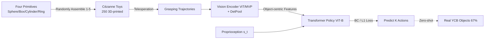

# Learning to Grasp Anything By Playing with Random Toys

**Conference**: ICLR 2026  
**OpenReview**: [https://openreview.net/forum?id=NZDaMcpXZm](https://openreview.net/forum?id=NZDaMcpXZm)  
**Code**: [https://lego-grasp.github.io/](https://lego-grasp.github.io/)  
**Area**: Robotics / Grasping / Generalization  
**Keywords**: Object-centric representation, Shape primitives, Zero-shot grasping, Detection pooling, Behavior Cloning  

## TL;DR
LEGO trains a grasping policy using 3D-printed "toys" randomly assembled from four shape primitives: spheres, boxes, cylinders, and rings. By employing a Detection Pooling (DetPool) mechanism that constrains visual attention to target objects to learn object-centric representations, it achieves a 67% zero-shot success rate on real-world YCB objects, outperforming VLA models that use significantly more data and parameters.

## Background & Motivation
- **Background**: Robotic manipulation policies have made significant progress in dexterous manipulation, sim-to-real, and long-horizon planning. The mainstream generalization approach relies on "large-scale pre-training," where VLAs like OpenVLA-OFT and π0-FAST are built on massive in-domain trajectories and internet-scale multimodal data.
- **Limitations of Prior Work**: Despite the scale of data, policies struggle to generalize to **unseen objects**, which limits real-world deployment; data collection remains expensive and difficult.
- **Key Challenge**: Humans (especially children) master transferable grasping skills by playing with a few simple toys, yet robots require massive amounts of real-world data to achieve marginal generalization. **Does generalization stem from data scale or a more fundamental representation structure?**
- **Goal**: To verify if robots can learn to "grasp anything by playing with toys" under the strictest zero-shot setting—training exclusively on **out-of-distribution (OOD) random toys** and testing on common real-world objects.
- **Core Idea**: **[Training Data]** Inspired by Cézanne’s insight that everything in nature can be reduced to the sphere, cylinder, and cone, "Cézanne toys" assembled from four primitives are used as the sole training set. **[Mechanism]** The study discovers that the key to generalization is **object-centric visual representation**. DetPool is used to constrain the visual encoder's attention to target object patches, filtering out backgrounds and distractors.

## Method

### Overall Architecture
LEGO (LEarning to Grasp from tOys) consists of an OOD toy dataset and an object-centric policy network. A vision encoder (MVP pre-trained ViT) paired with DetPool extracts visual features strictly from the target object. These features are concatenated with proprioception and fed into a ViT-B sized Transformer policy to predict the next $K$ steps of actions via behavior cloning. Training data comes entirely from randomly assembled Cézanne toys, with zero-shot migration to real-world objects during testing.

### Key Designs

**1. Cézanne Toys: OOD training set with "correct structure, distant appearance."** The training objects must retain the **compositional structure** of real objects (to allow knowledge transfer) while remaining sufficiently OOD in appearance (to test generalization). Four primitives (sphere, cuboid, cylinder, ring) are selected. Each toy is randomly composed of 1–5 primitives with random scales and 3D rotations. The first primitive is placed at the origin, and subsequent ones are placed such that their centroids fall within the previous primitive to ensure a coherent structural whole. Each is randomly assigned one of four colors. 250 toys were generated and 3D-printed for teleoperated data collection. This "randomness is diversity" approach bypasses the need for real-world object data.

**2. Detection Pooling (DetPool): Locking attention to the object within the ViT.** This is identified as the key to generalization. A segmentation mask of the target object is obtained via SAM 2 (real) or ground truth (sim). This mask is incorporated into the ViT's attention mask so that **no attention occurs between object patch tokens and non-object patch tokens**. Consequently, object tokens aggregate only their own features, masking background and distractor information. Positional encodings are preserved, allowing the model to perceive the object's spatial location. Only object patch tokens are averaged to produce the final visual embedding. This differs fundamentally from attention/mean/CLS pooling; without constrained attention, background features contaminate the representation, hindering migration between toys and real objects.

**3. Transformer Policy and Behavior Cloning: Fusing visual features and proprioception for action regression.** The policy concatenates the visual embeddings $e^{1:N}_t$ and proprioception $s_t$ from the past $C=16$ steps into a single token sequence. A ViT-B Transformer backbone predicts the future $K=16$ steps of actions $a_{t:t+K-1}$. States and actions are parameterized using **absolute joint angles**. Training utilizes a standard behavior cloning $\ell_1$ loss:

$$\mathcal{L} = \frac{1}{K d_a}\,\lVert \hat{a}_{t:t+K-1} - a_{t:t+K-1} \rVert_1$$

Ablations show that an 86M (ViT-B) backbone provides the best balance of performance and inference speed.

## Key Experimental Results

### Main Results
**Simulated Zero-shot Grasping (YCB, Success Rate %, vs. Demonstrations)**:

| Method | 250 | 500 | 1000 | 1500 | 2000 | 2500 |
|---|---|---|---|---|---|---|
| OpenVLA-OFT (7B) | 30.10 | 36.35 | 22.31 | 15.38 | 14.71 | 12.79 |
| π0-FAST (3B) | 8.85 | 7.60 | 7.69 | 8.56 | 4.23 | 4.13 |
| Ours - Attn Pooling | 34.71 | 40.10 | 44.23 | 48.27 | 49.81 | 51.63 |
| Ours - CLS Pooling | 24.71 | 20.29 | 36.92 | 41.44 | 42.40 | 49.81 |
| Ours - Mean Pooling | 32.98 | 30.38 | 36.15 | 39.90 | 40.29 | 40.58 |
| **Ours - DetPool** | **56.63** | **68.17** | **71.15** | **74.62** | **76.83** | **80.00** |

**Real Franka (64 YCB Objects, 1500 Demos)**:

| Method | Pre-train | Params | Success Rate % |
|---|---|---|---|
| OpenVLA-OFT | OXE | 7B | 9.47 |
| π0-FAST (Zero-shot) | π+75K DROID | 3B | 61.82 |
| π0-FAST (Fine-tuned) | π+75K DROID | 3B | **76.56** |
| ShapeGrasp | GPT-4o | - | 26.56 |
| **Ours** | None | 86M | 66.67 |

**Real H1-2 Dexterous Hand (13 Daily Objects, 500 Demos)**: LEGO averaged **50.77%**, significantly higher than π0-FAST (26.15%) and OpenVLA-OFT (18.46%).

### Ablation Study
**Primitive Importance (YCB Success % when removing one primitive)**:

| Removed Primitive | 100 | 200 | 500 | 1000 |
|---|---|---|---|---|
| Cuboid | 37.88 | 56.35 | 65.38 | 72.12 |
| **Sphere** | 44.13 | **47.31** | **61.83** | **63.08** |
| Ring | 44.23 | 67.50 | 68.56 | 72.60 |
| Cylinder | 45.29 | 57.60 | 69.52 | 72.31 |

The sphere is the most critical primitive; its removal causes the largest performance drop. Rings and cylinders have the least impact.

### Key Findings
- **DetPool is the key to generalization**: Compared to other pooling baselines, DetPool improves simulation performance by 22–48% and scales stably, while attention/CLS/mean pooling saturate early.
- **Large VLA models struggle**: π0-FAST is data-hungry and affected by real-to-sim gaps; OpenVLA-OFT performs reasonably at 250–500 demos but overfits and degrades as data increases.
- **Demo count > Toy diversity**: Adding unique toys yields diminishing returns; the number of demonstrations is more impactful. Once demos are sufficient, **15 toys are enough** for robust zero-shot transfer, aligning with cognitive science findings.
- **Smaller models are better**: Efficiency saturates at 86M (ViT-B); 307M provides no additional gain.
- **Simpler toys contribute effectively**: Two-primitive toys contribute most to performance; five-primitive toys are useful but have less impact (due to the test set being largely 2–3 component objects).

## Highlights & Insights
- **Shifting the narrative from "Data Scaling" to "Representation Structure"**: Using an 86M model and 1500 toy demos to outperform 3B/7B VLAs suggests that the bottleneck for generalization may not be data quantity but whether visual representations are object-centric.
- **DetPool is simple and fundamental**: Without architectural changes or extra loss functions, modifying attention with a mask and performing mean pooling on object patches effectively strips background and distractors.
- **Engineering cognitive science**: "Playing with toys to grasp anything" is transformed into a reproducible data generation pipeline (Cézanne toys), and results validate cognitive science findings regarding demonstration volume over variety.
- **Morphology Robustness**: Successful transfer from Franka parallel grippers to H1-2 dexterous hands demonstrates that object-centric generalization is not limited to a specific end-effector.

## Limitations & Future Work
- **Dependency on segmentation quality**: DetPool relies on SAM 2 masks; segmentation failures, occlusions, or transparent/reflective objects can pollute the object-centric representation.
- **Single skill focus**: The task is restricted to grasping; whether this generalizes to long-horizon tasks requiring contact dynamics (e.g., placing, insertion, tool use) remains unverified.
- **Limited primitive vocabulary**: While four primitives work well, coverage of extreme shapes (thin sheets, soft bodies, articulated objects) is questionable. The sensitivity to the sphere primitive suggests vocabulary choice is crucial.
- **Absolute joint angles and fixed grid evaluation**: Robustness under dynamic interference or in open-ended poses needs further validation beyond the predefined evaluation grid.

## Related Work & Insights
- **VLA Models (OpenVLA-OFT, π0-FAST)**: Representative of the "large-scale pre-training for generalization" trend; this paper challenges their data and parameter efficiency.
- **Training-free Geometric Decomposition (ShapeGrasp)**: Uses LLMs to decompose geometry into graspable parts; LEGO echoes this "primitive" approach but focuses on **data generation** rather than inference-time decomposition.
- **Shape Primitive Abstraction (Marr & Nishihara, Tulsiani et al.)**: Classic vision-cognition ideas of representing complex objects as simple geometries serve as the theoretical foundation for Cézanne toys.
- **Insight**: Combining OOD synthetic data with object-centric representations is a paradigm worth extending to other manipulation skills and mobile manipulation. DetPool is a lightweight attention modification that can be integrated into other vision-based policies.

## Rating
- Novelty: ⭐⭐⭐⭐⭐ The perspective of "learning from toys + object-centric representation" is fresh and counter-intuitive; DetPool is elegant, and the data paradigm is inspiring.
- Experimental Thoroughness: ⭐⭐⭐⭐ Simulation + two real robots, comparison with 3B/7B VLAs, and multi-dimensional ablations provide solid coverage; needs more validation on segmentation failure robustness and diverse skills.
- Writing Quality: ⭐⭐⭐⭐⭐ Clear storyline (motivation → data → mechanism → verification) with well-organized figures and tightly linked evidence.
- Value: ⭐⭐⭐⭐⭐ Provides a strong counter-example to "generalization requires massive real data," offering practical guidance for low-cost generalized robotic manipulation. Code/Data/Checkpoints are open-source.

<!-- RELATED:START -->

## Related Papers

- [\[CVPR 2025\] DexGrasp Anything: Towards Universal Robotic Dexterous Grasping with Physics Awareness](../../CVPR2025/robotics/dexgrasp_anything_towards_universal_robotic_dexterous_grasping_with_physics_awar.md)
- [\[ECCV 2024\] An Economic Framework for 6-DoF Grasp Detection](../../ECCV2024/robotics/an_economic_framework_for_6-dof_grasp_detection.md)
- [\[CVPR 2026\] DextER: Language-driven Dexterous Grasp Generation with Embodied Reasoning](../../CVPR2026/robotics/dexter_language-driven_dexterous_grasp_generation_with_embodied_reasoning.md)
- [\[CVPR 2026\] MaskDexGrasp: Generative Masked Modeling for Part-Aware Dexterous Grasp Synthesis](../../CVPR2026/robotics/maskdexgrasp_generative_masked_modeling_for_part-aware_dexterous_grasp_synthesis.md)
- [\[CVPR 2026\] A Cross-view Fusion Framework for Robust 6-DoF Grasp Pose Estimation](../../CVPR2026/robotics/a_cross-view_fusion_framework_for_robust_6-dof_grasp_pose_estimation.md)

<!-- RELATED:END -->
