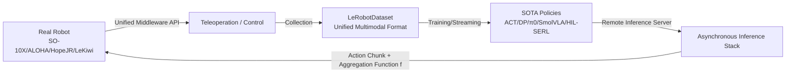

# LeRobot: An Open-Source Library for End-to-End Robot Learning

**Conference**: ICLR 2026  
**OpenReview**: [https://openreview.net/forum?id=CiZMMAFQR3](https://openreview.net/forum?id=CiZMMAFQR3)  
**Code**: [https://github.com/huggingface/lerobot](https://github.com/huggingface/lerobot)  
**Area**: Robot Learning / Embodied AI / Open-source Infrastructure  
**Keywords**: robot learning, open-source library, imitation learning, VLA, asynchronous inference, LeRobotDataset  

## TL;DR
LeRobot is an open-source end-to-end robot learning library released by Hugging Face. It integrates low-level motor middleware, a unified multimodal dataset format, a decoupled asynchronous inference stack, and a suite of state-of-the-art (SOTA) policy implementations, consolidating the fragmented and closed-source robot learning toolstack into a reproducible, low-barrier, vertically integrated platform.

## Background & Motivation
**Background**: Robotics is shifting from classical "explicit models" that rely on rigid-body kinematics, contact modeling, and planning, toward learning "implicit models" from data—monolithic policies that directly map observations to actions. The primary dividend of this shift is **scalability**: performance increases with data volume and compute power, aligning with scaling trends in vision, language, and multimodal domains. Low-cost teleoperation hardware (such as SO-10X and ALOHA-2, which cost a fraction of industrial arms) and large-scale open datasets have further accelerated this process.

**Limitations of Prior Work**: The robot learning ecosystem is **severely fragmented**, forcing researchers to spend significant effort on system integration rather than scientific questions. This fragmentation appears in three areas: (1) **Middleware fragmentation**: Control interfaces are often customized for specific robots and hard to migrate; (2) **Data format fragmentation**: Data is scattered across TensorFlow Datasets, ROS bags, and various JSON layouts, lacking a unified schema to aggregate heterogeneous data; (3) **Learning framework fragmentation**: Subtle implementation differences in algorithms and evaluation pipelines cause significant result fluctuations, compounded by hardware differences.

**Key Challenge**: While robot learning methods are progressing rapidly, the **toolstack supporting these methods remains scattered, closed-source, and non-reproducible**, which raises entry barriers and slows down the iteration speed of the entire field.

**Goal**: Provide an end-to-end, open, and extensible library that unifies hardware interfaces, data collection/storage/streaming, and policy training/deployment to minimize engineering overhead.

**Core Idea**: **[Vertical Integration]**—rather than making a "better version" of a single sub-module, LeRobot performs a unified abstraction across the entire robot learning stack (middleware → data → inference → algorithms). It lowers the entry barrier through principles of **accessibility, extensibility, and openness**, emphasizing a scalable learning path that improves directly with data and compute rather than manual engineering tricks.

## Method

### Overall Architecture
LeRobot is not just an algorithm but a suite covering the complete stack, composed of four vertically integrated components: a **unified robot middleware** at the bottom (interfacing directly with low-cost servo SDKs like FeeTech/Dynamixel); the **LeRobotDataset** unified multimodal format in the middle; a **decoupled asynchronous inference stack**; and a library of **SOTA policies** implemented in pure PyTorch at the top.

### Key Designs
**1. Unified Robot Middleware: Adapting one API to multiple embodiments.** LeRobot uses a shared middleware layer to unify heterogeneous platforms (SO-100/101, Koch-v1.1, ALOHA-2, Hope-JR, Stretch-3, LeKiwi, Reachy-2) under a consistent Python interface. It directly interfaces with the low-level SDKs of FeeTech and Dynamixel servos while providing high-level abstractions. This allows teleoperation by reading leader joints and writing to followers, and enables learned policies to control followers directly. The middleware is designed to be **extensible and modular**, requiring only minimal adaptation code for new embodiments.

**2. LeRobotDataset: A scalable, unified multimodal data schema.** To address data fragmentation, LeRobot defines a self-contained multimodal format capturing high-frequency proprioception, multiple camera streams, and teleoperation state signals. It embeds metadata such as task descriptions (supporting language-conditioned policies), robot specifications, FPS, and sensor types. The primary design principle is **scalability**—the architecture is optimized for large repositories containing millions of trajectories and integrates seamlessly with the PyTorch ecosystem. Its **streaming capability** allows users to process remote datasets (`StreamingLeRobotDataset`) without downloading the entire corpus. As of September 2025, over 2.2K contributors have shared 16K+ datasets in this format.

**3. Decoupled Asynchronous Inference Stack: Separating prediction from execution.** Modern policies often predict **action chunks** $a_{t:t+H-1}$ rather than single steps. LeRobot designs a decoupled inference stack based on this. **Physical decoupling** allows inference to run on a remote machine connected to the robot controller via a network, utilizing high-end compute resources while the controller executes actions at the desired frequency. **Logical decoupling** uses an asynchronous producer-consumer pattern: the inference process predicts action sequences in parallel using a look-ahead horizon $H$, while the control process consumes actions at a fixed frequency. Overlapping predictions are merged via a customizable generalized aggregation function $f$, ensuring the action queue remains non-empty and avoiding robot idling.

**4. Pure PyTorch SOTA Policy Library: Scaling from scratch and model reuse.** LeRobot provides multi-paradigm reference implementations: RL methods include HIL-SERL and TD-MPC; single-task imitation learning includes ACT, Diffusion Policy, and VQ-BET; multi-task VLA models include π0 and SmolVLA. All policies are implemented in pure PyTorch with "recipes" that allow **training a model in under 100 lines of code and deployment in under 40 lines**. The library covers various compute tiers, from lightweight single-task models (ACT at 52M parameters) to large-scale multi-task models (π0 at 3.5B parameters).

## Key Experimental Results
As a system/library paper, the "experiments" focus on system metrics (memory, latency) and ecosystem statistics rather than traditional accuracy comparisons.

### Main Results (Inference Latency, average of 100 forwards, ms)

| Model | Parameters | CPU(M1) | MPS | RTX 404090 | A100 |
|---|---|---|---|---|---|
| ACT | 52M | 182.3±40.8 | 42.7±10.1 | 5.01±0.06 | 13.77±0.45 |
| Diffusion Policy | 263M | (100% Timeout) | 3453.8±39.3 | 369.8±0.2 | 613.9±10.2 |
| π0 | 3.5B | (100% Timeout) | (100% Timeout) | 209.4±2.8 | 569.0±2.9 |
| SmolVLA | 450M | 2028.5±302.6 | 721.8±57.7 | 99.2±1.2 | 278.8±1.9 |

Note: Diffusion/Flow models use 10 denoising steps; timeout set at 5000ms.

### Ablation Study (Peak Memory, fp32)

| Model | Parameters | CPU | MPS | RTX 4090 | A100 |
|---|---|---|---|---|---|
| ACT | 52M | 817.4MB | 462MB | 211.2MB | 211.2MB |
| Diffusion Policy | 263M | 1.22GB | 224MB | 1.12GB | 1.12GB |
| π0 | 3.5B | 4.13GB | 97MB | 13.32GB | 13.32GB |
| SmolVLA | 450M | 1.69GB | 555MB | 1.75GB | 1.75GB |

### Key Findings
- **Small models are capable of edge real-time inference**: ACT achieves ~100-200Hz inference on RTX 4090/A100 and remains efficient on MPS backends. In contrast, foundation models like π0 cannot complete a single forward pass within 5s on low-end devices, highlighting deployment challenges.
- **Ecosystem scale is the contribution**: As of 2025-09, the platform hosts 16K+ datasets and 2.2K+ contributors. The SO-10X platform contributes over 50% of the datasets, validating the flywheel effect of "low-cost hardware + unified format → decentralized large-scale collection."
- **Download distribution**: Centralized research platforms like Franka Panda (1.87M downloads) and xArm (1.1M) lead in downloads, while SO-10X dominates in the number of datasets through decentralized community efforts.
- Native support for LIBERO and Meta-World simulation benchmarks is included for systematic policy evaluation.

## Highlights & Insights
- **"Integration" itself is a contribution**: In a field where methods iterate quickly but tools are fragmented, creating a unified, low-barrier platform provides leverage far exceeding another SOTA algorithm.
- **Accessibility as a first principle**: From $200 3D-printed hardware and streaming datasets to "<100 line training" recipes, every design choice lowers the entry barrier to drive the decentralized data flywheel.
- **Decoupled inference stack addresses real deployment pain points**: The combination of action chunking, physical/logical decoupling, and customizable aggregation systematically solves challenges like insufficient onboard compute and rate mismatches.
- **Honest system metrics**: By explicitly showing the unavailability of models like π0 on low-end hardware, the paper provides a realistic deployment reference for practitioners.

## Limitations & Future Work
- **Incomplete robot coverage**: While expanded from 3 to 8 embodiments in 2025, support for the vast hardware ecosystem (arms, grippers, sensors, controllers) remains an ongoing engineering task.
- **Algorithm coverage is non-exhaustive**: While key paradigms are addressed, incorporating more algorithms is future work.
- **Lack of low-level inference optimization**: Low-level optimizations like quantization and graph compilation are not yet integrated, limiting the real-time deployment of large models.
- The authors view these as concrete directions for community contribution.

## Related Work & Insights
- **Methodology**: Incorporates imitation learning (ACT, Diffusion Policy, π0/SmolVLA) and RL (SAC, RLPD, HIL-SERL, TD-MPC) into a single library.
- **Hardware/Data Ecosystem**: Built upon low-cost open-source hardware (SO-10X, ALOHA-2), complementing centralized large-scale efforts like Open X-Embodiment and DROID.
- **Insights**: (1) Well-designed unified open-source libraries are high-ROI research infrastructure in fragmented fields; (2) "Hardware accessibility → Data flywheel → Model ecosystem" is a positive feedback loop that tool design can amplify; (3) Decoupled asynchronous inference is valuable for any embodied system using heavy inference with real-time control.

## Rating
- Novelty: ⭐⭐⭐⭐ — While individual components are not new, the systematic vertical integration and unified data format are unique in the open-source ecosystem.
- Experimental Thoroughness: ⭐⭐⭐⭐ — System metrics are solid across platforms, though accuracy comparisons across libraries are limited.
- Writing Quality: ⭐⭐⭐⭐ — Clear motivation and well-organized structure.
- Value: ⭐⭐⭐⭐⭐ — Has become a de facto standard infrastructure for the robot learning community.

<!-- RELATED:START -->

## Related Papers

- [\[ICLR 2026\] RAVEN: End-to-end Equivariant Robot Learning with RGB Cameras](raven_end-to-end_equivariant_robot_learning_with_rgb_cameras.md)
- [\[ICLR 2026\] End-to-end Listen, Look, Speak and Act](end-to-end_listen_look_speak_and_act.md)
- [\[CVPR 2026\] RoboTAG: End-to-end Robot Pose Estimation via Topological Alignment Graph](../../CVPR2026/robotics/robotag_end-to-end_robot_pose_estimation_via_topological_alignment_graph.md)
- [\[NeurIPS 2025\] SutureBot: A Precision Framework & Benchmark for Autonomous End-to-End Suturing](../../NeurIPS2025/robotics/suturebot_a_precision_framework_benchmark_for_autonomous_end-to-end_suturing.md)
- [\[CVPR 2026\] End-to-End Language-Action Model for Humanoid Whole Body Control](../../CVPR2026/robotics/end-to-end_language-action_model_for_humanoid_whole_body_control.md)

<!-- RELATED:END -->
