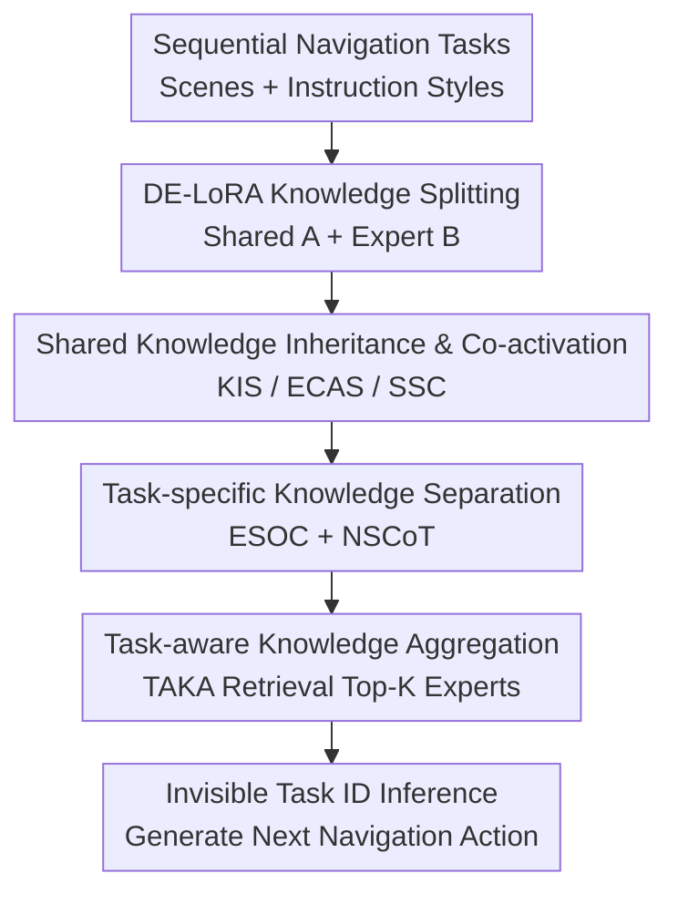

# Lifelong Embodied Navigation Learning

**Conference**: ICLR2026  
**OpenReview**: [https://openreview.net/forum?id=PaYo96rjij](https://openreview.net/forum?id=PaYo96rjij)  
**Code**: https://github.com/WangXudongSIA/Uni-Walker  
**Area**: Robotics / Embodied Navigation / Lifelong Learning  
**Keywords**: Embodied Navigation, Lifelong Learning, Catastrophic Forgetting, LoRA Experts, Navigation Reasoning  

## TL;DR
This paper proposes the Lifelong Embodied Navigation Learning task and the Uni-Walker framework, enabling LLM-driven embodied navigation agents to sequentially learn multiple navigation tasks (VLN, OLN, DUN). This approach allows the agent to absorb new scenes and instruction styles while significantly reducing the forgetting of previous tasks.

## Background & Motivation
**Background**: Embodied navigation is evolving from single-task execution toward general-purpose navigation agents. Early VLN primarily required agents to move in indoor environments following step-by-step natural language instructions; OLN emphasizes finding distant objects based on short goal descriptions; DUN requires agents to infer the user's true destination from multi-turn dialogues. Recent methods like NaviLLM, SAME, and OctoNav combine vision encoders with large language models, utilizing multi-task joint training to achieve more generalized navigation capabilities.

**Limitations of Prior Work**: These general navigation agents typically assume training data is available all at once, or at least that the task distribution is relatively fixed. Real-world robot deployment is more sequential: entering a new room today, encountering object localization instructions tomorrow, and understanding user dialogues the day after. Direct sequential fine-tuning causes the model to forget earlier scenes and instruction styles. Conversely, maintaining a separate LoRA for each task makes it difficult to reuse general navigation knowledge learned from previous tasks.

**Key Challenge**: The difficulty in lifelong navigation is not simply "learning more tasks" but simultaneously satisfying two conflicting requirements. On one hand, new tasks need to rapidly absorb new scene layouts and instruction styles; on the other hand, previously learned knowledge, such as path tracking, object localization, and vision-language alignment, must not be overwritten. Existing methods like MoE-LoRA or HydraLoRA allow for expert adaptation, but they usually have a fixed number of experts and are not specifically designed for scene similarity, instruction style similarity, and the invisibility of task IDs during testing in navigation tasks.

**Goal**: The authors formalize this problem as Lifelong Embodied Navigation Learning (LENL). It requires an agent to sequentially learn multiple navigation tasks, each consisting of a non-overlapping 3D scene and a specific user instruction style. Task IDs are known during training but unknown during testing. Ultimately, all old tasks and unseen scenes are evaluated together. The goal is to build a continuously evolving general navigation agent with low additional storage overhead.

**Key Insight**: Navigation knowledge can be split into two categories: task-shared knowledge, such as how visual observations align with language goals and how to determine the current position based on historical trajectories; and task-specific knowledge, such as the layout of a specific scene or how to organize reasoning for a certain instruction style. Uni-Walker is designed around this split: shared knowledge is placed in a common subspace, while task-specific knowledge is placed in progressively expanding expert subspaces.

**Core Idea**: By using an expandable Decoder Extension LoRA, navigation knowledge is split into a shared subspace $A$ and task expert subspaces $B_t$. Knowledge inheritance, expert co-activation, orthogonal constraints, navigation-specific CoT, and task-aware retrieval are then used to synthesize "learning new tasks" and "minimizing forgetting of old tasks" into a single lifelong navigation pipeline.

## Method
### Overall Architecture
Uni-Walker uses a NavLLM-style multimodal navigation agent as its base: visual observations are encoded by CLIP/EVA-CLIP, language instructions are input to the LLM, and the model autoregressively generates the next action. The difference is that instead of treating each new task as an isolated fine-tuning instance, the model expands a new LoRA decoder expert for each new task, which works alongside the shared encoder subspace, old experts, and a task retrieval index.

The entire process is divided into training and inference. During training, when task $T_t$ arrives, the system adds expert $B_t$, initializing it with old experts of the same instruction style while migrating old knowledge by co-activating old experts and stabilizing the shared subspace. During inference, since test samples have no task ID, TAKA first retrieves the most relevant old task using instructions and observations, then activates the Top-K experts to complete the navigation.

### Key Designs
**1. DE-LoRA Knowledge Splitting: Separating "How to Navigate" from "How to Perform This Task"**

While standard LoRA learns a low-rank update $\Delta W = BA$ in each layer, this paper reinterprets this structure as a knowledge decomposer: the shared subspace $A$ handles task-agnostic navigation capabilities, and each task expands a decoder expert $B_t$ for task-specific knowledge. The forward pass for the $t$-th task is $y = W_0x + \sum_{n=1}^{K} B_{t,n}Ax$, where the activated $B$ experts and shared $A$ form the adaptation weights.

This design addresses the issue where single-task LoRAs are too isolated and fixed-expert MoE models are not suited for lifelong expansion. Only a new $B_t$ is added for each new task, while the shared $A$ is continuously refined, allowing the model to grow new experts on a stable skeleton. Storage costs are controllable: each task adds roughly $2.1$ MB for the LoRA expert and the same for the Fisher matrix. Even with $100$ tasks, the extra storage is about $0.4$ GB for a 7B/13B LLM.

**2. Shared Knowledge Inheritance and Co-activation: Starting from Experience Rather than Scratches**

KIS addresses the initialization of new experts. If the current task shares an instruction style with previous tasks, their expert parameters are flattened into vectors to form matrix $M=[\theta_i,\ldots,\theta_j]$, and PCA is used to find the principal directions of variation. The new expert is not just the mean $\mu$ of old experts but moves along the top-$r$ principal components: $B_t \leftarrow \text{mat}(\mu + \frac{1}{r}\sum_{k=1}^{r}u_k)$. Intuitively, previous VLN tasks teach the new VLN task how to track incremental instructions, while previous OLN tasks teach the new one how to search based on object descriptions.

ECAS and SSC manage old experts during training and prevent the shared subspace from drifting, respectively. ECAS co-activates Top-K relevant experts during training; while $B_t$ is trainable, old experts are frozen to allow borrowing knowledge without corruption. SSC uses the Fisher Information Matrix to identify parameters in $A$ critical to previous tasks and penalizes large shifts: $L_{ssc,t}=\lambda_{ssc}\|F_{A,t-1}\odot(A'-A)\|_F^2$. This allows the shared space to learn new patterns while moving cautiously in directions vital to old tasks.

**3. Task-specific Knowledge Separation: Avoiding Style Confusion with Orthogonal Experts and Navigation CoT**

If all experts learn similar directions, expanding the expert pool does not provide true task specialization. ESOC constrains the current expert $B_t$ to be as orthogonal as possible to previous experts: $L_{esoc,t}=\lambda_{esoc}\sum_{i=1}^{t-1}|\text{tr}(\tilde B_i^T\tilde B_t)|$. Orthogonality encourages new experts to focus capacity on scene layouts, goal types, or instruction patterns not covered by old experts.

NSCoT applies "task-specificity" to reasoning prompts. VLN CoT focuses on tracking step-by-step routes; OLN CoT focuses on inferring target locations from observations and trajectories; DUN CoT parses user intent from dialogue history before deciding on actions. This is crucial for LLM navigation, as a command like "turn left" carries different reasoning implications in route following versus object search. A unified template would ignore structural differences in instruction styles.

**4. TAKA Task-aware Aggregation: Retrieving Experts Without Task IDs**

LENL testing conditions are more realistic than standard continual learning: the model is not told which task is currently active. TAKA stores two types of retrieval embeddings for each task: scene observation embeddings $E_{S,t}$ and instruction embeddings $E_{I,t}$. During inference, current observations $O_q$ and instructions $I_q$ are encoded by CLIP. Instruction similarity generates a mask, and Top-K experts are selected based on observation similarity among the masked candidates.

This two-stage matching is more robust than using instructions or observations alone. Relying solely on instructions might mix similar goals in different rooms, while relying only on observations might ignore the style differences between route following and dialogue understanding. TAKA's mixed matching essentially asks "what type of intent is this?" then "which scene experience matches this?".

### Loss & Training
The Uni-Walker training objective consists of three parts. First is the autoregressive generation loss for navigation actions; second is the shared smoothing consolidation loss $L_{ssc,t}$, which protects critical shared parameters using the Fisher matrix; third is the expert orthogonal loss $L_{esoc,t}$, reducing knowledge overlap.

The total loss is $L_t = -\lambda\sum_{n=1}^{N}\log P_t(A_n,\hat P_n|I,O)+L_{ssc,t}+L_{esoc,t}$. In experiments, LoRA rank $r=16$, Top-K expert $K=2$, instruction similarity threshold $\mu=0.5$, $\lambda_{ssc}=0.1$, $\lambda_{esoc}=0.1$, and Fisher smoothing coefficient $\omega=0.9$. The base model is Vicuna-7B-v0 with EVA-CLIP-02-Large, trained for $2000$ steps with a batch size of $64$.

## Key Experimental Results

### Main Results
The authors constructed a LENL benchmark based on the Matterport3D simulator, featuring $18$ sequential tasks with $18$ non-overlapping scenes and three instruction styles. The first $15$ tasks are for lifelong learning, and the last $3$ are for unseen scene generalization. Task IDs are not provided during testing. Metrics include SR, SPL, OSR, and their corresponding forgetting rates SR-F, SPL-F, OSR-F.

| Method | Avg SR ↑ | Avg SR-F ↓ | Avg SPL ↑ | Avg SPL-F ↓ | Avg OSR ↑ | Avg OSR-F ↓ |
|------|----------|------------|-----------|-------------|-----------|-------------|
| Seq-FT | 12 | 85 | 8 | 88 | 24 | 73 |
| HydraLoRA | 27 | 63 | 19 | 72 | 37 | 57 |
| BranchLoRA | 30 | 58 | 20 | 70 | 41 | 53 |
| O-LoRA + TAKA | 58 | 17 | 37 | 44 | 77 | 9 |
| SD-LoRA + TAKA | 59 | 16 | 38 | 42 | 79 | 7 |
| Uni-Walker | 66 | 5 | 61 | 7 | 81 | 5 |

The most critical information is the change in forgetting rates. Seq-FT has an Avg SR of only $12\%$ and an SR-F of $85\%$, showing it only remembers the most recent tasks. While SD-LoRA + TAKA is a strong baseline, Uni-Walker improves Avg SR from $59\%$ to $66\%$ and suppresses SR-F from $16\%$ to $5\%$. The SPL improvement is even more significant (from $38\%$ to $61\%$), indicating better path efficiency.

| Method | S16 Unseen VLN | S17 Unseen OLN | S18 Unseen DUN | Avg SR ↑ |
|------|--------------|--------------|--------------|----------|
| HydraLoRA | 18 | 14 | 16 | 16.0 |
| BranchLoRA | 28 | 20 | 15 | 21.0 |
| O-LoRA + TAKA | 65 | 53 | 36 | 51.3 |
| SD-LoRA + TAKA | 68 | 55 | 48 | 57.0 |
| Uni-Walker | 74 | 61 | 51 | 62.0 |

Generalization to unseen scenes shows the same trend. Uni-Walker achieves an average SR of $62\%$ on unseen tasks, $5$ points higher than SD-LoRA + TAKA. Since these tasks were not in the lifelong training set, this proves that DE-LoRA's shared knowledge and TAKA's retrieval generalize across scenes rather than just memorizing them.

### Ablation Study
| Configuration | SR ↑ | SR-F ↓ | SPL ↑ | SPL-F ↓ | OSR ↑ | OSR-F ↓ | Description |
|------|------|--------|-------|---------|-------|---------|------|
| Baseline | 55.7 | 21.1 | 37.0 | 45.0 | 76.7 | 8.7 | Without shared knowledge components |
| w/o KIS | 60.3 | 14.2 | 50.2 | 23.9 | 77.6 | 7.7 | No style-based initialization |
| w/o SSC | 59.7 | 15.1 | 44.7 | 30.6 | 77.9 | 7.3 | Shared subspace drifts easily |
| w/o ECAS | 58.1 | 17.4 | 44.7 | 32.3 | 78.3 | 6.9 | No borrowing from old experts |
| Uni-Walker | 67.3 | 4.3 | 62.3 | 5.7 | 81.3 | 3.5 | Full shared knowledge modeling |

Ablations show that KIS, ECAS, and SSC are all essential. Removing ECAS drops SR from $67.3\%$ to $58.1\%$, proving old experts must participate in the forward pass of new tasks. Removing SSC increases SPL-F from $5.7\%$ to $30.6\%$, indicating that without Fisher constraints, path efficiency for old tasks is severely compromised.

| Configuration | SR ↑ | SR-F ↓ | SPL ↑ | SPL-F ↓ | OSR ↑ | OSR-F ↓ | Description |
|------|------|--------|-------|---------|-------|---------|------|
| Baseline | 49.0 | 29.2 | 33.9 | 45.0 | 72.3 | 14.0 | Without task-specific components |
| w/o ESOC | 63.5 | 9.8 | 60.6 | 8.2 | 79.7 | 5.3 | Potential expert overlap |
| w/o NSCoT | 51.1 | 27.3 | 35.5 | 46.3 | 75.3 | 10.5 | Shared reasoning template for all |
| Uni-Walker | 67.3 | 4.3 | 62.3 | 5.7 | 81.3 | 3.5 | Full task-specific modeling |

Among task-specific components, NSCoT has the largest impact. Removing it drops SR by $16.2\%$, showing that the agent must distinguish reasoning processes by task type. ESOC has a smaller impact but helps reduce SR-F from $9.8\%$ to $4.3\%$ by ensuring expert specialization.

### Key Findings
- Uni-Walker's primary benefit is a massive drop in forgetting rates (SR-F reduced from $16\%$ to $5\%$), directly addressing the core goal of LENL.
- NSCoT is the most critical task-specific component for LLM navigation; "reasoning by instruction style" is more fundamental than just expanding experts.
- TAKA mixed matching allows inference without task IDs. Compared to observation-only matching, mixed matching significantly reduces forgetting (SR-F from $9.6\%$ to $4.3\%$), acting as a stable router.
- Compared to specialized general agents like SAME ($55/45/62$ SR/SPL/OSR), Uni-Walker performs better ($66/61/81$), showing that lifelong learning compensates for the limitations of multi-task joint training in continuous adaptation.

## Highlights & Insights
- The definition of the LENL problem—varying scenes and styles without task IDs at test time—is realistic and well-formulated for robot deployment.
- DE-LoRA's reinterpretation of $A$ and $B$ as "shared" vs. "expert" subspaces perfectly aligns with the knowledge decomposition needs of navigation.
- Use of PCA in KIS to extract initialization directions from same-style experts is more principled than simple copying, as it captures shared variation patterns.
- The value of NSCoT highlights that for LLM-based embodied agents, continual learning should focus on reasoning protocols as much as parameter adaptation.
- TAKA's "instruction mask then observation Top-K" logic is transferable to other embodied tasks like language-guided manipulation or human-robot collaboration.

## Limitations & Future Work
- The experiments are entirely simulator-based (Matterport3D). Real-world robot deployment involves sensor noise, dynamic obstacles, and sim-to-real gaps.
- The task scope (VLN, OLN, DUN) is broader than VLN alone but lacks active exploration, interactive QA, or long-term memory map building.
- KIS relies on explicit style labels. Future work should investigate expert initialization under unlabelled or soft-labelled conditions.
- TAKA stores scene and instruction embeddings, which might pose privacy risks in sensitive environments like homes or hospitals.
- While parameter-efficient, the backbone models (Vicuna-7B) are heavy. Evaluation of latency and energy costs for edge robotic deployment is needed.

## Related Work & Insights
- **vs NaviLLM / SAME / OctoNav**: These focus on offline multi-task training for coverage. Uni-Walker focuses on sequential arrival, emphasizing the ability to absorb and retain knowledge over time.
- **vs HydraLoRA**: While sharing a similar $A/B$ structure, Uni-Walker adds dynamic expansion, knowledge inheritance, and task-aware aggregation specifically for navigation.
- **vs EWC / LwF**: Conventional continual learning methods often protect old knowledge through passive regularization. Uni-Walker actively reuses old experts, leveraging existing knowledge rather than just protecting it.
- **Insight for other tasks**: The DE-LoRA + TAKA structure could be applied to manipulation, where the shared space learns VL-action alignment while experts learn specific objects or user preferences.

## Rating
- Novelty: ⭐⭐⭐⭐☆ Systematic introduction of lifelong learning to multi-style embodied navigation with a solid benchmark.
- Experimental Thoroughness: ⭐⭐⭐⭐☆ Comprehensive ablations on all components, though missing real-robot experiments.
- Writing Quality: ⭐⭐⭐⭐☆ Logical and clear, though some minor inconsistencies in figure and table references.
- Value: ⭐⭐⭐⭐⭐ Highly relevant for long-term deployed navigation agents, effectively combining PEFT, expert routing, and reasoning templates.

<!-- RELATED:START -->

## Related Papers

- [\[CVPR 2026\] Arcadia: Toward a Full-Lifecycle Framework for Embodied Lifelong Learning](../../CVPR2026/robotics/arcadia_toward_a_full-lifecycle_framework_for_embodied_lifelong_learning.md)
- [\[ICLR 2026\] All-day Multi-scenes Lifelong Vision-and-Language Navigation with Tucker Adaptation](all-day_multi-scenes_lifelong_vision-and-language_navigation_with_tucker_adaptat.md)
- [\[ICLR 2026\] Embodied Navigation Foundation Model](embodied_navigation_foundation_model.md)
- [\[CVPR 2025\] Think Small, Act Big: Primitive Prompt Learning for Lifelong Robot Manipulation](../../CVPR2025/robotics/think_small_act_big_primitive_prompt_learning_for_lifelong_robot_manipulation.md)
- [\[NeurIPS 2025\] MindForge: Empowering Embodied Agents with Theory of Mind for Lifelong Cultural Learning](../../NeurIPS2025/robotics/mindforge_empowering_embodied_agents_with_theory_of_mind_for_lifelong_cultural_l.md)

<!-- RELATED:END -->
