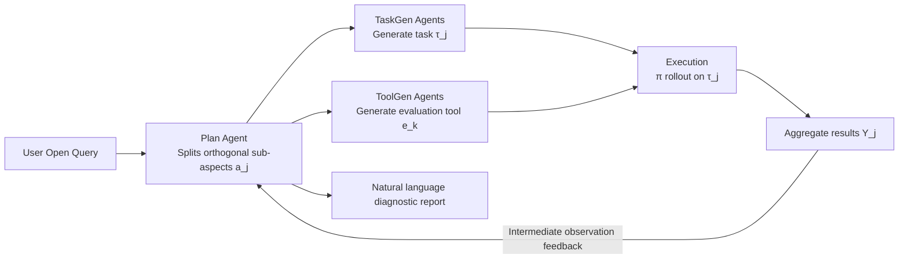

# ManipEvalAgent: Promptable and Efficient Evaluation Framework for Robotic Manipulation Policies

**Conference**: ICLR 2026  
**OpenReview**: [https://openreview.net/forum?id=3u6AkbWEls](https://openreview.net/forum?id=3u6AkbWEls)  
**Code**: To be confirmed  
**Area**: Robotic Manipulation / Policy Evaluation / LLM Agent  
**Keywords**: Robotic manipulation policy, evaluation framework, VLM Agent, code generation, simulation evaluation  

## TL;DR
ManipEvalAgent utilizes a collaborative group of VLM Agents to mimic how human experts form judgments by "trying it out a few times," performing promptable, multi-turn, and dynamically planned evaluations of robotic manipulation policies. By generating task and evaluation tool code within a simulator, it achieves conclusions comparable to full-scale benchmarks using significantly fewer samples, while providing interpretable diagnostic text instead of a single success rate.

## Background & Motivation

**Background**: Robotic manipulation policies have advanced rapidly in recent years—from Diffusion Policy to general-purpose VLA models like RT-1/RT-2, π0, and RDT, end-to-end capabilities are constantly broadening. Correspondingly, simulation benchmarks such as RoboTwin, LIBERO, Meta-World, and CALVIN provide standardized task suites and unified evaluation processes, serving as the infrastructure for model comparison.

**Limitations of Prior Work**: The mainstream evaluation paradigm suffers from three structural problems. First, **Expense**: static benchmarks require exhaustive execution across all predefined tasks $\times$ all candidate policies, often involving tens of thousands of rollouts and hundreds of minutes, incurring high time and compute costs. Second, **Rigidity**: the evaluation process is fixed and the task set is preset, refusing user input and failing to respond to open-ended, customized needs like "how well does this policy generalize to object appearances?" Third, **Uninterpretability**: conclusions are compressed into a single scalar success rate, which neither identifies why failures occur nor directly guides model iteration.

**Key Challenge**: Human experts do the opposite—they form a reliable impression of a policy's overall capability through small-scale, hands-on interaction and can clearly state "what is strong, what is weak, and why." Filling the gap of providing automated evaluation with the **efficiency, customizability, and interpretability** of a human expert is the focus of this paper.

**Goal**: Propose an evaluation framework that reaches conclusions comparable to full benchmarks with minimal sampling, while dynamically planning evaluation paths according to user queries and outputting diagnostic reports beyond single scores.

**Core Idea**: **Remodel "evaluation" as a promptable, interactive, and adaptive Agent process.** A Plan Agent simulates a human evaluator by decomposing open queries into orthogonal sub-aspects for multi-turn exploration; TaskGen / ToolGen Agents generate tasks and evaluation tools on-the-fly via code generation in the simulator; the execution results are fed back to the Plan Agent to dynamically decide the next steps, eventually summarizing into a natural language report.

## Method

### Overall Architecture

ManipEvalAgent is driven by collaborative VLM Agents, mimicking human expert evaluation through a cycle of few-shot, multi-turn interactions. Formally, a simulator $S=(\Omega,\Gamma)$ provides capabilities $\Omega$ and constraints $\Gamma$ (available assets, interfaces, etc.); the policy $\pi(a_t|o_t,l)$ rollouts on task $\tau$ to produce trajectory $\zeta$ and rendered frames $I_{0:T}$. Unlike classic methods relying on a fixed large test set $C$, this framework decomposes evaluation into a small set of sub-aspects $A=\{a_j\}$ discovered dynamically. The system forms a multi-turn feedback loop consisting of three stages: Proposal (Plan Agent splits sub-aspects) → Generation (TaskGen/ToolGen generate task and tool code) → Execution (run policy and evaluate with tools), with results feeding back to the Proposal stage.

### Key Designs

**1. Plan Agent: Transforming Open Queries into Exploration Paths** The Plan Agent is the soul of ManipEvalAgent, handling planning, observation, and summarization to mimic human behavior: "test basic abilities first, then dig deeper." upon receiving a user query, it reads a system-level prompt containing simulator capabilities and constraints, along with policy metadata (e.g., whether it is language-conditioned). It then selects an initial sub-aspect to evaluate and iteratively refines the direction based on intermediate results. The key is decomposing a vague open question ("how does it generalize to various object attributes") into orthogonal sub-aspects $A=\{a_j\}$: evaluating spatial generalization for clear conclusions first, then appearance generalization, and if results are ambiguous, refining probes further. This "dynamic path planning to avoid redundant test cases" is the source of its efficiency.

**2. TaskGen Agents: Reuse-first Task Code Generation + Triple Enhancements** For each sub-aspect, TaskGen outputs a single-task Python file containing two core parts: scene construction (invoking existing simulator interfaces to populate assets) and success criteria (generating a `check_success` method). The workflow follows the **reuse-first engineering principle**—retrieving tasks that can be directly reused from the simulator first, and only triggering generation when reuse is impossible. To address instability in few-shot generation, three enhancements are introduced: **RAG** (offline Task Library / Asset List / Doc Library to retrieve similar tasks for few-shot and constrain asset calls), **Visual Self-Reflection** (rendering the first frame of the generated scene for visual comparison with the "expected frame" from the proposal, sending diagnostic suggestions if deviations are found), and **README.Agent** (agent-oriented documentation with structured summaries of interface precautions and pitfalls).

**3. ToolGen Agents: Rule-based and VQA Dual Track with Retrieval-first Expansion** Each task is paired with evaluation tools generated by ToolGen, categorized into **Rule-based metrics** $r:\zeta\mapsto\mathbb{R}^d$ (Python functions built on simulator interfaces, e.g., `safety_margin`) and **VQA metrics** $q:(I_{0:T},Q)\mapsto\mathbb{R}^d$ (using VLMs for visual question answering on information difficult to extract from simulator interfaces). The toolbox is open and extensible. The workflow is also **retrieval-first**: searching for existing tools before generating new ones via few-shot, and then registering new tools back to the toolbox.

**4. Evaluation Pipeline and Aggregation under Multi-turn Feedback** For each sub-aspect $a_j$ with task $\tau_j$ and tool $e_k$, $M_j$ trajectories are sampled via $\zeta_{j,m}=\text{Rollout}(\pi,\tau_j,\text{seed}_m)$. Results are processed by rule-based tools $r(\zeta_{j,m})$ or VQA tools $q(I_{0:T},Q)$, first aggregated within the sub-aspect $Y_j=\text{Aggregate}\{y_{j,m}\}_{m=1}^{M_j}$, and then across $N$ sub-aspects $Y=\text{Aggregate}\{Y_j\}_{j=1}^{N}$. Here $M_j$ is far smaller than full sampling in static benchmarks, and $N$ is discovered dynamically. Numerical scores and interpretable text are eventually fed back to the Plan Agent for final summarization.

## Key Experimental Results

Experiments address whether it achieves comparable effects to existing benchmarks, performance under open queries, and the contribution of code generation modules. Policies evaluated include ACT, Diffusion Policy (DP), DP3, and VLA models RDT-1B and π0; benchmarks include RoboTwin 2.0 and LIBERO.

### Main Results: Evaluation Time Comparison

| Model | RoboTwin | LIBERO | Ours |
|------|----------|--------|------|
| ACT | 167 min / 56,592 samples | 117 min / 29,546 samples | **42 min / 16,927 samples** |
| DP | 171 min / 55,551 samples | 132 min / 29,059 samples | **45 min / 16,895 samples** |
| DP3 | 159 min / 52,087 samples | 113 min / 28,343 samples | **44 min / 15,638 samples** |
| RDT | 210 min / 55,435 samples | 132 min / 28,878 samples | **63 min / 16,676 samples** |
| π0 | 164 min / 51,087 samples | 103 min / 26,732 samples | **43 min / 15,336 samples** |

Time is generally reduced to about 1/3 of original benchmarks, with sampling volume reduced by approximately 2/3.

### Conclusion Consistency (10 trials Hit Rate: Exact Interval / Within Error Tolerance)

| Dimension | ACT | DP | DP3 | RDT | π0 |
|------|-----|-----|-----|-----|-----|
| S.R. (RoboTwin) | 50% / 90% | 60% / 100% | 50% / 80% | 50% / 60% | 70% / 100% |
| S.R. (LIBERO Avg.) | 60% / 70% | 50% / 70% | 40% / 60% | 70% / 90% | 50% / 50% |
| Spatial (LIBERO) | 70% / 100% | 100% / 100% | 80% / 80% | 70% / 100% | 60% / 80% |
| Obj (LIBERO) | 60% / 80% | 50% / 70% | 60% / 60% | 60% / 60% | 40% / 70% |
| Goal (LIBERO) | 30% / 70% | 70% / 70% | 50% / 70% | 50% / 60% | 50% / 50% |
| Long (LIBERO) | 60% / 70% | 60% / 80% | 50% / 70% | 70% / 80% | 60% / 90% |

Most dimensions reproduce full benchmark conclusions at a high rate within error tolerance.

### Ablation Study: Code Gen Modules

| Setting | Generation Success Rate ↑ |
|------|-------------|
| TaskGen (Full) | 98% |
| TaskGen w/o RAG | 95% |
| TaskGen w/o Visual Self-Reflection | 96% |
| TaskGen w/o README.Agent | 96% |
| TaskGen (Base, pure few-shot) | 93% |
| ToolGen (Full) | 96% |
| ToolGen w/o RAG | 92% |

### Key Findings
- **Pure few-shot is viable (93%), but every enhancement provides stable gains**—these modules are necessary for a reliable evaluation system.
- **System error is ~5%, concentrated in the generation phase (69.8%)**, with task generation contributing the most (42.8%), followed by ToolGen (27%) and Plan Agent (9.5%). This confirms that code generation (requiring precise API, semantic, and spatial understanding) is the most challenging bottleneck.

## Highlights & Insights
- **Paradigm Shift**: It reframes evaluation from "exhaustive scoring on fixed sets" into "promptable interactive Agent exploration," achieving efficiency, customizability, and interpretability for the first time.
- **Code Generation as Engine**: Using LLMs to create tasks and tools on-the-fly, rather than relying on preset libraries, provides the technical foundation for "dynamic, on-demand evaluation."
- **Visual Self-Reflection**: Comparing the first frame with the expected visual is a low-cost, effective error correction loop that uses VLM visual capabilities to backstop code generation.
- **Honest Error Profiling**: Acknowledging the 5% failure rate and identifying task generation as the cause provides a clear direction for improvement rather than masking system instability.

## Limitations & Future Work
- **5% failure rate is relatively high for an evaluation system**: As a "judge," it must be highly credible; the high error proportion in the generation phase indicates that replicability is still constrained by code generation stability.
- **Consistency metrics are not exceptional**: Many "Exact Interval" hit rates are between 40%–60%, relying on error tolerance for better appearance. Some dimensions (e.g., π0 on LIBERO Avg.) show a gap in alignment with full benchmarks.
- **Reliance on simulator interfaces and existing assets**: Reuse-first and RAG strategies depend on well-documented simulators; the benefits may diminish when migrating to new simulators with sparse documentation.
- **Unexplored reliability of VQA metrics**: The propagation of VLM visual errors into final conclusions lacks quantitative analysis.
- **Future Work**: Stronger reasoning models could reduce generation errors; modeling VQA uncertainty and introducing stricter consistency calibration would make the "low-sampling for comparable results" claim more robust.

## Related Work & Insights
- **Robotic Manipulation Policies**: From single-task (Diffusion Policy, DP3) to general VLA (RT-1/RT-2, π0, RDT), as policies become stronger, the need for efficient and flexible evaluation grows—Ours addresses this gap.
- **Simulation Benchmarks**: Meta-World, LIBERO, RoboTwin, etc., represent the static evaluation mainstream; Ours treats them as "gold standards" to align with, rather than replacements.
- **LLM Agent**: Leverages CoT, autonomous agents, and "LLM-as-judge" research to systematically migrate these concepts into robotic manipulation evaluation within simulation engines.
- **Mechanism**: When evaluation is expensive and rigid, the strategy of "Agent adaptive exploration + code-generated metrics" is a generalizable approach for other domains requiring large-scale rollouts (e.g., autonomous driving or long-horizon planning).

## Rating
- **Novelty**: ⭐⭐⭐⭐ Remodeling evaluation as a promptable Agent process and using code generation for task/tool creation is an original paradigm shift in this field.
- **Experimental Thoroughness**: ⭐⭐⭐ Covers 5 policies $\times$ 2 benchmarks including time/consistency/ablation/error analysis. However, consistency relies on error tolerance, and open queries lack large-scale quantitative validation.
- **Writing Quality**: ⭐⭐⭐⭐ Clear motivation, and the three-stage framework is well-formulated. Illustrations (Fig. 1/2/3) aid understanding.
- **Value**: ⭐⭐⭐⭐ Reducing evaluation time to 1/3 and sampling to 1/3 with interpretable results has practical value for accelerating robotics research.

<!-- RELATED:START -->

## Related Papers

- [\[ICLR 2026\] When would Vision-Proprioception Policies Fail in Robotic Manipulation?](when_would_vision-proprioception_policies_fail_in_robotic_manipulation.md)
- [\[ICLR 2026\] WorldGym: World Model as an Environment for Policy Evaluation](worldgym_world_model_as_an_environment_for_policy_evaluation.md)
- [\[AAAI 2026\] SemanticVLA: Semantic-Aligned Sparsification and Enhancement for Efficient Robotic Manipulation](../../AAAI2026/robotics/semanticvla_semantic-aligned_sparsification_and_enhancement_for_efficient_roboti.md)
- [\[NeurIPS 2025\] RoboCerebra: A Large-scale Benchmark for Long-horizon Robotic Manipulation Evaluation](../../NeurIPS2025/robotics/robocerebra_a_large-scale_benchmark_for_long-horizon_robotic_manipulation_evalua.md)
- [\[ICLR 2026\] Action-aware Dynamic Pruning for Efficient Vision-Language-Action Manipulation](action-aware_dynamic_pruning_for_efficient_vision-language-action_manipulation.md)

<!-- RELATED:END -->
