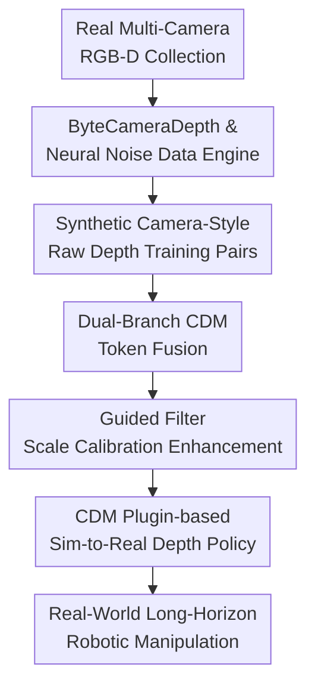

# Manipulation as in Simulation: Enabling Accurate Geometry Perception in Robots

**Conference**: ICLR 2026  
**OpenReview**: [https://openreview.net/forum?id=sWyX1BpeN4](https://openreview.net/forum?id=sWyX1BpeN4)  
**Code**: https://manipulation-as-in-simulation.github.io/  
**Area**: Robotics / Embodied AI  
**Keywords**: Robotic Manipulation, Depth Camera, Metric Depth Estimation, sim-to-real, Geometric Perception  

## TL;DR
This paper proposes camera-specific Camera Depth Models (CDM) to calibrate noisy RGB-D inputs from real depth cameras into high-quality metric depth similar to simulation. This allows robotic manipulation policies trained solely on clean simulation depth to transfer to real-world long-horizon tasks with zero fine-tuning.

## Background & Motivation
**Background**: Modern robotic manipulation policies mostly learn actions from visual observations, with mainstream inputs being RGB or multi-view RGB images. While RGB is semantic-friendly (e.g., identifying cups, bowls, or microwave doors), manipulation itself relies heavily on 3D geometry: object distances, sizes, boundaries, thin object poses, and the positions of articulable structures directly determine grasp points and motion trajectories.

**Limitations of Prior Work**: Depth cameras theoretically provide this geometric information, but depth maps in actual robot experiments are often "dirty." Active infrared stereo cameras like the D435 produce holes and artifacts on boundaries, reflective surfaces, and glass; ToF/LiDAR cameras like the L515 fail on metallic, black, or highly reflective areas. Consequently, many 3D manipulation methods resort to point cloud cropping, downsampling, hole filling, and filtering, or restrict experiments to perfect simulation depth, leading to geometric collapse during real camera deployment.

**Key Challenge**: Simulation provides robots with nearly noise-free metric depth, while the real world offers affordable but unreliable depth camera outputs. Directly adding noise to simulation depth damages valuable geometric details, whereas using raw depth as-is inputs incorrect shapes into policies. The fundamental contradiction addressed here is: to make robots "manipulate as in simulation," one should not make simulation "dirtier," but rather restore real camera depth to simulation-level clean geometry.

**Goal**: The authors decompose the problem into three sub-tasks: first, capturing real noise patterns of different depth cameras; second, synthesizing paired training samples on simulation data using these noise patterns to train a model mapping RGB + raw depth to accurate metric depth; third, using this model as a real-world robot frontend plugin to enable zero-shot transfer of depth-only policies trained in simulation.

**Key Insight**: The paper avoids general monocular depth estimation due to inherent scale ambiguity in single RGB images. It also moves beyond traditional hole filling, as real depth errors include camera-specific scale bias, blur, jitter, and material-dependent failures besides missing values. It selects "camera-specific models": each Camera Depth Model (CDM) understands the typical failure modes of a specific camera while utilizing RGB semantics to judge which raw depth values to trust or correct.

**Core Idea**: Training camera-specific RGB-D metric depth models using a data engine learned from real camera noise to convert real raw depth into simulation-grade clean geometry, thereby bridging the sim-to-real geometric gap in robotic manipulation.

## Method

### Overall Architecture
The overall workflow can be understood as "learning how cameras fail, training a model to correct them, and plugging the correction model in front of the real robot." During training, a multi-camera rig is used to collect ByteCameraDepth to learn hole noise and value noise, which are then transferred to simulation data with clean depth to generate training pairs of raw-depth-style inputs and clean labels. During deployment, the CDM receives real RGB and raw depth to output clean metric depth for policies trained only on simulation clean depth.

More specifically, the CDM is not a simple depth completion model. Its input consists of RGB image $I$ and raw depth $D$ from the same camera, and its output is high-quality absolute depth $\hat{D}$. The RGB branch provides information on object boundaries, materials, and semantic regions, while the depth branch provides existing scale hints. Both are fused at the token level by spatial position and reconstructed into a dense depth map via a DPT decoder. This ensures the model neither loses real scale (as monocular depth might) nor blindly trusts sensor errors (as traditional filtering might).

### Key Designs
**1. ByteCameraDepth & Neural Noise Data Engine: Learning Camera Failures as Synthesizable Sources**

The core difficulty in training CDM is the lack of triplets: real cameras provide RGB and low-quality depth but lack ground-truth clean depth for every pixel; simulation provides clean depth but lacks hardware noise. The authors built a multi-camera rig equipped with RealSense D405/D415/D435/D455/L515, ZED 2i, and Azure Kinect, covering 7 cameras and 10 depth modes across 7 scene types. Approximately 170k RGB-D pairs were collected to learn camera-specific noise styles.

Noise is categorized into two types: *hole noise* (predicting which pixels become holes) using a binary classification model $N_{hole}$ with DINOv2 backbone and DPT head; and *value noise* (depth value deviations) using a Depth Anything V2 style model $N_{value}$ to learn relative depth styles. These are applied to simulation data (HyperSim, DREDS, etc.) to generate low-quality inputs $\tilde{D}=\mu(V(I))\cdot(H(I)<0.5)$. The key is that synthetic data carries material failures, boundary holes, scale biases, and blur patterns of specific real cameras.

**2. Dual-branch CDM Token Fusion: Balancing Scale Hints and RGB Semantics**

The CDM structure is purposeful. RGB images and raw depth enter two separate ViT encoders to obtain $X_I=ViT_I(I)$ and $X_D=ViT_D(D)$. To prevent the model from treating depth as a shallow signal, fusion occurs across multiple token layers, allowing RGB and depth tokens to exchange information at identical spatial positions.

The fusion module uses multi-head attention to merge corresponding tokens, resulting in scale-aware features $\tilde{X}$, which are concatenated with original RGB tokens for the DPT head to output $\hat{D}=DPT([X_I;\tilde{X}])$. This design allows CDM to process raw depth with holes directly without prior hole filling while retaining RGB semantics to avoid mechanical smoothing during sensor failures.

**3. Guided Filter Scale Calibration Enhancement: Preventing Scaling Bias in Synthetic Noise**

It was observed that after fine-tuning on real ByteCameraDepth, the value noise model captures camera-like noise textures but might destroy the correct metric scale when transferred to simulation. This would lead CDM to learn to ignore depth hints, losing the primary advantage of RGB-D models.

The authors use a guided filter to address this. It treats the value noise as the guidance image $G$ and the simulation ground-truth depth as the input $A$, fitting $b_i=x_kg_i+y_k$ within local windows. The output $B$ retains the structure and camera style of the value noise while being anchored to the correct metric scale. Randomized window sizes $k$ during training simulate varied intensities of "camera-style but scale-reliable" prompt depth.

**4. CDM Plugin-based Sim-to-Real Depth Policy: Converting the World Back to Simulation Geometry**

The ultimate use of CDM is to provide simulated-like geometry for robot policies in the real world. The pipeline involves four stages: building geometrically similar scenes in simulation; aligning camera extrinsics via differentiable rendering calibration; generating smooth simulation demonstrations with an extended WBCMimicGen; and training depth-only policies via imitation learning.

Task inputs are single-view depth maps, joint positions, and gripper states. RGB is intentionally excluded from policy input to isolate the effect of "accurate geometry." During deployment, raw depth passes through the corresponding CDM before reaching the policy, effectively rewriting the observation gap from "real cameras are dirty" to "real observations approach simulation."

### Loss & Training
Noise model training involves two parts: hole noise is trained using pixel-wise binary cross-entropy where $D_{i,j}=0$; value noise is trained using L1 loss after affine-invariant normalization. CDM training utilizes L1 depth loss and gradient loss:

$$
\ell(M)=L1(D,\hat{D})+\ell_{grad}(D,\hat{D}),\quad
\ell_{grad}=\left|\frac{\partial(\hat{D}-D)}{\partial x}\right|+\left|\frac{\partial(\hat{D}-D)}{\partial y}\right|.
$$

Actual training uses disparity as the target. ViT encoders are initialized from DINOv2. The robot policy uses ResNet for depth encoding and a diffusion head for action prediction, without additional depth noise during simulation training.

## Key Experimental Results

### Main Results
Evaluation was conducted on metric depth zero-shot estimation (Hammer dataset) and real-world zero-shot sim-to-real manipulation.

| Scenario / Dataset | Metric | Ours | Prev. SOTA / Baseline | Gain |
|:---|:---|:---|:---|:---|
| Hammer D435 split | L1 ↓ / RMSE ↓ | CDM-D435: 0.0258 / 0.0404 | Raw Depth: 0.0550 / 0.1458 | L1 halved, RMSE significantly lower |
| Hammer L515 split | L1 ↓ / RMSE ↓ | CDM-L515: 0.0156 / 0.0297 | Raw Depth: 0.0312 / 0.0813 | L1 halved, RMSE reduced to ~37% |
| Real D435 Kitchen | Total Success ↑ | CDM-D435: 26/30 | Raw Depth: 0/30; PriorDA: 7/30 | Near-sim performance from failure |
| Real L515 Canteen | Total Success ↑ | CDM-L515: 22/30 | Raw Depth: 0/30; PriorDA: 3/30 | Strongest real Canteen results |

In real robot tasks, raw depth baseline often results in total failure, whereas CDM allows policies to reach success rates comparable to simulation.

### Ablation Study

| Configuration | Metric | Description |
|:---|:---|:---|
| PromptDA* (same data) | D435 L1: 0.0434 | Weaker than CDM, validating the dual-branch token fusion architecture. |
| Camera Mismatch | D435 Canteen: 0/30 | Robot deployment requires corresponding camera models despite metric generalization. |
| No CDM Frontend | Real Success: 0/30 | Raw depth errors cause total policy failure. |
| WBCMimicGen vs MimicGen | Sim Kitchen: 72% vs 56% | Smoother demonstrations improve policy quality and boundary jitter. |

### Key Findings
- CDM's benefit lies in restoring geometry to a state consumable by policies; it specifically manages failures on glass doors, metal forks, and thin plates.
- Camera specificity is critical for closed-loop operation. CDM-L515 achieves strong metrics on D435 data but fails in real D435 Canteen deployment.
- CDM latency is low: ~$0.151\pm0.002$s on an RTX 4090, enabling real-time control at over 6Hz.

## Highlights & Insights
- The technical highlight is the "sim-to-clean" perspective—restoring real depth to simulation quality rather than corrupting simulation data.
- The dual-branch structure effectively leverages RGB for semantic error correction and raw depth for absolute scale.
- ByteCameraDepth provides essential data on "how hardware fails," which is more relevant to deployment risks than pure clean depth datasets.
- The paper connects depth estimation metrics directly to closed-loop success rates, demonstrating how centimeter-level errors impact manipulation.

## Limitations & Future Work
- CDM can still be misled by incorrect prompt depth if RGB semantics are insufficient (e.g., large metallic surfaces failing without clear visual context).
- Real-world robot evaluation was primarily on D435 and L515; stability across more hardware requires further testing.
- The current pipeline addresses the visual geometry gap but does not solve sim-to-real gaps in dynamics, contact, or friction.
- Integration with large VLA (Vision-Language-Action) models remains an open research question.

## Related Work & Insights
- **vs PromptDA / PriorDA**: CDM avoids hole-filling pre-processing and fuses depth hints deeper within the network, making it more suitable for real-time robotics.
- **vs Depth Anything**: While Depth Anything excels at relative depth, CDM provides the absolute metric scale necessary for metric-space manipulation.
- **vs 3D Diffusion Policy**: This work shows that with sufficiently accurate depth, single-view 2.5D representations can suffice for complex manipulation without the overhead of point cloud processing.

## Rating
- **Novelty**: ⭐⭐⭐⭐⭐ High. Reversing the sim-to-real noise paradigm is a distinctive and effective approach.
- **Experimental Thoroughness**: ⭐⭐⭐⭐⭐ Comprehensive coverage from static benchmarks to real-world long-horizon tasks.
- **Writing Quality**: ⭐⭐⭐⭐ Clear main line, though some details are split between the main text and appendix.
- **Value**: ⭐⭐⭐⭐⭐ Highly practical; provides a clean geometric entry point for simulation-trained policies.

<!-- RELATED:START -->

## Related Papers

- [\[CVPR 2026\] CycleManip: Enabling Cycle-based Manipulation via Effective History Perception and Understanding](../../CVPR2026/robotics/cyclemanip_enabling_cycle-based_manipulation_via_effective_history_perception_an.md)
- [\[ICLR 2026\] RoboCasa365: A Large-Scale Simulation Framework for Training and Benchmarking Generalist Robots](robocasa365_a_large-scale_simulation_framework_for_training_and_benchmarking_gen.md)
- [\[ICLR 2026\] Geometry-Aware Policy Imitation](geometry-aware_policy_imitation.md)
- [\[CVPR 2026\] GeoPredict: Leveraging Predictive Kinematics and 3D Gaussian Geometry for Precise VLA Manipulation](../../CVPR2026/robotics/geopredict_leveraging_predictive_kinematics_and_3d_gaussian_geometry_for_precise.md)
- [\[ICLR 2026\] Virtual Community: An Open World for Humans, Robots, and Society](virtual_community_an_open_world_for_humans_robots_and_society.md)

<!-- RELATED:END -->
