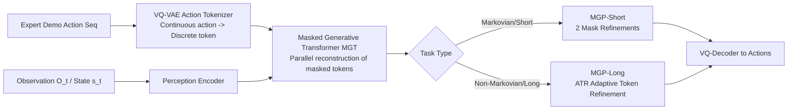

# Masked Generative Policy for Robotic Control

**Conference**: ICLR 2026  
**OpenReview**: [https://openreview.net/forum?id=KFu4p3pd11](https://openreview.net/forum?id=KFu4p3pd11)  
**Code**: TBD  
**Area**: Robot Manipulation / Visuomotor Imitation Learning  
**Keywords**: Masked generation, action tokens, imitation learning, parallel decoding, non-Markovian tasks, adaptive replanning  

## TL;DR
Discretizes robot actions into tokens and utilizes a "Masked Generative Transformer" from image generation to predict entire action sequences in parallel, followed by resampling only low-confidence tokens. This removes the bottlenecks of multi-step denoising in diffusion policies and token-by-token decoding in autoregressive policies, achieving globally coherent and reliable control in dynamic, partially observable, and non-Markovian tasks.

## Background & Motivation
**Background**: Visuomotor imitation learning has recently converged on "leveling conditional generative models for action sequences." There are two mainstream routes: Diffusion Policies (Diffusion Policy, 3D Diffusion Policy), which treat action synthesis as a conditional denoising process—high quality but requiring multiple denoising steps per action—and Autoregressive Policies (QueST, VQ-BeT), which discretize actions into tokens and use GPT-style Transformers for token-by-token prediction, matching the sequential execution nature of robots.

**Limitations of Prior Work**: Diffusion policies suffer from high latency during closed-loop real-time control due to multi-step iterative sampling; acceleration schemes like Consistency Policy or FlowPolicy either require extra distillation or sacrifice sampling quality. Autoregressive policies produce only one token per forward pass, with latency growing linearly with sequence length; furthermore, they lack memory and have immutable prefixes—any change requires regenerating all subsequent tokens, making them fragile in partially observable or non-Markovian tasks.

**Key Challenge**: The trade-off between inference latency brought by iterative sampling and the global coherence/robust replanning required for long-horizon, non-Markovian manipulation—fast models are unstable, and stable models are slow.

**Goal**: Develop a generative policy that is both low-latency and high-success, capable of rapid "plan adjustment" during execution, covering the full spectrum from short-range Markovian to long-range non-Markovian tasks.

**Core Idea**: **[Masked Generation + Confidence Resampling]** Borrowing the MaskGIT approach from image generation, actions are represented as discrete tokens. A conditional Masked Transformer generates all tokens **in a single parallel pass**, followed by minor iterative refinement of only **low-confidence** tokens. Two sampling paradigms are designed: MGP-Short for short-range tasks and MGP-Long with Adaptive Token Refinement (ATR) for long-range tasks.

## Method

### Overall Architecture
MGP is trained in two stages: first, a VQ-VAE compresses continuous action sequences into discrete tokens (action tokenizer); second, a Masked Generative Transformer (MGT) learns to reconstruct full action tokens from "masked token sequences + observation conditions." During inference, it switches between two paradigms based on task nature: MGP-Short (minimal mask-and-refine iterations) for short-range tasks, and MGP-Long (parallel trajectory prediction with adaptive refinement of unexecuted tokens based on new observations) for long-range/non-Markovian tasks.

### Key Designs

**1. Action Tokenizer: Compressing continuous actions into discretely reconstructible tokens to create a discrete latent space for masked generation.** Uses VQ-VAE to encode a continuous action sequence $a \in \mathbb{R}^{T\times j}$ ($j$ for end-effector position/rotation/gripper state) through two-layer residual 1D CNNs into $\hat{y}\in\mathbb{R}^{N\times d}$, followed by a nearest-neighbor lookup in a learnable codebook. A symmetric upsampling Conv1D decodes it. The training objective is reconstruction loss plus commitment loss $L_{VQ}=\lambda_{rec}\|a-\hat{a}\|_1+\beta\|\hat{y}-\text{sg}[y]\|_2^2$, with the codebook updated via EMA and dead-code resetting for utilization. Once trained, it is frozen and used only for data encoding and MGT output decoding—this step transforms "generating actions" into "generating discrete tokens," allowing the transfer of the masked generation paradigm.

**2. Masked Generative Transformer (MGT): Generating all tokens in parallel, learning to "complete" via mask supervision.** Given observations $O_t$ and historical states $s_t$, the MGT recovers $N$ future action tokens from a sequence with [MASK] tokens (also using [END]/[PAD] for termination and padding). The perception encoder maps observations and states via MLP into condition features, followed by 2 layers of cross-attention between observation embeddings and action token embeddings, plus 2 layers of self-attention to output logits for each token. Training involves randomly masking tokens and perturbing 5% of the remainder, minimizing negative log-likelihood $L_{MGT}=-\mathbb{E}_{y\in K}\big[\sum_n \log p(y_n\mid y_M,c)\big]$. Unlike GPT’s token-by-token method, its single forward pass for the whole segment is the source of low latency.

**3. MGP-Short: Two-step mask refinement for short-range Markovian tasks.** Simple tasks are viewed as MDPs without long-range dependencies. MGP-Short samples based on current observation $c_t$: the first round feeds a full [MASK] sequence and $c_t$ into the Transformer for parallel logits, using Gumbel-Max sampling $y=\arg\max_n(e_n/\tau+g_n)$ (where $g_n$ is Gumbel noise) to maintain diversity. Normalized probabilities are treated as confidence scores to rank and re-mask the lowest confidence tokens for a second round of resampling. High-quality actions are obtained in just two iterations (ablation shows $r=2$ improves by 14.3% over $r=1$, while $r=3$ offers no extra gain), with inference taking only 3ms per step.

**4. MGP-Long + Adaptive Token Refinement (ATR): Global planning + online refinement for long-range/non-Markovian tasks.** At task onset, it infers $p(y^{0:N}_0\mid c_0)$ based on initial observation $c_0$, sampling a full token sequence covering the entire horizon as the initial plan. The robot executes with an adjustable step size. After executing $n$ tokens, new observation $c_i$ triggers **posterior confidence estimation**: executed tokens serve as hidden state $H_i$, and the Transformer recalculates probabilities for previously sampled results under the new observation $S(y^{0:N}_{i-1})=\text{softmax}(e^{0:N})$. Executed token scores are excluded; only the unexecuted segment $n{:}N$ is normalized, and low-scoring tokens are re-masked $y^{n:N}_{i-1M}\leftarrow\text{MASK}(y^{n:N}_{i-1},S)$, then fed back into the Transformer with historical executed tokens for refinement $y^{n:N}_i=\text{GumbelMax}(p(y^{n:N}_i\mid y^{0:N}_{i-1M},c_i,H_{i-1}))$. This preserves executed tokens as "memory anchors" for global coherence while specifically modifying uncertain future tokens—it can even "soldier on" with the planned actions when observations are missing.

## Key Experimental Results
Evaluations cover Meta-World (50 tasks, Easy to Very Hard), LIBERO-90, and LIBERO-Long for a total of 150 manipulation tasks, plus three challenge environments: missing observations, dynamic environments, and non-Markovian tasks. Comparisons include 10 baselines (DP, DP3, Simple-DP3, CP, FlowPolicy, QueST, VQ-BeT, PRISE, ACT, ResNet-T).

### Main Results
Meta-World single-task success rates and inference latency per step:

| Method | Easy(28) | Medium(11) | Hard(5) | V.Hard(5) | Avg SR | Inf.T/step(ms) | Inf.T/seq(ms) |
|------|----------|------------|---------|-----------|--------|----------------|---------------|
| DP | 0.836 | 0.311 | 0.108 | 0.266 | 0.380 | 106 | 4750 |
| Simple-DP3 | 0.868 | 0.420 | 0.387 | 0.350 | 0.506 | 63 | 2830 |
| DP3 | 0.909 | 0.616 | 0.380 | 0.490 | 0.599 | 145 | 6557 |
| CP | 0.912 | 0.627 | 0.400 | 0.510 | 0.612 | 5 | 230 |
| FlowPolicy | 0.902 | 0.630 | 0.392 | 0.360 | 0.571 | 19 | 850 |
| **MGP-Short** | **0.920** | **0.650** | **0.440** | **0.538** | **0.637** | **3** | **135** |

LIBERO multi-task success rates:

| Method | LIBERO-90 | LIBERO-Long |
|------|-----------|-------------|
| DP | 0.754 | 0.501 |
| VQ-BeT | 0.813 | 0.593 |
| QueST | 0.886 | 0.680 |
| **MGP-Short** | **0.889** | 0.770 |
| MGP-w/o SM | - | 0.805 |
| **MGP-Long** | - | **0.820** |

MGP-Short achieves an average success rate of 0.637, 3.8% higher than DP3 and 6.6% higher than FlowPolicy. Its 3ms per step is approximately 49× faster than DP3 (145ms); total sequence inference latency is reduced up to 35× compared to DP3. The model has only 7M parameters (37× fewer than DP3's 262M) and trains in 55 minutes for 2000 epochs (vs 3 hours for DP3 on the same RTX 4090).

### Ablation Study
Comparison of long-range methods and MGP-Long ablation (Meta-World Hard/Very Hard):

| Method | Hard(5) | V.Hard(5) | Avg SR |
|------|---------|-----------|--------|
| DP3-Full Seq. | 0.188 | 0.350 | 0.270 |
| MGP-Full Seq. (No Online Adpt.) | 0.294 | 0.386 | 0.340 |
| MGP-w/o SM (No Score Masking) | 0.510 | 0.572 | 0.541 |
| **MGP-Long** | **0.540** | **0.586** | **0.563** |

Challenge environments (Success Rate):

| Method | Missing Obs. Avg | Dynamic Avg | Non-Markovian Button On/Off | Button Color Change |
|------|-----------|----------|--------------------------|---------------------|
| DP3 | 0.200 | 0.360 | 0.00 | 0.00 |
| QueST | - | - | 0.00 | 0.00 |
| MGP-Short | 0.205 | 0.430 | 0.00 | 0.00 |
| **MGP-Long** | **0.525** | **0.436** | **1.00** | **1.00** |

Key Hyperparameter Ablations: MGP-Short refinement steps $r=2$ vs $r=1$ gain 14.3%; MGP-Long mask ratio of 70% is optimal; ATR scoring outperforms Random by 10.68% and Score Reuse by 5.53%; execution step of 12 is optimal (54%); sensitivity to codebook size and discrete granularity (4 actions/token is optimal) is low.

### Key Findings
- MGP-Long achieves 100% success on two non-Markovian button tasks, while DP3 / QueST / MGP-Short all fail (0%)—because a single frame cannot reveal progress; only preserving a global plan + memory anchors allows pressing buttons in the correct color order.
- In missing observation scenarios, MGP-Long is ~22%–31% higher than short-range methods: short-range methods "stay in place" or regress to static out-of-distribution point clouds when observations are lost, whereas MGP-Long continues based on high-confidence planned future tokens.
- Confidence visualization shows: confidence is high when approaching objects but drops sharply during fine manipulation / retry attempts / environmental changes (e.g., bin moving). Refinement concentrates exactly "where it needs to change," validating the interpretability of score masking.

## Highlights & Insights
- **Clever Paradigm Transfer**: Systematically brings "masked parallel generation + iterative refinement" (from MaskGIT) to robotic imitation learning, solving both the "slowness" of diffusion and the "immutable prefix" problem of autoregressive models.
- **One Representation, Two Samplers**: The same MGT performs both closed-loop short-range sampling (MGP-Short) and global long-range planning (MGP-Long). ATR makes "plan adjustment" a matter of "resampling low-confidence tokens" rather than full sequence regeneration, the key to its speed and robustness.
- **Posterior Confidence Estimation** has a clear Bayesian interpretation: recalculating the posterior predictive probability of old tokens under new observations is equivalent to "modifying parts of the plan that are no longer credible under new information," turning heuristic replanning into a quantifiable mechanism.
- **Small and Fast**: 7M parameters, minute-scale training, and millisecond-scale inference make it highly suitable for real-world closed-loop deployment.

## Limitations & Future Work
- All experiments were conducted in simulation (Meta-World / LIBERO + custom LeRobot sim); real-robot results are pending, and sim-to-real remains to be verified.
- Dependence on VQ-VAE action discretization means action precision is bounded by the codebook/granularity; while sensitivity appears low, discretization error may become a ceiling for extreme precision tasks.
- Non-Markovian experiments involve only two synthetic button tasks; generalization to more complex long-term memory/reasoning tasks requires more samples.
- Parameters like MGP-Long execution step, mask ratio, and refinement steps require per-environment tuning, lacking an adaptive selection mechanism.

## Related Work & Insights
- **Diffusion Policies**: Diffusion Policy, 3D Diffusion Policy (DP3), Consistency Policy, FlowPolicy—primary comparisons and "targets for replacement" due to slow multi-step sampling.
- **Autoregressive / Discrete Token Line**: QueST, VQ-BeT, PRISE, Chain-of-Action—share the "discretized action tokens" idea, but MGP replaces token-by-token decoding with parallel masked generation.
- **Masked Generative Transformer Line**: MaskGIT, MUSE, StyleDrop (images), MMM, MoMask (human motion)—the methodological roots of MGP, which this work migrates from content generation to control.
- **Insight**: When sequence generation in a field is stuck between "element-by-element autoregression vs. multi-step iterative denoising," "parallel generation + confidence-guided local refinement" may be the third way; the idea of "preserving executed/high-confidence prefixes as anchors and only changing uncertain parts" is valuable for any sequence decision-making requiring online replanning.

## Rating
- **Novelty**: ⭐⭐⭐⭐ First systematic transfer of Masked Generative Transformers to robotic imitation learning; ATR + posterior confidence estimation for online replanning is a solid mechanism design.
- **Experimental Thoroughness**: ⭐⭐⭐⭐ Covers 150 tasks across 3 benchmarks + 3 challenge environments + 10 baselines + 7 ablation groups; extensive evidence, though lacking real-robot tests.
- **Writing Quality**: ⭐⭐⭐⭐ Clear motivation-contradiction-method-experiment chain; sampling paradigms and diagrams are well-matched; formulas and mechanisms are explained well.
- **Value**: ⭐⭐⭐⭐ Solves both inference speed and long-range robustness; millisecond inference with small models is attractive for deployment; the 0% to 100% improvement on non-Markovian tasks is impactful.

<!-- RELATED:START -->

## Related Papers

- [\[ICLR 2026\] Much Ado About Noising: Dispelling the Myths of Generative Robotic Control](much_ado_about_noising_dispelling_the_myths_of_generative_robotic_control.md)
- [\[CVPR 2026\] MaskDexGrasp: Generative Masked Modeling for Part-Aware Dexterous Grasp Synthesis](../../CVPR2026/robotics/maskdexgrasp_generative_masked_modeling_for_part-aware_dexterous_grasp_synthesis.md)
- [\[ICLR 2026\] Policy Contrastive Decoding for Robotic Foundation Models](policy_contrastive_decoding_for_robotic_foundation_models.md)
- [\[ICLR 2026\] Scaling up Memory for Robotic Control via Experience Retrieval](scaling_up_memory_for_robotic_control_via_experience_retrieval.md)
- [\[ICLR 2026\] Real-Time Robot Execution with Masked Action Chunking](real-time_robot_execution_with_masked_action_chunking.md)

<!-- RELATED:END -->
