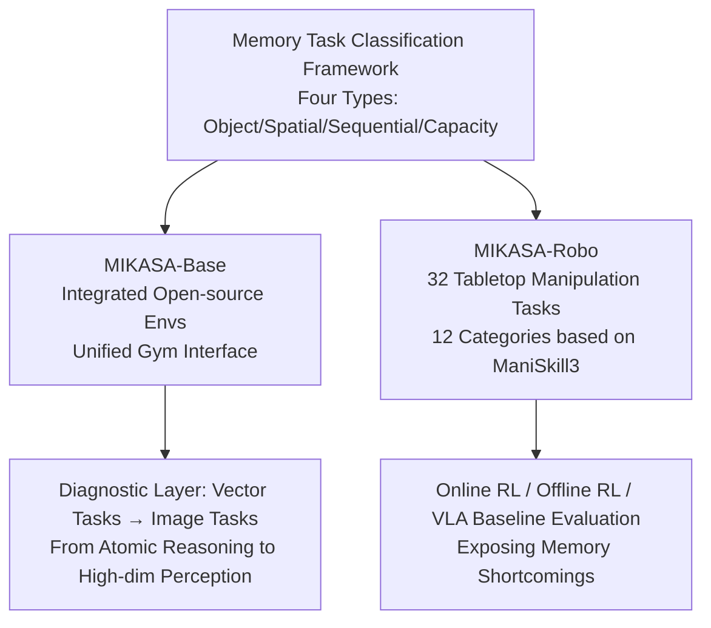

# Memory, Benchmark & Robots: A Benchmark for Solving Complex Tasks with Reinforcement Learning

**Conference**: ICLR 2026  
**OpenReview**: [https://openreview.net/forum?id=9cLPurIZMj](https://openreview.net/forum?id=9cLPurIZMj)  
**Code**: [https://tinyurl.com/membenchrobots](https://tinyurl.com/membenchrobots) (`pip install mikasa-robo-suite`, MIT)  
**Area**: Robotic Manipulation / Memory Reinforcement Learning  
**Keywords**: Memory RL, POMDP, Tabletop Manipulation, Benchmark, Partial Observability  

## TL;DR
The authors propose the MIKASA memory benchmark suite—unifying fragmented memory RL evaluations with a four-category memory task classification framework. They construct 32 tabletop robotic manipulation memory tasks (MIKASA-Robo) for the first time, systematically exposing memory deficiencies of mainstream RL/VLA agents in partially observable manipulation tasks.

## Background & Motivation
- **Background**: A large number of real-world tasks involve **partial observability** (POMDP), such as delayed/sparse rewards and long-range information retention. Equipping agents with memory mechanisms (LSTM, Transformer, State Space Models, etc.) is the mainstream solution. While fields like NLP have mature memory benchmarks like LongBench, memory evaluation in RL remains extremely fragmented.
- **Limitations of Prior Work**: As revealed in Table 2, almost every memory-augmented algorithm (DRQN, GTrXL, AMAGO, RATE, etc.) is evaluated on its **own customized environment**, with almost no overlap in task sets. Even within a single benchmark, often only one type of memory (e.g., remembering object positions) is tested while neglecting others (e.g., reconstructing event sequences), leading to incomplete evaluations and a lack of cross-algorithm comparisons.
- **Key Challenge**: The field of robotic manipulation specifically lacks such benchmarks. Most manipulation simulators design tasks as MDPs (fully observable), whereas real-world scenarios (remembering a plate covered by a towel, judging if a microwave door has been wiped enough times) inherently requires spatio-temporal memory. Existing practices of "adding noise/occlusion to convert MDP to POMDP" fail to capture the physical complexity of manipulation tasks. Concurrent work like MemoryBench contains only 3 tasks, covers only one memory type, and is based on RLBench which lacks efficient parallelization.
- **Goal**: To provide a unified framework that **covers core memory dimensions while maintaining practical simplicity**, systematically evaluating memory capabilities at both the abstract diagnostic and real-world robotic manipulation levels.
- **Core Idea**: **[Classification-driven Unified Benchmark]** Drawing from cognitive science and developmental psychology research on human memory, memory-intensive RL tasks are categorized into four types (Object, Spatial, Sequential, and Capacity). Based on this, existing open-source environments are integrated (MIKASA-Base) and 32 new robotic manipulation tasks are built (MIKASA-Robo), establishing a standardized yardstick for comparing memory mechanisms.

## Method

### Overall Architecture
MIKASA (Memory-Intensive Skills Assessment Suite for Agents) consists of three components: a **classification framework** that categorizes memory tasks into four types, a diagnostic benchmark **MIKASA-Base** that integrates existing memory environments into a unified Gym interface, and a self-built 32-task robotic manipulation benchmark **MIKASA-Robo**. The classification framework serves as the foundation, determining task selection/creation; MIKASA-Base focuses on abstract diagnostics while MIKASA-Robo emphasizes physical realism, progressing from "atomic reasoning" to "high-dimensional perception" to cover the full spectrum of memory capabilities.

### Key Designs

**1. Four-category Memory Task Classification Framework: Mapping Cognitive Concepts to RL.** The core contribution is this classification yardstick. It defines memory-intensive tasks over POMDPs where an **associated horizon** $\xi > 1$ exists, representing the minimum steps between a "critical event" and the point where that information must be "recalled"—larger $\xi$ indicates higher memory pressure. Based on this, tasks are divided into: **Object Memory** (tracking attributes of occluded objects, e.g., fruit in a fridge), **Spatial Memory** (environmental layout and positions, e.g., returning a moved mug), **Sequential Memory** (recalling ordered information, e.g., recipe steps), and **Memory Capacity** (managing multiple pieces of information, e.g., remembering locations of multiple objects during table clearing). This framework strikes a balance between human memory complexity and RL formalization (Figure 3).

**2. MIKASA-Base: A Diagnostic Layer Unifying Fragmented Environments.** It re-categorizes widely used open-source memory environments (POPGym, Memory Maze, Passive T-Maze, MiniGrid-Memory, etc.) and wraps them in a unified Gym-like API. The design progresses through two tiers: the first tier consists of **vector diagnostic environments** to isolate single memory mechanisms and exclude perceptual interference; the second tier includes **image tasks** to introduce realistic perceptual challenges. This allows researchers to precisely attribute failures to specific memory types.

**3. MIKASA-Robo: 32 Tabletop Manipulation Memory Tasks.** Built on **ManiSkill3** for high-speed GPU parallel training, it includes 12 categories and 32 tasks across the four memory types. Typical tasks include `ShellGameTouch` (observing a red ball, which is then covered by one of three cups—Object Memory), `RememberColor3/5/9` (observing a color, which disappears for 5 steps before requiring selection from 3/5/9 candidates—Object Memory/Capacity), `RotateLenientPos` (remembering initial peg orientation—Spatial Memory), and `SeqOfColors`/`ChainOfColors` (recalling colors in arbitrary/strict order—Sequential Memory). Each task specifies "Oracle Info" required for success and a timeout $T$. Training modes include `state` (full oracle vector) to verify MDP solubility and **`RGB+joints`** for standard memory testing.

**4. Multi-paradigm Baselines + Datasets: Making the Benchmark Actionable.** The suite includes a full evaluation ecosystem: Online RL (PPO-MLP/PPO-LSTM, SAC, TD-MPC2), Offline RL (BC, CQL, Decision Transformer, RATE, Diffusion Policy), and VLA models (Octo, OpenVLA, SpatialVLA, π0). **Expert trajectory datasets** are released for all 32 tasks to support offline RL research. The comparison between memoryless (MLP) and memory-augmented (LSTM/Transformer) architectures is used to verify that tasks truly require memory.

## Key Experimental Results

### Main Results (VLA Success Rates on Selected Memory Tasks, 100 episodes, mean±sem)

| Model | ShellGameTouch | InterceptMedium | RememberColor3 | RememberColor5 | RememberColor9 |
|---|---|---|---|---|---|
| Octo-small | 0.46±0.05 | 0.39±0.04 | 0.45±0.06 | 0.17±0.03 | 0.11±0.03 |
| OpenVLA (K=4) | 0.12±0.05 | 0.06±0.02 | 0.21±0.00 | 0.09±0.02 | 0.08±0.02 |
| OpenVLA (K=8) | 0.47±0.05 | 0.14±0.03 | 0.59±0.04 | 0.16±0.03 | 0.06±0.02 |
| SpatialVLA (K=4) | 0.23±0.04 | 0.27±0.04 | 0.27±0.05 | 0.17±0.03 | 0.11±0.03 |

> As the number of candidate colors increases from 3→5→9 (increasing memory load), the success rates of all VLA models significantly collapse to ~0.1, confirming that the tasks effectively stress memory.

### Online RL Baselines (RememberColor-v0, RGB+joints, dense reward)

| Setting | Observation |
|---|---|
| `state` mode (MDP) | PPO-MLP achieves **100% success rate**, proving task solvability and isolating memory as the difficulty. |
| 3 colors + dense | PPO-LSTM significantly outperforms PPO-MLP (effective memory mechanism). |
| 5/9 colors + dense | Success rates for both **drop to near 0**. |
| 3 colors + sparse | Both architectures **fail to solve the task**. |
| SAC / TD-MPC2 | Higher sample efficiency than PPO-MLP, but performance collapses on complex tasks due to lack of explicit memory extensions. |

### Key Findings
- Tasks are 100% solvable under MDP conditions, proving that failures are entirely attributable to **memory deficiency under partial observability**, ensuring a clean benchmark design.
- As memory load (number of candidates, sequence length) increases, performance for online RL, offline RL, and VLAs degrades sharply, showing a clear performance-to-difficulty curve.
- Common robotic RL algorithms like SAC/TD-MPC2 are unsuitable for memory-intensive tasks, highlighting the need for specialized memory mechanisms.

## Highlights & Insights
- **Leveraging Cognitive Science**: The four-category classification is not arbitrary but maps to established concepts like object permanence, working memory, serial recall, and memory span, providing interpretable dimensions for RL evaluation.
- **Dual-tier Coverage**: MIKASA-Base handles "clean diagnostics" while MIKASA-Robo handles "physical realism," enabling strong attribution from vectors to images.
- **Complete Ecosystem**: The authors provide classification, environments, expert datasets, and three sets of baselines (Online/Offline/VLA). The suite is MIT-licensed and supports ManiSkill3 GPU parallelization for low barrier to entry.
- **Strong Diagnostic Value**: The contrast between "100% solvable under MDP" vs. "collapse under POMDP" cleanly decouples memory capability from other factors like control or perception.

## Limitations & Future Work
- Online RL evaluations were limited to basic architectures (MLP, LSTM, SAC); more advanced memory architectures (e.g., various Transformer or SSM variants) were not systematically benchmarked.
- Tasks remain in simulated tabletop environments; the sim-to-real gap regarding physical hardware and realistic sensor noise was not validated.
- While the four categories are concise, higher-order cognitive memory tasks such as causal or transitive inference were excluded to maintain simplicity.
- Future work could involve memory-augmented architecture competitions and expansion toward multimodal instructions and long-horizon multi-step tasks.

## Related Work & Insights
- **Memory RL Benchmarks**: POPGym, DMLab-30, Memory Gym, etc., each focus on specific facets without overlap—precisely what MIKASA aims to unify.
- **Memory Classification**: Prior work categorized memory based on horizons or temporal dependencies, often **neglecting the physical spatial dimension in robotics**, a gap filled by this work.
- **Manipulation Benchmarks**: ManiSkill3, LIBERO, Meta-World, and RLBench are almost exclusively designed as MDPs without memory testing (Table 3).
- **Insights**: When a sub-field suffers from fragmentation where "everyone evaluates on their own set," establishing a classification yardstick aligned with a mature discipline (cognitive science) and integrating existing plus new content is a powerful paradigm to standardize progress.

## Rating
- **Novelty**: ⭐⭐⭐⭐ — Successfully migrates cognitive memory systems to RL and builds the first large-scale (32 tasks) manipulation memory benchmark.
- **Experimental Thoroughness**: ⭐⭐⭐⭐ — Covers Online, Offline, and VLA paradigms with clear MDP/POMDP controls; however, cross-evaluations of advanced architectures and sim-to-real are limited.
- **Writing Quality**: ⭐⭐⭐⭐ — Logical flow from motivation to classification to benchmark results; tables and figures effectively support the arguments.
- **Value**: ⭐⭐⭐⭐⭐ — High community value as an open-source, ready-to-use platform with complete datasets, likely to become a standard for memory-augmented RL and robotics.

<!-- RELATED:START -->

## Related Papers

- [\[ICLR 2026\] MolLangBench: A Comprehensive Benchmark for Language-Prompted Molecular Structure Recognition, Editing, and Generation](mollangbench_a_comprehensive_benchmark_for_language-prompted_molecular_structure.md)
- [\[ICLR 2026\] TaCo: A Benchmark for Lossless and Lossy Codecs of Heterogeneous Tactile Data](taco_a_benchmark_for_lossless_and_lossy_codecs_of_heterogeneous_tactile_data.md)
- [\[ICLR 2026\] CoNavBench: Collaborative Long-Horizon Vision-Language Navigation Benchmark](conavbench_collaborative_long-horizon_vision-language_navigation_benchmark.md)
- [\[ICLR 2026\] RF-MatID: Dataset and Benchmark for Radio Frequency Material Identification](rf-matid_dataset_and_benchmark_for_radio_frequency_material_identification.md)
- [\[ICLR 2026\] AutoBio: A Simulation and Benchmark for Robotic Automation in Digital Biology Laboratory](autobio_a_simulation_and_benchmark_for_robotic_automation_in_digital_biology_lab.md)

<!-- RELATED:END -->
