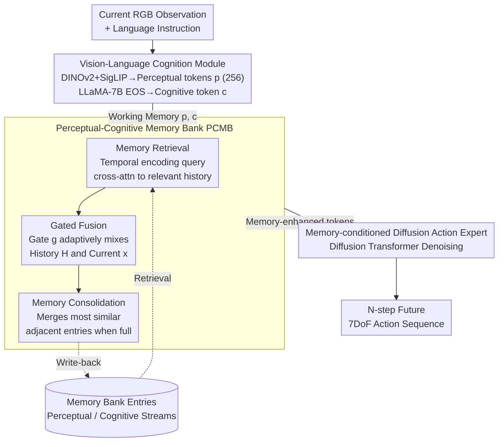

# MemoryVLA: Perceptual-Cognitive Memory in Vision-Language-Action Models for Robotic Manipulation

**Conference**: ICLR 2026  
**arXiv**: [2508.19236](https://arxiv.org/abs/2508.19236)  
**Code**: [Project Page](https://shihao1895.github.io/MemoryVLA)  
**Area**: Robotics/VLA  
**Keywords**: VLA, memory mechanism, long-horizon manipulation, diffusion policy, cognitive science

## TL;DR
Inspired by the dual memory system in cognitive science, this work proposes the MemoryVLA framework. It introduces a Perceptual-Cognitive Memory Bank (PCMB) into the VLA model to capture long-term dependencies through memory retrieval, gated fusion, and consolidation mechanisms, significantly outperforming CogACT and π₀ across 150+ tasks in SimplerEnv, LIBERO, and real-world environments.

## Background & Motivation

**Background**: Vision-Language-Action (VLA) models (e.g., OpenVLA, π₀, CogACT) have achieved remarkable progress in robotic manipulation. however, mainstream methods rely solely on current observations and ignore temporal dependencies, leading to poor performance in long-horizon tasks. For instance, in a "Push Buttons" task, visual differences before and after pressing are negligible, making it impossible to determine if an action is completed without history.

**Limitations of Prior Work**: (1) Concatenating multiple frames leads to quadratic self-attention complexity and distribution mismatch with single-frame pre-training; (2) RoboFlamingo uses LSTM compression, which loses fine-grained information; (3) TraceVLA draws trajectories but misses semantic details; (4) UniVLA adds past actions, acting more as a Chain-of-Thought (CoT) than true memory utilization.

**Key Challenge**: Robotic manipulation is inherently non-Markovian (past actions influence future decisions), whereas current VLA models are predominantly Markovian (observing only the current frame).

**Key Insight**: In cognitive science, humans process manipulation tasks using working memory (short-term) and episodic memory (long-term, containing verbatim details and "gist" semantics). Based on this, the PCMB is designed to store memory at two levels: perceptual details and cognitive semantics.

## Method

### Overall Architecture
MemoryVLA addresses the weakness where VLAs only "see" the current frame and struggle with long-horizon tasks. Its design directly corresponds to the dual memory system in the human brain—using working memory for immediate control and hippocampal-style episodic memory to preserve history. The system follows a "Cognition-Memory-Action" pipeline across three stages for each frame: first, a 7B Vision-Language Cognition module encodes the current RGB observation and language instruction into two types of working memory—**perceptual tokens** $p$ (retaining visual details) and a **cognitive token** $c$ (compressing high-level semantics); second, this working memory queries a continuously accumulating Perceptual-Cognitive Memory Bank (PCMB) to retrieve relevant history, adaptively fuses it with current information via a gate, and writes back the fusion result (consolidating when capacity is full); finally, the memory-enhanced tokens are fed as conditions into a Diffusion Action Expert to generate a 7DoF action sequence for the next $N$ steps. The entire pipeline is trained end-to-end, with the PCMB enabling the model to transition from "Markovian processing" to "non-Markovian historical reference."

### Key Designs

**1. Vision-Language Cognition Module: Representing the current frame via "Details" and "Semantics"**

The prerequisite for memory storage and retrieval is encoding the current observation at the appropriate granularity. This module uses DINOv2 and SigLIP in parallel for visual encoding, concatenates their features, and compresses them via an SE-bottleneck (squeeze-and-excitation) into 256 perceptual tokens $p$, preserving fine-grained spatial information. Simultaneously, visual features and language instructions are fed into LLaMA-7B, where the output at the EOS position serves as a single cognitive token $c$, encoding high-level semantic understanding of the task. The combination of $p$ and $c$ constitutes the working memory of the current frame. The dual-stream design allows long-horizon tasks to access history hierarchically—sometimes needing pixel-level details (e.g., has the object moved?) and other times needing semantic states (e.g., should this step be considered finished?).

**2. Perceptual-Cognitive Memory Bank (PCMB): Temporal memory via Retrieval-Fusion-Consolidation**

This is the core contribution of the paper, addressing the limitations of previous methods like frame concatenation or LSTM compression. PCMB writes working memory into a limited-capacity bank over time and integrates history into current decision-making through three steps. In the **Retrieval** phase, current tokens with temporal positional encodings serve as queries for cross-attention over the PCMB to extract relevant historical perceptual/cognitive information $H^p, H^c$. In the **Fusion** phase, instead of naive concatenation, a learned gate adaptively mixes the content:

$$\tilde{x} = g^x \odot H^x + (1-g^x) \odot x, \qquad g^x = \sigma(\text{MLP}(\text{concat}[x, H^x]))$$

The gate $g^x$ is determined by both the current information $x$ and retrieved history $H^x$. Consequently, $g$ remains small for simple tasks (relying on current observations) and increases for complex long-horizon tasks (relying more on history). fused tokens are written back to the bank. When the bank is full, the **Consolidation** phase avoids simple FIFO (which might delete key frames) and instead calculates the similarity of adjacent entries to merge the most similar pair, reducing redundancy while preserving critical historical information.

**3. Memory-Conditioned Diffusion Action Expert: History-aware action generation**

With memory-enhanced perceptual and cognitive tokens, the final step uses them as conditions for a Diffusion Transformer to denoise and generate $N$ steps of 7DoF actions. Diffusion is chosen over regression because robotic action distributions are naturally multi-modal. Using fused memory tokens as conditions allows the action head—which is traditionally Markovian—to gain temporal awareness, which is critical for tasks like "Push Buttons" where visual cues alone are insufficient to judge completion.

### Loss & Training
The entire framework is trained end-to-end: the 7B VLM is pre-trained on the OXE dataset; the Diffusion Action Expert is trained using standard DDPM objectives; the perceptual side uses an SE-bottleneck for compression, while the cognitive side extracts the EOS token as a semantic summary.

## Key Experimental Results

### Main Results (Simulation)

| Benchmark | MemoryVLA | CogACT | π₀ | Gain / Notes |
|------|-----------|--------|-----|------|
| SimplerEnv-Bridge | **71.9%** | 57.3% | Lower | **+14.6** |
| SimplerEnv-Fractal | **72.7%** | 68.1% | Lower | +4.6 |
| LIBERO-5 | **96.5%** | Second | Second | Outperforms both |
| Mikasa-Robo | **41.2%** | — | 29.4% | **+11.8** |

### Real-world Experiments (12 tasks)

| Task Type | MemoryVLA | CogACT | π₀ |
|---------|-----------|--------|-----|
| General Skills (6 tasks) | **85%** | 76% | Low |
| Long-horizon Dependency (6 tasks) | **83%** | 57% | Low (**+26** vs CogACT) |

### Key Findings
- Improvements are most significant in long-horizon tasks (+26 vs CogACT), proving that memory mechanisms are vital for temporal dependencies.
- The gate value $g$ in fusion changes dynamically—relying on current information for simple tasks and history for complex ones.
- Memory consolidation via merging similar neighbors is more efficient than fixed-window or FIFO approaches.
- The model exhibits strong robustness under OOD conditions, such as different backgrounds, distractors, lighting, and occlusions.

## Highlights & Insights
- **Cognitive Science-Driven Design**: The mapping of working and episodic memory to perceptual/cognitive tokens and the PCMB provides a theoretically grounded architecture rather than simple frame stacking.
- **Perceptual vs. Cognitive Decoupling**: Perceptual tokens (256) retain spatial details while the cognitive token (1) summarizes high-level semantics. Dual-stream storage in PCMB allows tasks to query history at different levels of abstraction.
- **Significant Gain in Long-horizon Tasks**: The +26% improvement indicates that memory is not just an incremental feature but a necessary condition for VLAs to handle temporal reasoning effectively.

## Limitations & Future Work
- The 7B VLM introduces significant inference overhead, limiting real-time performance.
- The PCMB capacity $L$ requires manual setting; adaptive capacity management remains an open area for exploration.
- Consolidating via cosine similarity might be too coarse; more sophisticated memory selection strategies could be beneficial.
- The model currently only uses third-person RGB; multi-view and multi-modal memory (e.g., tactile) have yet to be explored.

## Related Work & Insights
- **vs π₀**: π₀ lacks a memory mechanism and struggles significantly with long-horizon tasks; MemoryVLA's PCMB fills this gap.
- **vs CogACT**: While CogACT uses a diffusion action head, it lacks temporal modeling. MemoryVLA achieves comprehensive improvements by adding memory.
- **vs RoboFlamingo**: RoboFlamingo utilizes coarse-grained memory via LSTM, whereas MemoryVLA's dual-stream memory provides more detailed historical context.

## Rating
- Novelty: ⭐⭐⭐⭐⭐ First introduction of a cognitive-inspired dual-stream memory architecture in VLA.
- Experimental Thoroughness: ⭐⭐⭐⭐⭐ Evaluated across 3 robots, 150+ tasks (simulation and real-world), multiple baselines, and OOD tests.
- Writing Quality: ⭐⭐⭐⭐ Clear motivation from cognitive science and intuitive architectural diagrams.
- Value: ⭐⭐⭐⭐⭐ Addresses a critical missing piece in VLA (temporal memory) with convincing experimental results.

<!-- RELATED:START -->

## Related Papers

- [\[ICLR 2026\] VLM4VLA: Revisiting Vision-Language-Models in Vision-Language-Action Models](vlm4vla_revisiting_vision-language-models_in_vision-language-action_models.md)
- [\[ICML 2026\] Spatial Memory for Out-of-Vision Manipulation in Vision-Language-Action](../../ICML2026/robotics/spatial_memory_for_out-of-vision_manipulation_in_vision-language-action.md)
- [\[ICLR 2026\] TwinVLA: Data-Efficient Bimanual Manipulation with Twin Single-Arm Vision-Language-Action Models](twinvla_data-efficient_bimanual_manipulation_with_twin_single-arm_vision-languag.md)
- [\[ICLR 2026\] VLMgineer: Vision-Language Models as Robotic Toolsmiths](vlmgineer_vision-language_models_as_robotic_toolsmiths.md)
- [\[ICLR 2026\] WMPO: World Model-based Policy Optimization for Vision-Language-Action Models](wmpo_world_model-based_policy_optimization_for_vision-language-action_models.md)

<!-- RELATED:END -->
