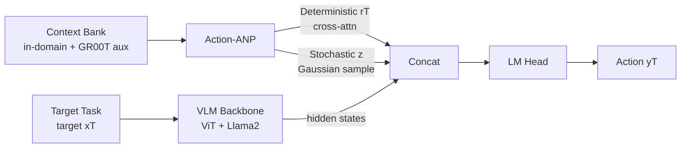

# MetaVLA: Unified Meta Co-Training for Efficient Embodied Adaptation

**Conference**: ICLR 2026  
**OpenReview**: [https://openreview.net/forum?id=E1K2Ph3LtS](https://openreview.net/forum?id=E1K2Ph3LtS)  
**Code**: To be open-sourced (Paper promises "Code will be available")  
**Area**: Robotics / Embodied AI (VLA Post-Training)  
**Keywords**: Vision-Language-Action, Meta-Learning, Multi-Task Co-Training, Attentive Neural Processes, Post-Training Efficiency  

## TL;DR
MetaVLA introduces a lightweight context memory module (Action-ANP) derived from Attentive Neural Processes during the VLA post-training phase. It transforms multi-task co-training from a state where "more tasks lead to collapse" to one where "auxiliary tasks improve performance." Using a single model on LIBERO, it reduces OpenVLA training from 240K steps to 75K steps, cuts GPU time by 76%, and outperforms the baseline by 8% on long-horizon tasks.

## Background & Motivation
**Background**: Vision-Language-Action (VLA) models are typically derived from pre-trained VLMs and adapted to new embodied tasks through Supervised Fine-Tuning (SFT) or Reinforcement Learning. Current mainstream practices (e.g., OpenVLA) fine-tune a **separate** model for each downstream task—requiring four models for the four LIBERO suites.

**Limitations of Prior Work**: This per-task SFT paradigm is costly and fragile. Fine-tuning OpenVLA on all four LIBERO suites requires approximately 240K steps and nearly 100 GPU hours; OpenVLA-OFT requires between 150K and 500K steps. Long-horizon tasks (LIBERO-Long) are particularly significant training bottlenecks, often requiring many gradient steps to stabilize meaningful action sequences. These models exhibit poor generalization, slow adaptation, and result in multiple redundant checkpoints that are difficult to maintain.

**Key Challenge**: A natural idea is to use multi-task co-training to share knowledge and reduce costs. The authors started with vanilla multi-task SFT—feeding the four LIBERO suites into a single model did reduce GPU time and slightly increased success rates. However, when they attempted to **further include more heterogeneous auxiliary tasks**, they found that naive co-training actually **slowed convergence and degraded performance**. The more tasks added, the worse the collapse (the average success rate plummeted from 76.2% to 8.6% after adding 5 single-arm and 1 bimanual task). The authors attribute this to optimization instability caused by heterogeneous distributions—mismatches in feature spaces (camera views) and action spaces (degrees of freedom, DoF) offset the benefits of co-training.

**Goal**: To design a unified, backbone-agnostic VLA post-training framework that enjoys the efficiency of co-training while safely consuming high-diversity auxiliary tasks, without the inefficiency of per-task SFT or the performance degradation of naive multi-task SFT.

**Core Idea**: **Use meta-learning to "downgrade" auxiliary tasks from "optimization targets" to "retrieved context memory."** The proposed **Context-Aware Meta Co-Training** establishes a context bank (containing in-domain target tasks + out-of-domain auxiliary tasks). It uses an Action-ANP derived from Attentive Neural Processes to aggregate these contexts into referable representations injected into the action decoder. This allows the model to "learn" from the information gain of auxiliary data without direct gradient optimization on it, thereby isolating the optimization interference from heterogeneous distributions.

## Method

### Overall Architecture
MetaVLA attaches a lightweight Action-ANP module on top of a standard VLA backbone (OpenVLA = ViT + Llama2-7B + action head). During training, two databases are maintained: a **target bank** (containing only the target sets of the four LIBERO suites, which are the objects of optimization) and a **context bank** (in-domain task context sets + GR00T auxiliary tasks). For each prediction, Action-ANP aggregates samples from the context bank into deterministic representations and stochastic global representations. These are concatenated with Llama hidden states and passed through the LM head to produce action logits in an end-to-end training manner.

### Key Designs
**1. Action-ANP: Modeling "reference demonstrations" as functional distributions rather than new training targets.** This is the core of the method. Instead of letting auxiliary tasks enter the loss function directly, the authors follow the logic of Attentive Neural Processes to model "predicting target actions given context" as a distribution of functions: $p(y_T \mid x_T, x_C, y_C) := \int p(y_T \mid x_T, r_T, z)\, q(z \mid \bar{s}_C)\, dz$. Context sample pairs $(x_{Ci}, y_{Ci})$ are aggregated via self-attention to produce context representations $r_{Ci}, s_{Ci}$. Target features $x_T$ act as queries for cross-attention over context keys/values to obtain a **deterministic representation** $r_T$ (capturing target-related dependencies). $\bar{s}_C$ is the mean of all $s_{Ci}$, used to sample a **stochastic global latent variable** $z$ (modeling context distributions independent of specific targets). This dual-branch approach provides the model with "referable demonstrations." The key advantage is that auxiliary data is only "attended/retrieved" and does not participate in target optimization, effectively isolating optimization interference.

**2. Variational Lower Bound + KL Constraint: Keeping the target distribution "referable but not drifting."** During training, ground truth pairs $(x_T, y_T)$ are processed via the same self-attention and averaging to produce a target-side representation $\bar{s}_T$. Through reparameterization of the Gaussian latent variable $z$, the variational lower bound is maximized: $\log p(y_T \mid x_T, x_C, y_C) \geq \mathbb{E}_{q(z \mid s_T)}[\log p(y_T \mid x_T, r_T, z)] - D_{KL}(q(z \mid \bar{s}_T) \,\|\, q(z \mid \bar{s}_C))$. The first term handles target action reconstruction, while the KL divergence term constrains the target distribution from drifting too far from the context distribution. This is the mathematical guarantee for stable heterogeneous co-training: the more diverse the context, the more the KL term acts as a "soft alignment" regularizer, preventing optimization from being scattered by diverse distributions. Unlike original ANP which uses small networks, this method uses pre-trained Llama2 as the backbone, and the latent vectors produced by Action-ANP are concatenated before the final Llama output layer.

**3. Dual Databases + Periodic Refresh: Context as "external memory" rather than a training set.** The context bank stores both in-domain data (non-overlapping with the target set) and out-of-domain auxiliary tasks (selected from the GR00T dataset), while the target bank stores only the four target suites. To ensure context coverage, the context set is refreshed every $K=200$ steps: $b_C=32$ samples are randomly drawn from each context task. $K$ balances training speed and decoding quality, while $b_C=32$ balances memory usage and performance. This "periodic sampling of external memory" allows a single model to be co-trained on all target suites without maintaining independent checkpoints for each.

**4. Auxiliary Task Selection: Achieving information gain through "sufficient difference."** The authors deliberately chose GR00T over data highly similar to LIBERO for two reasons: GR00T was completely unseen during OpenVLA pre-training (higher information gain), and it is partially related but structurally different from LIBERO. LIBERO uses a Franka Panda single-arm, 7-DoF, and front-view camera; the selected GR00T tasks include dual-arm 14-DoF operations and side-view single-arm operations. The deliberate gap in camera views and action spaces tests the robustness of MetaVLA. Contrary to prior work that carefully selects similar tasks, the authors argue that relaxing auxiliary task diversity leads to a more scalable adaptation framework.

## Key Experimental Results

### Main Results (LIBERO, OpenVLA backbone, Success Rate % / Training Steps)

| Model | Steps | Goal | Spatial | Object | Long | Average |
|---|---|---|---|---|---|---|
| OpenVLA (4 separate models) | 240K | 76.2 | 84.7 | 87.0 | 51.8 | 74.9 |
| SFT-4LIBERO (Single model naive co-train) | 75K | 77.8 | 84.8 | 87.4 | 54.7 | 76.2 |
| SFT-4LIBERO+5single+1bimanual | 75K | 15.2 | 5.6 | 12.0 | 1.6 | **8.6** |
| SFT-4LIBERO+5single+1bimanual | 187.5K | 23.4 | 16.7 | 13.6 | 4.4 | 14.5 |
| MetaVLA (Ours, LIBERO context only) | 75K | 78.9 | 88.5 | 88.5 | 55.3 | 77.8 |
| **MetaVLA+5single+1bimanual (Ours)** | 75K | 78.7 | 89.9 | 88.9 | **59.8** | **79.3** |

With six auxiliary tasks, MetaVLA outperforms OpenVLA by **4.4%** and SFT-4LIBERO by **3.1%** on average. On LIBERO-Long, it leads by **8.0% / 5.1%** respectively. The number of models is reduced from 4 to 1, training steps from 240K to 75K, and GPU time from ~100 hours to ~24 hours (approx. −76%). Most notably, while naive SFT collapses from 76.2% to 8.6% with the same auxiliary tasks, MetaVLA reverses the "add tasks and collapse" trend into "add tasks and gain."

### Ablation Study

| Dimension | Key Findings |
|---|---|
| Backbone Change (NORA-Long, 3B Qwen2.5-VL) | MetaVLA without aux tasks outperforms NORA-Long by **4.9%**; with aux tasks, it reaches **91.8%**, outperforming naive SFT by **25.4%** under the same settings, verifying backbone-agnosticism. |
| context batch size $b_C$ | Success rate increases monotonically with $b_C$; $b_C=32$ is optimal without increasing memory overhead. |
| Auxiliary Task Selection | Across three auxiliary settings (varying camera view/action space/task count), MetaVLA consistently outperforms SFT, indicating the context bank can be safely expanded. |
| Inference Overhead | The compact memory module adds only **0.3 ms/token** latency. |

### Key Findings
- Part of the performance drop in naive multi-task SFT is due to "diluted steps per task" (at 75K steps, per-task steps drop from 18.75K to 7.5K). however, even extending training to 187.5K steps still falls far short of MetaVLA, proving the core issue is optimization instability from heterogeneous distributions rather than insufficient steps.
- Downgrading auxiliary tasks to "retrieved context" is pivotal: MetaVLA exhibits more stable and faster convergence across Accuracy, Imitation Loss, and L1 Loss curves compared to SFT.

## Highlights & Insights
- **Paradigm Shift**: Re-identifying the failure of multi-task co-training as "auxiliary tasks should not enter the loss," and using meta-learning in-context retrieval to bypass heterogeneous optimization interference—a more fundamental approach than tuning sampling ratios or adding regularizers.
- **Engineering Friendly**: A plug-in module that is backbone-agnostic, has almost zero inference overhead (0.3ms/token), and can smoothly extend from SFT to RL.
- **Efficiency Gains**: Replacing four models with one while cutting both training steps and GPU time by approximately 3/4 is highly valuable for resource-constrained or democratized scenarios.
- **Solid Counter-Evidence**: The use of "naive SFT collapsing to 8.6% with auxiliary tasks" as a strong baseline highlights the necessity of the ANP mechanism.

## Limitations & Future Work
- The authors acknowledge that the explanation for why MetaVLA can stably consume heterogeneous distributions is intuitive rather than backed by **strict theoretical proof**, which is left for future work due to compute constraints.
- Evaluation is primarily limited to **LIBERO simulation** (Franka single-arm); performance on real robots and with larger-scale embodiment diversity remains unverified.
- Auxiliary task sources are limited (GR00T); whether the "low screening, high diversity" conclusion generalizes to any auxiliary data pool remains to be tested.
- Periodic refreshing of the context bank introduces hyperparameters like $K$ and $b_C$; the trends of retrieval cost and memory growth as scale increases are not fully discussed.

## Related Work & Insights
- **VLA Models**: Discrete token auto-regression (OpenVLA, RT series) vs. continuous actions (diffusion policy / flow matching, π0, π0.5). This work is orthogonal to these pre-training stage improvements and focuses on post-training.
- **Multi-task Co-training**: Proven effective in LLM/VLM (GPT-2, LLaVA, Qwen-3, Molmo/Pixmo) but long ignored in VLA post-training—most work co-trains during pre-training but uses per-task SFT downstream. MetaVLA fills this gap.
- **Meta-Learning / ANP**: Leveraging task invariance, selective attention to relevant demonstrations, and the avoidance of direct optimization on context makes ANP naturally suited for low-data cross-domain VLA adaptation.
- **Insight**: When "adding data leads to a performance drop," first ask "should this data enter the gradient?" Converting external knowledge into a retrievable context memory might be more effective than hard-tuning the optimizer. This "memory-augmented + meta-learning" approach is transferable to other fine-tuning scenarios requiring heterogeneous auxiliary data (multi-modal alignment, cross-domain RL).

## Rating
- **Novelty**: ⭐⭐⭐⭐ — Introducing ANP/meta-learning into VLA post-training and downgrading auxiliary tasks to context memory to solve heterogeneous co-training instability is novel and addresses a real pain point.
- **Experimental Thoroughness**: ⭐⭐⭐⭐ — Includes dual backbones (OpenVLA + NORA-Long), strong baselines (SFT collapse), and multi-dimensional ablations (batch size / aux tasks / latency); minor points deducted for being limited to LIBERO simulation and lacking real-world/theoretical proof.
- **Writing Quality**: ⭐⭐⭐⭐ — Clear motivation (deriving the method from naive co-train failure), good alignment between figures and formulas, and a complete narrative.
- **Value**: ⭐⭐⭐⭐ — Cutting training costs by 76%, replacing multiple models with one, and having nearly zero inference overhead provides direct practical value for resource-constrained VLA adaptation.

<!-- RELATED:START -->

## Related Papers

- [\[ICML 2026\] Online Self-Training for Co-Adaptation in Hierarchical Diffusion Policies](../../ICML2026/robotics/online_self-training_for_co-adaptation_in_hierarchical_diffusion_policies.md)
- [\[NeurIPS 2025\] Generalizable Domain Adaptation for Sim-and-Real Policy Co-Training](../../NeurIPS2025/robotics/generalizable_domain_adaptation_for_sim-and-real_policy_co-training.md)
- [\[ICLR 2026\] Hybrid Training for Vision-Language-Action Models](hybrid_training_for_vision-language-action_models.md)
- [\[ICLR 2026\] VITA: Zero-Shot Value Functions via Test-Time Adaptation of Vision–Language Models](vita_zero-shot_value_functions_via_test-time_adaptation_of_visionlanguage_models.md)
- [\[ICLR 2026\] House Of Dextra : Cross-Embodied Co-Design for Dexterous Hands](house_of_dextra_cross-embodied_co-design_for_dexterous_hands.md)

<!-- RELATED:END -->
